# March 2016: Eclipse and MongoDB Connector for BI

[Browse 2016](../README.md)

[Back to home](../../README.md)

Original PDF: [MDB_DN_2016_03_Eclipse_BiConnector.pdf](./MDB_DN_2016_03_Eclipse_BiConnector.pdf)

---
## Chapter 3. March 2016

Welcome to the March 2016 edition of MongoDB Developer’s Notebook (MDB-DN). This month we answer the following questions; I prefer using Eclipse as my interactive development environment (IDE). How do I interface with MongoDB when using Eclipse ? Can I run structured query language select (SQL SELECT) statements against MongoDB ? Excellent question! In 2015, Eclipse continued to be the world’s third most popular IDE, behind Notepad++ and SublimeText. Given Eclipse’s wide support for programming languages, rich graphical interface, seamless integration with source code control and deployment tools, Eclipse is a very good choice of IDE. While there are numerous integration options in the area of Eclipse and MongoDB, we will use Toad (http://www.toadworld.com/m/freeware). Toad will allow you to work with MongoDB, and most other database systems. We will also install, configure, and use a Postgres JDBC driver and the MongoDB Connector for BI, which will give you the SQL interface you asked for. We will also briefly touch on the topics of the Monja Eclipse plug-in and RoboMongo.

## Software versions

The primary MongoDB software component used in this edition of MDB-DN is the MongoDB Connector for BI (Business Intelligence), currently release 1.1.2 and available for CentOS and RHEL, versions 6 and 7. All of the software referenced is available for download at the URL's specified, in either trial or community editions.

All of these solutions were developed and tested on a single tier CentOS 7.0 operating system, running in a VMWare Fusion version 8.1 virtual machine. The MongoDB server software is version 3.2.3, and unless otherwise specified is running on one node, with no shards and no replicas.

The Eclipse version we are running is Kepler (Eclipse version 4.3), SR2. And the Postgres driver version is 9.4. All software is 64 bit.

## 3.1 Terms and core concepts

Arguably, structured query language (SQL) was the 1980’s response to the IBM, NCR, and other’s mainframes, with the mainframe’s years long software development cycles, huge labor and licensing costs, and painful assumptions. These assumptions included that an application was available Monday to Friday, 8 AM to 5 PM, and evenings and weekends were for reconciling and processing any changes to the data. Also arguably, MongoDB is the modern day response to SQL.

MongoDB expects that your application is or will go global, that every operation must complete within milliseconds, and that this same application with its associated data model, may get changed and deployed numerous times each week, each day, or each hour; continuous integration, continuous deployment, CI/CD.

While becoming less common each day, SQL is still in all or most shops. And, on top of any or most SQL database management systems is a business intelligence (BI) reporting system. The better/most-modern BI systems support structured, semi-structured, and unstructured data, and most BI systems have as a lowest common denominator the expectation to speak SQL.

> Note: Just to be clear, we really like SQL. SQL moved the information technology (IT) industry ahead by a huge, huge margin.

Depending on how you count, a SQL SELECT statement has 2 mandatory clauses and 5 optional clauses. These clauses, if present, must appear in order, and must appear only once; SELECT column list (this clause is mandatory, and must appear first) FROM table list (this clause is mandatory, and must appear second) [ WHERE filter and join criteria ] (optional clause, must appear third) [ GROUP BY column list ] (optional clause, must appear fourth) [ HAVING aggregate filter criteria ] (optional clause, must appear fifth) [ ORDER BY column list ] (optional clause, must appear sixth) [ INTO table name ] (optional clause, must appear seventh)

In MongoDB, clauses three through seven can appear multiple times, and in any order. Like Linux pipes (cat file | grep | sed | awk | sort), MongoDB has an easily programmable aggregation framework, much improved over SQL. The ease with which MongoDB can group, sub-group, wind (like an ETL pivot), and unwind data is unmatched.

So SQL BI reporting systems abound. Thus, MongoDB is well served to support SQL BI reporting systems. Figure 3-1 below details the component architecture when using the MongoDB Connector for BI. A code review follows.

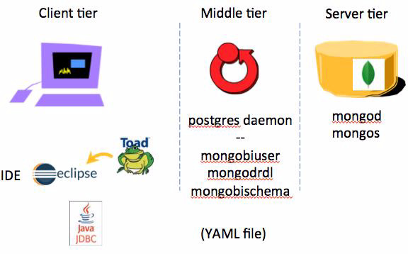

*Figure 3-1 Component architecture, 5 total software components.*

Relative to Figure 3-1, the following is offered:

- The server tier runs the standard MongoDB database server. Either the mongod (MongoDB database daemon), or mongos (MongoDB software router) are listening for client connections on a given IP address and port.

- On the same or different tier, a MongoDB configured listening daemon is present; again, for client connections, IP address and port. This lightweight process sits between any SQL client and the MongoDB database server. All of this arrives and is configured as part of the MongoDB Connector for BI software package. A YAML file (ASCII text data file in YAML/YML format), maps SQL databases, rows and columns, to MongoDB databases, collections, keys and values. This YAML file is generated via a MongoDB utility, mongodrdl, and may be modified to suit your needs. (mongodrdl: MongoDB document to relational definition language.)

> Note: This middle tier is making use of Postgres foreign data wrappers (FDW), a source code module from the Postgres open source database software project. We are not running a Postgres database per se. There is no Postgres maintenance, or configuration required. There are Postgres daemons running that you will see below.

- The client tier (co-located with any of the previous tiers, or not) runs whatever SQL client you prefer. In this document we are running the Eclipse interactive development environment as our client. You could just as easily run most leading BI reporting systems, SQL literate command window, etcetera. To better enable SQL activities in Eclipse, we detail installing the Toad Extension for Eclipse (Toad), below. With this Eclipse plug in, you can interact with many SQL database systems. MongoDB will appear as a standard Postgres SQL database. In order for Toad/Eclipse to connect to Postgres, we will download and install a Postgres JDBC driver (Jar file). This driver will point to the IP address and port number of the MongoDB Connector for BI listening daemon, which then points to the MongoDB database server.

Below we detail the steps to install and configure all of the referenced software. With reasonable pre-requisite skill, you can complete all of these steps in 30 or so minutes.

## 3.2 Complete the following

In this section of this document, we create and configure the following:

- Download and install a Postgres JDBC driver

- Download, install and configure MongoDB

- Create a sample database and collection hosted in MongoDB

- Download, install and configure MongoDB Connector for BI

- Download, install and configure Eclipse

- Download, install and configure Toad Extension for Eclipse

- Run a SQL query or two

All of the above is detailed on a single-tier CentOS version 7.0 virtual machine. We perform most steps as the user id “root”, although that is not required.

> Note: Before our boss yells at us (we’re kidding, he’s nice), we have to mention that this section is a very brief, get it up and running set of instructions. If you have more time, or interest, MongoDB runs free online programming and administration classes, the best free classes we’ve ever seen, available at,
>
> https://university.mongodb.com/

There is free online help, quizzes, homework, and a qualification exam at the end. These classes last 7 weeks, and consume 3-6 hours of time per week, depending on how much you want to learn.

## 3.2.1 Download, and install a Postgres JDBC driver

The MongoDB Connector for BI acts as a server to a SQL based client. To aid in adoption, the MongoDB Connector for BI allows MongoDB to appear as a Postgres compatible data source. (Many BI tools and reporting systems have connected to Postgres before MongoDB was created.) Since Eclipse expects to use JDBC drivers, we need to supply a Postgres JDBC driver.

Complete the following steps:

1. At the Linux Bash(C) command prompt enter,

```text
cd /opt
mkdir postgres_jdbc
```

2. Using a Web browser, download the Postgres JDBC driver version 9.4 (build 1208) into the

```text
/opt/postgres_jdbc
```

directory, from the following URL,

https://jdbc.postgresql.org/download.html

Type-4 JDBC drivers are platform agnostic, so there is no need to locate a CentOS version 7, or 64 bit specific, Postgres JDBC version. This file arrives as a Jar file, and no further steps are required.

## 3.2.2 Download, install and configure a MongoDB database server

Complete the following steps:

1. Using a Web browser, download the MongoDB database server software into the /opt directory, from the following URL,

https://www.mongodb.com/download-center#enterprise

These instructions were tested on CentOS version 7, so we selected the compatible RHEL 7 Linux 64 bit package. When prompted, select “archive”,

which is a combination of the other 4 packages listed. See example Figure 3-2.

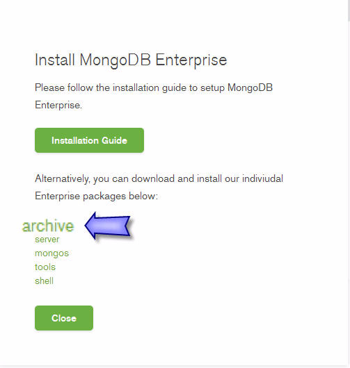

*Figure 3-2 MongoDB install packages, “archive” includes the other 4*

2. Unpack the distribution downloaded above. At a Linux Bash(C) command prompt (plan to keep this window open throughout this entire lesson), cd(C) to the Linux /opt directory.

```text
cd /opt
```

The file downloaded above arrives as a TGZ file titled, mongodb-linux-x86_64-enterprise-rhel70-3.2.3.tgz, or something similar. We have to “gunzip” this file, then “tar xf” it. Both gunzip(C) and tar(C) should already be installed on your CentOS system. At the Linux Bash(C) command prompt enter,

```text
gunzip mongodb-linux-x86_64-enterprise-rhel70-3.2.3.tgz
tar xf mongodb-linux-x86_64-enterprise-rhel70-3.2.3.tar
rm mongodb-linux-x86_64-enterprise-rhel70-3.2.3.tar
mv mongodb-linux-x86_64-enterprise-rhel70-3.2.3 mongo
export PATH=$PATH:/opt/mongo/bin
```

## 3.2.3 Start the MongoDB database server

The MongoDB database server is ready to start, and start accepting client requests. Before doing so, let’s make a specific directory to contain all of our data files, log files, and more. At the Linux Bash(C) command prompt enter,

```text
cd /opt/mongo
mkdir data
cd data
mongod --port 27017 --dbpath . --logpath logfile.0 --fork
```

The following is offered:

- “mongod” starts the MongoDB database server, acts a listening daemon for new client connections, and more.

- “mongodb --help” (not displayed), details all of the optional parameters to mongod.

- “--port 27017” is redundant, since port 27017 is the default port.

- “--dbpath .” specifies the that directory to contain data files and related should be located in the current working directory, /opt/mongo/data

- “--logpath logfile.0” specifies the name of our server (events) log file. This file is ASCII text, and you may view it via a variety of methods.

- “--fork” sends the MongoDB daemon process to the background.

- mongod will start listening for client connections and activity on at least localhost. If you have a single or set of network interface cards (NICs), this too is configurable. This topic is not expanded upon here.

Figure 3-3 offers a screen shot of the steps above. The MongoDB database server and now ready and willing.

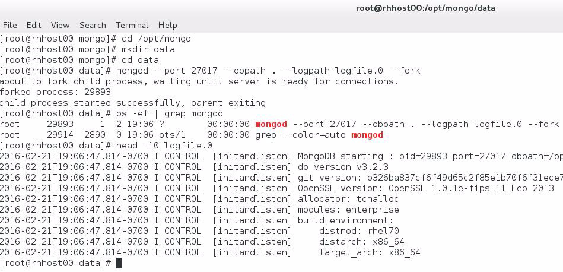

*Figure 3-3 Screen shot of the commands entered above.*

## 3.2.4 Create a sample database, and collection, and add data

We are now ready to create a database inside MongoDB, add a collection (similar to a SQL table), and insert some documents (similar to SQL rows). There are many MongoDB interfaces we can use, and perhaps the simplest is the character user interface titled, “mongo”.

At the Linux Bash(C) command prompt enter,

```text
mongo
```

The next sequence of commands are now entered into the MongoDB command shell,

```text
use bi_db
db.customer.insert(
{ "cust_num" : 101 , "cust_name" : "Dave",
"orders" :
[
{ "order_num" : 1000 , "order_amount" : 17.76 } ,
{ "order_num" : 1001 , "order_amount" : 44.00 }
]
} )
```

The following is offered:

- “mongo” is the binary program name which places you in the MongoDB command shell. Here you can enter MongoDB commands, as well as an amount of JavaScript programming; JavaScript loops, JavaScript functions, and more.

- “use bi_db” calls to change the current database . If this database does not exist, it will be created. In MongoDB, identifiers (bi_db) are case sensitive. A global variable titled, db provides a handle to the current database. –

```text
“db.customer.insert()”
```

is a method to insert into a collection resident in the current database titled, customer. (bi_db is the database. customer is the collection inside that database.) If this collection does not exist, it will be created. • Generally, commands in the MongoDB shell are not whitespace sensitive, and we have split this command above over several lines for visual clarity. This is not required. • The first argument to this method is expected to be a JSON document , in the form-

```text
{ “key1” : “value1” , “key2” : “value2” , .. }
```

A background article describing JSON is available at the following URL,

```text
https://en.wikipedia.org/wiki/JSON
```

• So, the entire document is wrapped in a pair of curly braces. Later we see an array of sub-documents (orders), or embedded document, which are themselves wrapped in a pair of curly braces. • Then we follow with key/value pairs. A key/value pair is marked by a colon, and second and subsequent key/value pairs are each separated with commas. • A key could have an array of values, and/or an array of documents. In this example, orders has an array of documents, which contains the keys order_num, and order_amount. In SQL, orders might be a child, or detail table to customer. In MongoDB, detail tables are modelled as embedded documents; pre-joined for ease and speed of retrieval.

Thus far we have created a MongoDB database server, a database, a collection, and added one document. Obviously there is much more we could discuss here. For now, experiment with adding a few more documents to the customer collection.

To check your work, enter, db.customer.find().pretty()

To exit the MongoDB command shell, enter, quit()

## 3.2.5 Download, install and configure MongoDB Connector for BI

In this section we download, install, and configure the MongoDB connector for BI. This connector allows you to run SQL against a MongoDB database. An optional introductory video is available here,

https://www.youtube.com/watch?v=0kwopDp0bmg

The MongoDB Connector for BI documentation is available here,

https://docs.mongodb.org/manual/products/bi-connector/

And the MongoDB Connector for BI software download site is available here,

https://www.mongodb.com/download-center#bi-connector

Complete the following steps:

1. Download, unpack, and install the MongoDB Connector for BI software.

- Make a new directory, and enter same.

- Download the software from the last URL offered above.

- The file above arrives as a bz2 file. To extract its contents, you can enter the command,

```text
tar xf mongodb-bi-1.1.2-1-centos7-rpms.tar.bz2
```

Keeping in mind that your file name may vary.

- We are running CentOS, which has as its package (software installation) manager, yum. yum arrives pre configured, and in this instance may require Internet access. These package files arrive as RPMs, so we may install them using this command,

```text
yum install *.rpm
```

The MongoDB Connector for BI software is now installed.

> Note: When we installed the MongoDB database server software proper above, we placed these files in /opt/mongo, and adjusted our execution search path to include /opt/mongo/bin.

The MongoDB Connector for BI software arrives as RPMs, and are installed via yum. yum places these files in the /usr/bin directory, which is already in our search path.

2. Create a user (database) which clients will use to connect to MongoDB Connector for BI.

- Currently we have a MongoDB server listening at localhost:27017, with a database titled, bi_db.

- At the Linux Bash(C) command prompt enter,

```text
mongobiuser create biuser "mongodb://localhost:27017/bi_db"
```

Example as shown in Figure 3-4.

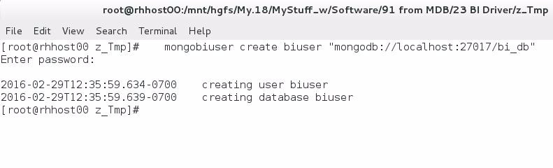

*Figure 3-4 Running mongobiuser*

- When prompted, enter a a password for this user. We used the password, password.

- If you make a mistake, enter “mongobiuser --help”, and look for the delete option.

- With the command above we created user credentials for the user named, biuser, and in the database, bi_db. localhost:27017 was the hostname and port number of an operating MongoDB database server.

3. Create a schema definition file . The MongoDB object hierarchy includes a (database) server instance, then databases, then collections, and then documents. SQL databases have server instances, then databases, then tables, rows and columns. To map

between these two worlds, we use a schema definition file, which we generate using the command, mongodrdl (MongoDB document to relational definition language). The output from this command is a YAML/YML formatted data file, which we may optionally edit to suit our needs.

Consider getting this example to work in its entirety before editing the

> Note: DRDL/YAML file.

If you do edit the file, a good/free online YAML validation utility is available at the following URL,

```text
https://yaml-online-parser.appspot.com/
```

- At the Linux Bash(C) command prompt enter,

```text
mongodrdl --host localhost:27017 -d bi_db -o schema.drdl
```

- The output of this command is the file named, schema.drdl, an ASCII text file in YAML file format. localhost:27017 is the host name and port number of an operating MongoDB database server, and di_db is the target database we extract these definitions from.

- Use `vi(C)` or another program to view the contents of `schema.drdl`. A brief code review follows: you see a `tables` section, followed by 2 tables: `customer` and `customer_orders`. `customer` maps to our MongoDB collection, `customer`. Because the MongoDB collection, `customer`, had an embedded array of documents for customer orders titled, `orders`, the `mongodrdl` utility defines a second (SQL table) for us titled, `customer_orders`. The MongoDB (query) framework method titled, `$unwind`, is used to (pivot) these array elements into separate rows, as is the SQL convention. The remainder of this document is column names, and data types, as you would expect. For now, make zero changes to this document; exit the editor, no save.

4. Import the schema file (DRDL file), configure the Postgres foreign data wrappers (FDW).

- At the Linux Bash(C) command prompt enter,

```text
mongobischema import biuser schema.drdl
```

The MongoDB Connector for BI software is now configured and ready for use. Users of the MongoDB Connector for BI connect to the default port of 27032.

A review of what just happened- The yum(C) command above installed and configured the MongoDB Connector for BI software . Any time after this step, a ps(C) command reveals output similar to that displayed in Figure 3-5.

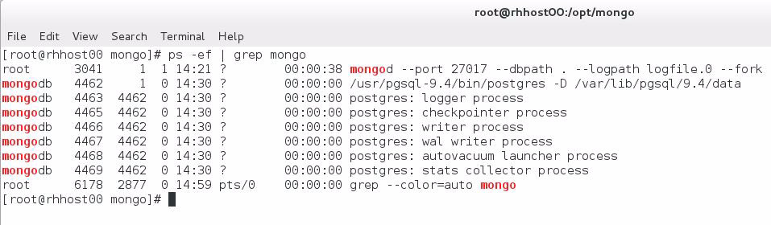

*Figure 3-5 Postgres foreign data wrapper (FDW) processes.*

These processes are started at the time of MongoDB Connector for BI software install, and are configured to start on system reboot via the systemd(c) Linux subsystem. You control this behavior by interfacing with the Linux systemd(C) subsystem. The configuration file for this is located in,

```text
/usr/lib/systemd/system/postgresql-9.4.service
```

Specific file names may differ based on your software versions.

How was port 27032 determined, and can I change it- This value can be changed. The Postgres system hosting the MongoDB Connector for BI configured foreign data wrappers (FDW) is located in the directory titled,

```text
/var/lib/pgsql/9.4
```

Keeping in mind that your file name may vary.

The specific configuration file you wish to access is then titled,

```text
./data/postgresql.conf
```

Look for the entry titled, “port”, which is commented out by default.

How do I install/verify (test) the above- We need a ODBC/JDBC client to test the above, which we install and configure in the next set of steps in the form of Eclipse.

Does the MongoDB BI Connector tier store any data- No, or at least not any data in the traditional sense. The only data stored on this tier is the user connection string and the DRDL schema configuration data.

## 3.2.6 Download, install and configure Eclipse

In this section we download and install Eclipse, the widely used interactive developer’s environment (IDE). We chose version 4.3 (Eclipse Kepler, SR2), Standard Edition.

Complete the following steps:

1. Download the 64 bit edition into the /opt directory from this URL,

http://www.eclipse.org/downloads/download.php?file=/technology/epp/downloads/release/kepler/SR2/eclipse-standard-kepler-SR2-linux-gtk-x86_64.tar.gz

2. This software arrives as a GZ file. “

```text
gunzip
```

” it, then “

```text
tar x
```

f” it. At the Linux Bash(C) command prompt enter,

```text
cd /opt
gunzip eclipse-standard-kepler-SR2-linux-gtk-x86_64.tar.gz
tar xf eclipse-standard-kepler-SR2-linux-gtk-x86_64.tar
rm eclipse-standard-kepler-SR2-linux-gtk-x86_64.tar
export PATH=$PATH:/opt/eclipse
```

3. Run the Eclipse IDE. At the Linux Bash(C) command prompt enter,

```text
eclipse
```

Upon program start, you will be prompted to “Select a workspace”, the directory where Eclipse will keep its metadata and project source code files and related. Select the default and continue. The “Welcome” view appears by default. Close this view by clicking the “x” in the title bar to this view.

Eclipse is now installed and ready for use. Eclipse is extensible, and the next step is to install the Toad EXtension for Eclipse plug-in, detailed below.

## 3.2.7 Download, install and configure Toad Extension for Eclipse

In the Eclipse program, complete the following:

1. From the Eclipse menu bar, select, Help -> Eclipse Marketplace -> Find In the Find text entry field enter the value, “toad extension for eclipse”, then click, Go. Example as shown in Figure 3-6

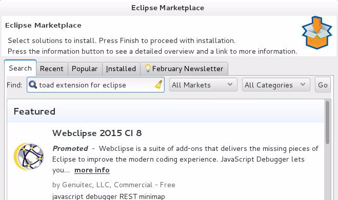

*Figure 3-6 Installing Toad, step 1.*

2. After Eclipse loads an amount of metadata, Click Install, and then Confirm, then Accept and Finish, as shown in Figure 3-7

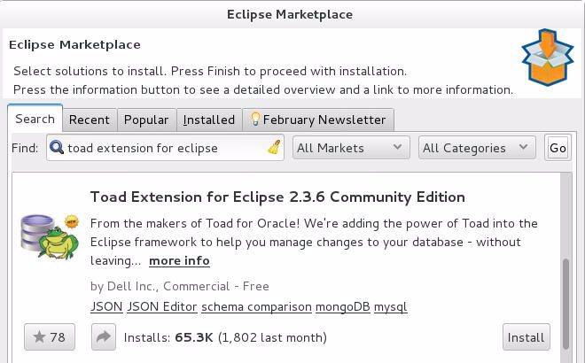

*Figure 3-7 Installing Toad, step 2.*

3. Eclipse will ask to restart, select Yes. At this time Toad Extension for Eclipse is installed and ready for use. When Eclipse restarts, choose the following from the menu bar, Window -> Open Perspective -> Other -> Toad Extension -> OK

> Note: As a developer’s workbench, Eclipse is extensible and can grow quite large. Each of the (frames) on display inside Eclipse is called a view. You could wind up having so many views, that these are organized into groupings called perspectives. A perspective is just a logical grouping of views.

When we first launched Eclipse, we were placed into the default perspective titled, Java. Since we have now installed and wish to use Toad Extension for Eclipse, we move to the Toad perspective.

## 3.2.8 Use Toad natively with MongoDB

The question that being asked in this edition of MongoDB Developer’s Notebook (MDB-DN) is how to run SQL against MongoDB when using Eclipse. This response requires using the MongoDB Connector for BI.

As an aside, however, the Toad Extension for Eclipse can run against MongoDB natively, without running SQL, and without running the MongoDB Connector for BI. As a brief tour of this capability, complete the following:

1. From the Eclipse menu bar, select, Window -> Preferences -> Toad Extension -> Database Settings -> MongoDB

2. For the MongoDB Console, select,

```text
/opt/mongo/bin/mongo
```

and click, OK Example as shown in Figure 3-8.

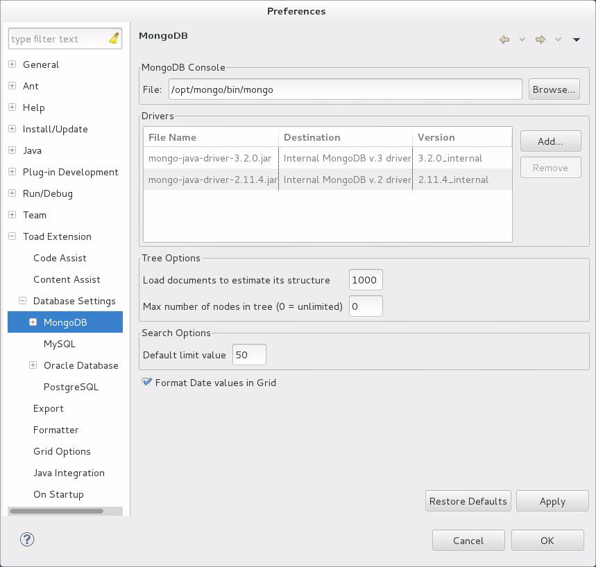

*Figure 3-8 Setting MongoDB runtime inside Toad.*

Toad is now configured to use MongoDB natively. Note that in Figure 3-8, there are drivers for MongoDB version 3.2 and 2.11. This is a condition we will have to overcome below.

Complete the following steps:

3. In the (Toad perspective) Connections view, right-click, and select, New Connection Enter a database name titled, bi_db, and click, OK. You may also experiment with the, Test Connection, button.

4. The above connection is open/active, but does not have the exact properties we require. In the Connections view, right-click our newly created connection, and select, Properties. Here you see that this MongoDB server connection is using the version 2.11 driver libraries. This will cause compatibility issues. Click Cancel to get out of this dialog box.

5. Close this connection. Right-click this connection, then select, Disconnect. Right-click again, then select, Properties. Check the version 3 driver, then click, OK. Right-click the connection a third time, and select, Connect.

6. Experiment with the Object Explorer view. Example as shown in Figure 3-9.

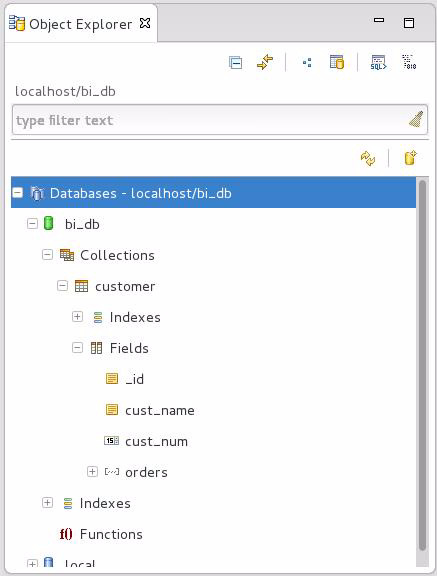

*Figure 3-9 Toad perspective, Object Explorer View.*

7. Enter a MongoDB find() method in the Worksheet view. Example as shown in Figure 3-10.

```text
db.customer.find()
```

should yield results. A reminder, db is the global variable pointing to the current database. The current database was specified in the connection definition we made in Step-3 above.

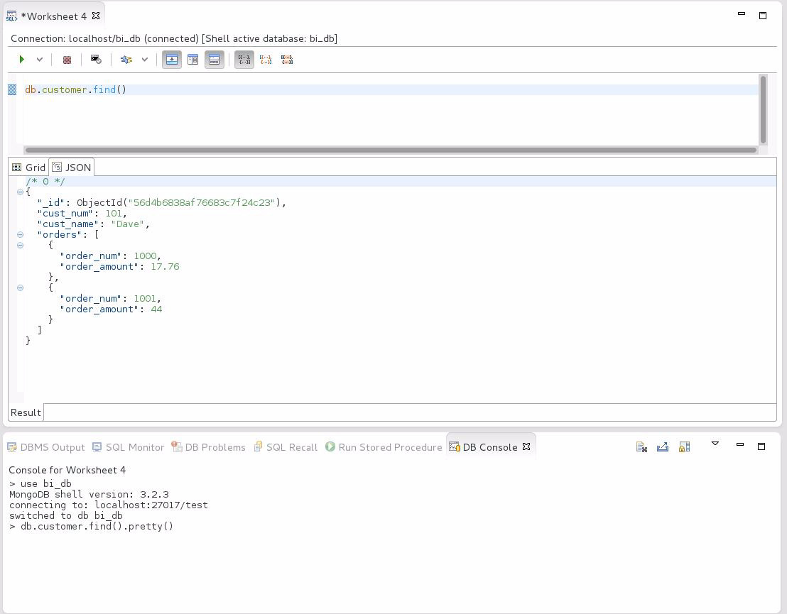

*Figure 3-10 Worksheet view, db.customer.find()*

## 3.2.9 Make a new Toad connection, using Postgres JDBC driver

So far the Toad Extension for Eclipse is configured to access MongoDB natively, using MongoDB recognized commands. Now its time to configure Toad to access MongoDB using SQL.

Complete the following steps:

1. From the Eclipse menu bar select, Window -> Preferences -> Toad Extension -> Database Settings -> PostgreSQL

2. In the dialog box that is produced, Click Add, and browse to the Postgres JDBC Jar file located in

```text
/opt/postgres_jdbc
```

directory. Then click, OK.

3. From the Eclipse menu bar select, Window -> Preferences ->Toad Extension -> Database Settings, and access the drop down list box titled, “Set default database platform”. Choose, PostgreSQL, and click, OK.

4. In the Toad perspective, Connections view, you will have to click the tool bar icon for New Connection. Example as shown in Figure 3-11.

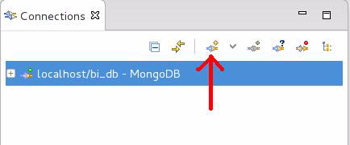

*Figure 3-11 Toolbar in Connection view, New Connection*

5. In the dialog box that is produced, complete the following:

- Port should be 27032, the default listening port for the MongoDB Connector for BI we allowed above.

- Host is localhost.

- Database is biuser. The database name is determined by the mongobischema command we used above, which used the value biuser.

- User is biuser

- Password is password Click the Test Connection button as needed. And click OK when done.

Eclipse is now fully configured to run SQL against MongoDB.

## 3.2.10 Run SQL against a MongoDB target

The Toad views for Object Explorer, Worksheet and others are context aware , meaning; whichever connection in the Toad Connections view is highlighted, determines what you see in these related views. Net/net: for this section, be certain that the biuser connection using PostgreSQL is highlighted.

Complete the following steps:

1. Highlight the biuser connection in the Toad Connections view.

2. In the Worksheet view, enter the SQL SELECT statement,

```text
select * from customer
```

Then click the “Execute SQL statement” button in the Worksheet view toolbar. Example as shown in Figure 3-12.

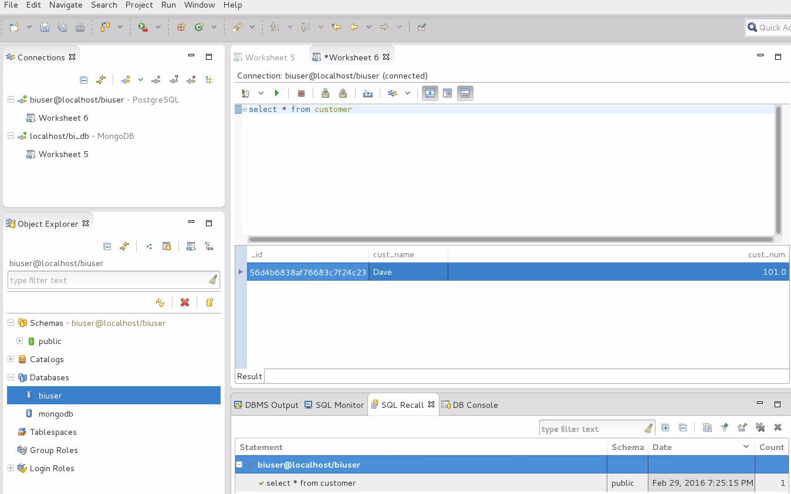

*Figure 3-12 Running SQL in Toad.*

3. Above is an example of a single table SQL SELECT. Enter the following to demonstrate a multi-table SQL SELECT,

```text
select * from customer t1, customer_orders t2
where t1._id = t2._id
order by t1.cust_name
```

## 3.3 (Views) using MongoDB Connector for BI

At this point, the common next question becomes; is there an equivalent to SQL vertical and horizontal slicing when using the MongoDB Connector for BI ?

The short answer is, yes.

- SQL views can restrict access to a vertical slice of a SQL table by removing columns from the view, columns that are normally found in the source table. In the MongoDB sense, we merely remove these columns from the DRDL file. The user can not see these columns, and in effect, these columns do not exist for this user.

- SQL views can restrict access to a horizontal slice of a SQL table by adding a SQL WHERE clause. If effect, the SQL table contains rows for all states (50) in the US, but a SQL WHERE clause specifies that a given user may only view rows from Colorado. In the MongoDB sense, we merely add a $match clause to the DRDL file.

> Note: This topic could get really large, really fast.

We’ve already seen that the mongobischema utility automatically generates an $unwind clause for array elements inside a collection. In this case, we are going to horizontally slice the collection by adding a single or set of $match clauses.

We are going to stop after this addition to the text. If you wish to go further, check the online documentation and experiment with edits to the DRDL file.

Above we entered a 3 step progression to configuring the MongoDB Connector for BI:

- mongobiuser, created a set of user credentials

- mongodrdl, generated our document to relational language mapping file, which we can then edit

- mongobischema, imports the above DRDL file, and configures the Postgres FDW for us

For this task, we do not need to repeat execution of mongobiuser. We also do not need to regenerate the DRDL file, do not need to re-run mongodrdl.

We will enter a loop of editing the DRL file, and re-registering it with the MongoDB Connector for BI, using mongobischema. Some useful commands include:

- mongobischema list biuser Where biuser was the user role we created above. This command is non-destructive.

- mongobischema drop biuser --all

Will drop the table definitions we created above.

- mongobischema drop biuser --all --password password Shows an optional form; supplying the password on the command line, so that we do not need to enter it on every iteration of our test loop. Handy.

- mongobischema import biuser schema.drdl --password password Calls to create the given tables in the Postgres FDW. If you are redefining the same tables, you need not drop them between iterations of your tests, simply import over and over.

Example 3-1 displays our unedited DRDL, as produced by mongodrdl.

### Example 3-1 Unedited version of our DRDL file

```text
schema:
- db: bi_db
tables:
- table: customer
collection: customer
pipeline: []
columns:
- Name: _id
MongoType: bson.ObjectId
SqlName: _id
SqlType: varchar
- Name: cust_name
MongoType: string
SqlName: cust_name
SqlType: varchar
- Name: cust_num
MongoType: float64
SqlName: cust_num
SqlType: numeric
- table: customer_orders
collection: customer
pipeline:
- $unwind:
includeArrayIndex: orders_idx
path: $orders
columns:
- Name: _id
MongoType: bson.ObjectId
SqlName: _id
SqlType: varchar
- Name: cust_name
MongoType: string
```

```text
SqlName: cust_name
SqlType: varchar
- Name: cust_num
MongoType: float64
SqlName: cust_num
SqlType: numeric
- Name: orders.order_amount
MongoType: float64
SqlName: orders.order_amount
SqlType: numeric
- Name: orders.order_num
MongoType: float64
SqlName: orders.order_num
SqlType: numeric
- Name: orders_idx
MongoType: int
SqlName: orders_idx
SqlType: numeric
```

And Example 3-2 displays an edited version of this file that adds a $match clause. A code review follows.

### Example 3-2 Edited version of the DRDL file, adding a $match clause.

```text
schema:
- db: bi_db
tables:
- table: customer
collection: customer
pipeline: []
columns:
- Name: _id
MongoType: bson.ObjectId
SqlName: _id
SqlType: varchar
- Name: cust_name
MongoType: string
SqlName: cust_name
SqlType: varchar
- Name: cust_num
MongoType: float64
SqlName: cust_num
SqlType: numeric
- table: customer_orders
collection: customer
pipeline:
- $unwind:
includeArrayIndex: orders_idx
path: $orders
```

```text
- $match:
cust_num: 101.0
- $match:
orders.order_amount:
$gte: 25.0
columns:
- Name: _id
MongoType: bson.ObjectId
SqlName: _id
SqlType: varchar
- Name: cust_name
MongoType: string
SqlName: cust_name
SqlType: varchar
- Name: cust_num
MongoType: float64
SqlName: cust_num
SqlType: numeric
- Name: orders.order_amount
MongoType: float64
SqlName: orders.order_amount
SqlType: numeric
- Name: orders.order_num
MongoType: float64
SqlName: orders.order_num
SqlType: numeric
```

Relative to Example 3-2, the following is offered:

- The only lines added begin with the string, $match, the MongoDB clause similar to SQL WHERE. We added two $match clauses, to demonstrate that these can cumulative.

- The first `$match` clause specifies an equality, that `cust_num` must be equal to `101.0`.

- The second `$match` clause uses the “greater than or equal to” operator, `$gte`. The target of the operator is the key value titled, `order_amount`, in the embedded sub-document titled, `orders`.

- The net effect of these two clauses is that the user can only see a horizontal slice of the underlying collection.

- We did not demonstrate deleting a column from the DRDL file, providing a vertical slide of the collection. We hope at this point that this task is trivial in complexity.

## 3.4 Monja plug-in for Eclipse and RoboMongo

MonjaDB plug-in for Eclipse does not support SQL against a MongoDB target, but is a widely popular developer’s tool. The Eclipse Marketplace page is located at the following URL,

https://marketplace.eclipse.org/content/monjadb

MonjaDB is installed in the same manner as the Toad Extension for Eclipse, above. Examples as shown in Figure 3-13 and Figure 3-14.

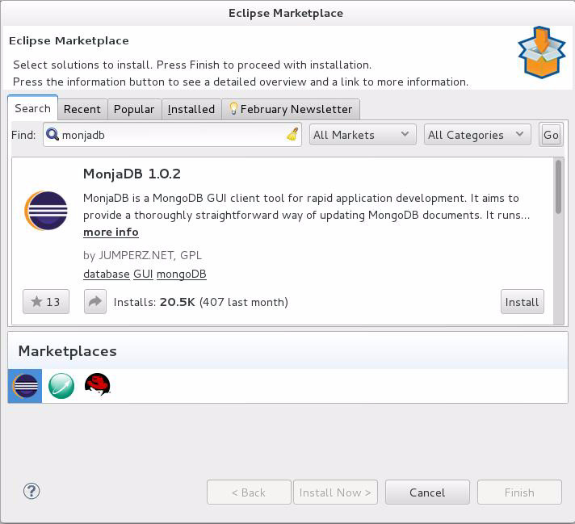

*Figure 3-13 MonjaDB in the Eclipse Marketplace.*

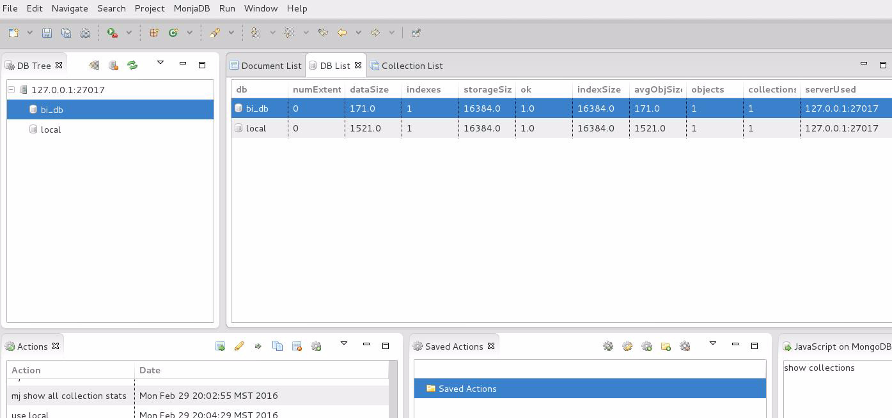

*Figure 3-14 MonjaDB perspective.*

While the MonjaDB plug-in for Eclipse may be aimed more at developers, the RoboMongo graphical tool is very robust, and allows for many administrator commands. Robomongo is not an Eclipse plug-in, and is instead a stand alone graphical tool. Robomongo is available at the following URL,

http://app.robomongo.org/download.html

Figure 3-15 offers a screen shot of the main Robomongo interface.

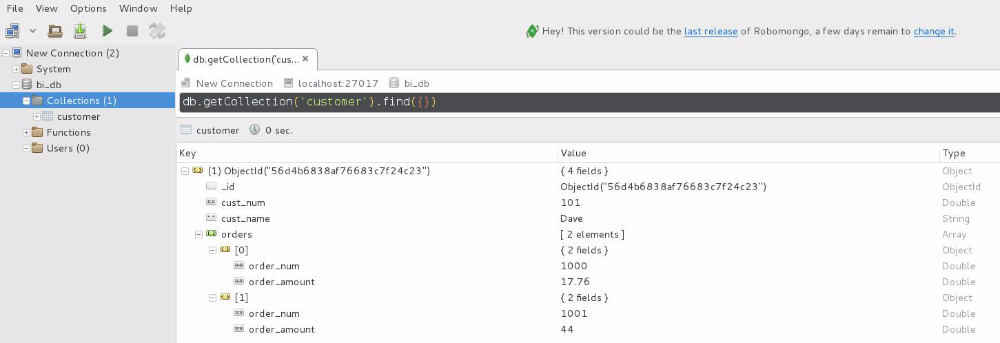

*Figure 3-15 Robomongo graphical user interface.*

## 3.5 In this document, we reviewed or created:

We detailed all steps necessary to install, configure, and operate the MongoDB Connector for BI, Eclipse, Toad Extension for Eclipse, and more. We also detailed how to vertically and horizontally slice your collections before offering them to consumers.

Now you can run SQL against MongoDB !

### Persons who help this month.

Dave Lutz, Dylan Tong, and Asya Kamsky.

### Additional resources:

Free MongoDB training courses,

https://university.mongodb.com/

MongoDB connector for BI introductory video,

https://www.youtube.com/watch?v=0kwopDp0bmg
