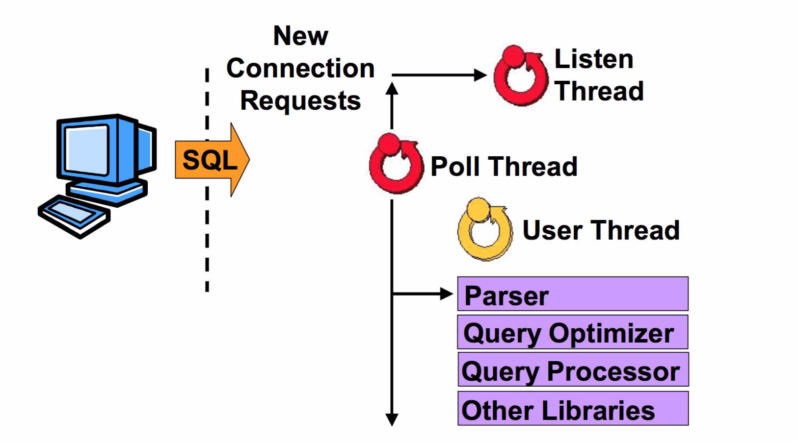
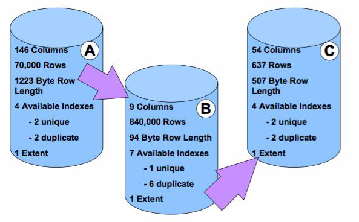
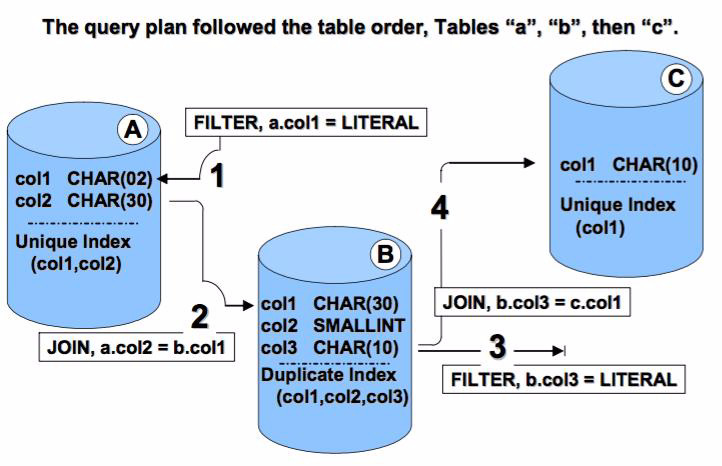
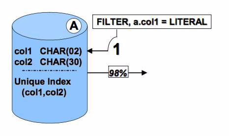
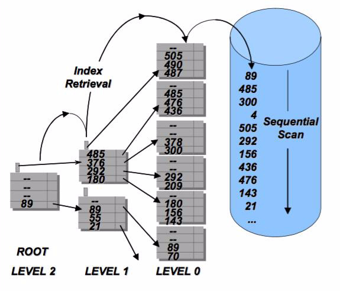
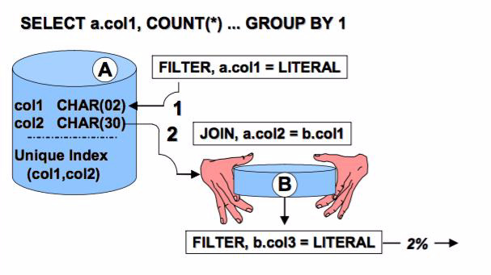
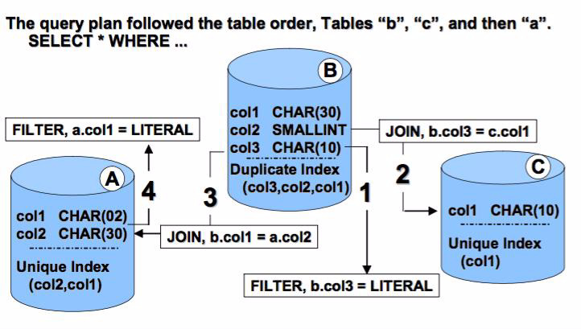
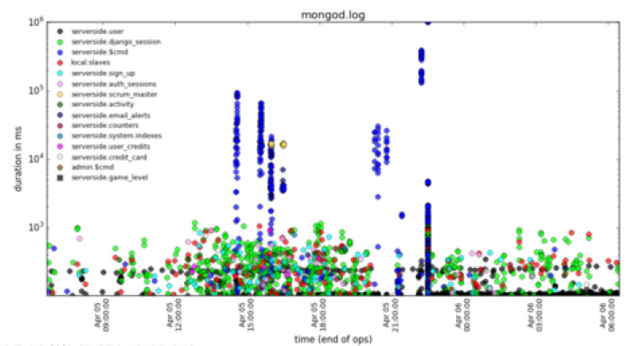

# May 2016: Index Tuning

[Browse 2016](../README.md)

[Back to home](../../README.md)

Original PDF: [MDB_DN_2016_05_IndexTuning.pdf](./MDB_DN_2016_05_IndexTuning.pdf)

---
## Chapter 5. May 2016

Welcome to the May 2016 edition of MongoDB Developer’s Notebook (MDB-DN). This month we answer the following question(s); I inherited a MongoDB database server with 60 collections and 100 or so indexes. The business users are complaining about slow report completion times. What can I do to improve performance ? Excellent question! Certainly in the area of database servers, there is system tuning (memory, process, disk, network), and end user application tuning (application architecture, statement and data model design, indexing). We want to be certain we don’t run off and solve the wrong problem. It could be that the problem does not lay within 100 kilometers of MongoDB; maybe the system generates PDFs from a slow cron(C) or at(C) job. And, we don’t want to take a production system and make it worse experimenting and creating mistakes. If you can afford a MongoDB services engagement, you might try a Developer: Performance Evaluation and Training, or DBA: Production Readiness, standard services offering. Both are described here,

```text
https://www.mongodb.com/consulting-test#performance_evaluation
```

In this document, we will assume all of the above has been completed, and we are now certain we have a MongoDB query optimizer or index problem.

## Software versions

The primary MongoDB software component used in this edition of MDB-DN is the MongoDB database server core, currently release 3.2.4. MongoDB Operations (Ops) Manager, and/or MongoDB Cloud Manager are great aids for this type of work, however; we have to reduce scope or this document would be many more pages. We will, however, briefly detail the open source, mtools, introduced here,

```text
http://blog.mongodb.org/post/85123256973/introducing-mtools
```

All of the software referenced is available for download at the URL's specified, in either trial or community editions.

All of these solutions were developed and tested on a single tier CentOS 7.0 operating system, running in a VMWare Fusion version 8.1 virtual machine. The MongoDB server software is version 3.2.4, and unless otherwise specified is running on one node, with no shards and no replicas. All software is 64 bit.

## 5.1 Terms and core concepts

Query optimizers and index utilization guidelines have been the mysterious black box of database servers since there were database servers. Perhaps my very first user told me she noticed that a query on “*son” was measurably slower than a query on last name Hanson, Johnson, Williamson, etcetera. I thought she was loco, and months later I realized she was smarter than me.

> Note: Specifically the condition being discussed above is; negation of an index, non-initial substring.

Consider that a standard phone book is indexed (sorted by), last name then first name. If you query to find “Hanson, Mary”, you will likely do an indexed retrieval on last name; a couple of cached logical I/Os, find Hanson, then Mary, then a physical I/O to retrieve the full width data record. This is much preferred over sequentially scanning the whole phone book, faster too.

But what if you forgot Mary’s last name ? You know its something “son”; Hanson, Johnson, Williamson. When you lose the leading portion of the indexed string (key value), you negate the use of that index.

A similar condition is; . negation of an index, non-anchored compound key

That is, when the index is composed of multiple key values, and you fail to reference the leading key column or columns. In this case, you never knew the last name, only the first name. If you try to find all persons with a first name of Mary in the phone book, you must sequentially scan the whole book.

Generally, the only exception to a negation of an index , is when that index may be used for a covered query, that is; a key only retrieval.

Database servers, (n) stage back end Generally, database servers have a 4 or 5 stage back end, as depicted in Figure 5-1. Your end user application program communicates, expectably over a network, to a single or set of dedicated database server processes that perform work on behalf of your application. But what steps does the database server execute when you request service ?



*Figure 5-1 Database server, 4 stage back end.*

Relative to Figure 5-1, the following is offered:

- Image Figure 5-1 is copied from an IBM RedBook titled, Dimensional Modeling : In a Business Intelligence Environment, available at, http://www.redbooks.ibm.com/abstracts/sg247138.html?Open Specifically chapters 10 and 11 offer a very effective primer of query optimization, index planning, and related. As author of that book, I am listing it as a source and borrow often from that material in this document.

- We display the 4 stage back end briefly so that we may introduce database server command processing- • With SQL at least and when using ODBC/JDBC, you can send literally any command to the database server. Step 1 then becomes parsing; did you send a SQL CREATE TABLE, a request for system backup or restore, a SQL SELECT, a SQL INSERT, what ? • If the statement you sent is a SELECT, UPDATE or DELETE, you then proceed to the query optimization and query processing stages. Each of these three statements must first read data, and have a plan to read (a query plan) that is as efficient as possible. All other statements (not SQL SELECT, SQL UPDATE, SQL DELETE) generally proceed to whatever set of run time libraries that exist below query processing. • MongoDB, by means of its native language client side libraries, incurs little or no load related to parsing. The client has already identified itself

by executing the specific client side method to find(), insert(), other, and against a specifically identified namepsace; database and collection. • However the real point here is that query optimization exists as a distinct and automatic processing step in your request for database service. Query optimization determines the collection access method; collection scan, or index scan, and which index. Query optimization also identifies the sequence in which query processing steps are executed; apply a predicate then sort, or sort then apply a predicate, etcetera. This determination is called the . query plan

SQL rule based query optimizers, first example Based on sound engineering principles, everything started with SQL rule based query optimizers. Rule based query optimizers receive their name from the manner in which they operate. That is, a set of 5 or so heuristic rules is used in examining your query, so that the query optimizer may determine the query plan; collection scan, or index scan, which index, query processing steps and order, and more, as mentioned above. Rule based query optimizers were never discarded, and merely evolved to become cost based query optimizers. Cost based query optimizers use rules and statistics about the data they operate on. Example 5-1 displays our first sample query. A code review follows.

### Example 5-1 Sample query, selectivity of predicates.

```text
CREATE TABLE t1 (col1, col_2, .. 80 more columns);
CREATE INDEX i1 ON t1 (col_gender);
```

```text
SELECT * FROM t1 WHERE col_gender = “F” AND col_age > 50;
```

Related to Example 5-1, the following is offered:

- The query in this example reads from one collection, and has two

```text
WHERE col_gender = .. and col_age > ..
```

predicates ( ). The questions the query optimizer must answer include: • Collection processing order (which of many collections to read first); not relevant to this example, since there is only one collection. • Collection access method; perform a collection scan (sequentially read every document in the collection and evaluate), or use the available

```text
col_gender = ..
```

index (perform an index scan) for the predicate ( ).

```text
col_age > ..
```

• The table t1 offers no index to serve the ( ) predicate, thus an index retrieval for this predicate is not available. • The index supported predicate is based on an equality, which is heuristically determined to be better than a range query. Thus even if

the range predicate was supported by an index, a rule based optimizer would generally favor the predicate with the equality. • Which of many indexes may be the best choice- By definition, a unique index on one key and a predicate with an equality, returns one document. Generally, the rule based optimizer expects that a range predicate on a sequential access method or duplicate index scan returns 1/3 or 1/5 of the entire contents of the collection. And also generally, a rule based optimizer expects that an equality predicate on a sequential access method or duplicate index scan returns 1/10 to 1/20 of the entire contents of the collection. The take away here is this; all things being equal, predicates with equalities are given favor over predicates with ranges.

> Note: The numbers 1/3, 1/5, 1/10, and 1/20 depend on the given SQL database vendor’s product programming choices.

• Covered query, or not (SQL generally calls these, key-only retrievals); since the query returns every key value (every column) from the collection, every document returned via indexed retrieval would have to first access the index entry, then collection entry (access the full width data record). The query detailed above is not available to be covered, key-only.

- So, the query plan for this query is likely to be,

```text
col_gender
```

• Index retrieval on i1; evaluate the predicate . • Then retrieve the full width document from the collection. • Then evaluate any remaining predicates.

> Note: What is an index ?

Generally, we know that the collection (SQL table) is a random ordered list of all of the documents found to exist in the given collection.

Generally, an index is a vertical slice of the collection it supports; that is, a subset of key values (columns), and all documents, kept in ASCII collation sequence. Because the index is pre-sorted, it may offer a more efficient access method than a collection scan, where the rows are in random sequence. Need to find Bernie Sanders in the phone book ? Open the book to the “S” page, then “Sa”, then find Sanders, then scan for Bernie. This is faster than reading the phone book page by page from the beginning.

Finds, updates, and removes may operate more quickly with index support, because they can find the documents they need to operate via fewer steps. (Find what needs to be found with a fewer number of physical/logical I/Os.)

Every insert, update, and remove is also a tad slower because the collection itself must be updated, as well as the vertical slice of the collection, which is the single or set of indexes accompanying the collection.

- Is the query plan offered above the most efficient ? No chance.

```text
col_gender
```

The predicate on likely returns 50% of the collection, after which we still have to retrieve from the collection and do more work. Most likely this query would perform best if we discarded using the index, and started with a collection scan. A cost based query optimizer would likely know this, and MongoDB would know this.

> Note: We have detailed two negation of an index criteria above. A third negation of an index criteria is; negation of an index, (poor) selectivity of a predicate .

What is the query processor ? Generally in the SQL world, the query processor stage operates after the query optimizer. The query processor is effectively the set of run time libraries that complete execution of the query plan. This also includes managing execution of the query plan in memory, or using a set of operating system disk files as virtual memory, allowing large queries to overflow to disk.

> Note: In MongoDB, there is greater overlap between the query optimizer and query processing stages. In effect with MongoDB, possible query plans are executed in trial against one another, and monitored. Slower query plans are then terminated, and the fastest query plan is allowed to execute to completion. Its like the movie Gladiator, but for queries.

Many winning query plans are kept in cache, and are re-evaluated after given conditions are observed. E.g., if you create or drop an index for a given collection, change the collection data set by a given percentage, other.

Contrast this to SQL, which has to run specific batch jobs to maintain query optimizer statistics, which can be wrong or out of date (or just plain never run). Bad query optimizer statistics are a leading contributor to bad, poorly performing query plans when using SQL.

Which query plans does MongoDB cache ? Only those that could have multiple solutions. See,

```text
https://docs.mongodb.org/manual/core/query-plans/
```

5 rules to a rule based query optimizer The 5 rules to a rules based query optimizer include: Rule 1: Outer table joins Rule 2: (Non-outer) table joins Rule 3: Filter criteria (predicates) Rule 4: Table size Rule 5: Table cardinality

The most common join in SQL is a required equi-join, that is,

```text
SELECT *
FROM order_header oh, order_line_items oi
WHERE oh.order_number = oi.order_number;
```

```text
order_header
```

For every document in the collection, find the expected and related

```text
order_line_items
```

(required) document from the collection. Optionally however, you might have a join similar to,

```text
SELECT *
FROM persons p, OUTER automobiles a
WHERE p.person_id = a.person_id;
```

In effect, return each person and a record of the automobile they own. If variably, the person owns no automobile, return the person record and a blank or NULL value for what should have been the automobile data.

Recall that MongoDB, a document database, does not shred data on

> Note: ingest like SQL.

A customer order in SQL might be stored in 3 or more tables when inserted. Each subsequent SQL SELECT then must re-assemble (join, outer join) the record prior to processing.

MongoDB does not shred data like SQL, and thus does not need to (un-shred). With MongoDB, a customer order would be stored (inserted, updated, read, other) intact. MongoDB does support join operations, but they are not common as allowed by the document database model.

Are SQL joins expensive ? Consider that the first two rule based query optimizer rules address only joins.

Rule based query optimizer example, a second example Figure 5-2 displays our second sample query, which we use to complete our discussion of a rule based query optimizer. A code review follows.



*Figure 5-2 Second query example, 3 collections, 2 predicates.*

Relative to Figure 5-2, the following is offered:

- Like most SQL queries, this query sources from multiple collections, and all of the collections are joined on equalities; collection-a joins to collection-b, then collection-b joins to collection-c.

- Recall that indexes are vertical slices of the collection they represent, and require resource as they need to be maintained. Figure 5-2 displays a total of 15 indexes, which means that a single row insert into these three SQL tables costs the same (or more) as fifteen single row inserts into a collection with zero indexes.

- There are nearly as many indexes on collection-b as there are columns. This is common for a SQL database design that violates best practice design guidelines. Generally this condition is indicative of a repeating set of columns in a (parent) collection, something SQL struggles with. To achieve improved performance, someone threw indexes at the (design) problem.

- The SQL SELECT syntax is diagramed in Figure 5-3. A code review follows.



*Figure 5-3 Syntax diagram for query number 2.*

Relative to Figure 5-3, the following is offered:

- If we apply the five rules from a rule based query optimizer, Rule 1 is not in effect; there are no outer joins. This is common.

- Rule 2 is not in effect yet, as all tables are joined, which is common. At this point, Rule 2 is indeterminate.

- Rule 3 becomes the first rule in effect, as two of the collections have predicates. • This means that collection-a or collection-b will be processed first. • Leading with the predicate on collection-a is supported by an index. Leading with the predicate on collection-b would be non-anchored, because the predicate is on column-3, and no index on collection-b leads with column-3.

- After the first collection is chosen, the remaining collection orders are determined by Rule 2, collection join.

> Note: Rules 4 and 5 are largely fall throughs; if rules 1 through 3 do not determine the query plan, only then do rule 4 or 5 come into effect.

Rule 4 is table size; given two tables, suffer through the worst table first, and join into the smaller table.

And rule 5 refers to the order in which the tables are listed in the SQL FROM clause; essentially a determinant. If you fall to rule 5, odds are you are having performance problems.

The query displayed in Figure 5-3 is a common problem query, and performance will be awful. This example was from a real world use case and returned about 700 documents in a 300 second elapsed time, about 2 documents per second. The problem would display itself in both rule based query optimizers as well as cost based, and we will discuss why. Figure 5-3 displays a crucial next piece of information towards tuning this problem query.



*Figure 5-4 Measuring selectivity of all predicates.*

Relative to Figure 5-4, the following is offered:

- A SELECT COUNT of the predicate on table a revealed that this predicate returned 98% of the entire contents of this collection. Yet, this collection had 70,000 documents, and the final result set contained 700 documents. Where did the 70,000 minus 700 documents go ?

- But this is a predicate, on an equality to a unique index. How do we return 98% of the contents of this collection ? The unique index is compound; composed from multiple keys. The predicate is only an equality to the leading column, thus losing uniqueness.

- After the predicate to collection-a is applied, the next step in query processing is to join to collection-b.

A unique index for a data set that is 98% duplicate. How ? Why ?

> Note:

This was a canned application, commercial off the shelf (COTS). The software vendor created an application to support multiple locations and this customer only had one location. This problem is common.

The indexed retrieval into collection-a was pretty much useless, and would better be served via a collection scan. This option was available, and would improve the performance of the query by a small measure, however, still not good enough to satisfy customer demand. Figure 5-5 displays a collection scan, and index scan retrievals. A code review follows.



*Figure 5-5 Index scan versus collection scan.*

Relative to Figure 5-5, the following is offered:

- A collection scan (aka full table scan, or sequential scan) offers given performance. The collection could be highly cached so most of these (physical) I/O calls might be logical.

- The most common type of index is a B-tree+. In effect, level-0 of the index structure keeps key values is ASCII collation sequence, pre-sorted. To find a given key value you walk a tree, with branch and twig nodes, finally arriving at the leaves. To find a single document, you would have to collection scan an entire collection. Or, you could perform a much smaller number of reads of the index to find your document.

Figure 5-6 displays the next set of steps in the processing of this sample query. A code review follows.



*Figure 5-6 Selectivity of the second predicate, much improved.*

Relative to Figure 5-6, the following is offered:

- Figure 5-6 unlocks the secret to this poorly performing query.

- Two predicates, and the predicate on collection-a is almost useless. It is the predicate on collection-b that reduces the resultant data set to a small number.

- As part of query processing, collection-a with 70,000 documents is fully merged with the 840,000 documents from collection-b, only to be discarded when the predicate on collection-b is applied. This is why the query was so slow.

- Collection-c was never part of the problem, being a join to an equality on a single key column; entirely unique, confirmed index retrieval.

> Note: This is not an edge use case, and is instead entirely too common. And, this entirely wasted set of resource consumption goes entirely unnoticed unless a human being complains.

Figure 5-6 displays a query plan that would deliver optimal performance. A code review follows.



*Figure 5-7 Optimal query plan, good performance.*

Relative to Figure 5-7, the following is offered:

- This figure displays the optimal, sub-second capable query plan.

- From Rule 3, the first collection to be processing is collection-b, via an index only retrieval; a covered query. This access method was not available until the index was changed; its column order reversed.

- From Rule 2, either collection-a or collection-c could be processed next. Until the index on collection-a had its column order reversed, there was no way this query plan could have been supported. Without this index, the query processor would have to had performed a collection scan on collection-a, once for every document in collection-b. That will never happen. A modern query optimizer would call to build a new index (likely a hash index) on collection-a in full multi-user mode. Better performance over the first query plan, but still not sub-second.

> Note: This query use case example does not have an industry standard name. Some call it the upside down filter problem .

Out of 100 average queries in a given SQL application, 4-6 follow this pattern and need repair.

Cost based query optimizer As stated, rule based query optimizers did not disappear; they were based on sound engineering principles. Cost based query optimizers are an enlacement to rule based query optimizers. Cost based query optimizers keep statistics about the collections they serve; number of documents in a collection, number of unique key values in a duplicate index, maximum, second maximum, minimum and second minimum key values, and much more.

These statistics that a cost based query optimizer are dependant on are not maintained automatically, and that is a good thing. Gathering these statistics is very costly; reading all documents in each index, gathering distributions, etcetera. Better to gather these statistics on demand, with human control.

> Note: Never gathering statistics, or falling dependant on statistics that are old (no longer accurate), is a leading performance problem with SQL based query optimizers.

And gathering statistics is very costly. Gathering statistics on a 100 TB data set could take 2+ hours, and equal the load of the worst report or query that the SQL database server system observes.

And, the query optimizer has to consider all of the statistics gathered. When the this month’s author to this document first used IBM DB2/UDB, generating a query optimizer plan could take minutes. So long in fact, that the query optimizer step had a user programmable system time out. Yeesh.

The MongoDB query optimizer As stated, rule based query optimizers did not go away. They got better, and became cost based. So what type of query optimizer does MongoDB employ ?

Consider the 3 logical steps to the execution of a SQL query; filter, join, sort (FJS). We list these logical steps in the order FJS, because this is the commonly observed query processing order; filter, then join, then sort.

> Note: You almost never sort first in the execution of a SQL query, because the data was shredded on insert. The data being requested does not exist until you reassemble it, until you join and then create it. SQL almost always filters first.

As efficiently as possible reduce the amount of documents that must be examined.

MongoDB can join. However, because MongoDB data was not shredded on insert, MongoDB rarely needs to join. This leaves filter and sort, and MongoDB often does filter or sort as the first step in query processing.

Where SQL has an FJS (filter, join, sort) preference, the common sequence for MongoDB is observed to be; equality, sort, range (ESR). Consider the following query (written in SQL in case you only read SQL), run against a MongoDB database server;

```text
SELECT *
FROM collection
WHERE col1 = ‘x’ and col2 > ‘y’
ORDER BY col3;
```

There is no join in the query listed above because MongoDB is modeled to rarely need to join. Still true to cost based query optimizers, the following is offered:

- If there was a compound index on (col1, col2), an indexed retrieval on this index would be anchored.

```text
col1 =
```

We could position once within the index for the equality predicate,

```text
‘x’
col2 > ‘y’
```

, and then from the leaf level, range scan for the predicate, .

- A compound index on (col2, col1) can not be considered anchored, here’s why- You could position at the leaf level of the index for the beginning of the

```text
col2 = ‘y’
```

range, . At this point you would have to skip scan, across all of

```text
col1
‘x’
```

the possible values of to find those just equal to .

Not getting this example ? Once again, consider the phone book.

> Note:

Consider last name equal to Smith, first name greater than David, versus, last name greater than Smith, first name equal to David.

- We are very close to optimal performance with an index on (col1, col2), except for the fact that we have to sort. A sort of 50,000 or more large documents may not be sub-second. There is a query plan for this query however, that is sub-second.

The technique we are employing here goes by the industry standard

> Note: name, . pseudo order by clause

Consider the following queries-

```text
SELECT * FROM t1 WHERE col1 = ‘x’ ORDER BY col2;
SELECT * FROM t1 WHERE col1 = ‘x’ ORDER BY col1, col2;
```

```text
col1
```

The two queries above are semantically the same. Because the value for

```text
col1 = ‘x’
```

is constant (per its predicate expression, ), it doesn’t matter if we

```text
col1 then col2
col2
```

sort by , versus just . It would be the same if we asked for-

```text
SELECT * FROM t1 ORDER BY ‘x’, col2;
```

Why do we care ?

```text
col1, col3
```

Because a single index ( ) can be applied to both the filter predicate and the sort; it is anchored. This query returns pre-sorted data. Mui fast, mui bueno.

A good query optimizer does this transform for you automatically. The MongoDB query optimizer determines this automatically.

- An index for this query on (col1, col3, col2), or just (col1, col3) supports the pseudo order by clause technique-

```text
col1 = ‘x’
```

• Index support for the predicate, . As efficiently as possible, reduce the amount of I/O to be performed. We are anchored so far.

```text
col2
```

• The data is pre-sorted on because the first column in the index used an equality predicate; pseudo order by clause.

```text
col1, col3
col2
```

• If the query only returned key values (columns and/or , we have a candidate for a covered query (a key-only retrieval). As it is written, this query returns more columns than can or should be contained in an index and can not be covered.

```text
col2
```

• Based on experimentation, may or may not be a candidate to include in this same index. If we have to go to the data pages anyway,

```text
col2
```

why not apply the predicate for there ?

- Consider if you had three indexes on this collection. One index on (col1, col2), and index on (col1, col3), and one on (col1, col3, col2).

How would MongoDB chose the best query plan ? MongoDB would run all 3 query plans supported, each for a period of 50-100 milliseconds, and measure which got farther faster. The fastest query would be allowed to complete, and the slower query plans would be terminated. MongoDB caches the winning query plan, and re-evaluates after given conditions are observed. E.g., if you create or drop an index for that collection, change the collection data set by a given percentage, other.

> Note: So the question remains unanswered; what type of query optimizer does MongoDB have ? MongoDB does not apply any term to describe its query optimizer.

Using industry standard terminology, the MongoDB query optimizer has elements of rule based, cost based (statistics about the indexes, automatically known), and also uses histograms. The MongoDB query optimizer experiments, and uses monitoring (history, histograms).

Checking in: what we have so far- At this point in this document, we have a general understanding of index utilization, query optimizers, and more specifically, the MongoDB query optimizer and indexes. Per the original problem statement- I inherited a MongoDB database server with 60 collections and 100 or so indexes. The business users are complaining about slow report completion times. What can I do to improve performance ?

We still need the following:

- We need a means to discover all of the databases, collections and indexes contained in a given MongoDB database server.

- We need a means to discover which queries are being executed; the frequency, concurrency and spread, and with what performance results.

- Per each of these queries, we need to output and analyze the associated query plan. For any poorly performing query, we need to make the query run faster and/or with less consumed resource, using techniques listed above, and those yet to be listed.

- We need a means to discover which indexes may actually be getting used. This task is not entirely on message. We may optimally remove indexes that are known to be unused to increase overall system performance; a marginal, but still useful gain compared to tuning any specific problem query.

> Note: Repeating our earliest disclaimer-

Before we perform any of this work, we need to confirm we actually have a query problem. Before we drop any indexes, we should be positive that no other query or routine, or data integrity constraint, is dependant on said index.

mtools Figure 5-8 displays a graph from the free, open source, MongoDB themed tool

```text
mtools
mtools
```

titled, . An overview of is available here,

```text
http://blog.mongodb.org/post/85123256973/introducing-mtools
```

What we are attempting to display is the following:

- When you gather and chart the all of the query completion times, they almost always appear equal to that which is displayed in Figure 5-8. The longest queries generally take orders of magnitude longer than the shortest queries.

- We work through the list longest queries first, make them faster by applying query tuning guidelines, until we get to the point where we reach acceptably performing query completion times. We don’t tune every query since our time is the most limited resource.



*Figure 5-8 mplotqueries, observed query performance graph with drill down.*

## 5.2 Complete the following

In the March 2016 edition of this document, MongoDB Developer’s Notebook March 2016 - - MongoDB Connector for Business Intelligence, we detailed several activities including:

- March 2016, Section 3.2.2, Download, install and configure a MongoDB database server

- March 2016, Section 3.2.3, Start the MongoDB database server

- March 2016, Section 3.2.4, Create a sample database, and collection, and add data

In this document, we will assume that all of the above steps have been completed. Further, we will assume you can or have already entered the MongoDB shell (binary program name, mongo), and are ready to enter MongoDB query language (MQL) commands.

Or, per our problem statement, you have an existing MongoDB database server in need of examination.

> Note: Do not complete any of these steps on a production or otherwise critical system, and have a system backup and know how to use it; no warranty written or implied by the author.

At one point below we turn on or increase the MongoDB system profiling level . Calling for this behavior can be resource consumptive; an example of one step below you don’t want to experiment with on production or otherwise critical systems.

Open source,

```text
mtools
mtools,
```

We are going to use the open source MongoDB themed tool titled, to gather statistics about which queries are running on our MongoDB database server. A couple of Url’s,

```text
mtools
```

– is created and maintained by Thomas Rueckstiess, and his blog

```text
mtools
```

detailing is located here,

```text
http://blog.mongodb.org/post/85123256973/introducing-mtools
```

Above you will see that there are currently five main grouping of utilities

```text
mtools
```

inside , of which we will only use one or two today.

```text
mtools
```

- Detailed installation instructions for are located here,

```text
https://github.com/rueckstiess/mtools/wiki/mtools-Installation-on
-Ubuntu-12.04
```

```text
mtools
```

> Note: We will not detail installing ourselves. The documentation is very good, and there is only a percentage chance we would install on your exact operating system anyway.

```text
mtools
```

Moving forward in this document, we will assume is installed and running.

- If you are not already aware, MongoDB offers free training courses related to programming and administering MongoDB at,

```text
http://university.MongoDB.com
```

The videos for these courses are hosted on YouTube and a YouTube query

```text
mtools
M202
```

for MongoDB and yields three very good videos from the

```text
mtools
```

course related to -

```text
mtools
```

• Lesson 4.0, Introducing ,

```text
https://www.youtube.com/watch?v=kYgC_9Jz-Ok&index=13&list=PLGO
sbT2r-igkk9yh3IAUP3oYTBI-gZI0r
mtools mloginfo
```

• Lesson 4.1, ,

```text
https://www.youtube.com/watch?v=Bcd_hgTfVsc&index=14&list=PLGO
sbT2r-igkk9yh3IAUP3oYTBI-gZI0r
mtools mplotqueries
```

• Lesson 4.2, ,

```text
https://www.youtube.com/watch?v=YC4R92Brzb4&index=15&list=PLGO
sbT2r-igkk9yh3IAUP3oYTBI-gZI0r
```

## 5.2.1 Find mongod, and associated settings

Per our original problem statement, we were given a (hardware) server running a MongoDB database server, and we know little else. Step one, find the MongoDB server software, and determine if MongoDB is running. Below we outline steps to complete these tasks on a Linux based system.

At the Linux Bash(C) command prompt enter,

```text
find / -name mongod -print 2> /dev/null
```

The command above runs the Linux find file by name on the entire Linux hard disk, and could take a long while to complete. Generally though, this command is safe, non-destructive. On our sample box, this command output the following,

```text
/opt/mongo/bin/mongod
/opt/mongo_3.0/bin/mongod
/opt/mongo_2.6/bin/mongod
```

```text
/opt/mongo_3.2.1/bin/mongod
```

Relative to the command and resulting output above, the following is offered:

```text
mongod
```

– is the main MongoDB server daemon, and that is why we look for it. Presence of this file is a good indicator of a MongoDB software installation.

```text
mongod
```

- The output above shows at least 4 binary programs. Run each of

```text
--version
```

the above with a parameter to confirm the version of each.

- Finding the binary files above does not indicate that a given installation of MongoDB is active, running.

At the Linux Bash(C) command prompt enter,

```text
netstat -na | grep mongod
```

```text
netstat
mongod
```

The command above runs the Linux command, which tells us if a daemon is listening on any network port. On our sample box, this command output the following,

```text
unix 2 [ ACC ] STREAM LISTENING 58572 /tmp/mongodb-27017.sock
```

> Note: Its not really this hard-

We are acting as though we inherited a box with no documentation, no idea where MongoDB is installed, other. But, better to be prepared than to not be prepared.

Relative to the command and resulting output above, the following is offered:

```text
mongod
```

- One of the four binaries we identified is listening on port 27017, the default MongoDB connection port.

```text
“ps -ef | grep mongod”
```

- A confirms we have one mongod running, and perhaps other MongoDB related daemons. At this point, however, we have all we need.

From the most recent version number mongod above, execute the mongo binary with the following option,

```text
mongo --port 27017 # this is also the default port number
db.version()
3.0.10
```

Relative to the command and resulting output above, the following is offered:

```text
mongod
```

- From the above output, we can determine that the binary version we are running is 3.0.10. For no reason whatsoever, let’s go back and run

```text
mongo
```

the 3.0.10 version of .

- Our next and final step is to locate the logfile for our given mongod executing binary.

Execute the mongo binary associated with our mongod binary and run,

```text
use admin
db._adminCommand("getCmdLineOpts")
```

Relative to the command and resulting output above, the following is offered:

```text
logpath
systemLog
path
```

- We’re looking for data related to , , and the nearby . Example output as displayed in Example 5-2. A code review follows.

### Example 5-2 Output from mongo, getCmdLineOpts.

```text
> db._adminCommand("getCmdLineOpts")
{
"argv" : [
"../bin/mongod",
"--fork",
"--dbpath",
".",
"--logpath",
"logfile.4"
],
"parsed" : {
"processManagement" : {
"fork" : true
},
"storage" : {
"dbPath" : "."
},
"systemLog" : {
"destination" : "file",
"path" : "logfile.4"
}
},
"ok" : 1
}
```

Relative to Example 5-2, the following is offered.

```text
“--logpath
```

- The MongoDB logfile is listed via a relative pathname,

```text
logfile.4”
dbpath
```

. Even the is relative. So, we know the logfile name is

```text
logfile.4
```

, but we do not know where this file is located.

- Use a version of the find command listed above to find every file named

```text
logfile.4
```

, hopefully there are only a few.

- Run the MongoDB command shell, mongo. Your connection to the server will be logged to the logfile, and only one of the (n) logfiles you find should show this new entry. Net/net; if you have (n) possible logfiles, and only one active MongoDB server, then only one logfile will be receiving entries. Your accessing of the MongoDB shell will be logged, and thus tell you which logfile is active.

Checking in: what we have so far-

- We know how many of which MongoDB database servers are running.

- And we know the connection port number.

- And we know the location of the logfile for one or all MongoDB database servers.

## 5.2.2 Optional: set the database server “server profiling level”

MongoDB has at least two entities that contain the keyword, log.

- Journaling, what other database servers may call logging, or transaction logging, is detailed here,

```text
https://docs.mongodb.org/manual/core/journaling/
```

This is not the topic we are discussing in this section.

- MongoDB also has an ASCII text file (and more) that logs key system events; new user connection requests, etcetera. By default, most operations like find, or similar, that take more than 100 milliseconds to complete are logged. This is the topic we are discussing in this section.

MongoDB has three server profiling levels ; zero (the default), one and two. It is this collection of settings that affect what is written to the MongoDB server logfile. Server profiling level is detailed here,

```text
https://docs.mongodb.org/manual/tutorial/manage-the-database-profile
r/
```

Why do I care ? By default, the MongoDB server log file will contain ‘operations’ (find methods, and more) that execute for longer than 100 milliseconds. Operations executing less than 100 milliseconds are not logged unless you change the server profiling level. You care if you wish to get a more complete picture of all queries that are being run, not just the really awful ones (more than 100 milliseconds).

> Note: This is one area we wish for you to be careful-

If you change the server profiling level to record every query (every operation), your load of writing to the server log file might be higher than the queries themselves. That would not be good, as overall system performance might not then meet your needs.

The server profiling level can be set system wide, or database by database. In Example 5-3 below, we set the server profiling level for a single database. A code review follows.

### Example 5-3 Setting the server profiling level

```text
> show dbs
local 0.078GB
test_db 0.078GB
>
> use test_db
switched to db test_db
>
> db.getProfilingLevel()
0
>
> db.setProfilingLevel(1,1)
{ "was" : 0, "slowms" : 100, "ok" : 1 }
>
> db.getProfilingLevel()
1
>
```

Relative to Example 5-3, the following is offered.

```text
show
```

- The first command above, , lists all of the databases contained in this server.

```text
use
```

- The second command, , calls to change our current database. This database becomes that which will receive and enact the

```text
setProfilingLevel()
```

method.

```text
getProfilingMethod()
```

– is non-destructive, and returns the current profiling level for the current database.

- And lastly we set the profiling level to report all operations that execute for longer than 1 millisecond. We’ve said at least twice now; don’t do this on a production system because of the cost. Run this command with great care.

At this point then, every query (pretty much every everything) you do against this MongoDB system will place an entry in the server logfile.

Remember to turn server profiling level back to off when you are done

> Note: experimenting/researching.

## 5.2.3 Run

```text
mtools
```

```text
mtools
```

As a package (toolset), has 5 or more command line utilities that perform given analysis of your MongoDB server system. We are interested in just two

```text
mloginfo
mplotqueries
```

today; and .

Now that we know where our MongoDB server log file is, and now that we’ve set

```text
mloginfo
```

the server profiling level, we can run queries and have report query behavior. Example as shown,

```text
mlogingo --queries logfile.4
```

```text
mloginfo
WHERE colx = 10
```

abstracts the column key values, E.g., , (omit the 10), and returns a summary of the query shapes. Example as shown in Example 5-4. A code review follows.

### Example 5-4 Output from mloginfo --queries <logfile>

```text
source: logfile.4
host: rhhost00.grid:27017
start: 2016 Apr 18 14:06:39.943
end: 2016 Apr 18 15:24:09.420
date format: iso8601-local
length: 1677
binary: mongod
version: 2.6.11
storage: mmapv1
```

```text
QUERIES
```

```text
namespace operation pattern
count min (ms) max (ms) mean (ms) 95%-ile (ms) sum (ms)
```

```text
test_db.zips getmore {"aggregate": 1, "cursor": {}, "pipeline":
[{"$group": {"_id": {"city": 1, "state": 1}}}, {"$group": {"_id": 1, "countOf":
{"$sum": 1}}}, {"$sort": {"countOf": 1}}]} 35 5 9
5 7.3 208
test_db.zips getmore {"aggregate": 1, "cursor": {}, "pipeline":
[{"$group": {"_id": 1, "countOf": {"$sum": 1}}}, {"$sort": {"countOf": 1}}]}
15 5 6 5 6.0 80
```

Relative to Example 5-4, the following is offered.

- So we have some issues with long output lines and wrapping, but work with me here.

```text
mloginfo
```

- We see in this log file there were two queries run. has removed (abstracted) any specific key values, then counted and aggregated given measures. For example, the first query was run 35 times, and the second query was run 15 times.

```text
mloginfo
```

reports by query shape; the specific syntax and structure regardless of the values being queried . This is super handy, by reducing the number of queries you’d have to examine by hand.

```text
mplotqueries
```

Now let’s run to receive a visual representation of the query load. Example as shown in Example 5-5. A code review follows.

### Example 5-5 Running mplotqueries.

```text
[root@rhhost00 data]# mplotqueries logfile.4
```

```text
SCATTER plot
id #points group
1 485 test_db.$cmd
2 50 test_db.zips
```

```text
keyboard shortcuts (focus must be on figure window):
```

```text
p switch to pan mode
o switch to zoom mode
left/right back / forward
h home (original view)
l toggle log/linear y-axis
f toggle fullscreen
1-9 toggle visibility of top 10 individual plots 1-9
0 toggle visibility of all plots
- toggle visibility of legend
[/] decrease / increase opacity by 10%
{/} decrease / increase opacity by 1%
</> decrease / increase marker size
e toggle marker edges
g toggle grid
c toggle 'created with' footnote
s save figure
q quit mplotqueries
```

Relative to Example 5-5, the following is offered.

```text
mplotqueries logfile.4
```

- The only command above is, .

The remainder of the output form instructions to control the visual plot that is produced.

```text
mtools
```

Consider viewing the themed online tutorials detailed above.

```text
mplotqueries
```

- Earlier we presented a sample output of in Figure 5-8. The commands detailed in Example 5-5 are executed when the visual display window from Figure 5-8 is current. We prefer ‘l’, to graph against a logarithmic scale, versus a linear scale. Note too that you can click on a given (dot), and the associated query will

```text
mplotqueries
```

output in the command window from which you launched . Need to find your most offensive query by elapsed execution time ? Now you know how.

Another technique

```text
mtools
```

is an open source project, created by, but not supported by staff members of MongoDB. (Largely, Thomas Rueckstiess.) When the formatted output of the

```text
mtools
```

MongoDB server logfile changes, may lag, and not yet support any new formatted output to said logfile.

If you wish to use Linux text processing to read your logfile, then the instructions below may be of aid to you. (If you run on Windows, no worries. Please find and install a free Linux toolkit on your Windows box.)

Consider the sample entry from the MongoDB logfile listed below-

```text
2016-04-18T14:07:18.228-0600 [conn3] command test_db.$cmd command:
aggregate { aggregate: "zips", pipeline: [ { $group: { _id: "$state",
cityCount: { $sum: 1 }, totalPop: { $sum: "$pop" } } }, { $sort: {
_id: 1 } } ], cursor: {} } keyUpdates:0 numYields:1 locks(micros)
r:25014 reslen:2640 30ms
```

Relative to the example above, the following is offered:

- The MongoDB logfile contains dozens of event types. We cherry picked a query above, because we’re talking about queries.

- The first two columns form a time stamp; useful, but perhaps something we will discard if we wish to aggregate by count.

```text
keyUpdates
```

- The last few columns, starting with offer performance data; again useful, but let’s discard for now if we wish to aggregate by count.

Example 5-6 below details how to process the logfile manually. A code review follows.

### Example 5-6 Using Linux text processing to analyze the logfile

```text
cat logfile.4 | grep "aggregate:" > queries1.txt
cat queries1.txt | cut -d ' ' -f3- > queries2.txt
cat queries2.txt | sed 's/\].*$/\]/' > queries3.txt
cat queries3.txt | sort | uniq -c > queries4.txt
```

```text
100 command test_db.$cmd command: aggregate { aggregate: "zips", pipeline: [ {
$group: { _id: { city: "$city", state: "$state" } } }, { $group: { countOf: {
$sum: 1 }, _id: "$_id.city" } }, { $match: { _id: "COLUMBUS" } } ]
```

```text
5 command test_db.$cmd command: aggregate { aggregate: "zips", pipeline: [ {
$group: { _id: "$state", cityCount: { $sum: 1 }, totalPop: { $sum: "$pop" } }
}, { $sort: { _id: 1 } } ]
```

Relative to Example 5-6, the following is offered.

```text
cat
```

- The 4 successive commands could be done as one command, without landing data. We broke this into 4 commands to hopefully make it easier to read here.

```text
cat
grep
```

- The first command uses to return only lines from the logfile that

```text
aggregate
```

contain the string “ :”. Your queries will generally contain the

```text
aggregate
find
```

strings; , and .

- Because we do not want the unique time stamps (columns 1 and 2) from

```text
cut
```

the query execution to inhibit out aggregation, we use to eliminate

```text
cat
```

them from our data stream. This is the second .

```text
cat
sed
Regex
```

- The third uses , which is similar to . The meta-expression calls to delete everything in the data stream after the square bracket,

```text
keyUpdates
```

which is essentially everything after .

```text
cat
sort
uniq -c
```

- And then the last calls to and count ( ).

- Two sample output lines are also listed above. We receive the specific query, lead by a count of the number of times it was executed; 100 times, and 5 times.

Checking in: what we have so far-

- We have a general understanding of query optimizers, query processing, and index utilization

- We found the MongoDB server logfile

- We set the server profiling level

- We found the queries running most frequently

We all of these skills, its time we tuned some queries.

## 5.2.4 Query 1: query plan and tuning

The overall problem statement we have is to find and tune given queries on a slow system. As examples then, we will use 3 queries that have more or less been discussed previously in this document.

The sample data set we use in these examples is the zips.json data set from many of the online MongoDB training courses. Url’s include,

```text
https://university.mongodb.com/
http://media.mongodb.org/zips.json
```

```text
zips.json
```

The second Url above offers a download of the data file. A sample

```text
zips.json
```

schema from is listed below in Example 5-7. All work from this point forward in this document is done in the MongoDB command shell titled, mongo.

### Example 5-7 Sample schema from zips.json

```text
> db.zips.findOne()
{
"_id" : ObjectId("57042dfb4395c1c26641c1f2"),
"city" : "ACMAR",
"zip" : "35004",
"loc" : {
"y" : 33.584132,
"x" : 86.51557
},
"pop" : 6055,
"state" : "AL"
}
```

The query that we will tune is listed below in Example 5-8. A code review follows.

### Example 5-8 First sample query, the common ESR pattern

```text
> db.zips.count()
29470
```

```text
db.zips.find( { "state" : "WI", "pop" : { "$lt" : 50 } } ).sort( { "city" : 1 }
)
```

```text
{ "_id" : ObjectId("57042dfc4395c1c26642338f"), "city" : "CLAM LAKE", "zip" :
"54517", "loc" : { "y" : 46.245675, "x" : 90.884107 }, "pop" : 2, "state" :
"WI" }
{ "_id" : ObjectId("57042dfc4395c1c266423439"), "city" : "LA POINTE", "zip" :
"54850", "loc" : { "y" : 46.846675, "x" : 90.603622 }, "pop" : 17, "state" :
"WI" }
```

```text
{ "_id" : ObjectId("57042dfc4395c1c26642330e"), "city" : "NEOPIT", "zip" :
"54150", "loc" : { "y" : 44.987323, "x" : 88.861116 }, "pop" : 14, "state" :
"WI" }
{ "_id" : ObjectId("57042dfc4395c1c2664232eb"), "city" : "STAR PRAIRIE", "zip"
: "54026", "loc" : { "y" : 45.2013, "x" : 92.551353 }, "pop" : 40, "state" :
"WI" }
```

Relative to Example 5-8, the following is offered.

- The first query is done as a sanity check; count how many documents are in the collection.

- The second and final query is the query we wish to tune. Because we only have 30,000 or so documents, some performance choices and characteristics will differ for us, as we will point out below.

- And the query is followed by a small number of sample output documents.

- Relative to this query, we state- • This query has two predicates-

```text
“state” equal to “WI”
“pop” (population) less than 50
city
```

• And this query calls to sort output by the key.

To get the query plan returned to us, we execute the same query statement with the syntax displayed in Example 5-9. A code review follows.

### Example 5-9 First sample query with call to output query plan

```text
db.zips.find( { "state" : "WI", "pop" : { "$lt" : 50 } } ).sort(
{ "city" : 1 } ).explain("executionStats")
```

Relative to Example 5-9, the following is offered.

```text
explain()
```

- The new clause present in Example 5-9 is the method to

```text
find()
```

. The explain method is fully documented here,

```text
https://docs.mongodb.org/manual/reference/method/cursor.explain/
explain
```

- In effect, the parameter passed to determines is verbosity of

```text
“executionStats”
```

output. We chose to pass, , which outputs rows counts, timings, and more.

The output from explain can be sizeable. Below in Example 5-10, we offer the full output from the explain method. Example 5-11 offers the manually edited output from explain, so that we may more easily highlight what we are interested in at this time.

### Example 5-10 Full output from explain

```text
{
"queryPlanner" : {
"plannerVersion" : 1,
"namespace" : "test_db.zips",
"indexFilterSet" : false,
"parsedQuery" : {
"$and" : [
{
"state" : {
"$eq" : "WI"
}
},
{
"pop" : {
"$lt" : 50
}
}
]
},
"winningPlan" : {
"stage" : "SORT",
"sortPattern" : {
"city" : 1
},
"inputStage" : {
"stage" : "SORT_KEY_GENERATOR",
"inputStage" : {
"stage" : "COLLSCAN",
"filter" : {
"$and" : [
{
"state" : {
"$eq" : "WI"
}
},
{
"pop" : {
"$lt" : 50
}
}
]
},
"direction" : "forward"
}
}
},
"rejectedPlans" : [ ]
```

```text
},
"executionStats" : {
"executionSuccess" : true,
"nReturned" : 4,
"executionTimeMillis" : 16,
"totalKeysExamined" : 0,
"totalDocsExamined" : 29470,
"executionStages" : {
"stage" : "SORT",
"nReturned" : 4,
"executionTimeMillisEstimate" : 10,
"works" : 29478,
"advanced" : 4,
"needTime" : 29473,
"needYield" : 0,
"saveState" : 230,
"restoreState" : 230,
"isEOF" : 1,
"invalidates" : 0,
"sortPattern" : {
"city" : 1
},
"memUsage" : 480,
"memLimit" : 33554432,
"inputStage" : {
"stage" : "SORT_KEY_GENERATOR",
"nReturned" : 0,
"executionTimeMillisEstimate" : 10,
"works" : 29473,
"advanced" : 0,
"needTime" : 29468,
"needYield" : 0,
"saveState" : 230,
"restoreState" : 230,
"isEOF" : 1,
"invalidates" : 0,
"inputStage" : {
"stage" : "COLLSCAN",
"filter" : {
"$and" : [
{
"state" : {
"$eq" : "WI"
}
},
{
"pop" : {
"$lt" : 50
}
```

```text
}
]
},
"nReturned" : 4,
"executionTimeMillisEstimate" : 10,
"works" : 29472,
"advanced" : 4,
"needTime" : 29467,
"needYield" : 0,
"saveState" : 230,
"restoreState" : 230,
"isEOF" : 1,
"invalidates" : 0,
"direction" : "forward",
"docsExamined" : 29470
}
}
}
},
"serverInfo" : {
"host" : "rhhost00.grid",
"port" : 27017,
"version" : "3.2.4",
"gitVersion" : "e2ee9ffcf9f5a94fad76802e28cc978718bb7a30"
},
"ok" : 1
}
```

Where Example 5-10 offers the full length output from explain, Example 5-11 has been manually edited to contain only the item of greater interest.

### Example 5-11 Manually edited (brief) output from explain

```text
"winningPlan" : {
"stage" : "SORT", "sortPattern" : { "city" : 1 },
"inputStage" : {
"stage" : "COLLSCAN",
"filter" : {
"$and" : [ "state" : { "$eq" : "WI" "pop" : { "$lt" : 50
"rejectedPlans" : [ ]
"executionStats" : {
"nReturned" : 4,
"executionTimeMillis" : 16,
"totalKeysExamined" : 0,
"totalDocsExamined" : 29470,
```

Relative to Example 5-11, the following is offered.

- The query plan as executed had 2 stages; full collection scan (read every document, and apply predicates), and then sort.

- No other query plans were considered, largely because there are no other possible query plans.

- 29470 documents were scanned (all documents), and only 4 are returned to the client. Because the collection is so small, total execution time was 16 milliseconds. This was on an idle box, cached data, with an SSD hard disk. If this were the true query and data set size, we might be done. 16 milliseconds is pretty good. To continue the example, we will proceed as though the data set size was large enough to cause a performance issue from the stand point of execution time.

- No indexes were used for processing.

Example 5-12 below show two statements; A code review follows.

### Example 5-12 Checking for existing indexes, adding an index

```text
> db.zips.getIndexes()
[
{
"v" : 1,
"key" : {
"_id" : 1
},
"name" : "_id_",
"ns" : "test_db.zips"
}
]
```

```text
db.zips.createIndex( { "state" : 1 , "pop" : 1 } )
```

Relative to Example 5-12, the following is offered.

- The first command calls to output all existing indexes present in the named collection.

```text
“_id”
```

There is one index present, on the key. This unique index is created by default.

```text
state
pop
```

- The second command calls to create a new index, on the and (population) keys, an index designed to improve our query performance.

With this new index in place, a new query plan is produced. The edited output from this is detailed in Example 5-13.

### Example 5-13 Query 1 with new query plan, result of new index

```text
winningPlan" : {
"stage" : "SORT", "sortPattern" : { "city" : 1 },
"inputStage" : {
"stage" : "FETCH",
"inputStage" : {
"stage" : "IXSCAN",
"keyPattern" : { "state" : 1, "pop" : 1 },
"indexBounds" : {
"state" : [ "[\"WI\", \"WI\"]" ],
"pop" : [ "[-inf.0, 50.0)" ]
"executionStats" : {
"nReturned" : 4,
"executionTimeMillis" : 1,
"totalKeysExamined" : 4,
"totalDocsExamined" : 4,
```

Relative to Example 5-13, the following is offered.

- The new query plan moves from 2 executing stages to 3. Now we start with an index scan. Instead of examining every document (29470 by count), we now scan just 4.

- After the index scan, we then fetch the full width data record, as this is the request made by the client calling function.

- And then we sort.

- Execution time moves from 16 milliseconds to 1, almost immeasurable.

Again, 1 millisecond is pretty fast. If this data set size were larger, there is still improvement to be made, in the area of the sort. Example 5-14 details a new index and final query plan. A code review follows.

### Example 5-14 Query 1 with best query plan possible, now and future

```text
db.zips.createIndex( { "state" : 1 , "city" : 1 , "pop" : 1 } )
```

```text
"winningPlan" : {
"stage" : "SORT", "sortPattern" : { "city" : 1
"inputStage" : {
"stage" : "FETCH",
"inputStage" : {
"stage" : "IXSCAN",
"keyPattern" : { "state" : 1, "pop" : 1
"rejectedPlans" : [
"stage" : "FETCH",
"inputStage" : {
"stage" : "IXSCAN",
```

```text
"keyPattern" : { "state" : 1, "city" : 1, "pop" : 1 },
"indexBounds" : {
"state" : [ "[\"WI\", \"WI\"]" ],
"city" : [ "[MinKey, MaxKey]" ],
"pop" : [ "[-inf.0, 50.0)" ]
```

Relative to Example 5-14, the following is offered.

- The first statement in Example 5-14 creates a new index. This index allows the data to be read pre-sorted, a design pattern common to MongoDB; equality, sort, range (ESR). , the query plan using this index is rejected, due to the small As it turns out sample data set size. If the data set size were larger, this query plan would outperform all other plans hands down. Reading a heavier number of documents in a pre-sorted manner loses to sorting only 4 documents.

- The chosen query plan then, is the same as Example 5-13, 1 millisecond total execution time.

## 5.2.5 Query 2: query plan and tuning

The second query we tune is the classic “pseudo order by clause” query from SQL. Example as shown in Example 5-15. A code review follows.

### Example 5-15 Second query, a classic pseudo order by clause

```text
db.zips.find( { "state" : "CO" } ).sort( { "pop" : 1 } )
```

```text
db.zips.find( { "state" : "CO" } ).sort( { "pop" : 1 }
).explain("executionStats")
```

Relative to Example 5-15, the following is offered.

- As stated, this is the classic pseudo order by clause query from SQL. This topic was discussed in detail above.

- The first query plan output is detailed in Example 5-16. Recall that a number of indexes were created above that also serve this query.

### Example 5-16 Second query, and its resulting query plan

```text
"winningPlan" : {
"stage" : "FETCH",
"inputStage" : {
"stage" : "IXSCAN",
```

```text
"keyPattern" : { "state" : 1, "pop" : 1 },
"indexBounds" : {
"state" : [ "[\"CO\", \"CO\"]" ],
"pop" : [ "[MinKey, MaxKey]" ]
"rejectedPlans" : [
"stage" : "SORT",
"sortPattern" : { "pop" : 1 },
"inputStage" : {
"stage" : "FETCH",
"inputStage" : {
"stage" : "IXSCAN",
"keyPattern" : { "state" : 1, "city" : 1, "pop" : 1 },
"indexBounds" : {
"state" : [ "[\"CO\", \"CO\"]" ],
"city" : [ "[MinKey, MaxKey]" ],
"pop" : [ "[MinKey, MaxKey]" ]
"executionStats" : {
"nReturned" : 416,
"executionTimeMillis" : 1,
"totalKeysExamined" : 416,
"totalDocsExamined" : 416,
```

Relative to Example 5-16, the following is offered.

- Two query plans were considered.

```text
state
pop
```

- The winning query plan uses the index on and (population).

```text
state = “CO”
```

We can use this index since the predicate is , then sort on

```text
pop
```

. Since state is a single constant, this index use is anchored. This query processing is the definition of pseudo order by clause.

- The losing query plan uses another index on this collection. This index needs to skip scan over city, the middle key in this compound index (an index composed of multiple keys). We need to skip over city to access pop in an anchored manner. This index loses because of the additional amount of I/O that must be performed. With no query rewrite, MongoDB found the fastest query plan.

- The index we need in place for this example was already created for query-1.

## 5.2.6 Query 3: query plan and tuning

This is the third and final query we review in this document. Consider-

- The first query followed the common MongoDB query pattern ESR; equality, sort, range. (Versus the common SQL query pattern FJS; filter, join, sort.) With the right index, we get 1 millisecond performance, in a manner that will scale easily to large data set sizes.

- The second query solved the classic SQL problem query, pseudo order by clause. Often the programmer of the query or an advanced query optimizer must rewrite this query to perform; you have to add the equality to the sort clause. With MongoDB, we saw that a single index delivers this query, also in 1 millisecond performance.

- The last query we examine is also a classic SQL problem query; an “or topped query”. That is

```text
SELECT * FROM t1
WHERE order_date = TODAY OR ship_weight < 10;
```

The problem with this query is that a document might be both TODAY and weigh less than 10. Even if you have index support on both predicates, the server must sort both lists and remove duplicates; you can’t return a document twice just because of your specific query processing steps.

The query we are running, and the edited (made brief) output from its explain plan are detailed in Example 5-17. A code review follows.

### Example 5-17 Query and explain plan for or topped query

```text
db.zips.find( { "$or" : [ { "state" : "UT" }, { "pop" : 2 } ] } )
```

```text
"winningPlan" : {
"inputStage" : {
"stage" : "COLLSCAN",
"filter" : {
"$or" : [
"pop" : { "$eq" : 2 }
"state" : { "$eq" : "UT" }
"rejectedPlans" : [ ]
"executionStats" : {
"nReturned" : 215,
"executionTimeMillis" : 22,
"totalKeysExamined" : 0,
"totalDocsExamined" : 29470,
```

Relative to Example 5-17, the following is offered.

- This query plan is executing a full collection scan, examining all documents, and taking 22 milliseconds to complete.

While there is an index to support the predicate for state, there is not an anchored index to support the predicate for pop.

- Example 5-18 displays a new index creation, and the new query plan. A code review follows.

### Example 5-18 Correction to query 3, the or topped query

```text
db.zips.createIndex( { "pop" : 1 } )
```

```text
"winningPlan" : {
"inputStage" : {
"stage" : "FETCH",
"inputStage" : {
"stage" : "OR",
"inputStages" : [
"stage" : "IXSCAN",
"keyPattern" : { "state" : 1, "pop" : 1 },
"indexBounds" : {
"state" : [ "[\"UT\", \"UT\"]" ],
"pop" : [ "[MinKey, MaxKey]" ]
"stage" : "IXSCAN",
"keyPattern" : { "pop" : 1 },
"indexBounds" : {
"pop" : [ "[2.0, 2.0]" ]
"rejectedPlans" : [ ]
"executionStats" : {
"nReturned" : 215,
"executionTimeMillis" : 2,
"totalKeysExamined" : 215,
"totalDocsExamined" : 215,
```

Relative to Example 5-18, the following is offered.

- SQL tends to stumble on this query, and the solution is to manually rewrite the query using an “or union transfer”. This is all because a document may qualify for both predicate lists, and we do not (can not) return the document to the client function unnecessarily.

- Here we see that MongoDB uses two index retrievals, then a fetch to retrieve the full width data set. Performance comes in at 2 milliseconds, livable and scalable.

## 5.3 Topics not previously covered

Blaise Pascal is the person most credited for writing, “if I had more time, I would have written a shorter letter”. This section of this document includes topics not detailed above, but still worthy of mention.

## 5.3.1 How to tell which indexes are being used

The data that reveals which indexes are being used inside a MongoDB database server is automatically available. This topic is overviewed here,

```text
https://docs.mongodb.org/manual/reference/operator/aggregation/index
Stats/#pipe._S_indexStats
```

From our work above, we have a single collection and several indexes on that collection. Example 5-19 displays the associated command and output. A code review follows.

### Example 5-19 Getting index usage information

```text
db.zips.aggregate( [ { "$indexStats" : {} } ] ).pretty()
{
"name" : "pop_1",
"key" : {
"pop" : 1
},
"host" : "rhhost00.grid:27017",
"accesses" : {
"ops" : NumberLong(15),
"since" : ISODate("2016-04-19T07:13:44.546Z")
}
}
{
"name" : "state_1_city_1_pop_1",
"key" : {
"state" : 1,
"city" : 1,
"pop" : 1
},
"host" : "rhhost00.grid:27017",
"accesses" : {
"ops" : NumberLong(0),
"since" : ISODate("2016-04-19T06:49:11.765Z")
}
}
{
"name" : "_id_",
"key" : {
```

```text
"_id" : 1
},
"host" : "rhhost00.grid:27017",
"accesses" : {
"ops" : NumberLong(0),
"since" : ISODate("2016-04-19T05:32:56.351Z")
}
}
{
"name" : "state_1_pop_1",
"key" : {
"state" : 1,
"pop" : 1
},
"host" : "rhhost00.grid:27017",
"accesses" : {
"ops" : NumberLong(18),
"since" : ISODate("2016-04-19T06:42:17.409Z")
}
}
```

Relative to Example 5-19, the following is offered.

```text
find()
aggregate()
```

- Instead of a normal method, we run , and we pass it

```text
“$indexStats”
pretty()
```

the key name. We also pass the method to format the output.

- From the output above, we see there are 4 indexes on this collection-

```text
“pop”
```

• The index on (population) has been used 15 times.

```text
“state”, “city”, “pop”
```

• The index on has been used zero times.

```text
“_id”
```

• The index on has been used zero times

```text
“pop”
```

• And the index on “state”, has been used 18 times.

Why do we care about this ? Our original problem statement for this document was to make reports (queries) run faster. Largely, all we did above was add indexes (and make queries run faster). But, indexes are not free. Every insert, update, and remove need to remove or update the full width data record (document) and its associated index entries.

On the very best systems, we should catalog and measure the effectiveness (how often they are used, and how much did they help) of indexes and remove those that provide only cost and little or no benefit.

In Example 5-19 above, the index on “_id” is unique (it provides a data integrity constraint), and is a known special key. This index should not be dropped.

```text
“state”, “city”, “pop”
```

The index on has been used zero times and would be a candidate to be dropped. Why wont we drop it ? Well in Example 5-14 we went on and on about how this index will be the best index, should we ever get more than a handful of data in a real sized data set.

## 5.3.2 How to tell if an index is unique

```text
“_id”
```

Above we said the index on was unique, but did not detail how we knew

```text
“_id”
```

that. is a special and known key name inside MongoDB, and it is always unique with an associated and automatically created unique index. Other indexes may or may not be unique.

Example 5-20 displays the relative command and resultant output of this activity. A code review follows.

### Example 5-20 Getting index related data, including uniqueness

```text
db.t1.createIndex( { "k1" : 1 }, { "unique" : true })
{
"createdCollectionAutomatically" : true,
"numIndexesBefore" : 1,
"numIndexesAfter" : 2,
"ok" : 1
}
> db.t1.getIndexes()
[
{
"v" : 1,
"key" : {
"_id" : 1
},
"name" : "_id_",
"ns" : "test_db.t1"
},
{
"v" : 1,
"unique" : true,
"key" : {
"k1" : 1
},
"name" : "k1_1",
"ns" : "test_db.t1"
}
]
```

Relative to Example 5-20, the following is offered.

- The first command creates a unique index on a single key for a given collection. We did this merely so that we would have a unique index to report on. This step is not required.

- The second command calls to report index information. • Not a bug or defect, just an anomaly; the special “_id” key is not reported as unique. This is just a thing. “_id” is in fact unique. • And then our newly create index is displayed as unique. This index may or may not be needed as a data integrity constraint in this collection and should only be dropped after careful thought.

## 5.3.3 Smoke tests

Consider you come into the office and receive a complaint that the computer hard disk is full, or that the system and queries are running slow. Whether this condition presented itself for the very first time overnight, or has happened incrementally over months, presents two very different problems and solutions. If the hard disk filled up over months, you might need a data archiving strategy. If the hard disk filled up once, overnight, you are looking for core files or large batch jobs that didn’t clean up correctly. If the queries are slow now, today, for the first time, same idea. So what are we to do ?

Smoke tests are not an industry standard term. What we mean by smoke tests include.

- Every night, gather a set of statistics about your hard disk fullness, and about the performance of a set of queries that are strategic to the application.

- For queries we wish to record- • The number of documents returned • The winning query plan • Elapsed time, disk and memory consumed • Other

The bigger your test suite (set of smoke tests), then the better you are prepared to respond to inquiries; is this actually new, different, what is different, etcetera.

This test suite can also serve as an additional layer to test any software or application updates.

## 5.3.4 Covered queries

Covered queries are those queries that are served entirely by a usable index; the database server needs never to retrieve the full width data page. SQL commonly calls these types of queries, key only retrieval, or key only queries.

Covered queries are documented here,

```text
https://docs.mongodb.org/manual/core/query-optimization/#covered-que
ry
```

Example 5-21 below offers a query that is covered. A code review follows.

### Example 5-21 Query and query plan for a covered query

```text
> db.zips.find( { "pop" : { "$lt" : 200 } }, { "_id" : 0, "pop" : 1 } ).sort( {
"pop" : -1 } ).explain()
{
"queryPlanner" : {
"plannerVersion" : 1,
"namespace" : "test_db.zips",
"indexFilterSet" : false,
"parsedQuery" : {
"pop" : {
"$lt" : 200
}
},
"winningPlan" : {
"stage" : "PROJECTION",
"transformBy" : {
"_id" : 0,
"pop" : 1
},
"inputStage" : {
"stage" : "IXSCAN",
"keyPattern" : {
"pop" : 1
},
"indexName" : "pop_1",
"isMultiKey" : false,
"isUnique" : false,
"isSparse" : false,
"isPartial" : false,
"indexVersion" : 1,
"direction" : "backward",
"indexBounds" : {
"pop" : [
"(200.0, -inf.0]"
]
```

```text
}
}
},
"rejectedPlans" : [ ]
},
"serverInfo" : {
"host" : "rhhost00.grid",
"port" : 27017,
"version" : "3.2.4",
"gitVersion" : "e2ee9ffcf9f5a94fad76802e28cc978718bb7a30"
},
"ok" : 1
}
```

Relative to Example 5-21, the following is offered.

- In Example 5-21, we have both a query criteria document and a projection document. The projection document is used primarily to suppress

```text
“_id”
“pop”
```

returning the field, which is not a member of the index. If any columns were returned that were not part of the usable index, then a full data page retrieval would be required and the query would not be covered.

```text
FETCH
```

- We know this query is covered because we see no stage.

Why do I care ? Covered queries are faster than not covered queries because all data to be returned is located in the index; less physical/logical I/O is required to satisfy the end user request for service.

If you already have an (n) key (column) index, and perhaps only one or two more keys needs to be returned to the calling function (and these keys are small), perhaps add them to an existing index to make the query covered.

Simpler still, however, return only those keys that are absolutely required by the calling function to increase the likelihood of receiving a covered query.

## 5.3.5 Documenting all MongoDB index types

In this document we did not discuss all of the MongoDB index types; text, spatial, hash, etcetera. That information is headed at the following Url,

```text
https://docs.mongodb.org/manual/indexes/
```

A review of this entire document did not seem to leave any holes, meaning; if we were to state something works in a given manner, but with a given index type

everything changes. You may consider the data in this document as a good, general set of guidelines.

## 5.3.6 When does the winning query plan get evacuated

We started above that MongoDB may query process several query plans in order to determine which is most performant. And, that this choice is cached until given conditions are observed. So, what are those conditions ? The following Url details this behavior,

```text
https://docs.mongodb.org/v2.4/core/query-plans/#read-operations-quer
y-optimization
```

In short, the cached query plan is re-evaluated if:

- The collection receives 1000 or more writes

- An index is added or dropped

```text
reindex
```

- A operation is performed

```text
mongod
```

– is restarted

- You run a query with explain

## 5.3.7 Index Intersection

MongoDB index intersection is documented here,

```text
https://docs.mongodb.org/manual/core/index-intersection/
```

```text
“$or”
```

Index intersection is applied to an (and topped) query, dissimilar to the topped query in Example 5-18.

To review, here is an “$or” topped query-

```text
db.zips.find( { "$or" : [ { "state" : "UT" }, { "pop" : 2 } ] } )
```

Relative to the query above, the following is offered:

- There are two predicates above, which generate two distinct lists of matching documents. And, a document may qualify for both lists, but may be returned to the calling function only once.

- Based on the selectivity of the predicates, the best performing query may perform a collection scan. Or, the best performing query may use two indexes (one for each predicate), sort, and remove duplicate documents. Both predicates must be indexed; it would make no sense to index retrieval one predicate and collection scan the other.

An (and topped) query is listed here,

```text
db.zips.find( { "city" : "EAST TROY", "zip" : 53120 } )
```

Relative to the query above, the following is offered:

- The best performing query would be served by a single, compound index

```text
city
zip
zip
city
```

on either then , or then . We can use a compound index because the predicates are additive, and thus a single index is anchored.

```text
zip
```

If is a numeric key, it would likely offer the best performance; that over a string key and the manner in which strings are evaluated by most software.

- But what if we do not have a single compound index covering both predicates ? What if we have two separate indexes, one for each predicate; will MongoDB use these two indexes ? Yes, and not so yes. MongoDB has the code internally to do this work, and that is the definition of an index intersection. However, more commonly use of a single index and then a full width data page retrieval runs faster, and becomes the winning query plan.

- Why does the more expensive “$or” win and “and” does not ?

```text
and
or
```

Because is additive, and is not. When you find the index for 53120 very efficiently (indexed), it is a very tiny incremental cost to then evaluate if this zip is also the city “EAST TROY”.

```text
Or
```

doesn’t have that luxury since the two result sets may be exclusive, non-additive.

- What does an index intersection query plan look like ? Similar to an “$or” topped query, you will see-

```text
AND_SORTED
```

• An “ ” stage. This is the stage that sorts two or more result sets and remove duplicates.

```text
inputStages
IXSCAN
```

• You will see an “ ” document, and two or more “ ” stages.

## 5.3.8 Can I build indexes in full multi user mode

Yes, although we will only overview the topic here. Consider-

- The index build topic is detailed here,

```text
https://docs.mongodb.org/manual/core/index-creation/
```

– Physically, there are two primary algorithms to build a B-tree+ index-

• Read the collection sequentially, top to bottom, and create the index

```text
insert()s
update()s
```

data structure as though you were receiving and for the very first time. The process above would result in a less dense and less efficient index structure. This process would also consume more disk and CPU resource. Why ? Because the input data set is not sorted, the index new would experience splitting, remaps, and other unnecessary overhead compared to the option below. In effect, this index is built from the top down. • Or, you could build the index from the bottom up. Read each of the key values and sort before writing any index data. This is how an offline index is built with MongoDB. This results in much less overhead, and produces a denser, more efficient final index data structure.

- The syntax to build an index in full multi-user mode is listed here,

```text
db.zips.createIndex( { “zip” : 1 }, { “background” : true } )
```

- To build a better, more efficient and foreground index, you need to have available replicas. In short, you take a replica off line, build the index in the foreground, then rotate though the replica set. This is easier than it sounds. And, the MongoDB Operations (Ops) Manager or Cloud Manager automate this process for you. This topic is not expanded upon further here.

## 5.3.9 Sharding and queries, query plans

This topic is overviewed here,

```text
https://docs.mongodb.org/manual/reference/explain-results/#Sharded
```

In short, we are looking for a couple of behaviors-

- We are looking for a query to have a single or set of predicates that allow for shard elimination. If you have sharded by geography (a shard for N.America, S.America, Europe, etcetera), hopefully your query asks to look for a condition that is local to (Europe). In this case, non-participating shards are eliminated from processing, which is a good thing.

- If shard elimination can not be performed, elements of the single query will be pushed down to each shard for local processing. This topic is also referred to as, scatter gather. Obviously filters (predicate matching) can be pushed down to each shard. Partial results from query processing are then sent to a single shard for final processing and assembly.

```text
SHARD_MERGE
```

The stage you will see present in your query plan is, . Our ultimate goal is to see most or all query processing stage completed before the shard merge.

This topic is not expanded upon further here.

## 5.3.10 Capped collections, tailable cursors

MongoDB has many special features, including collections designed to store a rolling window (generally temporal) of documents. Log files are often stored in this manner; rolling, and for a period of time. Collections of this type are created

```text
“capped : true”
```

with a argument. Example as shown,

```text
db.createCollection("my_collection", { capped : true, size :
5242880, max : 5000 } )
```

When reading from this type of collection, it may be desirable to use a tailable cursor, that is; a cursor that does not close when it reaches the normal end of list.

```text
“tail -f file”
```

This behavior would be similar to a Linux, .

For this narrow use case consider:

```text
“_id”
```

- You will still have an key and index.

```text
“$natural”
```

- You are reading in the order of the collections, thus; no additional indexes expected or required.

From the following Url,

```text
http://jwage.com/post/30490196727/mongodb-tailable-cursors
```

and in Example 5-22, your application source code might resemble that as shown below.

### Example 5-22 Example of tailable cursor, example in Python

```text
from pymongo import Connection
import time
```

```text
db = Connection().my_db
coll = db.my_collection
cursor = coll.find(tailable=True)
```

```text
while cursor.alive:
try:
doc = cursor.next()
print doc
except StopIteration:
time.sleep(1)
```

## 5.3.11 Optimizer hints

Generally database server query optimizers have a means to override, and instruct the query optimizer/processor how to execute a query, regardless of what the query optimizer may think is best. MongoDB has this feature too. This topic is detailed here,

```text
https://docs.mongodb.org/v3.2/reference/method/cursor.hint/#cursor.h
int
```

Consider the following example in Example 5-23. A code review follows.

### Example 5-23 Using MongoDB optimizer hints

```text
> db.zips.getIndexes()
[
{
"v" : 1,
"key" : {
"_id" : 1
},
"name" : "_id_",
"ns" : "test_db.zips"
},
{
"v" : 1,
"key" : {
"city" : 1
},
"name" : "city_1",
"ns" : "test_db.zips"
},
{
"v" : 1,
"key" : {
"zip" : 1
},
"name" : "zip_1",
"ns" : "test_db.zips"
}
]
```

```text
> db.zips.find( { "city" : "EAST TROY" }).hint( { "zip" : 1}
).explain("executionStats")
{
"queryPlanner" : {
"plannerVersion" : 1,
"namespace" : "test_db.zips",
"indexFilterSet" : false,
"parsedQuery" : {
"city" : {
"$eq" : "EAST TROY"
}
},
"winningPlan" : {
"stage" : "FETCH",
"filter" : {
"city" : {
"$eq" : "EAST TROY"
}
},
"inputStage" : {
"stage" : "IXSCAN",
"keyPattern" : {
"zip" : 1
},
"indexName" : "zip_1",
"isMultiKey" : false,
"isUnique" : false,
"isSparse" : false,
"isPartial" : false,
"indexVersion" : 1,
"direction" : "forward",
"indexBounds" : {
"zip" : [
"[MinKey, MaxKey]"
]
}
}
},
"rejectedPlans" : [ ]
},
"executionStats" : {
"executionSuccess" : true,
"nReturned" : 1,
"executionTimeMillis" : 28,
"totalKeysExamined" : 29470,
"totalDocsExamined" : 29470,
"executionStages" : {
"stage" : "FETCH",
```

```text
"filter" : {
"city" : {
"$eq" : "EAST TROY"
}
},
"nReturned" : 1,
"executionTimeMillisEstimate" : 20,
"works" : 29471,
"advanced" : 1,
"needTime" : 29469,
"needYield" : 0,
"saveState" : 230,
"restoreState" : 230,
"isEOF" : 1,
"invalidates" : 0,
"docsExamined" : 29470,
"alreadyHasObj" : 0,
"inputStage" : {
"stage" : "IXSCAN",
"nReturned" : 29470,
"executionTimeMillisEstimate" : 20,
"works" : 29471,
"advanced" : 29470,
"needTime" : 0,
"needYield" : 0,
"saveState" : 230,
"restoreState" : 230,
"isEOF" : 1,
"invalidates" : 0,
"keyPattern" : {
"zip" : 1
},
"indexName" : "zip_1",
"isMultiKey" : false,
"isUnique" : false,
"isSparse" : false,
"isPartial" : false,
"indexVersion" : 1,
"direction" : "forward",
"indexBounds" : {
"zip" : [
"[MinKey, MaxKey]"
]
},
"keysExamined" : 29470,
"dupsTested" : 0,
"dupsDropped" : 0,
"seenInvalidated" : 0
}
```

```text
}
},
"serverInfo" : {
"host" : "rhhost00.grid",
"port" : 27017,
"version" : "3.2.4",
"gitVersion" : "e2ee9ffcf9f5a94fad76802e28cc978718bb7a30"
},
"ok" : 1
}
```

Relative to Example 5-23, the following is offered.

```text
city
zip
```

- Above we see there are indexes to support and .

```text
city
```

The query has an equality predicate for , but hints and calls to use the

```text
zip
```

index on .

- Being your friendly database server, MongoDB does what it is told.

## 5.3.12 Memory limits

```text
find()
aggregate()
```

Generally, MongoDB offers two querying facilities; and . (There is also the Map/Reduce capability, not detailed here.)

```text
find()
```

Generally can apply predicates, perform projections, and sort the

```text
find()
```

resultant data set. As a query method, is expected to complete in milliseconds, and is limited to 32 MB of memory to complete its operations. This memory limit is detailed here,

```text
https://docs.mongodb.org/manual/reference/method/cursor.sort/
```

```text
sort()
```

You can also see this limit if you have a expression to find and use

```text
explain()
```

. Example as detailed below in Example 5-24. A code review follows.

### Example 5-24 Memory limits to find() and sort()

```text
"executionStages" : {
"stage" : "SORT",
"nReturned" : 1,
"executionTimeMillisEstimate" : 60,
"works" : 29474,
"advanced" : 1,
"needTime" : 29472,
"needYield" : 0,
"saveState" : 231,
"restoreState" : 231,
"isEOF" : 1,
```

```text
"invalidates" : 0,
"sortPattern" : {
"City" : 1
},
"memUsage" : 120,
"memLimit" : 33554432,
```

Relative to Example 5-24, the following is offered.

```text
memLimit
```

- Divide the amount by 1024 and 1024 again, and you will see the value returned in megabytes, 32.

```text
find()
```

- We’re okay with this value, as is supposed to be very fast. Larger, more resource consumptive queries should be pushed to

```text
aggregate()
aggregate()
find()
```

. can do everything can and more.

```text
aggregate()
```

The in memory limit for is stated as 100 MB per stage, detailed here,

```text
https://docs.mongodb.org/manual/core/aggregation-pipeline-limits/
```

```text
aggregate()
```

If should need to exceed this limit, you should enable the

```text
allowDiskUse
```

modifier. EXample as displayed in Example 5-25.

### Example 5-25 Example calling for allowDiskUse

```text
db.zips.aggregate([
{ "$group" :
{
"_id" : "$state",
#
"totalPop" : { "$sum" : "$pop" },
"cityCount" : { "$sum" : 1 }
}
} ,
{ "$sort" :
{
"_id" : 1
}
}
],
{
"allowDiskUse" : true
} )
```

## 5.3.13 Query rewrite, aka aggregation pipeline optimization

Query rewrite, also known as MongoDB aggregation pipeline optimization, is a feature of the query optimizer where this subsystem modifies your request for service to improve performance. This topic is detailed here,

```text
https://docs.mongodb.org/manual/core/aggregation-pipeline-optimizati
on/
```

For example, an aggregate query that sorts and then filters, might be automatically rewritten as filter then sort. Example as detailed below in Example 5-26. A code review follows.

### Example 5-26 Query rewrite, aggregate query, with explain

```text
> db.zips.aggregate(
... [
... {
... "$sort" :
... {
... "state" : 1
... }
... },
... {
... "$match" :
... {
... "state" : { "$gt" : "M" }
... }
... }
... ],
... {
... "explain" : true
... } )
{
"waitedMS" : NumberLong(0),
"stages" : [
{
"$cursor" : {
"query" : {
"state" : {
"$gt" : "M"
}
},
"sort" : {
"state" : 1
},
"queryPlanner" : {
"plannerVersion" : 1,
"namespace" : "test_db.zips",
```

```text
"indexFilterSet" : false,
"parsedQuery" : {
"state" : {
"$gt" : "M"
}
},
"winningPlan" : {
"stage" : "FETCH",
"inputStage" : {
"stage" : "IXSCAN",
"keyPattern" : {
"state" : 1,
"city" : 1
},
"indexName" : "state_1_city_1",
"isMultiKey" : false,
"isUnique" : false,
"isSparse" : false,
"isPartial" : false,
"indexVersion" : 1,
"direction" : "forward",
"indexBounds" : {
"state" : [
"(\"M\", {})"
],
"city" : [
"[MinKey, MaxKey]"
]
}
}
},
"rejectedPlans" : [ ]
}
}
}
],
"ok" : 1
}
```

Relative to Example 5-26, the following is offered.

- As stated, our query is written as sort than match (filter).

- The query plan reports a match, then sort. We received this rewrite after we created an index to support the match. When we had an index to support the sort, but not the match, this query did not rewrite.

## 5.4 In this document, we reviewed or created:

We overviewed query optimizers, then detailed all steps necessary to identify, test, tune (and make faster) the problem queries you might have. We used mostly command line utilities to save on having to detail install and setup of the more productive and capable MongoDB graphical tools. Another day, another time.

### Persons who help this month.

Dave Lutz, Dylan Tong, Daniel Coupal, and Will Cross.

### Additional resources:

Free MongoDB training courses,

https://university.mongodb.com/

The IBM Redbook containing the query optimizer primer (chapters 10 and 11), is available here,

```text
http://www.redbooks.ibm.com/abstracts/sg247138.html?Open
```

This document is located here,

```text
https://github.com/farrell0/MongoDB-Developers-Notebook
```
