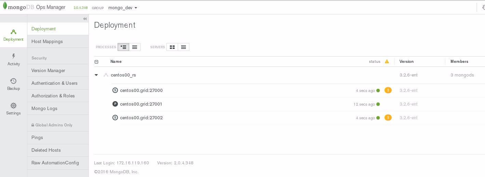

# July 2016: ElasticSearch

[Browse 2016](../README.md)

[Back to home](../../README.md)

Original PDF: [MDB_DN_2016_07_ElasticSearch.pdf](./MDB_DN_2016_07_ElasticSearch.pdf)

---
## Chapter 7. July 2016

Welcome to the July 2016 edition of MongoDB Developer’s Notebook (MDB-DN). This month we answer the following question(s); I’ve been asked to support a project that wants to deliver a fuzzy search capability for customer entitlement. E.g., you contact our customer call center and we find your record whether your name is David, Dave, Davey, you get the idea. I’ve read some on line postings that imply integration between ElasticSearch and MongoDB. What can you tell me ? Excellent question! There is an open source connector that will allow you to propagate data from MongoDB into many targets, including ElasticSearch. As soon as data arrives in MongoDB, this data gets pushed to ElasticSearch where it is indexed and ready to serve ElasticSearch hosted queries. Think of this connector as a change data capture middleware piece; source (MongoDB), and target. The target can be another MongoDB, ElasticSearch, or something else. There is also documentation to build your own connector. These connectors are written in Python, and run around 200 lines of code each, much of this being templated. Why ElasticSearch ? Also an excellent question. If your query has any number of combined predicates, and a simple text search requirement, you may choose to just perform the entire operation in MongoDB using client side pieces. We could easily do the Dave, David, Davey query using MongoDB alone. But, ElasticSearch does excel in areas where it excels. Perhaps ElasticSearch’s best use case is complete an entry as you type, with correction for mis-spellings. In this document we will detail building a complete solution, integration with, and then search from ElasticSearch.

## Software versions

The primary MongoDB software component used in this edition of MDB-DN is the MongoDB database server core, currently release 3.2.6. We also use the open source Mongo Connector, version 2.2 (2016-06-13), and ElasticSearch version 2.3.3. All of the software referenced is available for download at the URL's specified, in either trial or community editions.

All of these solutions were developed and tested on a single tier CentOS 7.0 operating system, running in a VMWare Fusion version 8.1 virtual machine. All software is 64 bit.

## 7.1 Terms and core concepts

Completing the steps in this document should take you less than two hours.

We detail installation and configuration of all of the software, to the point of propagating data from MongoDB, into ElasticSearch, running very basic ElasticSearch diagnostics and a brief ElasticSearch fuzzy search query. This serves as your proof point. But, ElasticSearch, as a server, has all or many of the features of MongoDB; replica sets, shards, etcetera.

If you move forward, you could spend many days hardening your ElasticSearch installation (productizing it), and then building and experimenting with more advanced, and more capable queries. With a high degree of confidence we will state that you will find everything you need in this document, and other resources ElasticSearch : The Definitive Guide as listed, and then the very fine book, . (ISBN, 978-1-449-35854-9.)

Let’s get started.

As a data source: MongoDB So the position we are following is that you have a MongoDB database, and you wish to perform queries that might best be performed by ElasticSearch, Lucene or Solr. As data arrives (insert, update, remove) into MongoDB, we push these changes to ElasticSearch in near real time, ElasticSearch indexes this data, and then ElasticSearch serves its own set of queries. Presumably ElasticSearch produces a single or set of primary keys (document identifiers), and then you return to MongoDB to perform continued OLTP and analytics style work.

Fortunately, MongoDB expects to run a production system with a minimum configuration of a 3 node replica set; 1 primary node, and two backup nodes. All nodes are data bearing.

> Note: Why 3 data bearing nodes ?

MongoDB expects to support the ability to never go down. Operating system upgrades, database server software upgrades, foreground index build, even data center migrations, you name it, MongoDB never goes down.

MongoDB uses an automated administrative client to take one of the two replicas offline, makes administrative changes to that node, then cycle through the remaining nodes to propagate administrative changes throughout. The MongoDB native client driver is designed to invisibly reconnect when changing between nodes, and the result is no observed downtime from the client application.

By having 3 nodes, you always have an operating primary and one back up (secondary) node.

To propagate data related changes (insert, update, remove, and more) between these three nodes, MongoDB has an oplog, a regular collection (table), which you can query, using standard commands. We say regular collection, but the oplog is capped ; a MongoDB keyword that indicates that the collection is written to serially, and then also in circular fashion, like a message queue of sorts. The MongoDB oplog is documented here,

```text
https://docs.mongodb.com/manual/core/replica-set-oplog/
```

Figure 7-1 displays the MongoDB Operations Manager (Ops Mgr) Web client, with a 3 node replica set.



*Figure 7-1 MongoDB Ops Manager displaying a 3 node replica set*

Relative to Figure 7-1, the following is offered:

- The data bearing nodes are all located on one host titled, centos00.grid. As a non-production, development/test style system, we are okay with having one (physical) node. In production, this would of course be no bueno.

- The connection ports are 27000, 27001, and 27002, with the primary data node port being 27001.

Example 7-1 below displays using the MongoDB command shell (mongo) to investigate the oplog collection. A code review follows.

### Example 7-1 Investigating the local database, oplog.rs collection using mongo.

```text
mongo --port 27001
MongoDB Enterprise centos00_rs:PRIMARY> show dbs
local 0.000GB
test_db1 0.000GB
MongoDB Enterprise centos00_rs:PRIMARY> use local
switched to db local
MongoDB Enterprise centos00_rs:PRIMARY> show collections
clustermanager
me
oplog.rs
replset.election
replset.minvalid
```

```text
startup_log
system.replset
MongoDB Enterprise centos00_rs:PRIMARY> db.oplog.rs.find().pretty()
{"ts" : Timestamp(1465941162, 1),
"h" : NumberLong("-5425350738743716303"),
"v" : 2,
"op" : "n",
"ns" : "",
"o" : {
"msg" : "initiating set"
}
}
... ... lines deleted
{"ts" : Timestamp(1465943772, 2),
"t" : NumberLong(2),
"h" : NumberLong("3828313583088982255"),
"v" : 2,
"op" : "i",
"ns" : "test_db1.c1",
"o" : {
"_id" : ObjectId("576086dc6fe5e7533ae04bab"),
"k" : 1
}
}
```

Relative to Example 7-1, the following is offered:

- We connect to the primary data node using the MongoDB command shell titled, mongo. We pass the argument “--port 27001”, so that we may connect to the correct connection port on the primary data node.

- A “show dbs” reports two databases; local and test_db1. The local database is that which manages data replication for MongoDB. The local database is detailed here,

```text
https://docs.mongodb.com/manual/reference/local-database/
```

- A “show collections” reports several collections, each with a distinct purpose. The collection containing readable transaction detail is titled, oplog.rs.

- The find ( ) targeting oplog.rs reports many lines, and the detail displayed in Example 7-1 has been truncated. The last line of output displays the record of an insert ( op : “i” ) into the collection titled, “test_db1.c1”. A single key titled, “k”, value 1, was inserted and an “_id” key field was auto-generated.

A client to read the MongoDB oplog If you keep the MongoDB command shell from Example 7-1 open, we can continue to execute inserts and related into user collections. In a second terminal window, we can run a client that will read the oplog in a tailable fashion, and report these changes. A sample client, written in Python, is displayed in Example 7-2.

### Example 7-2 Sample Python/Pymongo client to read the oplog.

```text
import pymongo
import time
#
from pymongo import MongoClient
```

```text
######################################################
```

```text
rsc = MongoClient("localhost:27000, localhost:27001, localhost:27002")
db = rsc.local
```

```text
print " "
print "Info: find ( ) loop."
```

```text
l_curr = db.oplog.rs.find( { },
cursor_type=pymongo.CursorType.TAILABLE_AWAIT )
```

```text
while l_curr.alive:
for s in l_curr:
print s
time.sleep(1.0)
```

Relative to Example 7-2, the following is offered:

- We are running a CentOS version 7 Linux host, with Python version 2.7.5. This version of Python will include “pip”, the (Python) package install program. The Python program, as displayed, requires the pymongo package, easily installed with pip. pymongo is the MongoDB created and supported database connectivity package for Python.

- The time package allows us to sleep for one second between each iteration of the loop. In a production application, we might choose to sleep

0.1 seconds.

- The line which begins with the variable, “rsc”, requests a MongoDB database connection using the preferred means of polling for a primary data node.

- The line which begins “l_curr” defines a cursor with a TAILABLE_WAIT modifier. A tailable cursor will remain active (open), and can be placed in a loop to check for newly arriving documents to the collection. This is a polling model, as the client sleeps and then checks (polls) for new data. The cursor targets the collection titled, oplog.rs, in the database titled, local. This is the MongoDB oplog, detailed above. Reading this collection, there are a lot of useful things we could do with this data.

ElasticSearch ElasticSearch is available as open source software, from the following Url,

```text
https://www.elastic.co/downloads/elasticsearch
```

We chose to download an RPM, version 2.3.3, and install it with yum, the primary CentOS package (install) manager. ElasticSearch can be started as a service, as displayed in Example 7-3.

### Example 7-3 Sample ElasticSearch start and configuration commands.

```text
service elasticsearch start
```

```text
service elasticsearch status
```

```text
# http://localhost:9200/
```

```text
curl http://localhost:9200
```

```text
{
```

```text
"name" : "Mysterio",
```

```text
"cluster_name" : "elasticsearch",
```

```text
"version" : {
```

```text
"number" : "2.3.3",
```

```text
"build_hash" : "218bdf10790eef486ff2c41a3df5cfa32dadcfde",
```

```text
"build_timestamp" : "2016-05-17T15:40:04Z",
```

```text
"build_snapshot" : false,
```

```text
"lucene_version" : "5.5.0"
```

```text
},
```

```text
"tagline" : "You Know, for Search"
```

```text
}
```

Relative to Example 7-3, the following is offered:

- The first line starts the ElasticSearch service.

- The second line reports if this service is active.

- The third line is not a command, but a Web address. This address pasted into the address bar of a Web browser reports the ElasticSearch server status. By default, ElasticSearch operates on port 9200.

- The fourth line reports this same data from the Linux command line.

- And the remaining lines are the output from line 4, the curl command.

The ElasticSearch server is now installed and operating.

The Mongo Connector The Mongo Connector is an open source program to read the MongoDB oplog, and then propagate this data to a specified target. The Mongo Connector is located here,

```text
https://github.com/mongodb-labs/mongo-connector
https://github.com/mongodb-labs/mongo-connector/wiki/FAQ
```

The Mongo Connector (connector) operates as a daemon, or service. The connector uses the term, DocManager, to refer to the plug-able portion of this daemon that is intentionally authored to support writes to a specific target. The connector project includes DocManagers to write to another MongoDB database (providing an open source data replication solution), ElasticSearch version 1.x, version 2.x, and Solr. There are also instructions to write your own DocManager. DocManagers are written in Python, and are around 200 lines long. Many of these 200 lines are templated (standard, provided).

Example 7-4 details how to install and start the Mongo Connector.

### Example 7-4 Installing and starting the Mongo Connector.

```text
pip install mongo-connector
pip install elastic2-doc-manager
```

```text
pip install mongo_doc_manager
```

```text
mongo-connector -m localhost:27001 \
-t http://localhost:9200 \
-o /opt/mongo-connector.oplog \
-d elastic2_doc_manager \
-n test_db1.zips
```

Relative to Example 7-4, the following is offered:

- The first line in this example installs the Mongo Connector proper.

- The next two lines install DocManagers for version 2.x ElasticSearch, and then the DocManager to push changes to a second MongoDB database server.

- The last line starts the Mongo Connector- • The number 27001 calls for a connection port into the source MongoDB database server acting as a primary data node. localhost is a reference to the host containing this same MongoDB database server. You can, if you choose, read from one of the MongoDB secondaries, as their oplog will be populated when the changes made to the primary data node are forwarded and received for replication. • The number 9200 and localhost keywords detail the location of the destination, the ElasticSearch server. • The “-o” argument details the location of an ASCII text file, the event log file for the Mongo Connector. • The “-d” argument specifies the specific DOC_MANAGER to load, in this case, a DOC_MANAGER to write to ElasticSearch version 2.x. • The “-n” argument specifies the specific namespace (the MongoDB database name and collection name combination) that is to be pushed

```text
“test_db1.zips”
```

to the target, in this case, .

> Note: For scalability (higher throughput), you can start multiple Mongo Connectors. You can start one Mongo Connector per namespace (unique database name collection name pair). You do this using the “-n” argument displayed above.

Why can’t you start multiple Mongo Connectors per one namespace, or multi-thread the output of data from one namespace ? (The Mongo Connector is multi-threaded, by the way; 1 monitoring/parent thread, and one thread each for each shard.)

Sequencing.

Imagine you have an insert, upsert, and delete sequence on one document (data record, row). Imagine you now allow multi-threading of this change stream to a target, and imagine you lose the original change order and it now becomes, insert, delete, upsert. (Two or more threads may race ahead of one another. You can’t synchronize, gate or block them, or you might as well have remained serial.) As requested, the document should have ended up deleted. If you lose the change order, it may be left in place, an error on your part.

There really is no means around this problem because you never know when you are done touching (transacting upon) a document. The best, most performant data replication schemes will allow parallelism, but per namespace so that they may ensure proper data propagation.

At this point, MongoDB is running, the ElasticSearch server is running, and the Mongo Connector is pushing changes from MongoDB to ElasticSearch. You are ready for testing !

Testing the propagation of data, running ElasticSearch queries As usual, we use the sample dataset zips, common to many of the MongoDB University courses. Urls include,

```text
http://University.MongoDB.com
http://media.mongodb.org/zips.json
```

To load the zips data set, we can use mongoimport. Example as displayed in Example 7-5.

### Example 7-5 Loading the zips data set using mongoimport

```text
mongoimport -d test_db1 -c zips --port 27001 --batchSize=1 zips.json
```

Relative to Example 7-5, the following is offered:

- A very typical mongoimport command, -d specifies the database name, and -c specifies the collection name.

- --port specifies the MongoDB database server connection port of the primary data node.

- The --batchSize argument is not necessary. We always like to detail a means to overcome a resource inadequacy of transaction size, should you see error.

While the above completes (it completes quickly, and you can re-run it often), you may also run a number of ElasticSearch queries. Example 7-6 details a number of ElasticSearch command line queries.

### Example 7-6 Command line queries using ElasticSearch.

```text
curl localhost:9200/test_db1/_count
{"count":29353,"_shards":{"total":5,"successful":5,"failed":0}}[root@centos00
22 ES testing]#
```

```text
curl http://localhost:9200/test_db1/_search/?pretty=1
{
"took" : 4,
"timed_out" : false,
"_shards" : {
"total" : 5,
"successful" : 5,
"failed" : 0
},
"hits" : {
"total" : 29353,
"max_score" : 1.0,
"hits" : [ {
"_index" : "test_db1",
"_type" : "zips",
"_id" : "03262",
"_score" : 1.0,
"_source" : {
"city" : "NORTH WOODSTOCK",
"state" : "NH",
"pop" : 1091,
"loc" : [ -71.697684, 44.019831 ]
}
}, {
"_index" : "test_db1",
"_type" : "zips",
"_id" : "03275",
"_score" : 1.0,
```

```text
"_source" : {
"city" : "ALLENSTOWN",
"state" : "NH",
"pop" : 11565,
"loc" : [ -71.439663, 43.147554 ]
}
... ... lines deleted
}, {
"_index" : "test_db1",
"_type" : "zips",
"_id" : "03603",
"_score" : 1.0,
"_source" : {
"city" : "CHARLESTOWN",
"state" : "NH",
"pop" : 4678,
"loc" : [ -72.40638, 43.257339 ]
}
} ]
}
}
```

Relative to Example 7-6, the following is offered:

- All of these commands are run from the Linux command prompt, and use curl (copy Url).

- The first curl command calls to return a count of the number of documents in this index. As a term, index is very much overloaded in the ElasticSearch world. In this context, index is a synonym for what MongoDB calls a database. ElasticSearch is a JSON data store, so a lot of the programming and techniques you use in MongoDB will be familiar when using ElasticSearch.

- After the second curl is data returned from the ElasticSearch server.

Want a cool tool to run ElasticSearch queries ? Figure 7-2 and Figure 7-3 displays install and use of the Google Chrome Sense plug-in.


*Figure 7-2 Installing the Sense Chrome plug-in.*


*Figure 7-3 Running an ElasticSearch query using Sense.*

Relative to Figure 7-3, the following is offered:

- The query we are running above is,

```text
POST /test_db1/_search/?pretty
{
query : {
match : {
"state" : "CA"
}
}
}
```

Performance monitoring/testing All things are relative. On our test system (a MacBook Pro with 16 GB of RAM, and 1 TB SSD disk), we run everything inside a CentOS version 7 virtual

machine with 8 GB of RAM. mongoimport loaded data at a rate greater than 1000 documents per second. Running the Mongo Connector from a MongoDB source to a MongoDB target was also fast, 600-1000 documents per second. Running the Mongo Connector from a MongoDB source to an ElasticSearch target ran at about 250-400 documents per second. Listed below are a number of client programs to count documents inside MongoDB and ElasticSearch; perhaps useful for testing.

Example 7-7 displays a Linux Bash client program to count documents from the ElasticSearch server.

### Example 7-7 Bash client program to get a document count from ElasticSearch.

```text
#!/bin/bash
```

```text
l_loopCntr=0
```

```text
while [ $l_loopCntr -lt 6000 ]
do
if [ -f "STOP" ]
then
exit 2
fi
#
l_loopCntr=$[$l_loopCntr+1]
echo "Loop iteration (of 6000) "$l_loopCntr
#
curl localhost:9200/test_db1/_count 2> /dev/null | \
sed 's/:/ /g' | sed 's/,/ /g' | awk '{print $2}'
sleep 2
done
```

Example 7-8 displays a Linux Bash client program to count documents from the MongoDB database server. Both of these programs run as an endless loop. To easily stop the program, touch a file in the current working directory titled, STOP. (Remember to delete this STOP file, or your loop will not then re-run.)

We can use these programs to measure the rate of data propagation between source and target.

### Example 7-8 Bash client program to get a document count from MongoDB.

```text
#!/bin/bash
```

```text
l_loopCntr=0
```

```text
while [ $l_loopCntr -lt 6000 ]
do
if [ -f "STOP" ]
then
exit 2
fi
#
l_loopCntr=$[$l_loopCntr+1]
echo "Loop iteration (of 6000) "$l_loopCntr
#
mongo localhost:27001/test_db1 --eval "printjson(db.zips.count())"
sleep 2
done
```

Example 7-9 displays a Python client program to insert documents into the ElasticSearch server. We can use this program to test the insert rate into ElasticSearch.

### Example 7-9 Python client program to insert documents into ElasticSearch.

```text
import elasticsearch
```

```text
es = elasticsearch.Elasticsearch() # use default of localhost, port 9200
```

```text
for t in range (1, 1000):
es.index(index='test_db1', doc_type='posting', id=t, body={
'author': 'Dave Lutz',
'blog': 'Surviving the Texas Summers',
'title': 'Don’t choose to live in Teaxas in the first place',
'topics': ['Man its hot', 'drink water', 'sunscreen !',
'stay inside', 'perhaps live underground'], 'icky': 0.3
})
#
print t
```

ElasticSearch queries Example 7-10 displays a single Bash client that runs two separate ElasticSearch queries; one for City, and one for State.

### Example 7-10 ElasticSearch queries, looking for City and State.

```text
#!/usr/bin/bash
```

```text
curl -XPOST "localhost:9200/test_db1/_search/?pretty" -d "{ \
query : {
match : {
\"city\" : \"BUENA\"
}
}
}"
```

```text
curl -XPOST "localhost:9200/test_db1/_search/?pretty" -d "{ \
query : {
match : {
\"state\" : \"CA\"
}
}
}"
```

Example 7-10 displays an ElasticSearch fuzzy query on City. A code review follows.

### Example 7-11 Fuzzy search using ElasticSearch.

```text
#!/usr/bin/bash
```

```text
# Data looks like
#
# {
# "_index" : "test_db1",
# "_type" : "zips",
# "_id" : "5759ddfee76be8aae9fc5330",
# "_score" : 1.0,
# "_source" : {
# "city" : "DRISCOLL",
# "state" : "ND",
# "pop" : 235,
# "zip" : "58532",
# "loc" : [ -100.144063, 46.851139 ]
# }
# }
```

```text
# get one document
#
# curl -XGET "localhost:9200/test_db1/_search/?size=1&pretty=1"
```

```text
# list all indexes
```

```text
#
# curl -XGET "localhost:9200/test_db1/_alias/*"
# curl -XGET "localhost:9200/_stats/indices?pretty"
```

```text
curl -XPOST "localhost:9200/test_db1/_search/?pretty" -d "{ \
query : {
match : {
\"city\" : {
query : \"JOHN\",
fuzziness : \"AUTO\",
operator : \"and\"
}
}
}
}"
... ... lines deleted and formatted-
"city" : "SAINT JOHNS",
"city" : "CABIN JOHN",
"city" : "SAINT JOHN",
"city" : "DUTCH JOHN",
"city" : "JOHN DAY",
"city" : "SAINT JOHN",
"city" : "LOHN",
"city" : "SAINT JOHN",
"city" : "PORT SAINT JOHN",
"city" : "SAINT JOHN",
... ... lines deleted and formatted-
{
"total" : 13,
"max_score" : 5.6127286,
"hits" : [ {
"_index" : "test_db1",
"_type" : "zips",
"_id" : "48879",
"_score" : 5.6127286,
"_source" : {
"city" : "SAINT JOHNS",
"state" : "MI",
"pop" : 16472,
"loc" : [ -84.571934, 43.005924 ]
}
}, {
"_index" : "test_db1",
"_type" : "zips",
"_id" : "97845",
"_score" : 5.1787624,
"_source" : {
"city" : "JOHN DAY",
```

```text
"state" : "OR",
"pop" : 1367,
"loc" : [ -119.105157, 44.409977 ]
}
}, {
"_index" : "test_db1",
"_type" : "zips",
"_id" : "76852",
"_score" : 4.7609706,
"_source" : {
"city" : "LOHN",
"state" : "TX",
"pop" : 233,
"loc" : [ -99.38334, 31.317297 ]
}
}, {
"_index" : "test_db1",
"_type" : "zips",
"_id" : "32927",
"_score" : 4.14301,
"_source" : {
"city" : "PORT SAINT JOHN",
"state" : "FL",
"pop" : 17351,
"loc" : [ -80.791114, 28.46844 ]
}
```

Relative to Example 7-10, the following is offered:

- Notice the we query for City equal to JOHN and we receive entries for LOHN, JOHNS, and more.

- A score key is returned that may be used to indicate confidence. SAINT JOHNS was the highest scoring return, with LOHN scoring higher than PORT SAINT JOHN. Interesting.

## 7.2 Complete the following

About the only thing we haven’t detailed thus far is how to create a MongoDB replica set. Example 7-12 offers a Linux Bash script to create a MongoDB replica set starting at port number 28000.

And if you don’t have the MongoDB database server software installed, we detailed that procedure in the March 2016 version of this document, Using the MongoDB Business Intelligence (BI) Connector , sections 3.2.2 and 3.2.3

### Example 7-12 Creating a MongoDB replica set via shell commands.

```text
!/bin/bash
```

```text
export DB_DIR=/data/rs_manual
```

```text
rm -r $DB_DIR
mkdir $DB_DIR $DB_DIR/node0 $DB_DIR/node1 $DB_DIR/node2
touch $DB_DIR/pids
#
chmod -R 777 $DB_DIR
chown -R mongod:mongod $DB_DIR
```

```text
sudo -u mongod mongod --dbpath $DB_DIR/node0 \
--logpath $DB_DIR/node0/logfile \
--port 28000 --fork --noauth \
--replSet "abc" --smallfiles --wiredTigerCacheSizeGB 1
ps -ef | grep mongod | grep 28000 | awk -F " " '{print $2}' >> $DB_DIR/pids
sudo -u mongod mongod --dbpath $DB_DIR/node1 \
--logpath $DB_DIR/node1/logfile \
--port 28001 --fork --noauth \
--replSet "abc" --smallfiles --wiredTigerCacheSizeGB 1
ps -ef | grep mongod | grep 28001 | awk -F " " '{print $2}' >> $DB_DIR/pids
sudo -u mongod mongod --dbpath $DB_DIR/node2 \
--logpath $DB_DIR/node2/logfile \
--port 28002 --fork --noauth \
--replSet "abc" --smallfiles --wiredTigerCacheSizeGB 1
ps -ef | grep mongod | grep 28002 | awk -F " " '{print $2}' >> $DB_DIR/pids
```

```text
sleep 10
```

```text
sudo -u mongod mongo --port 28000 <<EOF
```

```text
var cfg = { "_id" : "abc", members : [
{ "_id" : 0, "host" : "localhost:28000" }
] }
```

```text
rs.initiate( cfg )
```

```text
EOF
```

```text
sleep 10
```

```text
sudo -u mongod mongo --port 28000 <<EOF
```

```text
rs.add("localhost:28001")
rs.addArb("localhost:28002")
```

```text
EOF
sleep 10
```

```text
sudo -u mongod mongo --port 28000 <<EOF
```

```text
rs.status()
```

```text
EOF
```

## 7.2.1 Follow the steps in the terms and concepts section above

Using the techniques detailed above, complete the following:

- Install, configure and boot the MongoDB database server software.

- Create a MongoDB 3 node replica set.

- Create the Python program to read from local.oplog.rs.

- Load the zips data set.

- Install, configure and boot the ElasticSearch server software.

- Install, configure, and boot the Mongo Connector from MongoDB into ElasticSearch • Loads the zips data set again. • Run both or all of the data propagation rate monitoring programs, supplied.

- Run the ElasticSearch queries, including the fuzzy search.

- If you are going to do this professionally (ongoing), install the Chrome Web browser Sense plug in.

## 7.2.2 Replicate to a second MongoDB server instance

We have everything installed to test data replication into a second MongoDB server instance. Complete the following:

- Start a new MongoDB server instance. We created ours in this manner,

```text
cd ( into new, empty directory )
```

```text
mongod --port 28000 --fork --dbpath . --logpath logfile.0
mongo-connector -m localhost:27000 -t localhost:28000 -o
/opt/mongo-connector.oplog -d mongo_doc_manager -n
test_db1.zips
```

- In a second terminal window

```text
mongoimport --27001 $ppp -d test_db1 -c zips "20 zips.json"
--batchSize -1
mongo --port 28000
use test_db1
db.zips.count()
```

## 7.3 In this document, we reviewed or created:

We detailed install, configuration and use of the open source Mongo Connector, which allows data propagation from a MongoDB database server install several targets including another MongoDB server instance, ElasticSearch, and more. In detail we:

- Installed, configured, and booted the Mongo Connector.

- Installed, configured, and booted ElasticSearch.

- Authored a number of test programs.

- Authored a number of ElasticSearch queries, including fuzzy search.

- Discussed tuning and support.

### Persons who help this month.

Dave Lutz, and Lori Still.

### Additional resources:

Free MongoDB training courses,

https://university.mongodb.com/

This document is located here,

```text
https://github.com/farrell0/MongoDB-Developers-Notebook
```

Urls used to create this document,

A 3 part Python and ElasticSearch tutorial is located here,

```text
https://bitquabit.com/post/having-fun-python-and-elasticsearch-pa
rt-1/
https://bitquabit.com/post/having-fun-python-and-elasticsearch-pa
rt-2/
https://bitquabit.com/post/having-fun-python-and-elasticsearch-pa
rt-3/
```

Integration between MongoDB and ElasticSearch is located here,

```text
http://blog.mongodb.org/post/95839709598/how-to-perform-fuzzy-mat
ching-with-mongo-connector
```

Documentation related to the Mongo Connector,

```text
https://github.com/mongodb-labs/mongo-connector/wiki/Usage-with-E
lasticSearch
https://github.com/mongodb-labs/mongo-connector/wiki/FAQ
https://blog.jixee.me/how-to-use-mongo-connector-with-elasticsear
ch/
```
