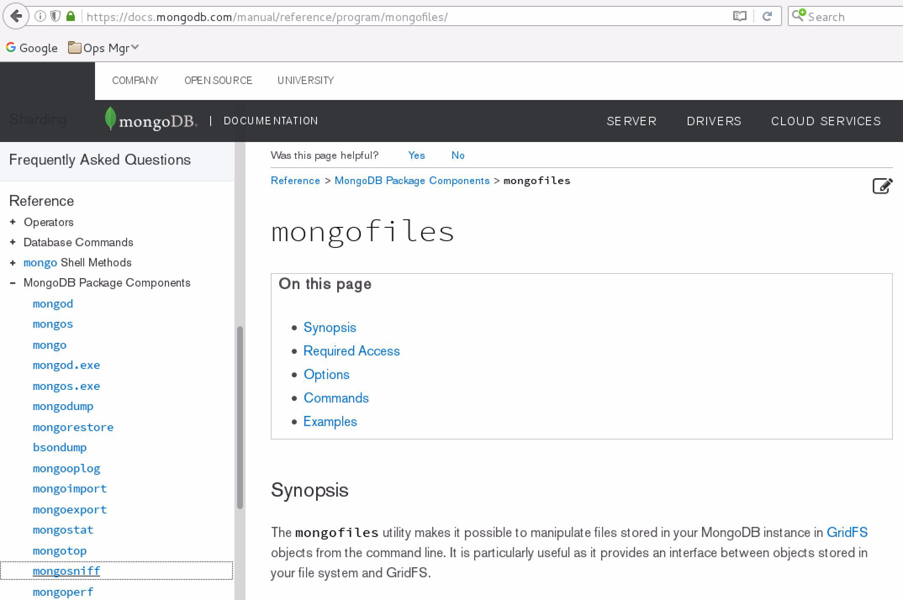
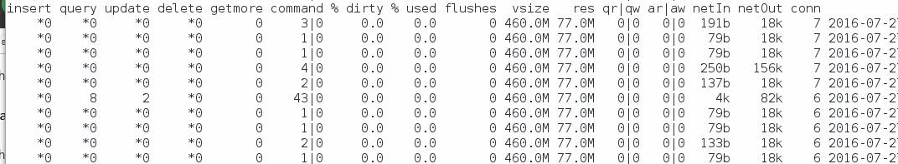

# August 2016: Tools

[Browse 2016](../README.md)

[Back to home](../../README.md)

Original PDF: [MDB_DN_2016_08_Tools.pdf](./MDB_DN_2016_08_Tools.pdf)

---
## Chapter 8. August 2016

Welcome to the August 2016 edition of MongoDB Developer’s Notebook (MDB-DN). This month we answer the following question(s); I recently took the MongoDB DBA certification exam, and was caught unprepared by questions related to mongofiles, mongoperf, and more. What have I been missing by not using these utilities ? Excellent question ! There are 12 or so MongoDB related binaries in a current MongoDB distribution, and if you are not familiar with these programs, you or your hardware may be working harder than you should need to. We’ll go through each of these utilities, demonstrate at least one primary use case per program, and perhaps more.

The primary MongoDB software component used in this edition of MDB-DN is the MongoDB database server core, currently release 3.2.6. All of the software referenced is available for download at the URL's specified, in either trial or community editions.

All of these solutions were developed and tested on a single tier CentOS 7.0 operating system, running in a VMWare Fusion version 8.1 virtual machine. All software is 64 bit.

## 8.1 Terms and core concepts

From our problem statement above, we seek to understand mongofiles, mongoperf, and more. These binary programs (command line utilities) are documented in the MongoDB on line documentation under- Reference -> MongoDB Package Components

At the Url listed,

```text
https://docs.mongodb.com/manual/reference/program/
```

Example as shown in Figure 8-1.



*Figure 8-1 MongoDB on line help, Reference, Package Components*

Core processes: mongod, mongos, mongo mongod, mongos, and mongo are listed as core processes , and form the very minimum distribution of MongoDB binary programs. Further-

- mongod is daemon process for a MongoDB database server system. the mongod handles new connection requests, requests for data access and manipulation, background services, and more. mongod is documented here, https://docs.mongodb.com/manual/reference/program/mongod/

- mongos is the daemon process which acts as a router (switch) for a sharded MongoDB system. A MongoDB system might be configured as a single (stand alone) node, or a replica set, or a sharded system, or a combination of replica and sharded. • A replica set is expected to have at least 2 data bearing nodes; a primary , and one or more secondaries . Writes are performed on the primary, which then replicates changes to one or more secondaries. The purpose of a replica set is to provide high availability, although some amount of scalability can be achieved as reads can be optionally and variably delegated to secondaries, thus shedding load off of the primary. • A sharded (data partitioned) system is the primary means to scale a MongoDB database server system. A single or set of MongoDB collections (similar to SQL tables) are spread across multiple data bearing nodes, each being writable. Different than multi-master database server systems, each writable data bearing node on a MongoDB sharded system contains a distinct (unique) subset of data. E.g., west coast data on one node, east coast data on a second node, etcetera. • And each primary data bearing node in a sharded system may themselves be replicated. A mongos process sits in front of a sharded system, and routes queries to those nodes which exclusively contain necessary data. E.g., if a query is received which needs data contained on one of five nodes in a sharded collection, then mongos routes this query to that one node only. mongos is documented here,

```text
https://docs.mongodb.com/manual/reference/program/mongos/
```

- And mongo is the command line interface to run MongoDB data access

```text
db.collection.find( )
```

commands and routines. E.g., . mongo is documented here,

```text
https://docs.mongodb.com/manual/reference/program/mongo/
```

Data import/export: binary data While you can create client programs to import or export to and from a MongoDB database server system, MongoDB includes a set of utilities to do this work for you. These utilities are grouped by those that operate on ASCII text (JSON files), and those that operate on binary data files (BSON). And, a program exists to convert from BSON to JSON.

mongodump is the utility to create a binary (BSON) export of a database. By default mongodump will output all databases, excluding the special local database. Or, mongodump can output specific, named databases. mongodump does cycle data pages through the standard database server cache, and can negatively impact performance. For this reason, consider running mongodump against secondary data nodes.

mongodump outputs data only, and not index data. (Index data is recreated on data restore.) While binary output (BSON), the output from mongodump is not compressed by default. An optional gzip parameter is available.

In addition to outputting a specific database (versus all databases), mongodump can also target a single collection, and even include a query document to read a subset of a given collection.

mongodump is documented here,

```text
https://docs.mongodb.com/manual/reference/program/mongodump/
```

> Note: mongodump can not output data in CSV format. To output data as a CSV, use mongoexport.

mongorestore is the companion program to mongodump, and restores from a previously created BSON image. mongorestore can optionally call to create the indexes that were in place when the (source) mongodump was executed.

mongorestore can restore to a new or existing target (database, collection). And, there is an optional parameter that calls to delete whatever targets that mongorestore is restoring to. mongorestore performs (inserts), and in the case of restoring to an existing target where there is a previously existing document, the existing document remains unaffected.

mongorestore is documented here,

```text
https://docs.mongodb.com/manual/reference/program/mongorestore/
```

> Note: You can perform point in time recovery using mongorestore with the --oplogLimit parameter.

bsondump is a utility to convert BSON data to JSON.

bsondump is documented here,

```text
https://docs.mongodb.com/manual/reference/program/bsondump/
```

Data import/export: ASCII text mongoexport and mongoimport can output and input data in JSON, CSV (comma separated values), and TSV (TAB separated values) format, respectively.

> Note: Because JSON offers a subset of BSON (including extended data types, to list one example), mongoexport and then mongoimport can not reliably be used to migrate data between MongoDB systems.

mongoexport can output a subset of databases, collections, and fields, and can operate with a query document to output a subset of documents.

mongoexport is documented here,

```text
https://docs.mongodb.com/manual/reference/program/mongoexport/
```

mongoimport can be configured to upsert on load, and can be configured to use a key other than _id. Why might you need to use a different key on insert ? It is possible you might want to load new version of document over unit time for reporting or similar.

mongoimport is documented here,

```text
https://docs.mongodb.com/manual/reference/program/mongoimport/
```

GridFS: mongofiles Before we get into the remainder of MongoDB utilities (which form a set of tuning and diagnostic tools), let us cover GridFS.

GridFS is an automatically included subsystem (set of capabilities) inside the MongoDB database server. GridFS allows you to store binary data files, and ASCII text files (or documents), inside MongoDB, similar to blobs (binary large objects) and clobs (character large objects) stored in a relational system.

> Note: Recall that MongoDB will automatically create a database or collection should you reference same, and said database or collection does not already exist.

Similarly, the first time you reference (insert a file into) the GridFS subsystem, a set of collections are created in the current database. These collections are titled,fs.files and fs.chunks.

fs.files stores metadata related to a given file stored in GridFS, and fs.chunks stores the data proper.

GridFS may be compared to a virtual filesystem, a virtual filesystem hosted by and inside MongoDB. Similar to the Hadoop filesystem, MongoDB can be configured to replicate or shard this filesystem, and thus, replicate or shard the data contained within it. Example 8-1 displays a sample Python/Pymongo client program that uses GridFS. A code review follows.

### Example 8-1 Python/Pymongo sample program using GridFS

```text
from pymongo import MongoClient
from gridfs import GridFS
```

```text
######################################################
######################################################
```

```text
#
# Get a MongoDB client connection
# Get a handle to the database
# Get a handle the the filesystem presented
# by GridFS
#
```

```text
l_serv = MongoClient("localhost:27000")
l_dbas = l_serv.test_db4
#
l_fsys = GridFS(l_dbas)
```

```text
######################################################
```

```text
#
# Put, read, then delete ASCII text
#
```

```text
l_file1 = l_fsys.put("Hello world 3000")
```

```text
print l_fsys.get(l_file1).read()
```

```text
l_fsys.delete(l_file1)
```

```text
######################################################
```

```text
#
# Put, read, then delete binary data
```

```text
#
```

```text
with open("sophie.JPG") as l_image:
l_file2 = l_fsys.put( l_image, content_type = \
"image/jpeg", filename="myimage")
```

```text
l_copy = l_fsys.get(l_file2).read()
```

```text
with open("sophie.copy.JPG", "wb") as l_file3:
l_file3.write(l_copy)
```

Relative to Example 8-1, the following is offered:

- This sample client program is written in Python, and uses the Pymongo library for MongoDB database connectivity.

- The variables l_serv and l_dbas give us handles to the MongoDB database server operating at port 27000.

- The variable l_fsys gives us a handle to the MongoDB embedded subsystem for GridFS.

- The variable l_file1 first puts a text string into the GridFS filesystem, where it becomes a file in the virtual filesystem which is GridFS. Then this code reads the same value back and outputs to the screen, and the deletes this same file from inside GridFS. The text string you input could be longer than the normal maximum document size supported by MongoDB. (Currently 16 MB.) How did we know about the delete( ) method to GridFS ? The documentation to the GridFS API is located here,

```text
http://api.mongodb.com/python/current/api/gridfs/
```

And a set of programming examples is located here,

```text
https://api.mongodb.com/python/current/examples/gridfs.html
```

- The next set of variables, l_file2 and l_file3, first write a binary data file (a JPEG image) to GridFS, and then reads it back and writes it back out to the operating system filesystem. If the before image and after image of these two files (l_file2 and l_file3) match, you have correctly completed a round trip (created a copy of), this file.

> Note: How could you import a GIF file into MongoDB ? Use mongofiles.

mongofiles is the command line utility to read and write binary data files, character files, and even documents into MongoDB. Example 8-2 displays using mongofiles. A code review follows.

### Example 8-2 Using mongofiles

```text
mongofiles --port 27000 list
```

```text
mongofiles --port 27000 put sophie.JPG
```

```text
mongofiles --port 27000 list
```

```text
mv sophie.JPG sophie.JPG2
```

```text
mongofiles --port 27000 get sophie.JPG
```

```text
mongofiles --port 27000 list
```

```text
diff sophie.JPG sophie.JPG2
```

```text
mongofiles --port 27000 delete sohpie.JPG
```

```text
mongofiles --port 27000 list
```

Relative to Example 8-2, the following is offered:

- list is a non-destructive invocation of monogfiles, similar to a ls -l in Linux.

- put, get and delete hopefully work as you would expect from their names.

The documentation page for mongofiles is located here,

```text
https://docs.mongodb.com/manual/reference/program/mongofiles/
```

And the documentation page for GridFS is located here,

```text
https://docs.mongodb.com/manual/core/gridfs/
```

Writing in MongoDB using Wired Tiger Before we enter the next section reviewing MongoDB performance diagnostic utilities, it might be good to review how MongoDB writes data to disk.

Of course, data pages are read from the hard disk into memory as needed. Most commonly, data pages are read as the result of a find( ) cursor method, aggregate( ) cursor method, or similar. These (unmodified) data pages may be overwritten as needed.

Data pages are also read into memory before they are written (updated, deleted, inserted into, other). The database server has a responsibility to write modified data pages back to the hard disk, to ensure that any changes made are durable.

MongoDB performs journaling, called transaction logging or similar in relational databases. That is, in addition to writing out the modified data pages, another data storage structure is written to (the journal) that contains the instructions that performed the write to a given data page. The journal is written to as a large, contiguous (big buffer) single physical I/O, and is thus relatively more efficient than the same amount of random I/O necessary to write out the modified data pages themselves.

In MongoDB and when using the Wired Tiger storage engine, journaling is enabled by default. The default interval to write out any buffered journal entries is 50 milliseconds. If nothing else, MongoDB could recover from failure by playing the journal entries forward. Every 60 seconds, or every 2 GB of journal entries, cause a checkpoint; a flush of all of the modified data pages and a special record of the instance of a checkpoint. Checkpoints in MongoDB are always non-blocking, performed in the background.

> Note: You can variably call to have each end user write command call to flush the buffer in front of the journal, thus ensuring maximum recoverability in the event of failure. Example as shown,

```text
db.col1.insert( {k : 10 }, { writeConcern : { j : 1 } } )
WriteResult({ "nInserted" : 1 })
```

A writeConcern of 1/true, calls to flush the journal buffer. This call to write would be blocking, whereas a value of “j : 0” is non-blocking.

A full discussion of writeConcern is detailed here,

```text
https://docs.mongodb.com/manual/core/replica-set-write-concern/
```

Journal data files on the hard disk are written to the DBPATH/journal directory, and have an approximate file size of 100 MB. After 100 MB, MongoDB will switch to a new journal log file. Old journal files are automatically removed after the successful completion of the next checkpoint.

MongoDB Wired Tiger operating information is available via the db.serverStatus().wiredToger.log command. Example as displayed in Example 8-3.

### Example 8-3 Example db.serverStatus().wiredTiger.log command.

```text
db.serverStatus().wiredTiger.log
```

```text
{
"total log buffer size" : 33554432,
"log bytes of payload data" : 4093,
"log bytes written" : 5376,
"yields waiting for previous log file close" : 0,
"total size of compressed records" : 3949,
"total in-memory size of compressed records" : 6689,
"log records too small to compress" : 6,
"log records not compressed" : 0,
"log records compressed" : 5,
"log flush operations" : 32822,
"maximum log file size" : 104857600,
"pre-allocated log files prepared" : 2,
"number of pre-allocated log files to create" : 2,
"pre-allocated log files not ready and missed" : 1,
"pre-allocated log files used" : 0,
"log release advances write LSN" : 5,
"records processed by log scan" : 11,
"log scan records requiring two reads" : 2,
"log scan operations" : 5,
"consolidated slot closures" : 98182,
"written slots coalesced" : 0,
"logging bytes consolidated" : 4992,
"consolidated slot joins" : 11,
"consolidated slot join races" : 0,
"busy returns attempting to switch slots" : 0,
"consolidated slot join transitions" : 98182,
"consolidated slot unbuffered writes" : 0,
"log sync operations" : 7,
"log sync_dir operations" : 1,
"log server thread advances write LSN" : 2,
"log write operations" : 11,
"log files manually zero-filled" : 0
}
```

Lastly, consider the MongoDB and Wired Tiger use a multi-version concurrency control model, or MVCC. MVCC is documented on Wikipedia.com at,

```text
https://en.wikipedia.org/wiki/Multiversion_concurrency_control
```

In this context, this means that MongoDB creates a new version of each data page each time a given data page is modified.

Diagnostic tools: mongostat, mongotop, mongoperf mongostat is designed to be similar to the Unix/Linux vmstat command. By default, mongostat output statistics every second, without accumulative count. (The data presented is net new, per each second.)

The output from mongostat is pretty wide, still we captured it in Figure 8-2. A code review follows.



*Figure 8-2 Output from mongostat*

Relative to Figure 8-2, the following is offered:

- In this section, we are detailing these columns and values for the Wired Tiger storage engine (WT: MongoDB using the Wired Tiger storage engine), and not the MMapV1 storage engine.

- The first 6 columns (insert, query, update, delete, getmore, and command) each represent the occurrence/receipt of said end user command by the MongoDB database server being reported on.

- %dirty - represents the percentage of the cache that has been modified since it was read from disk, and is in need of being written to disk. Consider that WT deltas modifications of data pages in order that it may support readers. This means that a given data page updated 5 times has 6 copies; the original page as it was read from disk, and each of the 5 changes.

> Note: What value is good or bad here, and what can you do about it ?

Generally, a relational database online transaction processing (OLTP) style application might average 90% reads, 10% writes, and might generally update the same page many times before flushing.

So, the first variance is that we are talking averages; you’re mileage will vary. Is your MongoDB application read heavy, write heavy, and to what extent-

Certainly we don’t want the %dirty to get too high lest we need to flush before the default scheduled time. With too many dirty pages, we will not have enough pages to cache reads effectively.

What do you do about this ? To a small extent, program your application to not update repetitively in any unnecessary manner. (Don’t be careless.) Otherwise, your next step is to increase to size of the available cache (WT available memory).

- %used - is exactly that. From the given amount of cache, what percent contains pages that have been read, or then modified. Expectably, this number starts low after system boot, and increase over time.

> Note: What does MongoDB use memory for other than page cache ?

Sorting, aggregate queries, managing user connections, and more.

- flushes - is the event of writing modified data pages to disk. By default, MongoDB performs this function every 60 seconds, and every 2 GB of journaled data. In the event of the %dirty becoming too high, MongoDB may need to flush more frequently.

> Note: How do you change the MongoDB cache size ?

To make this change persistent (across system restarts), change your mongod command line parameters to include this different number. E.g.,

```text
mongod --wiredTigerCacheSizeGB n ... # where n is an integer value
```

Or if using a configuration file on start,

```text
wiredTiger:
engineConfig:
cacheSizeGB: n # where n is an integer value
```

You can call to change the cache size in full multi-user mode via the db.adminCommand()-

```text
db.adminCommand( { "setParameter": 1,
"wiredTigerEngineRuntimeConfig":
"cache_size=nG"}) # where n is an integer value
```

- vsize, res - is the amount of memory being consumed by the MongoDB database server, both in memory and then that which is virtual. Generally these numbers are very close.

- qr, qw - reflects the number of readers or writers that are waiting to execute. MongoDB uses a concept of tickets , or a limit of the number of concurrent number of reads or writes that can execute. This default number is 128 (concurrent operations). After this number, calls to read or write are queued. This ticket number can be modified.

> Note: To check the settings for tickets, use the db.serverstatus() command-

```text
db.serverStatus().wiredTiger.concurrentTransactions
```

Sample output from the above includes-

```text
{
"write" : {
"out" : 0,
"available" : 128,
"totalTickets" : 128
},
"read" : {
"out" : 0,
"available" : 128,
"totalTickets" : 128
}
}
```

If you think you can suffer a higher number here, you may change the number of tickets via a-

```text
db.adminCommand( { setParameter: 1,
wiredTigerConcurrentReadTransactions: n} ) # n being an integer
value
db.adminCommand( { setParameter: 1,
wiredTigerConcurrentWriteTransactions: n} ) # n being an
integer value
```

- ar, aw - are the average observed values of qr and qw, above.

- netIn, netOut - are the number of bytes read in and out via a network interface to MongoDB. While there are cleaner avenues, it would not be too much of a stretch to compare these numbers to the maximum throughput of any network interface cards in use. Why might we call this a stretch ? There are dedicated network latency utilities/reports that you can reference from the operating system.

- conn - is the number of active end user connections MongoDB is supporting. In general, each connection starts at 1MB of memory to support the data elements it instantiates. This number grows in most cases, as the end user sorts and related.

> Note: At this point we are talking about utilities, and more specifically about the mongostat utility. A number of times in this section we have run db.serverStatus().

This command is mui useful, and worthy of great study. db.serverStatus() is documented here,

```text
https://docs.mongodb.com/manual/reference/command/serverStatus/
```

db.serverStatus() gives you the data from mongostat and much more, with greater detail.

> Note: From the list of following tuning questions, could mongostat help you - Can mongostat help you determine a write bottleneck ? Certainly the queue waits is a yellow flag here, but not necessarily indicating write bottlenecks. Here it is best to check the operating system iostats command. Can you determine if indexes are in use ? Using system profiling and looking for long running queries, and then the query plan for any offensive queries will tell you if given queries are using indexes. See the May/2016 version of this document for a complete treatment of query tuning, query plans, and query optimizers. Can you see if the database server needs more RAM, or the percent of the cache that is dirty? Yes, as discussed above. Watch the %dirty and related.

mongotop mongotop is a handy utility to quickly determine the number of reads and writes per collection. Sample output as detailed in Example 8-4.

### Example 8-4 Sample output from mongotop

```text
mongotop --port 27000
2016-07-28T23:03:26.917-0600connected to: 127.0.0.1:27000
```

```text
ns total read write 2016-07-28T23:03:27-06:00
admin.system.roles 0ms 0ms 0ms
admin.system.users 0ms 0ms 0ms
admin.system.version 0ms 0ms 0ms
config.settings 0ms 0ms 0ms
local.clustermanager 0ms 0ms 0ms
local.startup_log 0ms 0ms 0ms
local.system.profile 0ms 0ms 0ms
local.system.replset 0ms 0ms 0ms
test.col1 0ms 0ms 0ms
test.fs.chunks 0ms 0ms 0ms
```

mongotop is documented at,

```text
https://docs.mongodb.com/manual/reference/program/mongotop/
```

mongoperf mongoperf is a utility you can use to determine how well the I/O subsystem handles random reads and writes. mongoperf is documented here,

```text
https://docs.mongodb.com/manual/reference/program/mongoperf/
```

mongoperf uses a JSON formatted data file as input, example as shown in Example 8-5.

### Example 8-5 Sample JSON document to configure mongoperf

```text
{
nThreads: 1,
fileSizeMB: 1,
sleepMicros: 1,
mmf: 1,
r: 1,
w: 1,
recSizeKB: 4,
syncDelay: 1
}
```

Example 8-6 displays the running and output from mongoperf.

### Example 8-6 Running and output from mongoperf

```text
mongoperf < ( JSON config file name )
mongoperf
use -h for help
parsed options:
```

```text
{ nThreads: 1, fileSizeMB: 1, sleepMicros: 1, mmf: 1, r: 1, w: 1, recSizeKB: 4,
syncDelay: 1 }
creating test file size:1MB ...
2016-07-28T23:14:04.267-0600 I STORAGE [main] WARNING: This file system is not
supported. For further information see:
2016-07-28T23:14:04.267-0600 I STORAGE [main]
http://dochub.mongodb.org/core/unsupported-filesystems
2016-07-28T23:14:04.267-0600 I STORAGE [main] Please notify MongoDB, Inc. if
an unlisted filesystem generated this warning.
testing...
options:{ nThreads: 1, fileSizeMB: 1, sleepMicros: 1, mmf: 1, r: 1, w: 1,
recSizeKB: 4, syncDelay: 1 }
wthr 1
new thread, total running : 1
mmf sync took 0ms
read:1 write:1
20484 ops/sec
mmf sync took 24ms
20664 ops/sec
mmf sync took 23ms
21214 ops/sec
mmf sync took 22ms
20728 ops/sec
mmf sync took 25ms
20320 ops/sec
mmf sync took 24ms
21096 ops/sec
mmf sync took 23ms
```

What do you do with the above data ?

Each hard disk is associated with given physical metrics; seek time, latency, throughput for both read and write. If you are not seeing numbers near what is advertised from the vendor, you might have a number of conditions:

- Is the device busy from operations other than you’re own.

- Is this a virtual device, and has an error been made. E.g., if you have 4 physical drives with a virtual layer on top, and all of your I/O is hitting one physical drive and not the (n) drives you have available. (An error.)

- Other.

## 8.2 In this document, we reviewed or created:

We detailed configuration and use of a number of performance analytic utilities that ship with MongoDB including; mongostat, mongoperf, and more.

We also detailed how to determine if given database server settings are in need of change, and how to make said change.

### Persons who help this month.

Dave Lutz, Matt Kalan, Ronan Bohan

### Additional resources:

Free MongoDB training courses,

https://university.mongodb.com/

This document is located here,

```text
https://github.com/farrell0/MongoDB-Developers-Notebook
```
