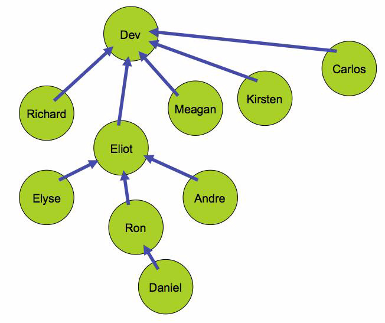

# September 2016: MongoDB 3.4 Features

[Browse 2016](../README.md)

[Back to home](../../README.md)

Original PDF: [MDB_DN_2016_09_34Features.pdf](./MDB_DN_2016_09_34Features.pdf)

---
## Chapter 8. September 2016

Welcome to the September 2016 edition of MongoDB Developer’s Notebook (MDB-DN). This month we answer the following question(s); It looks as though the new version 3.4 release of MongoDB has a number of cool business intelligence related features. What can you tell me ? Excellent question! Generally MongoDB follows an odd and even release pattern, that is; the odd release numbers (3.3.*) are developer-only/preview releases, and the even number releases (3.4.*) are suggested for production use. There are slides in the public domain that state that version 3.3.11 is ‘feature complete’ to the upcoming version 3.4. That doesn’t seem entirely true, since version 3.3.12 has even more features over 3.3.11. Regardless, the beta releases are available here,

```text
https://www.mongodb.com/customer-evaluation-downloads-development
-versions
```

And the Jira list (list of features) is available here,

```text
https://jira.mongodb.org/issues/
```

When we queried SERVER and TOOLS, version 3.2.6 and higher, we found over 70 (count) completed features. Some of the features include items like- • Redact sensitive information from the MongoDB server log file. • Add RPM support for (platform-n). • Others. Still, after removing many system-esque features, we find over 20 (count) items to discuss in this document.

The primary MongoDB software component used in this edition of MDB-DN is the MongoDB database server core, release 3.3.11. All of the software referenced is available for download at the URL's specified, in either trial or community editions.

All of these solutions were developed and tested on a single tier CentOS 7.0 operating system, running in a VMWare Fusion version 8.1 virtual machine. All software is 64 bit.

## 8.1 Terms and core concepts

Our intent in this document is to detail many of the features that should find their way into MongoDB version 3.4. We gathered this information from the public Jira list, specifically the query listed below-

```text
https://jira.mongodb.org/issues/?jql=project%20in%20(SERVER%2C%20TOO
LS)%20AND%20issuetype%20%3D%20%22New%20Feature%22%20AND%20status%20%
3D%20Closed%20AND%20resolution%20%3D%20Fixed%20AND%20fixVersion%20in
%20(3.2.8%2C%203.2.9%2C%203.3.0%2C%203.3.1%2C%203.3.10%2C%203.3.11%2
C%203.3.12%2C%203.3.13%2C%203.3.2%2C%203.3.3%2C%203.3.4%2C%203.3.5%2
C%203.3.6%2C%203.3.7%2C%203.3.8%2C%203.3.9%2C%203.4.0%2C%203.4.0-rc0
%2C%203.4.0-rc1%2C%203.4.0-rc2)&startIndex=50
```

That’s a very wordy query above, and we list it only that you may cut and paste. In short this query calls to-

- Show all Jiras for SERVER and TOOLS.

- That are Closed or Fixed (completed).

- MongoDB versions 3.2.7 though 3.4.0.

As stated above, some of the above features are more demonstratable than others. Thus, this document details about 20 (count) features, most of them executed from the MongoDB command shell (mongo).

## 8.1.1 Enhancement to $project

```text
https://jira.mongodb.org/browse/SERVER-24921
```

Actual Jira:

MongoDB has two methods to read data; find() and aggregate(). find() can accept zero, one, or two documents as parameters. The first document passed is the query document, similar to a SQL WHERE clause. The second document is the projection document, which tells MongoDB which keys to return to the calling function.

Generally we will state that the projection document could either promote or suppress the return of keys, and not promote and suppress the return of keys. This created grief as the special key titled, “_id” could not be suppressed without then manually calling to return all other keys. This Jira addresses this concern.

The sample program Example 8-1, 10_NewProject.py, details this change. A code review follows.

### Example 8-1 10_NewProject.py, Python/PyMongo program using $project.

```text
import pymongo
```

```text
#
from pymongo import MongoClient
```

```text
######################################################
```

```text
cn = MongoClient("localhost:28000, localhost:28001, localhost:28002")
db = cn.test_db9
```

```text
db.my_coll.drop()
#
db.my_coll.insert( { "k1" : 1, "k2" : 2 } )
```

```text
sss = list ( db.my_coll.find( {}, { "_id" : 0 } ) )
for s in sss:
print s
```

```text
sss = list ( db.my_coll.aggregate(
[
{ "$project" : { "_id" : 0 } }
]
) )
for s in sss:
print s
```

```text
db.my_coll.drop()
```

```text
#
# Returns
#
# {u'k2': 2, u'k1': 1}
# {u'k2': 2, u'k1': 1}
#
```

Relative to Example 8-1, the following is offered:

- This is a Python/PyMongo program. Similar source code will run at the MongoDB command shell, (mongo).

- The connection string calls to connect to a replica set available at ports 28000, 28001, and 28002.

- First we run a find() and then an equal aggregate() method.

- The sample outputted data is listed at the bottom.

## 8.1.2 Replica set (step up) command

```text
https://jira.mongodb.org/browse/SERVER-24881
```

Actual Jira:

A replica set is the primary means that MongoDB uses to deliver high availability. In effect, a single, primary, writable database server is backed up by two read-only database servers which are full copies of the primary. Why two (back up) servers ? As a convention, MongoDB will automatically cycle through the secondaries to make administrative changes; if you have only one secondary and that server is down, then you have no high availability at that time.

While MongoDB has complete diagnostic commands in the area of replica sets, and a command to step down a replica set member (instruct the primary to become a secondary, allow a new server to be elected primary), there was no explicit command to make a given secondary the primary server. This Jira addresses this concern.

A couple of examples:

- Example 8-2, 11_StepUpSetUp.sh, is a Linux Bash script to make a new, three node replica set.

- Example 8-3, 12_StepUp.sh, is a Linux Bash script that makes the actual call to (step up) a secondary to primary.

- Example 8-4, 13_CleanUpFrom11.sh, is a Bash script to clean up from this exercise.

A code review follows each example.

### Example 8-2 Linux Bash scripts to make a 3 node replica set.

```text
#!/bin/bash
```

```text
#
# Script to test the new stepUp() command.
#
```

```text
#
# Make the directories ..
#
export DB_DIR=/data/rs_manual9
#
rm -rf $DB_DIR
mkdir -p $DB_DIR/node0 $DB_DIR/node1 $DB_DIR/node2
touch $DB_DIR/pids
#
chmod -R 777 $DB_DIR
```

```text
#
# Make 3 servers
#
echo " "
echo "Make 3 servers."
echo " "
mongod --dbpath $DB_DIR/node0 \
--logpath $DB_DIR/node0/logfile \
--port 28000 --fork --noauth \
--replSet "abc" --smallfiles --wiredTigerCacheSizeGB 1
ps -ef | grep mongod | grep 28000 | awk -F " " '{print $2}' >> $DB_DIR/pids
mongod --dbpath $DB_DIR/node1 \
--logpath $DB_DIR/node1/logfile \
--port 28001 --fork --noauth \
--replSet "abc" --smallfiles --wiredTigerCacheSizeGB 1
ps -ef | grep mongod | grep 28001 | awk -F " " '{print $2}' >> $DB_DIR/pids
mongod --dbpath $DB_DIR/node2 \
--logpath $DB_DIR/node2/logfile \
--port 28002 --fork --noauth \
--replSet "abc" --smallfiles --wiredTigerCacheSizeGB 1
ps -ef | grep mongod | grep 28002 | awk -F " " '{print $2}' >> $DB_DIR/pids
```

```text
sleep 10
```

```text
#
# Initiate a replica set
#
echo " "
echo "Initiate a replica set."
echo " "
mongo --port 28000 <<EOF
```

```text
var cfg = { "_id" : "abc", members : [
{ "_id" : 0, "host" : "localhost:28000" }
] }
```

```text
rs.initiate( cfg )
```

```text
EOF
```

```text
sleep 10
```

```text
#
# Add second and third members
#
```

```text
echo " "
echo "Add a second and third members to the replica set."
echo " "
mongo --port 28000 <<EOF
```

```text
rs.add("localhost:28001")
rs.add("localhost:28002")
```

```text
EOF
```

```text
sleep 10
```

```text
#
# Check replcia set status
#
mongo --port 28000 <<EOF
```

```text
rs.isMaster()
```

```text
EOF
```

```text
echo " "
echo "** Notice port 28000 is the primary."
echo " "
```

Relative to Example 8-2, the following is offered:

- First, we make three stand alone MongoDB database servers. Notice the

```text
--wiredTigerCacheSizeGB 1
```

argument to save on memory.

- Then we initiate the first server under a replica set, followed by add’ing the two remaining members to this set.

```text
rs.isMaster()
```

- The call to gives us a shorter version of status than the

```text
rs.status().
```

more common

```text
mongod
```

- To aid us later, we captured the process id’s of each of the daemons to a single file.

```text
db.adminCommand({replSetStepUp: 1})
```

### Example 8-3 Actual call to (step up),

```text
#!/bin/bash
```

```text
#
# Script to test the new stepUp() command.
#
```

```text
#
# From the previous step, we expect a 3 node
# replica set with 28000 being the primary.
#
#
echo " "
echo "Run rs.isMaster()"
echo " "
mongo --port 28001 <<EOF
```

```text
rs.isMaster()
```

```text
EOF
```

```text
echo " "
echo "Run db.adminCommand({replSetStepUp: 1})"
echo " "
mongo --port 28001 <<EOF
```

```text
db.adminCommand({replSetStepUp: 1})
```

```text
EOF
```

```text
sleep 10
```

```text
echo " "
echo "Run rs.isMaster() again"
echo " "
mongo --port 28001 <<EOF
```

```text
rs.isMaster()
```

```text
EOF
```

Relative to Example 8-3, the following is offered:

- Really the only command that matters here is,

```text
db.adminCommand({replSetStepUp: 1})
```

which calls to make our current server the primary.

```text
rs.isMaster()
```

- The calls are merely for status/confirmation.

### Example 8-4 A simple clean up script.

```text
#!/bin/bash
```

```text
#
# This is clean up from the script above, number 11.
#
```

```text
export DB_DIR=/data/rs_manual9
```

```text
for t in ` cat $DB_DIR/pids 2> /dev/null`
do
kill -9 $t
done
```

```text
rm -fr $DB_DIR 2> /dev/null
```

Relative to Example 8-4, the following is offered:

- This is a simple clean up script.

- Because of the kill -9 command (severe, unbounded), we shouldn't put this script in production.

## 8.1.3 Read preference, maxStalenessMS

```text
https://jira.mongodb.org/browse/SERVER-24421
```

Actual Jira:

For this Jira, we need to return to the concept of replica sets. Figure 8-1 displays each of the following: a stand alone system, a replica set, and a sharded (data partitioned) system. A code review follows.


*Figure 8-1 Stand alone, Replica Set, Sharded systems.*

Relative to Figure 8-1, the following is offered:

- There are three systems offered above, separated by horizontal lines.

- The topmost system is a stand alone (SA); only one copy of the data, no high availability. This might be a system used on your laptop, and not for use in production.

- The middle system displays a replica set. • A primary database server (P), sends changes of the data to a read-only replica (R). (Technically, secondaries pull data from their source system.) The arrows are meant to indicate that a secondary may itself get its data from another secondary, producing less load on the primary. • By default, all client (end user) reads and writes are sent to the primary. • Variably, you may configure for client reads may be sent to a secondary. There are numerous configuration parameters that affect this behavior, which is the topic of this section.

- And the bottom section displays a sharded system; multiple writable primary servers (P1, P2), each with a distinct subset of data. E.g., server P1 might contain data for one country, and server P2 another. This is one collection (one table), spread and writable across multiple hosts. Each P* server should themselves have replicas for high availability; these are the R servers.The C servers store configuration data, that is; how is this data partitioned ? The S server is a switch; a lightweight MongoDB that routes queries to the single or set of MongoDB servers that host the data being requested.

So what is maxStalenessMS ? Example 8-5, 14_ReadPreference.sh, displays a client program that uses maxStalenessMS. A code review follows.

### Example 8-5 Client program that uses maxStalenessMS

```text
#!/bin/bash
```

```text
#
# Script to test the new read preference options.
#
```

```text
#
# From the previous step, we expect a 3 node
# replica set with 28000 being the primary.
#
#
echo " "
echo "Setting up a 3 node replica set with 28000"
echo "being the primary."
echo " "
13_CleanUpFrom11.sh 2> /dev/null
11_StepUpSetUp.sh 2> /dev/null
```

```text
echo " "
echo "Run a Python client requesting a secondary."
echo " "
```

```text
python <<EOF
```

```text
import pymongo
from pymongo import MongoClient
from pymongo import ReadPreference
```

```text
#
# maxStaleness not in current version of PyMongo
#
```

```text
cn =
MongoClient("mongodb://localhost:28000,localhost:28001,localhost:28002/?readPre
ference=secondary&maxStalenessMS=3000000")
db = cn.local
#
cc = db.me.find()
cc.next()
```

```text
dd = cc.address
```

```text
print dd
```

```text
EOF
```

```text
#
# This program outputs,
#
# ('localhost', 28002)
#
```

Relative to Example 8-5, the following offered:

- Example 8-5 displays a Linux Bash script with an embedded Python/PyMongo program.

- First we create a 3 node replica set using scripts introduced above in examples, Example 8-2 through Example 8-4.

```text
readPreference
```

- Then we connect to our replica set with a equal to secondary, and a maxStalenessMS value. Based on the version of Python native driver you are using, you may receive a maxStalenessMS value ignored message. In effect, features ship in the server before the drivers may support them.

- The “cc” and “dd” code displays the port number associated with the cursor connection. You should see a port number for a secondary server. Cool.

> Note: Consistency, and reads and writes-

As stated and by default, all client (end user) reads and writes target the primary database server.

Variably and configurable, you can call for writes to persist to just the primary, to the primary and all secondaries, and any condition in between. You can even call to return control to the client program before the write is safe/persisted; a fire and forget operation. (Not a safe write, but a very fast write.)

Reads then-

Reads can be variably directed to a single or set of secondaries, and not the primary. What of any possible lag to receive changes from the primary to a single or set of secondaries ? Based on your write preferences, there may not be any lag for writes. If you variably allow reads from secondaries, you can configure to read in a manner wherein you only see the accurate, up to the millisecond version of data. (Read only the correct/latest version of data.) Or, you can configure wherein your read may see older data; not up to the millisecond version of data. Why would you allow this ? Performance; all of this ensuredness costs time and resource.

So what is maxStalenessMS ? maxStalenessMS states that you are willing to read from a secondary that is up to (n) milliseconds behind the primary. How does the client know this value ? When reading from a 3 node replica set, the client actually maintains 3 concurrent open server connections, one per server, each with a timestamp. If the delay between the primary and a given secondary is too large, the client will call to read from the primary or another secondary.

## 8.1.4 aggregate stage, $bucketAuto

```text
https://jira.mongodb.org/browse/SERVER-24152
```

Actual Jira:

bucketAuto is one of a number of new aggregate() method stages, many of which aggregate data ($group) and similar. In each of these cases, we’ll list the example program and outputted data so that you may best decide the given stage’s application.

> Note: What is the MongoDB aggregate() cursor method ?

MongoDB has two methods to read data; find(), and aggregate().

The find() cursor method provides functionality similar to a SQL SELECT column list and WHERE clause. The aggregate() cursor method provides a superset to find(), and an equal or greater amount of the functionality to the full SQL SELECT.

Where SQL SELECT has 7 or more clauses, aggregate() has 14 or more stages. The difference between SQL clauses and aggregate() stages is that stages can appear multiple times and in any order, thus the power over SQL SELECT.

Example 8-6, 15_BucketAuto.py, displays a client program that uses the $bucketAuto aggregate() stage. A code review follows.

### Example 8-6 Sample program using the $bucketAuto stage.

```text
import pymongo
#
from pymongo import MongoClient
```

```text
######################################################
```

```text
cn = MongoClient("localhost:28002")
db = cn.test_db9
```

```text
db.my_coll.drop()
#
db.my_coll.insert( { "price" : 10 } )
db.my_coll.insert( { "price" : 10 } )
db.my_coll.insert( { "price" : 10 } )
db.my_coll.insert( { "price" : 20 } )
db.my_coll.insert( { "price" : 20 } )
db.my_coll.insert( { "price" : 50 } )
```

```text
######################################################
```

```text
print " "
print "Example 1: 6 documents, 2 groups."
print " "
```

```text
sss = list ( db.my_coll.aggregate(
[
{
"$bucketAuto" :
{
"groupBy" : "$price",
"buckets" : 2
}
}
] ) )
for s in sss:
print s
```

```text
######################################################
```

```text
print " "
print "Example 2: 6 documents, 4 groups."
print " "
sss = list ( db.my_coll.aggregate(
[
{
"$bucketAuto" :
{
"groupBy" : "$price",
"buckets" : 4
}
}
] ) )
for s in sss:
print s
```

```text
######################################################
```

```text
print " "
print "Example 3: 6 documents, 2 groups, custom accumulators."
print " "
sss = list ( db.my_coll.aggregate(
[
{
"$bucketAuto" :
{
"groupBy" : "$price",
"buckets" : 2,
"output" :
{
```

```text
"count" : { "$sum" : 1 },
"totPrice" : { "$sum" : "$price" }
}
}
}
] ) )
for s in sss:
print s
```

```text
######################################################
```

```text
print " "
print "Example 4: 6 documents, 2 groups, custom accumulators, specified
grouping."
print " "
sss = list ( db.my_coll.aggregate(
[
{
"$bucketAuto" :
{
"groupBy" : "$price",
"buckets" : 2,
"output" :
{
"count" : { "$sum" : 1 },
"totPrice" : { "$sum" : "$price" }
},
"granularity" : "R5"
}
}
] ) )
for s in sss:
print s
```

```text
db.my_coll.drop()
```

Relative to Example 8-6, the following offered:

- This example is written in Python/PyMongo. Four sample aggregate() cursor methods are presented.

- The source data contains 6 documents; three with a price of 10, two at 20, and one at 50.

- The first aggregate() cursor method outputs these values,

```text
{u'count': 3, u'_id': {u'max': 20, u'min': 10}}
{u'count': 3, u'_id': {u'max': 50, u'min': 20}}
```

The bucketAuto stage calls to group on price ($price, the value of the price key), and place these into 2 buckets. The grouping algorithm defaults and uses a nearest neighbor like scheme. Output as shown.

- The second aggregate() cursor method outputs these values,

```text
{u'count': 3, u'_id': {u'max': 20, u'min': 10}}
{u'count': 2, u'_id': {u'max': 50, u'min': 20}}
{u'count': 1, u'_id': {u'max': 50, u'min': 50}}
```

This bucketAuto stage calls for 4 groups, when there are only 3 distinct values for the specified key.

- The third aggregate() cursor method calls for 2 buckets and outputs these values,

```text
{u'count': 3, u'totPrice': 30, u'_id': {u'max': 20, u'min':
10}}
{u'count': 3, u'totPrice': 90, u'_id': {u'max': 50, u'min':
20}}
```

This bucketAuto stage details how to specify manual aggregate expressions, similar to the $group stage.

- The fourth aggregate() cursor method outputs these values,

```text
{u'count': 3, u'totPrice': 30, u'_id': {u'max': 16.0, u'min':
6.300000000000001}}
{u'count': 3, u'totPrice': 90, u'_id': {u'max': 63.0, u'min':
16.0}}
```

This bucketAuto stage uses the granularity setting based on the concept of preferred numbers , detailed at,

```text
https://en.wikipedia.org/wiki/Preferred_number
```

## 8.1.5 aggregate stage, $count

```text
https://jira.mongodb.org/browse/SERVER-6365
```

Actual Jira:

Count is a common SQL expression. MongoDB has a number of helper functions for count, but did not have a dedicated aggregate() cursor method for same. This Jira addresses this concern.

Example 8-7, 16_Count.py, displays a client program that uses the $count aggregate() stage. A code review follows.

### Example 8-7 Sample program using the $count stage.

```text
import pymongo
#
from pymongo import MongoClient
```

```text
######################################################
```

```text
cn = MongoClient("localhost:28000, localhost:28001, localhost:28002")
db = cn.test_db9
```

```text
db.my_coll.drop()
#
db.my_coll.insert( { "price" : 10 } )
db.my_coll.insert( { "price" : 10 } )
db.my_coll.insert( { "price" : 10 } )
db.my_coll.insert( { "price" : 20 } )
db.my_coll.insert( { "price" : 20 } )
db.my_coll.insert( { "price" : 50 } )
```

```text
######################################################
```

```text
print " "
print "Example: $count stage in group/aggregate."
print " "
sss = list ( db.my_coll.aggregate(
[
{
"$match" :
{
"price" : { "$gte" : 12 }
}
},
{
"$count" : "price"
}
] ) )
for s in sss:
print s
```

```text
######################################################
```

```text
print " "
print "Example: $count stage in group/aggregate."
print " "
sss = list ( db.my_coll.aggregate(
[
{
"$match" :
{
"price" : { "$gte" : 12 }
}
},
{
"$group" :
{
"_id" : "null",
"my_count1" : { "$sum" : 1 } # ,
# "my_count2" : { "$count" : "$price" } # This operator was not known
}
}
] ) )
for s in sss:
print s
```

Relative to Example 8-7, the following is offered:

- This example is written in Python/PyMongo. There are two aggregate() cursor method examples.

- The first aggregate() cursor method example uses $count as a stage.

- The second aggregate() cursor method example tries to use $count() as an expression in the $group stage, which was not recognized. To (count) inside a $group stage, we commonly perform a sum(1).

- The first aggregate() cursor methods outputs this value,

```text
{u'price': 3}
```

- The second aggregate() cursor method outputs this value,

```text
{u'_id': u'null', u'my_count1': 3}
```

## 8.1.6 aggregate stage, $sortByCount

```text
https://jira.mongodb.org/browse/SERVER-23816
```

Actual Jira:

Using prior versions of MongoDB, you could $group, calculate aggregate expressions including count, and then sort by that count. This new stage, $sortByCount, performs these steps in one stage.

Example 8-8, 17_SortByCount.py, displays a client program that uses the $sortByCount aggregate() stage. A code review follows.

### Example 8-8 Sample program using the $sortByCount stage.

```text
import pymongo
#
from pymongo import MongoClient
```

```text
######################################################
```

```text
cn = MongoClient("localhost:28000, localhost:28001, localhost:28002")
db = cn.test_db9
```

```text
db.my_coll.drop()
#
db.my_coll.insert( { "price" : 10 } )
db.my_coll.insert( { "price" : 10 } )
db.my_coll.insert( { "price" : 10 } )
db.my_coll.insert( { "price" : 20 } )
db.my_coll.insert( { "price" : 20 } )
db.my_coll.insert( { "price" : 50 } )
```

```text
######################################################
```

```text
print " "
print "Example: $sortByCount stage in aggregate."
print " "
sss = list ( db.my_coll.aggregate(
[
{
"$sortByCount" : "$price"
}
] ) )
for s in sss:
print s
```

Relative to Example 8-8, the following is offered:

- The $sortByCount stage acts like a $group stage in that it groups by a given key value (in this case, $price).

- $sortByCount automatically calculates a count per group, and sorts descending by same.

- There are other syntaxes/uses for this stage that are not displayed.

- This program outputs these values,

```text
{u'count': 3, u'_id': 10}
{u'count': 2, u'_id': 20}
{u'count': 1, u'_id': 50}
```

## 8.1.7 aggregate stage, $bucket

```text
https://jira.mongodb.org/browse/SERVER-23815
```

Actual Jira:

Using prior versions of MongoDB, you could $group by a given key, use a $switch, and create custom groups of key values. With this design, you’d also need to wind and then unwind an array. This new aggregate() stage removes all of that complexity.

Example 8-9, 18_Bucket.py, displays a client program that uses the $bucket aggregate() stage. A code review follows.

### Example 8-9 Sample program using the $bucket stage.

```text
import pymongo
#
from pymongo import MongoClient
```

```text
######################################################
```

```text
cn = MongoClient("localhost:28000, localhost:28001, localhost:28002")
db = cn.test_db9
```

```text
db.my_coll.drop()
#
db.my_coll.insert( { "price" : 10 } )
db.my_coll.insert( { "price" : 10 } )
db.my_coll.insert( { "price" : 10 } )
db.my_coll.insert( { "price" : 20 } )
db.my_coll.insert( { "price" : 20 } )
db.my_coll.insert( { "price" : 50 } )
db.my_coll.insert( { "price" : -2 } )
```

```text
######################################################
```

```text
print " "
print "Example: $bucket stage in aggregate."
print " "
sss = list ( db.my_coll.aggregate(
[
{
"$bucket" :
{
"groupBy" : "$price",
"boundaries" : [ 0, 22, 1000 ], # Infinity would not work
"default" : "None of the above",
"output" :
{
"count" : { "$sum" : 1 },
"members" : { "$push" : "$price" }
}
}
}
] ) )
for s in sss:
print s
```

Relative to Example 8-9, the following is offered:

- This program outputs these values,

```text
{u'count': 5, u'_id': 0, u'members': [10, 10, 10, 20, 20]}
{u'count': 1, u'_id': 22, u'members': [50]}
{u'count': 1, u'_id': u'None of the above', u'members': [-2]}
```

- The groupBy clause specifies the single or set of group keys.

- The boundaries clause specifies the bucket ranges. Notice our source data has a key that will not fit in any bucket.

- The default clause specifies a position for keys not to be found in any of the requested groups.

- The output clause is similar to a $group stage’s aggregate expressions.

## 8.1.8 aggregate stage, $facet

```text
https://jira.mongodb.org/browse/SERVER-23654
```

Actual Jira:

To understand facets, it might be best to start with a picture. Figure 8-2 is a screen shot from Amazon.com, and a query for ‘USB mouse’. A code review follows.


*Figure 8-2 Amazon.com query for USB mouse, notice the left column.*

Relative to Figure 8-2, the following is offered:

- The left column of this image displays a number of adjectives to the product set our query produced: interface, color, features, other. This is not even to say that you can get a red mouse in USB, this is just a quick pick list to aid the end user.

- This operation (this grouping of data) is generally referred to as faceting .

Example 8-10, 19_Facet.py, displays a client program that uses the $facet aggregate() stage. A code review follows.

### Example 8-10 Sample program using the $facet stage.

```text
import pymongo
#
from pymongo import MongoClient
```

```text
######################################################
```

```text
cn = MongoClient("localhost:28000, localhost:28001, localhost:28002")
db = cn.test_db9
```

```text
db.my_coll.drop()
#
db.my_coll.insert( {
"category" : "Computer peripherals" ,
"sub-category" : "Mouse" ,
"attributes" :
[
{ "color" : "red" },
{ "plug" : "USB" },
{ "buttons" : 3 }
]
} )
db.my_coll.insert( {
"category" : "Computer peripherals" ,
"sub-category" : "Mouse" ,
"attributes" :
[
{ "color" : "blue" },
{ "plug" : "USB" },
{ "buttons" : 2 }
]
} )
db.my_coll.insert( {
"category" : "Computer peripherals" ,
"sub-category" : "Mouse" ,
"attributes" :
```

```text
[
{ "color" : "silver" },
{ "plug" : "PS2" },
{ "buttons" : 2 }
]
} )
db.my_coll.insert( {
"category" : "Computer peripherals" ,
"sub-category" : "Monitor" ,
"attributes" :
[
{ "size" : 27 },
{ "res" : "CGA" }
]
} )
db.my_coll.insert( {
"category" : "Computer peripherals" ,
"sub-category" : "Monitor" ,
"attributes" :
[
{ "size" : 29 },
{ "res" : "VGA" }
]
} )
```

```text
######################################################
```

```text
print " "
print "Example: $facet stage in aggregate."
print " "
sss = list ( db.my_coll.aggregate(
[
{
"$match" :
{ "category" : "Computer peripherals" }
},
{
"$facet" :
{
"interface" :
[
{
"$match" : { "sub-category" : "Mouse" }
},
{
"$group" :
{
```

```text
"_id" : "$attributes.plug" ,
#
"count" : { "$sum" : 1 }
}
}
],
"sub-category" : [
{
"$group" :
{
"_id" : "$sub-category",
#
"count" : { "$sum" : 1 }
}
}
]
}
}
] ) )
for s in sss:
print s
```

Relative to Example 8-10, the following is offered:

- We start by inserting a number of documents. We used an array titled, attributes, so that we could a quick number of descriptors to each product.

- A single aggregate() cursor method has two stages; $match, and $facet. The $match was superfluous, and added simply to display (again) how multiple stages are specified.

- The $facet stage calls to output two new keys (two new columns) titled, interface and sub-category. We could have called these new keys anything.

- The interface key has a $match, and then a $group. We $group on attributres.plug, and output a count.

- The sub-category key just has a group. Here again we output a count.

- This program outputs these values,

```text
{u'interface': [{u'count': 1, u'_id': [u'PS2']}, {u'count': 2,
u'_id': [u'USB']}],
u'sub-category': [{u'count': 2, u'_id': u'Monitor'}, {u'count':
3, u'_id': u'Mouse'}]}
```

## 8.1.9 aggregate stage, $replaceRoot

```text
https://jira.mongodb.org/browse/SERVER-23313
```

Actual Jira:

Similar to many of these Jiras, you could have accomplished the intent of this new aggregate() cursor method stage, by writing a larger amount of code than before. Example 8-11, 20_ReplaceRoot.py, displays a client program that uses the $replaceRoot aggregate() stage. A code review follows.

### Example 8-11 Sample program using the $replaceRoot stage.

```text
import pymongo
#
from pymongo import MongoClient
```

```text
######################################################
```

```text
cn = MongoClient("localhost:28000, localhost:28001, localhost:28002")
db = cn.test_db9
```

```text
db.my_coll.drop()
#
db.my_coll.insert( {
"category" : "Computer peripherals" ,
"sub-category" : "Mouse" ,
"attributes" :
{
"color" : "red" ,
"plug" : "USB" ,
"buttons" : 3
}
} )
db.my_coll.insert( {
"category" : "Computer peripherals" ,
"sub-category" : "Mouse" ,
"attributes" :
{
"color" : "blue" ,
"plug" : "USB" ,
"buttons" : 2
}
} )
db.my_coll.insert( {
"category" : "Computer peripherals" ,
"sub-category" : "Mouse" ,
"attributes" :
{
```

```text
"color" : "silver" ,
"plug" : "PS2" ,
"buttons" : 2
}
} )
db.my_coll.insert( {
"category" : "Computer peripherals" ,
"sub-category" : "Monitor" ,
"attributes" :
{
"size" : 27 ,
"res" : "CGA"
}
} )
db.my_coll.insert( {
"category" : "Computer peripherals" ,
"sub-category" : "Monitor" ,
"attributes" :
{
"size" : 29 ,
"res" : "VGA"
}
} )
```

```text
######################################################
```

```text
print " "
print "Example: $replaceRoot stage in aggregate."
print " "
sss = list ( db.my_coll.aggregate(
[
{
"$replaceRoot" :
{ "newRoot" : "$attributes" }
}
] ) )
for s in sss:
print s
```

```text
######################################################
```

```text
print " "
print "Example: similar to $replaceRoot stage in aggregate."
print " "
sss = list ( db.my_coll.aggregate(
```

```text
[
{
"$project" :
{
"_id" : 0 ,
#
"category" : 1 ,
"sub-category" : 1 ,
"color" : "$attributes.color" ,
"plug" : "$attributes.plug" ,
"buttons" : "$attributes.buttons",
"size" : "$attributes.size" ,
"res" : "$attributes.res"
}
}
] ) )
for s in sss:
print s
```

Relative to Example 8-11, the following is offered:

- This program first inserts a number of documents. The intent of replaceRoot is to promote a sub-document to the root, thus we insert documents each containing sub-documents. The sub-document we call to promote is titled, attributes. The object you call to promote must be a document, and not an array. It can be a document with an embedded array, but not an array itself. After the aggregate() cursor method with a $replaceRoot stage, we write the equivalent aggregate() cursor method not using $replaceRoot.

- This program outputs these values,

```text
Example: $replaceRoot stage in aggregate.
```

```text
{u'color': u'red', u'plug': u'USB', u'buttons': 3}
{u'color': u'blue', u'plug': u'USB', u'buttons': 2}
{u'color': u'silver', u'plug': u'PS2', u'buttons': 2}
{u'res': u'CGA', u'size': 27}
{u'res': u'VGA', u'size': 29}
```

```text
Example: similar to $replaceRoot stage in aggregate.
```

```text
{u'category': u'Computer peripherals', u'plug': u'USB',
u'buttons': 3, u'color': u'red', u'sub-category': u'Mouse'}
{u'category': u'Computer peripherals', u'plug': u'USB',
u'buttons': 2, u'color': u'blue', u'sub-category': u'Mouse'}
{u'category': u'Computer peripherals', u'plug': u'PS2',
u'buttons': 2, u'color': u'silver', u'sub-category': u'Mouse'}
{u'category': u'Computer peripherals', u'res': u'CGA', u'size':
27, u'sub-category': u'Monitor'}
{u'category': u'Computer peripherals', u'res': u'VGA', u'size':
29, u'sub-category': u'Monitor'}
```

## 8.1.10 aggregate stage, $reverseArray

```text
https://jira.mongodb.org/browse/SERVER-23029
```

Actual Jira:

MongoDB has an array data type. See,

```text
https://docs.mongodb.com/manual/reference/operator/query/type/
```

When updating a MongoDB array, there are a number of array update methods. See,

```text
https://docs.mongodb.com/manual/reference/operator/update-array/
```

The above offers methods to:

- Add an element to an array. ($push)

- Add an element to an array if its not a duplicate. ($addToSet)

- Remove a specific element from an array.

- Sort the array.

- Cap the array size.

- And more.

All of the above are on the server side. E.g., what is stored on disk.

The reverseArray aggregate() cursor method affects the array (the data being returned, queried) as it is returned to the client. (reverseArray does not affect the data on disk. You knew this because reverseArray is a stage to the aggregate() cursor method, which reads, and does not write.) Presumably the array is sorted and you wish to reverse sort.

Example 8-12, 21_ReverseArray.py, displays a program that uses the $reverseArray aggregate() stage. A code review follows.

### Example 8-12 Sample program using the $reverseArray stage.

```text
import pymongo
#
from pymongo import MongoClient
```

```text
######################################################
```

```text
cn = MongoClient("localhost:28000, localhost:28001, localhost:28002")
db = cn.test_db9
```

```text
db.my_coll.drop()
#
db.my_coll.insert( {
"category" : "Computer peripherals" ,
"sub-category" : "Mouse" ,
"attributes" :
[
{ "color" : "red" },
{ "plug" : "USB" },
{ "buttons" : 3 }
]
} )
db.my_coll.insert( {
"category" : "Computer peripherals" ,
"sub-category" : "Mouse" ,
"attributes" :
[
{ "color" : "blue" },
{ "plug" : "USB" },
{ "buttons" : 2 }
]
} )
db.my_coll.insert( {
"category" : "Computer peripherals" ,
"sub-category" : "Mouse" ,
"attributes" :
[
{ "color" : "silver" },
{ "plug" : "PS2" },
{ "buttons" : 2 }
]
} )
db.my_coll.insert( {
"category" : "Computer peripherals" ,
"sub-category" : "Monitor" ,
```

```text
"attributes" :
[
{ "size" : 27 },
{ "res" : "CGA" }
]
} )db.my_coll.insert( {
"category" : "Computer peripherals" ,
"sub-category" : "Monitor" ,
"attributes" :
[
{ "size" : 29 },
{ "res" : "VGA" }
]
} )
```

```text
######################################################
```

```text
print " "
print "Example: $reverseArray stage in aggregate."
print " "
sss = list ( db.my_coll.aggregate(
[
{
"$project" :
{
"_id" : 0 ,
#
"attributes" : 1 ,
"attributesR" : { "$reverseArray" : "$attributes" }
}
}
] ) )
for s in sss:
print s
```

Relative to Example 8-12, the following is offered:

- This program outputs these values,

```text
{u'attributesR': [{u'buttons': 3}, {u'plug': u'USB'},
{u'color': u'red'}], u'attributes': [{u'color': u'red'},
{u'plug': u'USB'}, {u'buttons': 3}]}
{u'attributesR': [{u'buttons': 2}, {u'plug': u'USB'},
{u'color': u'blue'}], u'attributes': [{u'color': u'blue'},
{u'plug': u'USB'}, {u'buttons': 2}]}
```

```text
{u'attributesR': [{u'buttons': 2}, {u'plug': u'PS2'},
{u'color': u'silver'}], u'attributes': [{u'color': u'silver'},
{u'plug': u'PS2'}, {u'buttons': 2}]}
{u'attributesR': [{u'res': u'CGA'}, {u'size': 27}],
u'attributes': [{u'size': 27}, {u'res': u'CGA'}]}
{u'attributesR': [{u'res': u'VGA'}, {u'size': 29}],
u'attributes': [{u'size': 29}, {u'res': u'VGA'}]}
```

- The output was designed to be such that you can see the before and after effects.

## 8.1.11 (string methods)

```text
https://jira.mongodb.org/browse/SERVER-22580
```

Actual Jira:

MongoDB already has a large number of string operands, witnessed here,

```text
https://docs.mongodb.com/manual/reference/operator/aggregation-strin
g/
```

Some of the more commonly used operands above include: concat, substr, toLower, toUpper, strcasecmp, and more.

This Jira adds two more operands: substrBytes, and substrCP.

In effect, these are operands equal to those above, but are now byte aware. (Break on unicode string boundaries.)

> Note: “CP” stands for UTF-8 “code points”.

Example 8-13, 22_Strings.py, displays a client program that uses the $substrBytes and $substrCP operands. A code review follows.

### Example 8-13 Sample program using $substrBytes, and $substrCP.

```text
import pymongo
#
from pymongo import MongoClient
```

```text
######################################################
```

```text
cn = MongoClient("localhost:28000, localhost:28001, localhost:28002")
db = cn.test_db9
```

```text
db.my_coll.drop()
#
db.my_coll.insert( {
"category" : "Computer peripherals" ,
"sub-category" : "Mouse"
} )
db.my_coll.insert( {
"category" : "Computer peripherals" ,
"sub-category" : "Mouse"
} )
db.my_coll.insert( {
"category" : "Computer peripherals" ,
"sub-category" : "Mouse"
} )
db.my_coll.insert( {
"category" : "Computer peripherals" ,
"sub-category" : "Monitor"
} )
db.my_coll.insert( {
"category" : "Computer peripherals" ,
"sub-category" : "Monitor"
} )
```

```text
######################################################
```

```text
print " "
print "Example: (string) stages in aggregate."
print " "
sss = list ( db.my_coll.aggregate(
[
{
"$project" :
{
"_id" : 0,
"category" : 1,
"cat1" : { "$substrBytes" : [ "$category", 0, 8 ] },
"cat2" : { "$substrCP" : [ "$category", 0, 8 ] }
}
}
] ) )
for s in sss:
print s
```

Relative to Example 8-13, the following is offered:

- This program outputs these values,

```text
{u'category': u'Computer peripherals', u'cat1': u'Computer',
u'cat2': u'Computer'}
{u'category': u'Computer peripherals', u'cat1': u'Computer',
u'cat2': u'Computer'}
{u'category': u'Computer peripherals', u'cat1': u'Computer',
u'cat2': u'Computer'}
{u'category': u'Computer peripherals', u'cat1': u'Computer',
u'cat2': u'Computer'}
{u'category': u'Computer peripherals', u'cat1': u'Computer',
u'cat2': u'Computer'}
```

## 8.1.12 $range operand

```text
https://jira.mongodb.org/browse/SERVER-20169
```

Actual Jira:

Example 8-14, 23_Range.py, displays a client program that uses the $range operand. A code review follows.

### Example 8-14 Sample program using the $range operand.

```text
import pymongo
#
from pymongo import MongoClient
```

```text
######################################################
```

```text
cn = MongoClient("localhost:28000, localhost:28001, localhost:28002")
db = cn.test_db9
```

```text
db.my_coll.drop()
#
db.my_coll.insert( {
"category" : "Computer peripherals" ,
"sub-category" : "Mouse"
} )
db.my_coll.insert( {
"category" : "Computer peripherals" ,
"sub-category" : "Mouse"
} )
db.my_coll.insert( {
"category" : "Computer peripherals" ,
"sub-category" : "Mouse"
} )
db.my_coll.insert( {
```

```text
"category" : "Computer peripherals" ,
"sub-category" : "Monitor"
} )
db.my_coll.insert( {
"category" : "Computer peripherals" ,
"sub-category" : "Monitor"
} )
```

```text
######################################################
```

```text
print " "
print "Example: $range operator in aggregate."
print " "
sss = list ( db.my_coll.aggregate(
[
{
"$project" :
{
"_id" : 0,
"category" : 1,
"newKey" : { "$range" : [ 0, 5, 2 ] } # start, end, step
}
}
] ) )
for s in sss:
print s
```

Relative to Example 8-14, the following is offered:

- This program outputs these values,

```text
{u'category': u'Computer peripherals', u'newKey': [0, 2, 4]}
{u'category': u'Computer peripherals', u'newKey': [0, 2, 4]}
{u'category': u'Computer peripherals', u'newKey': [0, 2, 4]}
{u'category': u'Computer peripherals', u'newKey': [0, 2, 4]}
{u'category': u'Computer peripherals', u'newKey': [0, 2, 4]}
```

- This operand is meant to mimic the same named method in Python titled, range. This method generates a set of, in this case, numeric values.

- In the sample code above, we use a $project stage to suppress output of the “_id” key, output 1:true the category key, and then generate (range) a new key titled, newKey.

- The three arguments to $range are the: start, end, and step.

## 8.1.13 aggregate stage, $zip

```text
https://jira.mongodb.org/browse/SERVER-20163
```

Actual Jira:

$zip does not zip, but that would be a good guess. $zip zippers (merges) two arrays together. Given two (source) arrays, the first with five elements and the second with four, five new arrays are output: the first newly created array with the first elements from both source arrays, the second newly created array with the second elements from both source arrays, and so on. A switch determines what happens if the source arrays are not of equal size.

Example 8-15, 24_Zip.py, displays a client program that uses the $range operand. A code review follows.

### Example 8-15 Sample program using the $zip stage.

```text
import pymongo
#
from pymongo import MongoClient
```

```text
######################################################
```

```text
cn = MongoClient("localhost:28000, localhost:28001, localhost:28002")
db = cn.test_db9
```

```text
db.my_coll.drop()
#
db.my_coll.insert( {
"category" : "Computer peripherals" ,
"sub-category" : "Mouse" ,
"attributes" :
[
{ "color" : "red" },
{ "buttons" : 3 }
],
"other" :
[
{ "ship" : "International okay" },
{ "tax" : "Yes" },
]
} )
db.my_coll.insert( {
"category" : "Computer peripherals" ,
"sub-category" : "Mouse" ,
"attributes" :
[
{ "color" : "blue" },
```

```text
{ "plug" : "USB" },
{ "buttons" : 2 }
],
"other" :
[
{ "ship" : "Domestic only" },
]
} )
```

```text
######################################################
```

```text
print " "
print "Example: $zip operator in aggregate."
print " "
sss = list ( db.my_coll.aggregate(
[
{
"$project" :
{
"_id" : 0,
#
"newArr" :
{
"$zip" :
{
"inputs" : [ "$attributes", "$other" ],
"defaults" : [ 0, 1],
"useLongestLength" : True
}
}
}
}
] ) )
for s in sss:
print s
```

Relative to Example 8-15, the following is offered:

- This program outputs these values,

```text
{u'newArr': [[{u'color': u'red'}, {u'ship': u'International
okay'}], [{u'buttons': 3}, {u'tax': u'Yes'}]]}
{u'newArr': [[{u'color': u'blue'}, {u'ship': u'Domestic
only'}], [{u'plug': u'USB'}, 1], [{u'buttons': 2}, 1]]}
```

- In this example, the first document had 2 arrays, each with 2 elements. Thus 2 arrays are output as shown.

- The second document had 2 arrays, the first with 3 elements, the second with 1 element. Because we called for “useLongestLength, we will get 3 arrays output, with default values (values for the missing elements) equal to 1. The defaults clause specifies values for the first and then second array, should the first or second array be the shortest. If the first array had been shortest, the default value would have been zero.

## 8.1.14 $split operand

```text
https://jira.mongodb.org/browse/SERVER-6773
```

Actual Jira:

$split is an operand to split (from one string, create many) based on a separator.

Example 8-16, 25_Split.py, displays a client program that uses the $split operand. A code review follows.

### Example 8-16 Sample program using the $split operand.

```text
import pymongo
#
from pymongo import MongoClient
```

```text
######################################################
```

```text
cn = MongoClient("localhost:28000, localhost:28001, localhost:28002")
db = cn.test_db9
```

```text
db.my_coll.drop()
#
db.my_coll.insert( {
"category" : "Computer peripherals" ,
"sub-category" : "Mouse"
} )
db.my_coll.insert( {
"category" : "Computer peripherals" ,
"sub-category" : "Mouse"
} )
db.my_coll.insert( {
"category" : "Computer peripherals" ,
"sub-category" : "Mouse"
} )
```

```text
db.my_coll.insert( {
"category" : "Computer peripherals" ,
"sub-category" : "Monitor"
} )
db.my_coll.insert( {
"category" : "Computer peripherals" ,
"sub-category" : "Monitor"
} )
```

```text
######################################################
```

```text
print " "
print "Example: split operator in aggregate."
print " "
sss = list ( db.my_coll.aggregate(
[
{
"$project" :
{
"_id" : 0,
"category" : 1,
"newStr" : { "$split" : [ "$category", "p" ] }
}
}
] ) )
for s in sss:
print s
```

Relative to Example 8-16, the following is offered:

- $split is an operand and we chose to make use of it inside a $project stage.

- This program outputs these values,

```text
{u'category': u'Computer peripherals', u'newStr': [u'Com',
u'uter ', u'eri', u'herals']}
{u'category': u'Computer peripherals', u'newStr': [u'Com',
u'uter ', u'eri', u'herals']}
{u'category': u'Computer peripherals', u'newStr': [u'Com',
u'uter ', u'eri', u'herals']}
{u'category': u'Computer peripherals', u'newStr': [u'Com',
u'uter ', u'eri', u'herals']}
```

```text
{u'category': u'Computer peripherals', u'newStr': [u'Com',
u'uter ', u'eri', u'herals']}
```

- The arguments to $split include: an expression, expected to be the source string, and a second expression, expected to be the separator.

## 8.1.15 $in expression

```text
https://jira.mongodb.org/browse/SERVER-6146
```

Actual Jira:

$in returns a boolean indicating the presence of a key in a list.

Example 8-17, 26_In.py, displays a client program that uses the $in expression. A code review follows.

### Example 8-17 Sample program using the $in expression.

```text
import pymongo
#
from pymongo import MongoClient
```

```text
######################################################
```

```text
cn = MongoClient("localhost:28000, localhost:28001, localhost:28002")
db = cn.test_db9
```

```text
db.my_coll.drop()
```

```text
db.my_coll.insert( {"state" : "XX", "zip" : 55555 } )
db.my_coll.insert( {"state" : "CO", "zip" : 66666 } )
db.my_coll.insert( {"state" : "WI", "zip" : 77777 } )
db.my_coll.insert( {"state" : "TX", "zip" : 88888 } )
db.my_coll.insert( {"state" : "YY", "zip" : 99999 } )
```

```text
print " "
print "In a find."
print " "
sss = list ( db.my_coll.find( { "state" : { "$in" : [ "CO" , "WI" ] } } ) )
for s in sss:
print s
```

```text
print " "
print "In an aggregate."
print " "
sss = list ( db.my_coll.aggregate(
[
```

```text
{ "$match" :
{ "state" : { "$in" : [ "CO" , "WI", "TX", "NV" ] } }
}
] ) )
for s in sss:
print s
```

```text
print " "
print "In a find with numbers."
print " "
sss = list ( db.my_coll.find( { "zip" : { "$in" : [ (53), (88888) ] } } ) )
for s in sss:
print s
```

Relative to Example 8-17, the following is offered:

- This program outputs these values,

```text
In a find.
```

```text
{u'state': u'CO', u'_id':
ObjectId('57c562e024590fb680119545'), u'zip': 66666}
{u'state': u'WI', u'_id':
ObjectId('57c562e024590fb680119546'), u'zip': 77777}
```

```text
In an aggregate.
```

```text
{u'state': u'CO', u'_id':
ObjectId('57c562e024590fb680119545'), u'zip': 66666}
{u'state': u'WI', u'_id':
ObjectId('57c562e024590fb680119546'), u'zip': 77777}
{u'state': u'TX', u'_id':
ObjectId('57c562e024590fb680119547'), u'zip': 88888}
```

```text
In a find with numbers.
```

```text
{u'state': u'TX', u'_id':
ObjectId('57c562e024590fb680119547'), u'zip': 88888}
```

- Examples displays use for both the find() and aggregate() cursor methods.

## 8.1.16 aggregate stage, $addFields

```text
https://jira.mongodb.org/browse/SERVER-5781
```

Actual Jira:

$addFields is an aggregate() cursor method stage. The $project stage can itself be used to add fields (keys and values). If you $addFields with a (new) key name for an existing key name, this stage will overwrite the value for that key.

Example 8-18, 27_AddFields.py, displays a client program that uses the $addFields stage. A code review follows.

### Example 8-18 Sample program using the $addFields stage.

```text
import pymongo
#
from pymongo import MongoClient
```

```text
######################################################
```

```text
cn = MongoClient("localhost:28000, localhost:28001, localhost:28002")
db = cn.test_db9
```

```text
db.my_coll.drop()
#
db.my_coll.insert( {
"category" : "Computer peripherals" ,
"sub-category" : "Mouse"
} )
db.my_coll.insert( {
"category" : "Computer peripherals" ,
"sub-category" : "Mouse"
} )
db.my_coll.insert( {
"category" : "Computer peripherals" ,
"sub-category" : "Mouse"
} )
db.my_coll.insert( {
"category" : "Computer peripherals" ,
"sub-category" : "Monitor"
} )
db.my_coll.insert( {
"category" : "Computer peripherals" ,
"sub-category" : "Monitor"
} )
```

```text
######################################################
```

```text
print " "
print "Example: addFields stage in aggregate."
print " "
sss = list ( db.my_coll.aggregate(
[
{
"$project" :
{
"_id" : 0,
#
"category" : 1,
"newField1" : "yadda"
}
},
{
"$addFields" :
{
"newField2" : "yadda 2"
}
}
] ) )
for s in sss:
print s
```

Relative to Example 8-18, the following is offered:

- This program outputs these values,

```text
{u'category': u'Computer peripherals', u'newField2': u'yadda
2', u'newField1': u'yadda'}
{u'category': u'Computer peripherals', u'newField2': u'yadda
2', u'newField1': u'yadda'}
{u'category': u'Computer peripherals', u'newField2': u'yadda
2', u'newField1': u'yadda'}
{u'category': u'Computer peripherals', u'newField2': u'yadda
2', u'newField1': u'yadda'}
{u'category': u'Computer peripherals', u'newField2': u'yadda
2', u'newField1': u'yadda'}
```

- “newField1” is added using $project, and not using $addFields.

- “newField2” is adding using $addFields.

## 8.1.17 $reduce operand

```text
https://jira.mongodb.org/browse/SERVER-17258
```

Actual Jira:

$reduce has no relation to Map/Reduce. $reduce performs an operation similar to a $group, but on an array.

Example 8-19, 28_Reduce.py, displays a client program that uses the $reduce operand. A code review follows.

### Example 8-19 Sample program using the $reduce operand.

```text
import pymongo
#
from pymongo import MongoClient
```

```text
######################################################
```

```text
cn = MongoClient("localhost:28000, localhost:28001, localhost:28002")
db = cn.test_db9
```

```text
db.my_coll.drop()
#
db.my_coll.insert( {
"category" : "Computer peripherals" ,
"sub-category" : "Mouse" ,
"arrayOfVals" : [ 1, 2, 3]
} )
db.my_coll.insert( {
"category" : "Computer peripherals" ,
"sub-category" : "Mouse" ,
"arrayOfVals" : [ 1, 2]
} )
```

```text
######################################################
```

```text
print " "
print "Example: reduce operator in aggregate."
print " "
sss = list ( db.my_coll.aggregate(
[
{
"$project" :
{
"_id" : 0 ,
```

```text
"category" : 1,
#
"sumOf" :
{
"$reduce" :
{
"input" : "$arrayOfVals" ,
"initialValue" : 0 ,
"in" : { "$add" : [ "$$value", "$$this" ] }
}
},
"multOf" :
{
"$reduce" :
{
"input" : "$arrayOfVals" ,
"initialValue" : 1 ,
"in" : { "$multiply" : [ "$$value", "$$this" ] }
}
},
"both" :
{
"$reduce" :
{
"input" : "$arrayOfVals" ,
"initialValue" : { "sumOf2" : 0, "multOf2" : 1 },
"in" :
{
"sumOf2" : { "$add" : [ "$$value.sumOf2", "$$this" ]
},
"multOf2" : { "$multiply" : [ "$$value.multOf2", "$$this" ]
}
}
}
}
}
}
] ) )
for s in sss:
print s
```

Relative to Example 8-19, the following is offered:

- The source data offers two documents; the first with an array with 3 elements, the second document with an array of 2 elements.

- We present one aggregate() cursor method with one stage, $project.

- This $project stage has 5 clauses: • Suppress the “_id” key. • Output the “category” key. • Calculate a new key titled, “sumOf”. This key is produced as the output of the $reduce operand. Here we show how to add. Since we are adding, we start with a value of zero; initialValue:0 $$this will contain the value for the current element of our input array as we loop through each element of the array: $arrayOfVals.

> Note: $reduce expects to operate on an array.

$$value is our calculated output value. We use the $add operator to add. • Calculate a new key titled, “multOf”. Unlike sumOf above, here we display how to multiply. Because we are multiplying, we use an initial value of 1. We use the $multiply operator to multiply. • Calculate a new key titled, “both”. This clause is a hybrid/combination of the two keys outputted above. This key value will contain a document, since we are outputting two values into one key. Since we output two values, notice the difference when referencing $$value.

- This program outputs these values,

```text
{u'category': u'Computer peripherals', u'both': {u'sumOf2': 6,
u'multOf2': 6}, u'multOf': 6, u'sumOf': 6}
{u'category': u'Computer peripherals', u'both': {u'sumOf2': 3,
u'multOf2': 2}, u'multOf': 2, u'sumOf': 3}
```

## 8.1.18 $switch operand

```text
https://jira.mongodb.org/browse/SERVER-10689
```

Actual Jira:

Some languages call switch a case statement, or similar. Net/net, in a $project stage you can if/then/else, and now also, $switch (case).

Example 8-20, 29_Switch.py, displays a client program that uses the $switch operand. A code review follows.

### Example 8-20 Sample program using the $switch operand.

```text
import pymongo
#
from pymongo import MongoClient
```

```text
######################################################
```

```text
cn = MongoClient("localhost:28000, localhost:28001, localhost:28002")
db = cn.test_db9
```

```text
db.my_coll.drop()
```

```text
db.my_coll.insert( {"state" : "XX", "zip" : 55555 } )
db.my_coll.insert( {"state" : "CO", "zip" : 66666 } )
db.my_coll.insert( {"state" : "WI", "zip" : 77777 } )
db.my_coll.insert( {"state" : "TX", "zip" : 88888 } )
db.my_coll.insert( {"state" : "YY", "zip" : 99999 } )
```

```text
sss = list ( db.my_coll.aggregate(
[
{ "$match" :
{ "state" : { "$in" : [ "CO" , "WI", "TX", "NV" ] } }
},
{ "$group" :
{ "_id" : "$state" }
},
{ "$project" :
{
"state" : 1,
"stateCoolness" :
{
"$switch" :
{
"branches" :
[
{
"case" :
{ "$or" : [
{ "$eq" : [ "$_id" , "CO" ] },
{ "$eq" : [ "$_id" , "WI" ] }
] } ,
```

```text
"then" : "Very Cool"
},
],
"default" : "Not Cool"
}
}
}
}
] ) )
for s in sss:
print s
```

Relative to Example 8-20, the following is offered:

- This program outputs these values,

```text
{u'stateCoolness': u'Not Cool', u'_id': u'TX'}
{u'stateCoolness': u'Very Cool', u'_id': u'WI'}
{u'stateCoolness': u'Very Cool', u'_id': u'CO'}
```

- There is a “default” clause. E.g., a not found block.

- Otherwise you can $or, $and, and every expression you were using with if/then/else previously.

## 8.1.19 Views, (SQL style Views)

```text
https://jira.mongodb.org/browse/SERVER-142
```

Actual Jira:

SQL-style views are a new feature to MongoDB. In general, Views provide two areas of functionality:

- Macro capability, place the umpteen lines of aggregate() cursor method code in one registered place (a view), so that you don’t have to repeat it for each use. MongoDB now supports this feature.

> Note: This Jira states you can have views based on other views. We didn’t test this feature in this document.

This Jira states that views are currently read-only.

The Jira for writable views is found at,

```text
https://jira.mongodb.org/browse/SERVER-10788
```

If you get a chance, please up vote this Jira.

- Security, vertical and horizontal slicing of a collection. In effect, remove permission from the base collection, and leave them in place for the view that references the base collection. Use the view to restrict keys returned to the client (a vertical slice of the collection), and/or use predicates to return a subset of documents from the collection (a horizontal slice of the collection). MongoDB now supports this feature.

Example 8-21, 50_ViewWithAuth.sh, displays a client program that uses the new MongoDB view capability. A code review follows.

### Example 8-21 Sample program using MongoDB views.

```text
#!/usr/bin/bash
```

```text
######################################################
```

```text
rm -r /data/withAuth
```

```text
#
```

```text
mkdir -p /data/withAuth
```

```text
cd /data/withAuth
```

```text
#
```

```text
mongod --fork --port 27000 --dbpath . --logpath logfile.1
```

```text
######################################################
```

```text
mongo --port 27000 <<EOF
```

```text
use admin
```

```text
db.createUser(
```

```text
{
```

```text
"user" : "my_admin",
```

```text
"pwd" : "password",
```

```text
"roles" : [ { "role" : "userAdminAnyDatabase", "db": "admin" } ]
```

```text
}
```

```text
)
```

```text
use test_db9
```

```text
db.createUser(
```

```text
{
```

```text
"user" : "my_user1",
```

```text
"pwd" : "password",
```

```text
"roles" : [ ]
```

```text
}
```

```text
)
```

```text
db.grantRolesToUser(
```

```text
"my_user1",
```

```text
[
```

```text
{ "role" : "readWrite", "db" : "test_db9" }
```

```text
]
```

```text
)
```

```text
db.runCommand(
```

```text
{
```

```text
"createRole" : "viewFindOnly",
```

```text
"privileges" :
```

```text
[
```

```text
{ "resource" :
```

```text
{ "db" : "test_db9", "collection" : "my_view" }, "actions" : [
"find" ] }
```

```text
],
```

```text
roles : []
```

```text
}
```

```text
)
```

```text
db.createUser(
```

```text
{
```

```text
user: "my_user2",
```

```text
pwd: "password",
```

```text
roles: []
```

```text
}
```

```text
)
```

```text
db.revokeRolesFromUser(
```

```text
"my_user2",
```

```text
[
```

```text
{ "role" : "readWrite", "db" : "test_db9" }
```

```text
]
```

```text
)
```

```text
db.grantRolesToUser(
```

```text
"my_user2",
```

```text
[
```

```text
{ "role" : "viewFindOnly", "db" : "test_db9" }
```

```text
]
```

```text
)
```

```text
use admin
```

```text
#
```

```text
db.shutdownServer()
```

```text
EOF
```

```text
sleep 10
```

```text
######################################################
```

```text
mongod --fork --port 27000 --dbpath . --logpath logfile.1 --auth
```

```text
#
```

```text
ps -ef | grep mongod | grep 27000 | awk -F \
```

```text
" " '{print $2}' >> /data/withAuth/pids
```

```text
######################################################
```

```text
mongo --port 27000 --authenticationDatabase "admin" <<EOF
```

```text
use test_db9
```

```text
db.auth("my_user1", "password" )
```

```text
db.my_coll.drop()
```

```text
db.my_view.drop()
```

```text
db.my_coll.insert(
```

```text
[
```

```text
{ "name" : "Alice" , "favColor" : "Blue" , "age" : 41 },
```

```text
{ "name" : "Bob" , "favColor" : "Pink" , "age" : 39 },
```

```text
{ "name" : "Kate" , "favColor" : "Green" , "age" : 12 },
```

```text
{ "name" : "William" , "favColor" : "Yellow" , "age" : 41 }
```

```text
])
```

```text
db.createView("my_view", "my_coll",
```

```text
[
```

```text
{
```

```text
"\$match" : { "age" : { "\$gt" : 18 } }
```

```text
},
```

```text
{
```

```text
"\$project" : { "age" : 0 }
```

```text
}
```

```text
]);
```

```text
EOF
```

Relative to Example 8-21, the following is offered:

- With this example we leave the standard 3 node replica set we have used up until this point, and move to a single node server. The new port is 27000 on localhost.

- We create a my_admin user and turn on authentication.

- We add two more users titled, my_user1 and my_user2. my_user1 has read/write on all collections in the database titled, test_db9. my_user2 has find on a view (collection) titled, my_view in the test_db9 database. We created a user defined role so that we may more easily add this capability to new users in the future.

- In the last section you see we make the collection and view.

Where the above set in place test data and the collection and view proper, the next program tests our work.

Example 8-22, 51_ReadViews.py, displays a client program that uses the new MongoDB view capability. A code review follows.

### Example 8-22 Sample program using MongoDB views.

```text
import pymongo
```

```text
from pymongo import MongoClient
```

```text
cn = MongoClient("mongodb://localhost:27000")
```

```text
db = cn.test_db9
```

```text
#
```

```text
db.authenticate("my_user1", "password" )
```

```text
print " "
```

```text
print "Example (my_user1): find() from base collection."
```

```text
print " "
```

```text
try:
```

```text
sss = list ( db.my_coll.find( {}, { "_id" : 0 } ) )
```

```text
for s in sss:
```

```text
print s
```

```text
except:
```

```text
print "Can not read from base collection."
```

```text
print " "
```

```text
print "Example (my_user1): find() from view."
```

```text
print " "
```

```text
try:
```

```text
sss = list ( db.my_view.find( { "favColor" : "Blue" }, { "_id" : 0 }
) )
```

```text
for s in sss:
```

```text
print s
```

```text
except:
```

```text
print "Can not read from view."
```

```text
db.logout()
```

```text
#
```

```text
db.authenticate("my_user2", "password" )
```

```text
print " "
```

```text
print "Example (my_user2): find() from base collection."
```

```text
print " "
```

```text
try:
```

```text
sss = list ( db.my_coll.find( {}, { "_id" : 0 } ) )
```

```text
for s in sss:
```

```text
print s
```

```text
except:
```

```text
print "Can not read from base collection."
```

```text
print " "
```

```text
print "Example (my_user2): find() from view."
```

```text
print " "
```

```text
try:
```

```text
sss = list ( db.my_view.find( { "favColor" : "Blue" }, { "_id" : 0 }
) )
```

```text
for s in sss:
```

```text
print s
```

```text
except:
```

```text
print "Can not read from view."
```

Relative to Example 8-22, the following is offered:

- This program outputs these values,

```text
Example (my_user1): find() from base collection.
```

```text
{u'favColor': u'Blue', u'age': 41.0, u'name': u'Alice'}
{u'favColor': u'Pink', u'age': 39.0, u'name': u'Bob'}
{u'favColor': u'Green', u'age': 12.0, u'name': u'Kate'}
{u'favColor': u'Yellow', u'age': 41.0, u'name': u'William'}
```

```text
Example (my_user1): find() from view.
```

```text
{u'favColor': u'Blue', u'name': u'Alice'}
```

```text
Example (my_user2): find() from base collection.
```

```text
Can not read from base collection.
```

```text
Example (my_user2): find() from view.
```

```text
{u'favColor': u'Blue', u'name': u'Alice'}
```

- Above you can see that my_user1 and my_user2 can read as expected. And the view is offering the correct filters, as it was created/designed to do.

## 8.1.20 aggregation stage, $graphLookup

```text
https://jira.mongodb.org/browse/SERVER-23725
```

Actual Jira:

graphLookup is hugely useful. By the accounts of many persons, NoSQL databases may be categorized as falling into four categories:

- Key/Value store databases, example HBase, Redis, others.

- Document databases, MongoDB, others.

- Columnar databases, HP Vertica, others.

- Graph databases, Neo4J, Titan, others.

It could be argued that a strong document database (MongoDB) offers a superset of the functionality of a key/value store database. With the addition of graphLookup, MongoDB now offers a great measure of the functionality supplied by graph databases.

What is a graph database ? According to db-engines.com, Neo4J is the number 21 most popular database on the planet, and the most popular graph database. The Neo4J on line documentation is available here,

```text
https://neo4j.com/docs/operations-manual/current/
https://neo4j.com/docs/operations-manual/current/tutorial/
https://neo4j.com/developer/cypher-query-language/
```

Neo4J calls its query language, Cypher, and the last Url above offers a tutorial on that topic. In SQL parlance, graph databases (graph queries) are recursive. Example use cases include:

- From a given (person), show me their parents, their parent’s parents, and so on. Show me their children.

- Parts explosions; given an airplane bill of materials, show me the engine assembly, then a sub-assembly of that, and continue down to the last indivisible part.

- Social networks; show me who you know, and then who each of those persons know, follow this listing (n) levels deep.

- Fraud detection; aliases, what names of nicknames are you known by, and so on.

The example we are going to use in this section is employee reporting chains, that is; who reports to whom, who manages whom. This example comes as the third example in the beta program documentation.

Figure 8-2 displays the tree (graph) of data we are working with.



*Figure 8-3 Tree (Graph) of the data we are working with in this example.*

Example 8-23, 74_GraphLookup2.py, displays a client program that uses the new MongoDB $graphLookup capability. A code review follows.

### Example 8-23 Sample program using the $graphLookup stage.

```text
import pymongo
```

```text
#
from pymongo import MongoClient
```

```text
######################################################
```

```text
cn = MongoClient("localhost:28000, localhost:28001, localhost:28002")
db = cn.test_db9
```

```text
db.my_employees.drop()
```

```text
db.my_employees.insert( { "_id" : 1, "name" : "Dev" , "title" : "CEO"
} )
db.my_employees.insert( { "_id" : 2, "name" : "Eliot" , "title" : "CTO"
, "boss" : 1 } )
db.my_employees.insert( { "_id" : 3, "name" : "Meagan" , "title" : "CMO"
, "boss" : 1 } )
db.my_employees.insert( { "_id" : 4, "name" : "Carlos" , "title" : "CRO"
, "boss" : 1 } )
db.my_employees.insert( { "_id" : 5, "name" : "Andrew" , "title" : "VP Eng"
, "boss" : 2 } )
db.my_employees.insert( { "_id" : 6, "name" : "Ron" , "title" : "VP PM"
, "boss" : 2 } )
db.my_employees.insert( { "_id" : 7, "name" : "Elyse" , "title" : "COO"
, "boss" : 2 } )
db.my_employees.insert( { "_id" : 8, "name" : "Richard" , "title" : "VP PS"
, "boss" : 1 } )
db.my_employees.insert( { "_id" : 9, "name" : "Kirsten" , "title" : "VP
People", "boss" : 1 } )
db.my_employees.insert( { "_id" : 10, "name" : "Daniel" , "title" : "Serf"
, "boss" : 6 } )
```

```text
######################################################
```

```text
print " "
print "Example: $graphLookup operator in aggregate."
print " For every employee, list all of their bosses."
print " "
sss = list ( db.my_employees.aggregate(
[
{
"$graphLookup" :
{
"from" : "my_employees",
"startWith" : "$boss",
"connectFromField" : "boss",
```

```text
"connectToField" : "_id",
#
# "maxDepth" : 6,
"depthField" : "level",
"as" : "allBosses"
}
}
] ) )
for s in sss:
print s
```

```text
######################################################
```

```text
print " "
print "Example: $graphLookup operator in aggregate."
print " For every employee, list all of their reports."
print " "
sss = list ( db.my_employees.aggregate(
[
{
"$graphLookup" :
{
"from" : "my_employees",
"startWith" : "$_id",
"connectFromField" : "_id",
"connectToField" : "boss",
#
# "maxDepth" : 6,
"depthField" : "level",
"as" : "allReports"
}
},
{
"$match" :
{
"allReports" : { "$ne" : [] }
}
}
] ) )
for s in sss:
print s
```

```text
######################################################
```

```text
print " "
print "Example: $graphLookup operator in aggregate."
```

```text
print " Using maxDepth, listing only direct reports."
print " "
sss = list ( db.my_employees.aggregate(
[
{
"$graphLookup" :
{
"from" : "my_employees",
"startWith" : "$_id",
"connectFromField" : "_id",
"connectToField" : "boss",
#
"maxDepth" : 0,
"depthField" : "level",
"as" : "allReports"
}
},
{
"$match" :
{
"allReports" : { "$ne" : [] }
}
}
] ) )
for s in sss:
print s
```

Relative to Example 8-23, the following is offered:

- This program outputs these values,

```text
Example: $graphLookup operator in aggregate.
For every employee, list all of their bosses.
```

```text
{u'_id': 1, u'allBosses':
[
], u'name': u'Dev', u'title': u'CEO'}
```

```text
{u'title': u'CTO', u'_id': 2, u'allBosses':
[
{u'level': 0L, u'_id': 1, u'name': u'Dev', u'title': u'CEO'}
] u'name': u'Eliot', u'boss': 1}
```

```text
{u'title': u'CMO', u'_id': 3, u'allBosses':
[
{u'level': 0L, u'_id': 1, u'name': u'Dev', u'title': u'CEO'}
], u'name': u'Meagan', u'boss': 1}
```

```text
{u'title': u'CRO', u'_id': 4, u'allBosses':
[
{u'level': 0L, u'_id': 1, u'name': u'Dev', u'title': u'CEO'}
], u'name': u'Carlos', u'boss': 1}
```

```text
{u'title': u'VP Eng', u'_id': 5, u'allBosses':
[
{u'level': 1L, u'_id': 1, u'name': u'Dev', u'title':
u'CEO'},
{u'title': u'CTO', u'level': 0L, u'_id': 2, u'name':
u'Eliot', u'boss': 1}
], u'name': u'Andrew', u'boss': 2}
```

```text
{u'title': u'VP PM', u'_id': 6, u'allBosses':
[
{u'level': 1L, u'_id': 1, u'name': u'Dev', u'title':
u'CEO'},
{u'title': u'CTO', u'level': 0L, u'_id': 2, u'name':
u'Eliot', u'boss': 1}
], u'name': u'Ron', u'boss': 2}
```

```text
{u'title': u'COO', u'_id': 7, u'allBosses':
[
{u'level': 1L, u'_id': 1, u'name': u'Dev', u'title':
u'CEO'},
{u'title': u'CTO', u'level': 0L, u'_id': 2, u'name':
u'Eliot', u'boss': 1}
```

```text
], u'name': u'Elyse', u'boss': 2}
```

```text
{u'title': u'VP PS', u'_id': 8, u'allBosses':
[
{u'level': 0L, u'_id': 1, u'name': u'Dev', u'title': u'CEO'}
], u'name': u'Richard', u'boss': 1}
```

```text
{u'title': u'VP People', u'_id': 9, u'allBosses':
[
{u'level': 0L, u'_id': 1, u'name': u'Dev', u'title': u'CEO'}
], u'name': u'Kirsten', u'boss': 1}
{u'title': u'Serf', u'_id': 10, u'allBosses':
[
{u'title': u'CTO', u'level': 1L, u'_id': 2, u'name':
u'Eliot', u'boss': 1},
{u'level': 2L, u'_id': 1, u'name': u'Dev', u'title':
u'CEO'},
{u'title': u'VP PM', u'level': 0L, u'_id': 6, u'name':
u'Ron', u'boss': 2}
], u'name': u'Daniel', u'boss': 6}
```

```text
Example: $graphLookup operator in aggregate.
For every employee, list all of their reports.
```

```text
{u'_id': 1, u'allReports':
[
{u'title': u'Serf', u'level': 2L, u'_id': 10, u'name':
u'Daniel', u'boss': 6},
{u'title': u'COO', u'level': 1L, u'_id': 7, u'name':
u'Elyse', u'boss': 2},
{u'title': u'VP PM', u'level': 1L, u'_id': 6, u'name':
u'Ron', u'boss': 2},
```

```text
{u'title': u'VP Eng', u'level': 1L, u'_id': 5, u'name':
u'Andrew', u'boss': 2},
{u'title': u'VP People', u'level': 0L, u'_id': 9, u'name':
u'Kirsten', u'boss': 1},
{u'title': u'CTO', u'level': 0L, u'_id': 2, u'name':
u'Eliot', u'boss': 1},
{u'title': u'CMO', u'level': 0L, u'_id': 3, u'name':
u'Meagan', u'boss': 1},
{u'title': u'CRO', u'level': 0L, u'_id': 4, u'name':
u'Carlos', u'boss': 1},
{u'title': u'VP PS', u'level': 0L, u'_id': 8, u'name':
u'Richard', u'boss': 1}
], u'name': u'Dev', u'title': u'CEO'}
```

```text
{u'title': u'CTO', u'_id': 2, u'allReports':
[
{u'title': u'Serf', u'level': 1L, u'_id': 10, u'name':
u'Daniel', u'boss': 6},
{u'title': u'COO', u'level': 0L, u'_id': 7, u'name':
u'Elyse', u'boss': 2},
{u'title': u'VP PM', u'level': 0L, u'_id': 6, u'name':
u'Ron', u'boss': 2},
{u'title': u'VP Eng', u'level': 0L, u'_id': 5, u'name':
u'Andrew', u'boss': 2}
], u'name': u'Eliot', u'boss': 1}
```

```text
{u'title': u'VP PM', u'_id': 6, u'allReports':
[
{u'title': u'Serf', u'level': 0L, u'_id': 10, u'name':
u'Daniel', u'boss': 6}
], u'name': u'Ron', u'boss': 2}
```

```text
Example: $graphLookup operator in aggregate.
```

```text
Using maxDepth, listing only direct reports.
{u'_id': 1, u'allReports':
[
{u'title': u'VP People', u'level': 0L, u'_id': 9, u'name':
u'Kirsten', u'boss': 1},
{u'title': u'CTO', u'level': 0L, u'_id': 2, u'name':
u'Eliot', u'boss': 1},
{u'title': u'CMO', u'level': 0L, u'_id': 3, u'name':
u'Meagan', u'boss': 1},
{u'title': u'CRO', u'level': 0L, u'_id': 4, u'name':
u'Carlos', u'boss': 1},
{u'title': u'VP PS', u'level': 0L, u'_id': 8, u'name':
u'Richard', u'boss': 1}
], u'name': u'Dev', u'title': u'CEO'}
```

```text
{u'title': u'CTO', u'_id': 2, u'allReports':
[
{u'title': u'COO', u'level': 0L, u'_id': 7, u'name':
u'Elyse', u'boss': 2},
{u'title': u'VP PM', u'level': 0L, u'_id': 6, u'name':
u'Ron', u'boss': 2},
{u'title': u'VP Eng', u'level': 0L, u'_id': 5, u'name':
u'Andrew', u'boss': 2}
], u'name': u'Eliot', u'boss': 1}
```

```text
{u'title': u'VP PM', u'_id': 6, u'allReports':
[
{u'title': u'Serf', u'level': 0L, u'_id': 10, u'name':
u'Daniel', u'boss': 6}
], u'name': u'Ron', u'boss': 2}
```

- This example uses 1 collection, 3 aggregate() cursor method, 3 queries. • Query 1 displays the bosses for every employee in the collection; basically, look up. We read from my_employees with a key of _id. We self join to this collection, and join to the key titled, boss.

• Query 2 is a sort of inversion to query 1. Query 2 displays the reports for every employee; basically a look down. We read from my_employees with a key of boss. We self join to this collection, and join to the key titled, _id. • Query 3 is a modification to Query 2. Using the maxDepth parameter (equal to zero), we return only direct reports.

## 8.2 Persons who help this month.

Dave Lutz, Asya Kamsky, and Shawn McCarthy.

## 8.3 Additional resources:

Free MongoDB training courses,

https://university.mongodb.com/

This document is located here,

```text
https://github.com/farrell0/MongoDB-Developers-Notebook
```

Urls used to create this document,

```text
https://jira.mongodb.org/issues/?jql=project%20in%20(SERVER%2C%20
TOOLS)%20AND%20issuetype%20%3D%20%22New%20Feature%22%20AND%20stat
us%20%3D%20Closed%20AND%20resolution%20%3D%20Fixed%20AND%20fixVer
sion%20in%20(3.2.8%2C%203.2.9%2C%203.3.0%2C%203.3.1%2C%203.3.10%2
C%203.3.11%2C%203.3.12%2C%203.3.13%2C%203.3.2%2C%203.3.3%2C%203.3
.4%2C%203.3.5%2C%203.3.6%2C%203.3.7%2C%203.3.8%2C%203.3.9%2C%203.
4.0%2C%203.4.0-rc0%2C%203.4.0-rc1%2C%203.4.0-rc2)&startIndex=50
```
