# November 2016: Ops Manager

[Browse 2016](../README.md)

[Back to home](../../README.md)

Original PDF: [MDB_DN_2016_11_OpsMgr.pdf](./MDB_DN_2016_11_OpsMgr.pdf)

---
## Chapter 11. November 2016

Welcome to the November 2016 edition of MongoDB Developer’s Notebook (MDB-DN). This month we answer the following question(s); After our initial (and hugely successful) project writing a mobile application that uses MongoDB, I have been tasked with determining our run time environment for the MongoDB database server. I am a little confused with the differences between MongoDB Operations Manager, MongoDB Cloud Manager, and such. We will be running this system on our multi-national private cloud. What can you tell me ? Excellent question! We will use this opportunity to compare and contrast MongoDB Operations Manager (Ops Mgr), MongoDB Cloud Manager (Cloud Mgr), and MongoDB Atlas (Atlas). We will detail which software product you need, and install and configure same. We’ll get you that far (above); product installed, configured, basic operating terms and procedures. We will stop short of overviewing any on-demand courses you should consider, and perhaps any MongoDB professional services you would best be served to contract and complete. For that, it is best to contact your local MongoDB account team.

## Software versions

The primary MongoDB software component used in this edition of MDB-DN is MongoDB Operations Manager (Ops Mgr), version 2.0, MongoDB Cloud Manager (Cloud Mgr), and MongoDB Atlas (Atlas). All of the software referenced is available for download at the URL's specified, in either trial or community editions.

All of these solutions were developed and tested on a two tier CentOS 7.0 operating system, running in a VMWare Fusion version 8.1 virtual machine. The MongoDB server software is version 3.3.12, and unless otherwise specified is running on two nodes, with no shards and maybe some replicas. All software is 64 bit.

## 11.1 Terms and core concepts

MongoDB database server network topologies Before we detail how you are going to manage this MongoDB database server system, we should probably detail MongoDB database server network topologies. Figure 11-1 offers an image of these, with a code review that follows.

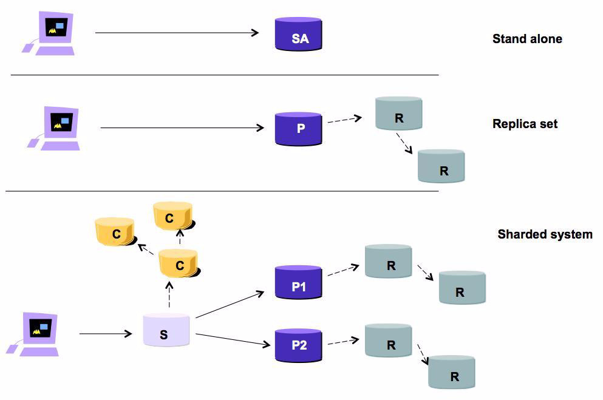

*Figure 11-1 MongoDB database server network topologies.*

Relative to Figure 11-1, the following is offered:

- There are three systems offered above, separated by horizontal lines. While cylinders are generally used to represent hard disks in these types of images, in this context they represent nodes (a distinct operating system server), hosting a MongoDB server instance.

- The topmost system is a stand alone (SA); only one copy of the data, no high availability. This might be a system used on your laptop, and not for use in production.

- The middle system displays a replica set .

• A primary database server (P), sends changes of the data to a read-only replica (R). (Technically, secondaries pull data from their source system.) The arrows are meant to indicate that a secondary may itself get its data from another secondary, producing less load on the primary. • By default, all client (end user) reads and writes are sent to the primary. • Variably, you may configure for client reads may be sent to a secondary. There are numerous configuration parameters that affect this behavior, which is a topic we will list as out of scope for this document.

- And the bottom section displays a sharded system ; multiple writable primary servers (P1, P2), each with a distinct subset of data. E.g., server P1 might contain data for one country, and server P2 another. This is one collection (one table), spread and writable across multiple hosts. Each P* server should themselves have replicas for high availability; these are the R servers.The C servers store configuration data, that is; how is this data partitioned ? The S server is a switch; a lightweight MongoDB that routes queries to the single or set of MongoDB servers that host the data being requested.

Based on your problem statement (multi-national private cloud), you may be looking at a sharded system. Why ?

- Based on data locality laws, you may need each country’s data to reside wholly within that given country. A sharded collection allows a single view of data across countries, while being to write to multiple hosts, each local to a given geography. In effect, the single collection is spread across nodes, across geographies.

- And then latency; if your collection resides in Asia Pacific and Eastern United States (US), even the best networks will have an access latency of 40-70 milliseconds. If you are Amazon.com like, in most cases your Japan customer will access and place orders on Japan hosted product, and not product from the US. Why not store the data where it would be most performant ?

> Note: Let’s take an aside and discuss storage engines-

While database servers may be known first for disk storage, (they are the persistence layer in the ubiquitous design pattern, Model-View-Controller, MVC), they are also intense calculation engines (CPU) performing complex analytics; sorting, summing, ranking, and more. And, database servers are well designed caching engines (RAM), generally achieving 95% or higher cache read rates, and high cache write rates.

Prior to release 3.0, MongoDB had one storage engine titled, MMapV1. MMapV1 is detailed here,

```text
https://docs.mongodb.com/manual/core/mmapv1/
```

By release 3.2, a new and default MongoDB storage engine arrived titled, Wired Tiger. Wired Tiger is detailed here,

```text
https://docs.mongodb.com/manual/core/wiredtiger/
```

The long and short of it is Wired Tired is more performant than MMapV1 on all but a very small number of usage patterns, and offers more features. In both cases, MMapV1 and Wired Tiger are expected to write to disk. It is only the disk, and not CPU or RAM, that is persistent across single machine failures, reboots, or related. Persistence is necessary.

But what if persistence were not necessary ? What if your data could easily be recovered from elsewhere, could your database run even more quickly ?

The answer is, Yes. By knowing you need not ever write to disk, you can provide shorter software product code paths, and your database can run even more quickly. In MongoDB parlance, you could have a 3 node replica set, where the primary has an in-memory storage engine (not writing to disk), and the replicas have a Wired Tiger storage engine (writing to disk for persistence, data recoverability). Upon reboot, the (primary) syncs (copies its data) from any secondary.

How to do the above was detailed briefly in the September/2016 edition of this document, section 8.1.2.

## 11.1.1 Cloud Computing, and as a Service (aaS)

Cloud computing (cloud) is a bit of an overloaded term; not entirely precise, and somewhat misused. Wikipedia.com defines cloud computing as “a type of Internet-based computing that provides shared computer processing resources and data to computers and other devices on demand”.

Source,

```text
https://en.wikipedia.org/wiki/Cloud_computing
```

With cloud we have nodes that may be rapidly provisioned, at lower cost (the provider achieving an economy of scale), and hopefully better managed, more resilient. A couple of more points relative to cloud:

- While you can contract to receive bare metal (access to a node just as you would have it in your own shop), it is measurably more common that you are contracting to receive a virtual machine (VM). With a VM, a layer of software (a type-1 or type-2 hypervisor) sits between you and the bare metal, and acts as a resource manager, providing you with a guaranteed subset (or superset) of a given amount of bare metal.

- At this point all you have received is a node, an operating system of your choice. To allow themselves to add further value, most (all) cloud providers offer additional software capabilities beyond cloud computing, beyond just virtual hardware. They offer Web servers, email servers, authentication servers, basically all that you need to host a given application.

Platform as a Service, PaaS Thus far in this discussion of cloud computing, you have received a virtual machine. Why is it that every of say 20 boxes you contract to receive would each need the very repetitive and error prone human activity to install and configure all of these software servers (Web servers, email servers, authenticaiton servers, yadda) ? Why can’t you just push a button on your application, and have it automatically deployed, automatically configured and integrated, automatically scaled and managed, automatically everything ? Well, that function is delivered by PaaS.

There are at least two highly competitive and rapidly evolving PaaS offerings; both are open source, Cloud Foundry and Docker, and we’ll focus on Cloud

```text
( http://www.CloudFoundry.org ).
```

Foundry

With Cloud Foundry, you must create your application compliant with a very specific set of design guidelines; namely, it must be a 12 factor application

```text
( http://www.12factor.net ).
```

One of the 12 factor guidelines states that your application must be stateless, that is; it can not read or write from the hard disk, the hard disk is expected to be ephemeral. (The application can receive data it would normally receive from the hard disk via network calls.) Why ? By breaking the dependency from the hard disk, the application can be restarted (or started, scaled), or migrated to a new node without concern. That’s very cool.

PaaS could operate in the cloud, or on (bare metal) located entirely within your own shop. Databases (MongoDB) are automatically wired (connected to) your

application as a user defined service , and operates outside of Cloud Foundry. Completing the discussion of PaaS would take many, many more pages.

Software as a Server (SaaS) Where first we had cloud computing, then PaaS, now we have SaaS. (Our ordering is such that we arrive at a fully functioning end user application last.) SalesForce.com is one such SaaS. When you contract with SalesForce.com, they manage every aspect of the application; install, configuration, tuning, backup and recovery, basically everything. You write a check, and get an IP address where your application resides. Also very cool if you’re in the market for a commercial off the shelf (COTS) style application.

## 11.1.2 MongoDB Operation Manager (Ops Mgr)

Now we have all of the pre-requisites in place to detail MongoDB Operation Manager (Ops Mgr). Ops Mgr is a 3-tier Web application, written by MongoDB and available as part of your MongoDB Enterprise Advanced software license. Further comments related to Ops Mgr:

- The 3 tiers to Ops Mgr are- • A MongoDB database server, which stores application configuration data. This database is normally referred to as the ‘appdb’ database. • A Web server which hosts the Ops Mgr application. This application uses the open source Jetty Java based servlet container (its all bundled and configured, and you will never see this level of detail), and a number of other software components. • And the third tier is your Web browser.

- The primary functions provided by Ops Mgr include- • Monitoring, with one example being a scatter plot of all routines (both end user and administrative) that are running on a given database server, which leads to an index and query advisor. E.g., my query is slow, which new index may I now require. Figure 11-2 displays a sample performance graph located inside the MongoDB Ops Mgr application.

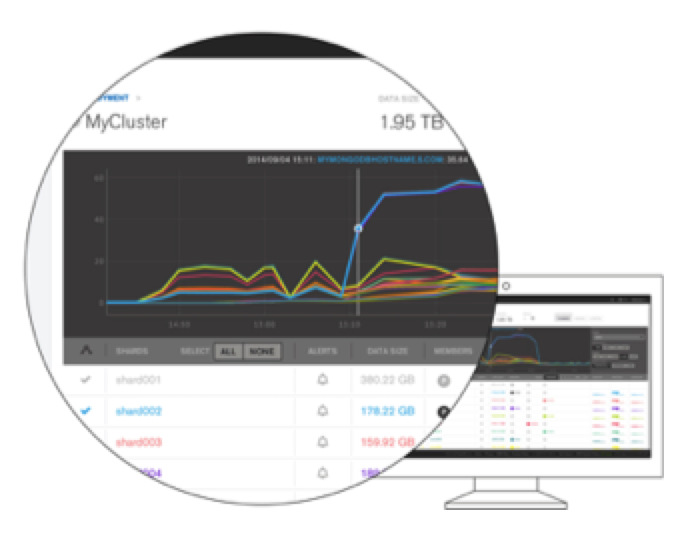

*Figure 11-2 Sample performance graph inside MongoDB Ops Mgr*

• Automation, with one example being provisioning. E.g., give me a new 3 node replica set with these exact parameters on these exact set of nodes. • Backup and recovery, here you configure to create the standard incremental data page backups along with the real time backup of the oplog (the transaction log file).

- 2 More databases and high availability- • When you configure backups though Ops Mgr, you create a net new database server to manage the data page backups, the second overall database server associated with the Ops Mgr application. This second database server is associated with a HEAD directory, a parent directory where the database data files are stored. This second database server is instantiated and then turned off as required automatically, and in the background. The backup of the oplog may be sent to another net new database server, the third and final overall database server associated with the Ops Mgr application.

Why 3 databases ? Isolation. In production you would likely want to spread this load and any potential single point of failure across numerous nodes. For test and development, these 3 databases may all co-locate on one node, in one MongoDB Database server. The backup of the oplog need not be sent to a database server, and may be sent to a block store on a filesystem (called a filesystem store). • High availability- Best practice would have you place a replica set behind any of the persistent database servers outlined above. And, the Ops Mgr application proper should have a load balancing router placed in front of it, configured for proper routing in the event of application failure.

- 3 more pieces of software- MongoDB Ops Mgr has 3 more pieces of software that complete it. Agents, these software programs operate as faceless daemons. • The Automation Agent is the only of the 3 agents that must be manually installed. Acting as a bootstrap program (and more), the automation agent can install and configure the remaining 2 Ops Mgr agents. The Automation Agent must be installed on each node that Ops Mgr will manage, or interact with. The Ops Mgr application communicates with each Automation Agent and directs each to do work on behalf of the Ops Mgr application. An example Automation Agent activity would be to change a given tunable and then start or restart a given mongod daemon as required. • The Monitoring Agent must be installed one per MongoDB cluster (one per replica set, for example). The Monitoring Agent pulls performance related data and events from each node in a given MongoDB cluster, and then serves as a distribution point for same. You can start multiple Monitoring Agents, but only one would be active per MongoDB cluster until (primary) Monitoring Agent failure. • And the Backup Agent performs activity related to backup and recovery. You can start multiple Backup Agents, but only one would be active until (primary) Backup Agent) failure.

- Figure 11-3 offers an architectural diagram to MongoDB Ops Mgr. The online documentation page hosting this diagram is located here,

```text
https://docs.opsmanager.mongodb.com/current/core/system-overvi
ew/
```

Online documentation for MongoDB Ops Mgr is located here,

```text
https://docs.opsmanager.mongodb.com/current/
```

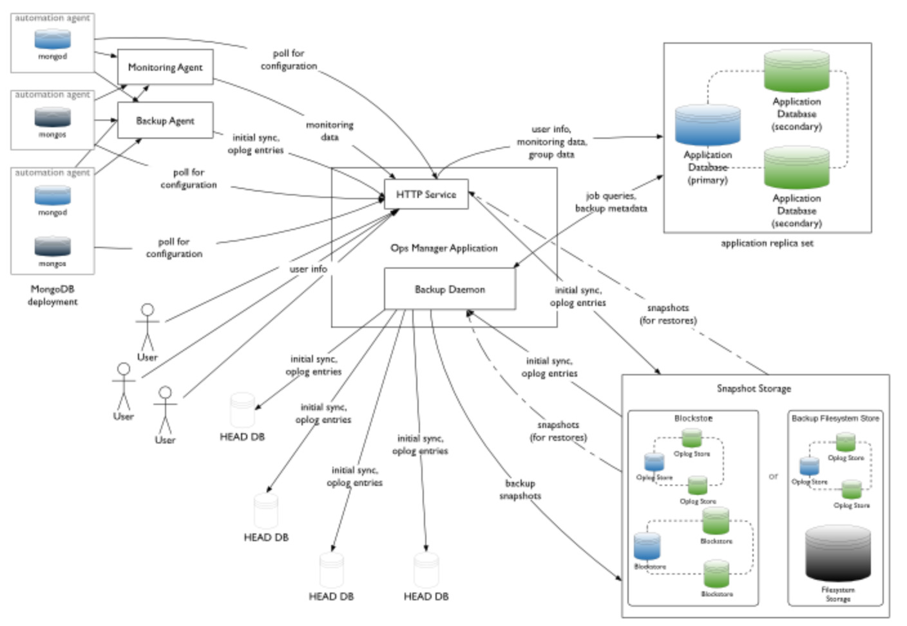

*Figure 11-3 MongoDB Ops Mgr architectural diagram.*

- Given our problem statement, is MongoDB Ops Mgr a fit ? Yes. Expectedly you will run a number of data bearing nodes in multiple countries which host the MongoDB database server proper. And, you will run a number of additional nodes to host the MongoDB Ops Mgr application itself, including its own set of database servers. MongoDB Ops Mgr can, as an application, run on premise , or in the cloud, or run as a hybrid , both on premise and in the cloud concurrently. And MongoDB Ops Mgr can manage systems that are both on premise, in the cloud, or hybrid. MongoDB Ops Mgr is part of a MongoDB Enterprise Advanced license.

## 11.1.3 MongoDB Cloud Manager (Cloud Mgr)

MongoDB Cloud Manager (Cloud Mgr) is 98% the same as MongoDB Operations Manager (Ops Mgr). As such, we will detail the primary differences.

With Cloud Mgr, the (Ops Mgr) application and its associated Ops Mgr application databases are hosted for you by MongoDB. (MongoDB hosts and manages the Ops Mgr application.) You could label this a SaaS installation, however since your end user application databases proper are still hosted on your gear (or your cloud), it might be best to label Cloud Mgr, Backup as a Service (BaaS).

We say backup above, but Cloud Mgr is the full (Ops Mgr) application; monitoring, automation, and backup.

Cloud Mgr is part of the MongoDB Professional and Enterprise Advanced licenses. With these licenses, you own the software. As a hosted service, there is an additional charge based on data volume . E.g., how much data are you backing up, restoring, and retaining. You only pay for what you use.

## 11.1.4 MongoDB Atlas (Atlas, a true SaaS)

Finally, with MongoDB Atlas (Atlas) we arrive at a full SaaS. With Atlas, you contract with MongoDB to host your entire MongoDB installation; all (or a portion, your choice) of your MongoDB databases, and an Ops-Mgr/Cloud-Mgr style interface.

The thought here being, we’re MongoDB, we created this database server software, and we’re really good at managing and maintaining it . Why not focus your innovation efforts on creating your application proper.

## 11.2 Complete the following

At this point in this document, we have an initial understanding of MongoDB Operation Manager (Ops Mgr); its physical components, its basic function (what does it do), and more. In this section, we will install Ops Mgr, configure it, create a replica set, set some tunables, and configure and perform a backup.

The following details any starting point for the steps we are about to complete:

- We have two (count) CentOS version 7.0 64 bit virtual machines with static IP addresses.

We ensured that all host names resolve; E.g., an

```text
ssh hostname
```

, finds the given remote host. We also added the capability to

```text
ssh
```

between nodes without a password, to aid in our productivity.

- We disabled the Linux firewall, only to save time and complexity. After the install and configuration, we’d turn this back on with only the proper ports open.

- Specific to the Linux platform, we have installed and configured a Linux

```text
munin-node
```

sub-system ( ) that allows Ops Mgr to report on operating CPU and disk statistics. See the following Urls for details,

```text
https://docs.opsmanager.mongodb.com/v2.0/tutorial/configure-mo
nitoring-munin-node/
https://www.howtoforge.com/tutorial/server-monitoring-with-mun
in-and-monit-on-centos/
```

- And to offer a greater level of documentation, we will state that we are generally following the instructions located here,

```text
https://docs.opsmanager.mongodb.com/current/tutorial/install-s
imple-test-deployment/?_ga=1.48123875.514616956.1461687856
```

## 11.2.1 Install a MongoDB database server to host the Ops Mgr app

As detailed above, MongoDB Operations Manager (Ops Mgr) is a 3-tier Web application, with a backing MongoDB database server that serves the application data. (No surprise there.) Comments:

- The directions we are following in the Url just above has us install a release 3.2 Community Edition MongoDB database server, in pretty much the default location and with a default port (27017). This is completed by adding to the Linux server’s Yum repository, with steps as follow.

- Edit and save a file titled,

```text
/etc/yum.repos.d/mongodb.repo
```

and add this block of text,

```text
[mongodb-org-3.2]
name=MongoDB Repository
baseurl=https://repo.mongodb.org/yum/redhat/7Server/mongodb-or
g/3.3/x86_64/gpgcheck=0
enabled=1
```

The above file is whitespace sensitive, so please do left justify all text as shown above.

- Then run a yum install via this command,

```text
yum install -y mongodb-org mongodb-org-shell
```

yum is the default package installer/modifier for CentOS, similar to rpm for RedHat Linux, aptget, and others. The above installs the latest stable version of the MongoDB database server, Community Edition, in the version 3.2 release family. And it installs the MongoDB Command Shell titled, mongo. At this point we have installed the database server software, but have not configured or started a database server instance.

- Before we can start a database server, we need to prepare a directory to contain its data files and related.

```text
mkdir -p /data/appdb
chown -R mongod:mongod /data
chmod -R 777 /data
```

- And then start the database server via the following,

```text
mongod --port 27017 --dbpath /data/appdb --logpath
/data/appdb/mongodb.log --fork --wiredTigerCacheSizeGB 2
```

This command is successful if you can run the MongoDB Command shell titled mongo, mongo show dbs exit

- Since we used a non-standard directory location to contain this database, we must edit the /etc/mongod.conf configuration file.

```text
vi /etc/mongod.conf
```

# Change these lines

```text
path: /data/appdb/mongod.log
dbPath: /data/appdb
pidFilePath: /data/appdb/mongod.pid
```

> Note: If the database server we created above does not restart, it may be restarted with a,

```text
mongod --config /etc/mongod.conf
```

## 11.2.2 Install the Ops Mgr application

The MongoDB Operations Manager (Ops Mgr) application may be downloaded from,

```text
https://www.mongodb.com/subscription/downloads/ops-manager
```

We downloaded the RPM for CentOS, and then installed via a, yum install -y *.rpm

As a program on the Linux hard disk, Ops Mgr is installed in,

```text
/opt/mongodb/mms/
```

A possible file you may wish to edit in the future is,

```text
/opt/mongodb/mms/conf/conf-mms.properties
```

> Note: Installing the

```text
mongodb-org
```

and

```text
mongodb-org-shell
```

packages created a new no login user titled,

```text
mongod
```

.

Installing the Ops Mgr application creates a no login user titled,

```text
mongodb-mms
```

.

## 11.2.3 Defect in CentOS version 7.0

A small defect exists in CentOS Version 7, and is documented on the install page Url. We need to edit a file and make one change before proceeding.

```text
vi /etc/init.d/mongodb-mms
```

# Change near line 55

```text
ABS_PATH="$( resolvepath $0 )"
```

# to

```text
SCRIPTPATH=/opt/mongodb/mms/bin/mongodb-mms
ABS_PATH="$( resolvepath $SCRIPTPATH )"
```

## 11.2.4 Now start the Ops Mgr application

We are now ready to start the MongoDB Operations Manager Web application via a,

```text
service mongodb-mms start
```

# The above starts this application. # # The next commands get its status, and the last will stop this app

```text
service mongodb-mms status
service mongodb-mms stop
```

This step is successfully done when you can login to the Ops Mgr application via a Web browser pointed to, http://localhost:8080 http://hostname:8080 # whatever your hostname is

Example 11-1 displays the sample and successful output from starting the Ops Mgr application.

### Example 11-1 Sample and successful output, starting Ops Mgr

```text
service mongodb-mms start
Generating new Ops Manager private key...
Starting pre-flight checks
Successfully finished pre-flight checks
```

```text
Migrate Ops Manager data
Running migrations... [ OK ]
Start Ops Manager server
Instance 0 starting............ [ OK ]
Starting pre-flight checks
Successfully finished pre-flight checks
```

```text
Start Backup Daemon... [ OK ]
```

## 11.2.5 Ops Mgr, first steps, creating an administrative user

Figure 11-4 displays the login screen to the Ops Mgr Web program. Because this is our first time accessing this screen, we must select, Register for new account.

> Note: The backing database to this Web application is running as user,

```text
mongod
```

.

```text
mongodb-mms
```

The Ops Mgr application itself is running as user, .

The user we are about to create is the administrator inside this application, with the ability to create additional users and groups.

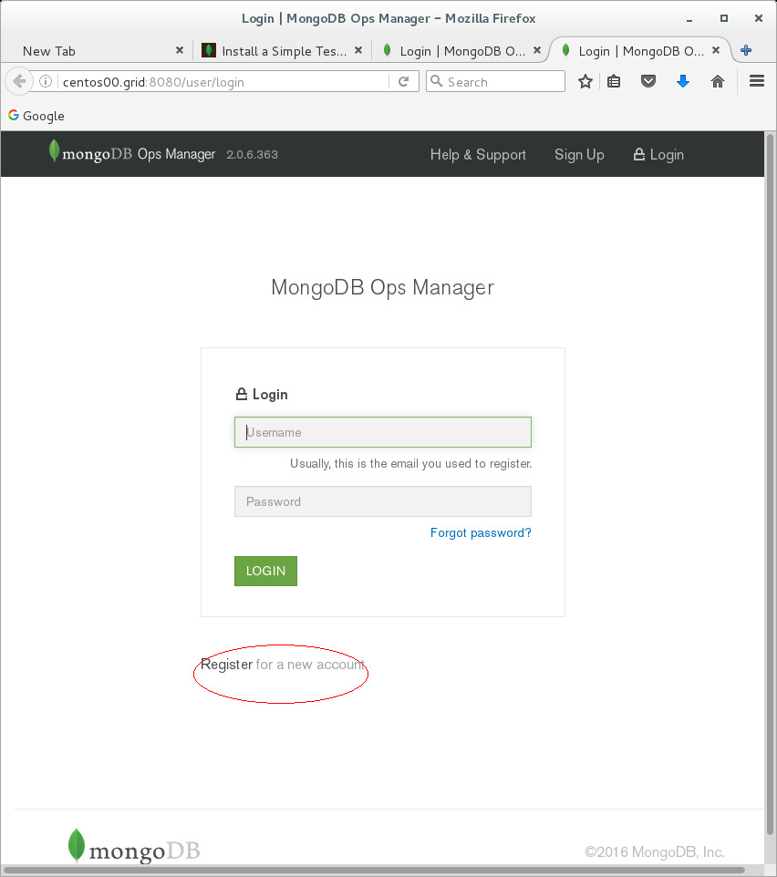

*Figure 11-4 Login screen to Ops Mgr Web program, first time*

Figure 11-5 displays the values we entered to create our new administrative user for the Ops Mgr application. If this is a net new install (ours is), you must chose, I want to create a new group, and enter a group name. The email address you supply is the (username) you will use to login.

> Note: Groups are super cool.

The very best Ops Mgr installations have multiple groups and assign a specific administrator account to any given application development group. In this manner, development groups may use the Ops Mgr Web application to self-serve, creating their own database server instances for testing and related. Very controlled (safe), and very cool.

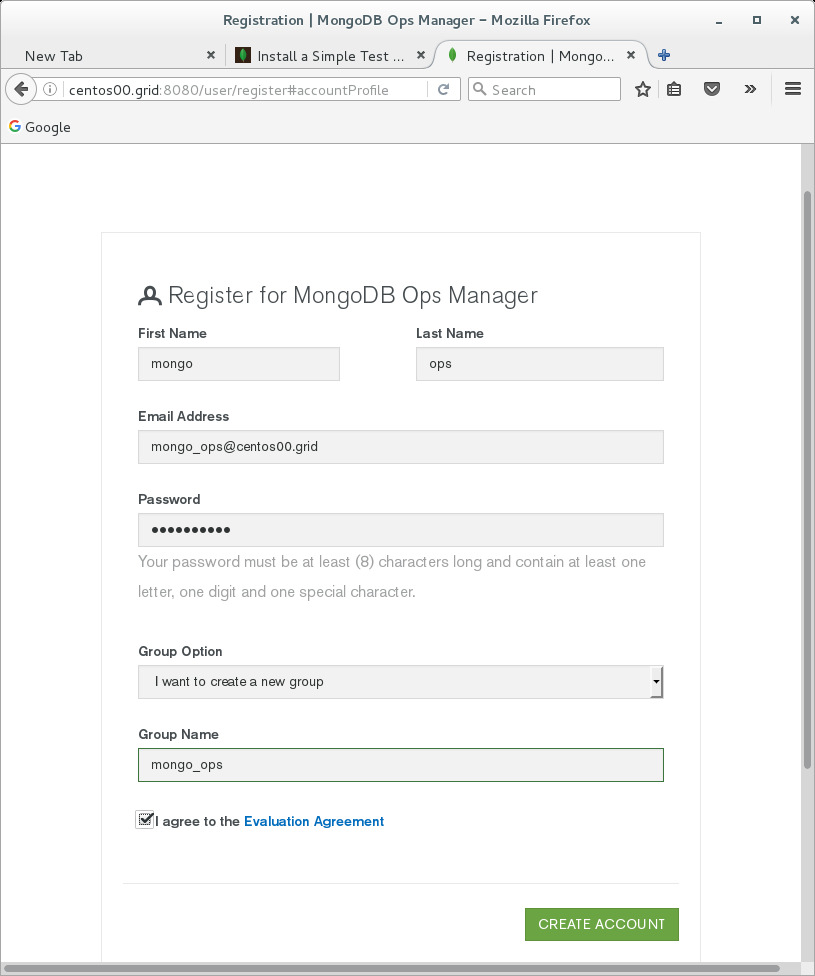

*Figure 11-5 Creating a new Ops Mgr administrator user account.*

## 11.2.6 Ops Mgr, first steps, initial configuration

At this point in the process, we are presented with a number of data entry screen forms where you configure the MongoDB Operations Manager (Ops Mgr) application. The list below details every required text entry field, and those we have specific interest in at this point:

- Url to Access Ops Mgr,

```text
http://centos00.grid:8080
centos00.grid
```

We entered the value, where is the name of our host that the Ops Mgr application is installed on.

- (Https PEM), is required to enable secure Http traffic. We left these fields blank for now.

- (Load balancer), if we were going to make the Ops Mgr Web application highly available, we would need a load balancing router in front of this application (this field), and more. For now, we will leave this field empty.

- (Email), form a set of required fields. If you are using a virtual machine with a hostname that Google Mail (for example), doesn’t trust, you will not be able to send or receive email from this host regardless. Still, these values are required. We entered,

```text
mongo_ops@centos00.grid,
smtps, imap.gmail.com
```

, and (port) 993 respectively.

Move to second page, click Continue.

- (Authentication), there is nothing we have to change on this page. By using the defaults, passwords will be stored in the

```text
appdb
```

database in the database server operating at the default port 27107, the database server we installed and started above.

Move to third page, click Continue.

- (Proxy server to access Ops Mgr application), is not required because we are operating essentially locally, entirely within a set of virtual machines that we control.

- (Twilio Integration), is one means that you can configure to have Ops Mgr alert you when given events occur in the life of both the Ops Mgr application, and the database server systems it monitors. We will skip this for now, and return later to demonstrate its use.

- (MongoDB Version Management), configures where Ops Mgr will pull MongoDB binary distributions from when you call to instantiate or then upgrade given database server installations. By default, Ops Mgr will pull binaries from the Internet. We will return later and configure this to use local binary files only. Why ? This is a security thing for some folks.

- (Backups), (Backup Snapshots), are additional features we will leave unconfigured at this time.

To complete configuration of the Ops Mgr application, click Continue.

Congratulations, you have now installed a net new MongoDB Operations Manager Web application. Let’s now move to using this administrative tool.

## 11.2.7 Using Ops Mgr, overview of main screen

Figure 11-6 displays the MongoDB Operations Mgr (Ops Mgr) main screen, just after an install and (minimum) configuration. We added three red circles to highlight given areas of this screen. A code review follows.

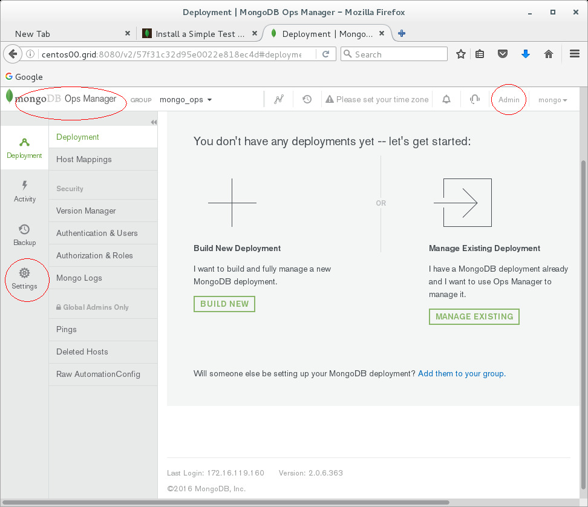

*Figure 11-6 Ops Mgr, initial screen post install and configuration*

Relative to Figure 11-6, the following is offered:

- In Figure 11-6, we are showing the Ops Mgr main screen at rest ; not in the middle of any particular activity. We drew 3 red circles to highlight specific controls on this screen.

- The red circle in the upper right leads us back to the configuration and control of the Ops Mgr application proper, access to most of the settings we set (or did not set) in the last section of this document.

- The red circle in the upper left returns us to this main screen, the ability to configure and control MongoDB database servers proper, which is the primary intent of the Ops Mgr application.

- The red circle in the bottom left highlights settings specific to this group . Ops Mgr groups offer a logical grouping of permissions and related to folks who will interact with (use) Ops Mgr. Ops Mgr groups are detailed here,

```text
https://docs.opsmanager.mongodb.com/current/tutorial/nav/group
s-users/
```

Using groups is not really required. In a best practice installation, individual development teams are given their own groups (with their own resources), so that they may self-serve, create and manage (version, test, other) their own database server systems.

- Because we have not yet used this Ops Mgr installation to create any MongoDB database servers, the middle portion of this screen prompts us to Build a New Deployment (create a new, never before existing MongoDB server system, either stand alone, replica set, or sharded system), or Manage Existing Deployment (inherit an existing MongoDB server system and begin to manage that). Either choice is valid. Below we will continue by creating a net new MongoDB server system.

## 11.2.8 Using Ops Mgr, create a net new replica set

As stated above, we could chose to inherit and then manage an existing MongoDB server system, or create a net new MongoDB server system. In this section, we will create a net new 3 node replica set.

- Click on, Build New Deployment

- Click on, Deploy in Other Remote What fun would it be if Ops Mgr could only work on our own (local) box ? By clicking on (Other Remote), we will begin the steps to deploy a 3 node replica set with database servers on 2 nodes; the first node will be shared with our Ops Mgr application, and then a second, much smaller node, so that this may all fit on our laptop.

- Click on, Create Replica Set Stand Alone, Replica Set, Sharded System, all should work on our laptop, although the sharded system might get a little tight if we aren’t careful. • For the Replica Set Name, we entered, centos00_rs. This name is used as an identifier in reporting and similar. • Number of Nodes, we left it at the default of, 3.

```text
/data/centos00_rs
```

• Data Directory Prefix, we entered, . This directory should exist and be writable by the user mongod on all nodes that will host this replica set. In past releases of Ops Mgr, this (install) process would hang if this directory did not exist; recoverable of course, but just an unnecessary delay. Don’t worry though, exact copy and paste commands are listed below by the install process itself. The only way this fails is if you fail to complete all steps.

• Click, Continue. This event produces the display as shown in Figure 11-7.

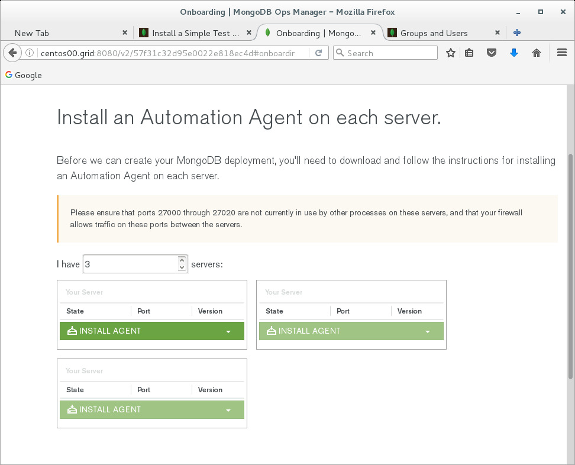

*Figure 11-7 Managing/installing Automation Agents screen.*

- We seek to create a 3 node replica set (the smallest size replica set), however, we only have 2 (operating system) nodes. So, step 1 click the, I have (n) servers, and change that value to 2. Then click, Install Agent. This action prompts you to select your operating system, and then produces the display as shown in Figure 11-8. A code review follows.

> Note: A note on agents-

In addition to all of the software installed above, there are 3 more pieces of software we need to introduce.

A (MongoDB Ops Mgr) Automation Agent must be installed and running on every node that Ops Mgr will manage. The Automation Agent will install and manage each of the 2 remaining agents; the Monitoring Agent, and the Backup Agent.

The Monitoring Agent will be installed and managed as needed, one per MongoDB cluster, by the Automation Agent. The Monitoring Agent has the task to pull performance (monitoring) data from each of the participating MongoDB (data bearing, and more) nodes.

The Backup Agent will be installed and managed as needed, one per MongoDB cluster, by the Automation Agent. The Backup Agent has the task to execute requested backup and restore operations.


*Figure 11-8 Instructions to install the Automation Agent.*

Relative to Figure 11-8, the following is offered:

- This dialog box is display only, meant to display the (manual) instructions to install the Automation Agent. This is a (manual) process, because nothing is expected to reside on any of these (data bearing) nodes; there is nothing that can initiate or bootstrap this install. As it turns out, in our specific example, we will install an Automation Agent on the same node that is hosting our Ops Mgr application, but this is not common. We repeat these same steps on each (data bearing) node to install the Automation Agent there. We have 2 nodes total, so we’ll do these steps twice, once on each node. • Download the Automation Agent. On each node (we have 2), execute a,

```text
curl -OL
http://centos00.grid:8080/download/agent/automation/mongodb-mm
s-automation-agent-manager-2.5.20.1755-1.x86_64.rhel7.rpm
```

This command copies the Automation Agent binary program from the Internet and places it in our current working directory. If you have Internet connectivity concerns, you could download this file via any means, scan it, and keep it in a safe location. • On each node execute a,

```text
yum install -y *.rpm
```

This command calls to install the Automation Agent. • There is a configuration file associated with the Automation Agent that we must add 3 values to, On each node, execute a,

```text
vi /etc/mongodb-mms/automation-agent.config
```

We need to set values to 3 of the keys in this file, namely.

```text
mmsBaseUrl=http://centos00.grid:8080
mmsGroupId=jjjjjjjd95e0022e818ec4d
mmsApiKey=lllllll7954ca24fa71dc819e3eafc0
```

These 3 values are ready to be copied from the dialog box as shown; your values will differ. • The remainder of this dialog box gives us the commands to copy to prepare the directories. On each node, execute a,

```text
mkdir -p /data/centos00_rs
chown mongod:mongod /data/centos00_rs
```

• Finally start the Automation Agent. On each node execute a,

```text
service mongodb-mms-automation-agent start
```

You can also do a,

```text
service mongodb-mms-automation-agent status
service mongodb-mms-automation-agent stop
```

- Click on, Verify Agent. A successful install is displayed in Figure 11-9. Notice each of our two nodes are represented in the display.

- Click on, Continue.

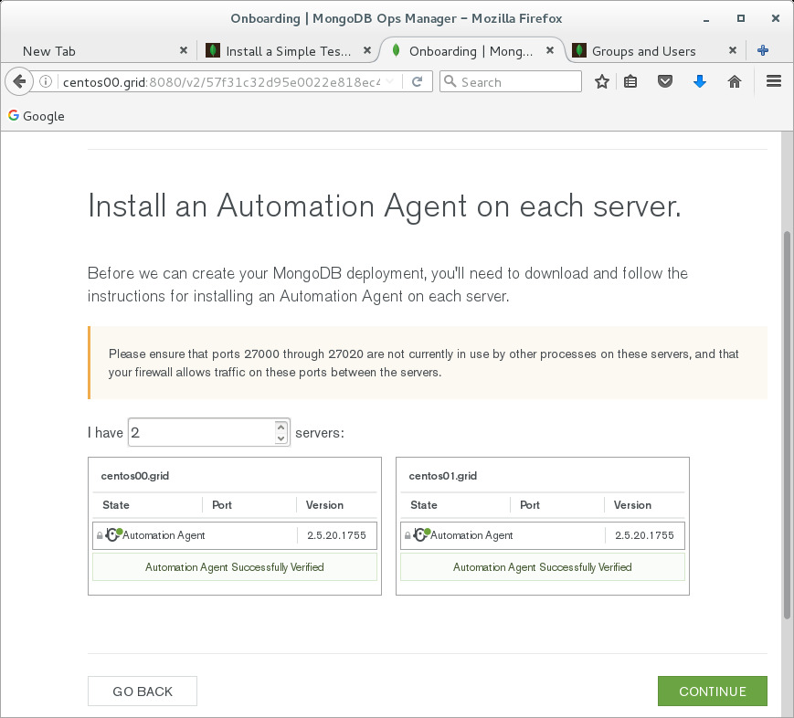

*Figure 11-9 Results of verifying the Automation Agents presence.*

- Figure 11-10 displays the last step before we finally deploy our requested 3 node replica set.

> Note: How did the Ops Mgr application in Figure 11-9 know we had two database server nodes ready for install (operation and maintenance) ?

Because the Automation Agents phoned home. The Automation Agents were configured with the Url (username and password) to interact with the Ops Mgr application, using the same Administrative API that the Ops Mgr Web application uses.

This same Administrative API is available for your use, and is documented at,

```text
https://docs.opsmanager.mongodb.com/current/api/
```

This display is active, and we can drag and drop the MongoDB (data bearing) nodes across the (host) nodes. Let’s drag and drop the single MongoDB (data bearing) node in the right column to the first node, centos00.grid, in the left column, and Click, Deploy. Example as shown in Figure 11-11.

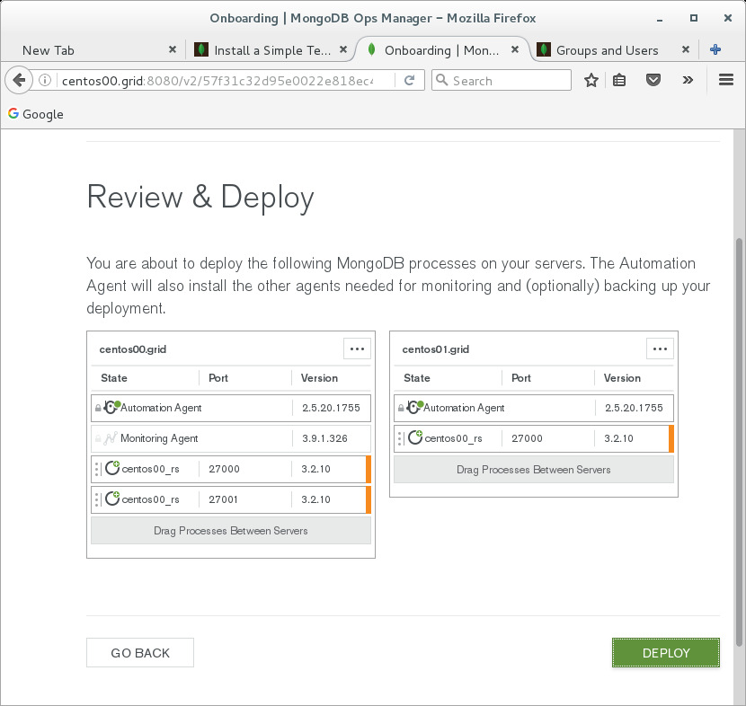

*Figure 11-10 Nearly final step before deploy of our replica set.*

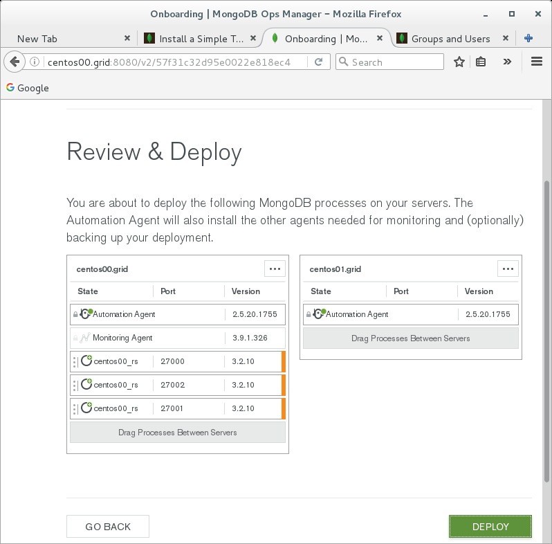

*Figure 11-11 Truly final step before we Click, Deploy.*

- Figure 11-12 displays our successfully deployed replica set. While the replica set is created/deployed in nearly sub-second time, it may take zero to (n) seconds before the Ops Mgr Web application observes this change. And, you may need to refresh your browser a number of times (if you are impatient to see this change).

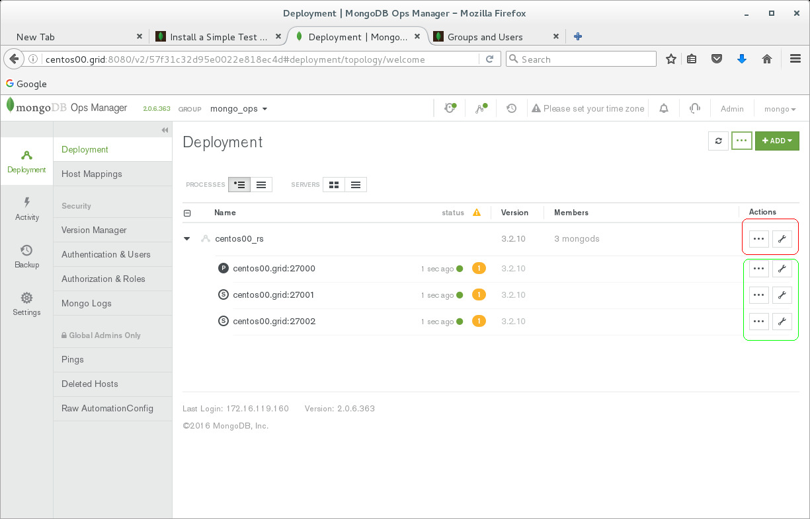

*Figure 11-12 Successfully deployed replica set via Ops Mgr.*

Relative to Figure 11-12, the following is offered:

- We see a 3 node replica set, with each of the 3 data bearing MongoDB nodes located on one of our operating system nodes.

- We drew 2 boxes on this display on the right hand side- • The green box shows visual controls where we can make changes to any of the individual MongoDB database servers (the wrench icon), or view any of its performance metrics and related (the ellipsis icon). • The red box shows visual controls where you can view or change the replica set in its entirety, that is; call to change all of the MongoDB servers in this cluster.

## 11.2.9 Add some data for testing

Before we makes changes to our replica set proper, let’s add some data so that me may observe that data being replicated.

- A common data set used in the MongoDB University courses is the Zips collection; approximately 40,000 City, State, Postal code documents. Download the

```text
Zips.json
```

data set from,

```text
http://media.mongodb.org/zips.json
```

- Open a terminal window and load the zips collection via a, mongoimport --port 27000 -d test_db1 -c zips zips.json --batchSize -1 The --batchSize is not required, and is offered only for safely. And the port 27000 assumes that your primary server (as opposed to stand -by, secondary servers), is still at port 27000.

- From a terminal window enter the following commands,

```text
mongo --port 27000
use test_db1
db.zips.count()
exit
mongo --port 27001
rs.slaveOk() # allow reads from secondary, not the default
setting
use test_db1
db.zips.count()
```

The above flow demonstrates a read from the primary, a count of the document we loaded above via

```text
mongoimport
```

. then we connect to a secondary, call to permit reads, and repeat same.

## 11.2.10 Using Ops Mgr to change our replica set

The use case we are presenting in this section is this:

- Add a fourth data bearing node to our existing 3 node replica set, and add it on a different operating system node.

- Let the newly added node above sync up, then disconnect it so it exists as a stand alone database server. The use case is creating a play space to test an application against a different version of the database server.

- Change this database server node’s tunables.

Complete the following:

- As stated above, there are icons for each database server node, and icons for the replica set as a whole. And there are icons to modify the settings (the wrench icon), and an icon for tunables and related (the ellipsis icon). We are going to add a new database server node to this replica set, which we do by clicking the wrench icon to the replica set, circled in red in Figure 11-13.

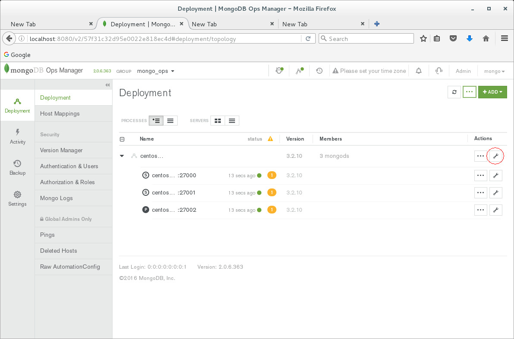

*Figure 11-13 Adding a node to our 3 node replica set.*

Clicking the wrench icon in Figure 11-13 produces the display in Figure 11-14. A code review follows.


*Figure 11-14 Editing the replica set configuration, part 1.*

Relative to Figure 11-14, the following is offered:

- We edited the “MongoDs Per Replica Set” from 3 to 4.

- We then scroll down farther into the dialog box, as displayed in Figure 11-15. A code review follows.

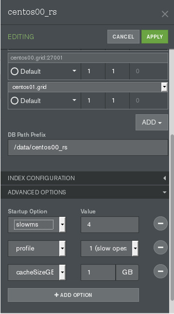

*Figure 11-15 Editing the replica set configuration, part 2.*

Relative to Figure 11-15, the following is offered:

- In the list for “Member Options”, a drop down list box starts with the default value of “Automatic” for our newly requested database server node. We currently have 3 replica set members on the operating system node titled, centos00.grid. We changed the value of “Automatic” to equal, centos01.grid, a net new node for us.

- Under the “Advanced Options” twistie, we Clicked the “+ Add Option” button 3 times. With each of these (options), a drop down list box lets us select from a number of tunables for each database server node. We chose these tunables and associated values:

```text
profile - 1
```

• , this setting will allow us to demonstrate another feature of Ops Mgr, that is; charting (slow) system and end user requests for service on an active scatter plot graph. •

```text
slowms - 4
```

, related to above, specifies to report on all requests for service that take 4 milliseconds or more to complete.

•

```text
cacheSizeGB (WiredTiger)- 1
```

, this setting sets the memory amount for the database server to cap at 1 GB. Normally the default value here is fine, however, because we are running numerous database servers per (operating system) node, we choose to dial this value back, (reduce from the default setting)

- Click, Review and Deploy, Confirm and Deploy. This action will cause Ops Mgr to cycle through the replica set (to avoid any observed end user application downtime), and enact the requested changes. Similar to above, these changes may complete before the Web browser hosting this Web application refreshes and notifies you of its completion. If you are impatient, you may choose to manually refresh your browser.

- Test your requested action- • From a terminal window enter, mongo --port 27000 --host centos01.grid rs.slaveOk() use test_db1 db.zips.count() exit • You should see the same number of documents in this collection as before; the data has been synchronized from any of the existing database server nodes to this newly requested database server node.

## 11.2.11 Disconnect any of the replica set nodes, change version

The continuation of our use case now has us taking any one of the 4 replica set database server nodes and promoting it to a stand alone. Then we will change the version of this database server, and presumably run software application tests.

Complete the following:

- For any of the nodes, Click the ellipsis icon and select, Remove from Replica Set.

- Click, Remove, Review and Deploy, Confirm and Deploy.

- When this process is completed (refresh the browser), use a terminal window to connect to this database server instance and check to ensure that all data is present.

- Click the wrench icon for this newly made stand alone database server instance and change its Version to a new value. We chose 3.2.6, different from the existing 3.2.10.

- Click Apply, Review and Deploy, Confirms and Deploy.

- Using a terminal window, enter the mongo program and enter the command, db.version(). Notice the returned value.

> Note: What is the point of this exercise ?

Development teams and administrators can use Ops Mgr to automate the change in binary version of their database servers so that they may test their end user applications more fully.

We demonstrated this capability graphically. There is also an administrative API to accomplish same detailed at,

```text
https://docs.opsmanager.mongodb.com/current/api/
```

## 11.2.12 Adding Alerts to Ops Mgr

The MongoDB Operations Manager (Ops Mgr) application has the means to send alerts to users when given events happen in the life of the Ops Mgr application proper, and the database server systems which its monitors and maintains. Events may be received via electronic mail, SMS messages, and more.

Complete the following:

- Twilio is a software as a service (SaaS) system we can use to test alerts delivered via SMS messages. Go to https://www.twilio.com/try-twilio and create a free account. You are done with this step when you leave with a, • Account SID • Authorization Token • And a (From) Phone number The remainder of these steps are to be completed in the Ops Mgr application.

- In the Ops Mgr application, Click the Admin button in the tool bar. This button is highlighted in red, in the upper right portion of the display in Figure 11-6.

- Click Ops Mgr Config, Miscellaneous, and move to the Twilio Integration area of the display. Enter the 3 specific Twilio related values detailed just above. And Click, Save.

- Return to the main area of Ops Mgr application proper. This is accomplished by Clicking the (MongoDB) Ops Manager button displayed in the upper left portion of the display in Figure 11-6, highlighted in red.

- Click on Activity, then the ellipses in the upper right portion of the display, then Click Alert Settings, then +Add, then New Alert. This creates the Create a New Alert dialog box displayed in Figure 11-16. A code review follows.

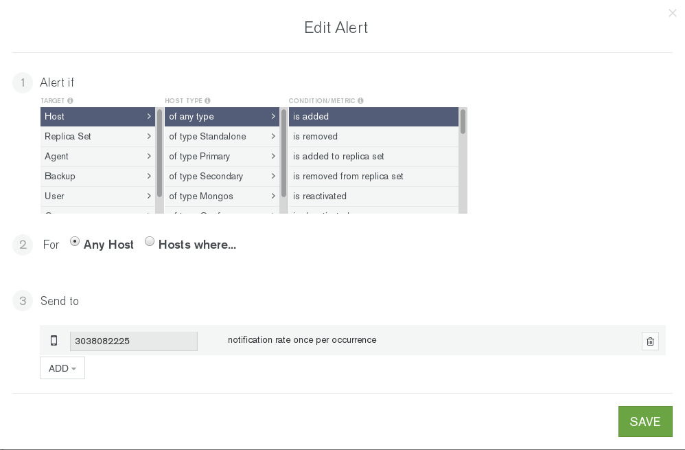

*Figure 11-16 Create a New Alert dialog box.*

Relative to Figure 11-16, the following is offered:

- In this display we have called for an SMS message alert to be initiated in the event that any database server node is added to the Ops Mgr managed system.

- From the display you can discern that Ops Mgr supports electronic mail message, SMS messages, and more, should Ops Mgr be so configured.

Complete the following:

- Follow the steps to complete the display in Figure 11-16.

- The Click, Save.

- Click, Deployment and complete the steps to add a net new database server node.

- Observe that you have received a new SMS message.

## 11.2.13 Using Ops Mgr monitoring capabilities

In this section we are going to detail use of a small portion of the Ops Mgr monitoring capabilities. In an earlier section we set the (application) profiling value to 1, and the slowms (milliseconds) values to 4. These settings are required to see the results we are about to observe.

Complete the following:

- From the main Ops Mgr screen, displayed in Figure 11-6, Click the ellipsis for the replica set (not for any specific database server node, but for the replica set), and Click Performance Metrics. Example as shown in Figure 11-17. Here we see we are currently reporting on the default metric, Ops Counter; essentially all of the system and end user requests made and received by the member nodes of the replica set.

- Experiment adding and removing other metrics.

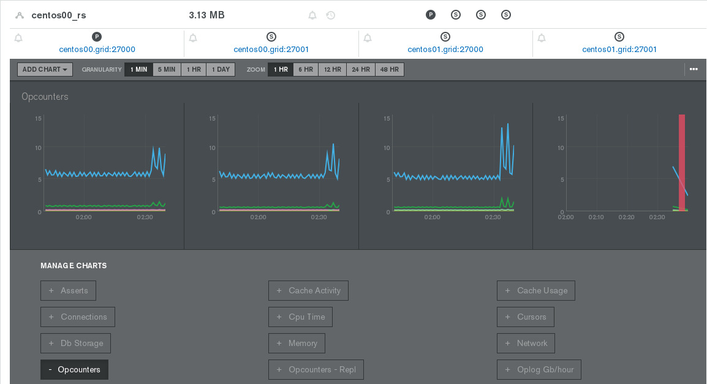

*Figure 11-17 Ops Mgr Performance Metrics for a replica set.*

- Click on the Deployment button in the upper left portion of the display. Observe which database server node in this replica set is Primary; which hostname and port number.

- Click on the ellipsis button for that same node and Click, Performance Metrics, Profiler, Profiling On. Then reload the Web page.

- Using a terminal window and the MongoDB Command Shell, enter the command as displayed in Example 11-2.

### Example 11-2 Query that should drive some above average load.

```text
use test_db1
```

```text
db.zips.aggregate(
[
{
"$group" :
{
"_id" :
{
"state" : "$state"
},
```

```text
"pop" : { "$sum" : "$pop" }
}
},
{
"$project" :
{
"_id" : 0,
"state" : "$_id.state",
"pop" : 1,
"nextGroupId" :
{
"$literal" : 1
}
}
},
{
"$sort" :
{
"pop" : -1
}
},
{
"$group" :
{
"_id" :
{
"id2" : "$nextGroupId"
},
"stateArr" :
{
"$push" :
{
"state" : "$state",
"pop" : "$pop"
}
}
}
},
{
"$project" :
{
"_id" : 0,
"stateArrTop" :
{
"$slice" : [ "$stateArr" , 5 ]
},
"stateArrBottom" :
{
"$slice" : [ "$stateArr" , -5 ]
```

```text
},
}
},
{
"$project" :
{
"allStates" :
{
"$setUnion" :
[
"$stateArrTop",
"$stateArrBottom"
]
}
}
},
{
"$unwind" : "$allStates"
},
{
"$project" :
{
"state" : "$allStates.state",
"pop" : "$allStates.pop",
}
}
] )
```

- After some period of time, the query above should display in the profiler scatter plot. Example as shown in Figure 11-18. A code review follows.


*Figure 11-18 Ops Mgr Profiler scatter plot, drag-able surface.*

Relative to Figure 11-18, the following is offered:

- This scatter plot is resizable via click and hold, and then stretch.

- When you hover over a given point, the right side of the display will then produce the given system or end user service request as registered.

- In Figure 11-18 we see evidence of the aggregate query we ran in Example 11-2.

- Experiment with the display including the calculate suggested index button.

## 11.2.14 Change to use local binary distributions

Currently our Ops Mgr installation will automatically download given (requested) MongoDB database server binary distribution versions from the Internet. This isn’t allowable at some customer sites. Fortunately, Ops Mgr is easily configured to perform this same action from a local (non Internet) repository.

Complete the following:

- Click the Admin button in the upper right portion of the display, then General, and Ops Manager Config.

- Scroll down to the section titled, MongoDB Version Management. • Change the Version Management Source to, Local. • And change, Backup Version Auto Download to False.

- Click, Save.

At this point we have called to install new (different versions) of MongoDB database servers from locally hosted distributions. But, none of these files are actually located on our local server. The procedure we are about to follow is documented at,

```text
https://docs.opsmanager.mongodb.com/current/tutorial/configure-local
-mode/
```

Complete the following:

- Download the binaries we wish to support from two Urls,

```text
https://www.mongodb.org/dl/linux/x86_64-rhel70
https://www.mongodb.com/download-center/enterprise/releases/ar
chive
```

- File naming is very important here. Example 11-3 displays the files we seek to load. And these files are to be kept in,

```text
/opt/mongodb/mms/mongodb-releases
```

This directory can be automatically pruned via the actions performed in Ops Mgr.

### Example 11-3 Creating a repository of binary distributions.

```text
mongodb-linux-x86_64-enterprise-rhel70-2.6.12
mongodb-linux-x86_64-enterprise-rhel70-2.6.12.tgz
mongodb-linux-x86_64-enterprise-rhel70-2.8.0-rc5
mongodb-linux-x86_64-enterprise-rhel70-2.8.0-rc5.tgz
mongodb-linux-x86_64-enterprise-rhel70-3.0.12
mongodb-linux-x86_64-enterprise-rhel70-3.0.12.tgz
mongodb-linux-x86_64-enterprise-rhel70-3.2.0
mongodb-linux-x86_64-enterprise-rhel70-3.2.0.tgz
mongodb-linux-x86_64-enterprise-rhel70-3.2.1
mongodb-linux-x86_64-enterprise-rhel70-3.2.1.tgz
mongodb-linux-x86_64-enterprise-rhel70-3.2.2.tgz
mongodb-linux-x86_64-enterprise-rhel70-3.2.3
mongodb-linux-x86_64-enterprise-rhel70-3.2.3.tgz
mongodb-linux-x86_64-enterprise-rhel70-3.2.4
mongodb-linux-x86_64-enterprise-rhel70-3.2.4.tgz
```

```text
mongodb-linux-x86_64-enterprise-rhel70-3.2.5
mongodb-linux-x86_64-enterprise-rhel70-3.2.5.tgz
mongodb-linux-x86_64-enterprise-rhel70-3.2.6
mongodb-linux-x86_64-enterprise-rhel70-3.2.6.tgz
mongodb-linux-x86_64-enterprise-rhel70-3.2.7
mongodb-linux-x86_64-enterprise-rhel70-3.2.7.tgz
mongodb-linux-x86_64-enterprise-rhel70-3.2.8
mongodb-linux-x86_64-enterprise-rhel70-3.2.8.tgz
mongodb-linux-x86_64-enterprise-rhel70-3.3.6
mongodb-linux-x86_64-enterprise-rhel70-3.3.6.tgz
mongodb-linux-x86_64-enterprise-rhel70-3.3.8
mongodb-linux-x86_64-enterprise-rhel70-3.3.8.tgz
mongodb-linux-x86_64-rhel70-3.2.0
mongodb-linux-x86_64-rhel70-3.2.0.tgz
mongodb-linux-x86_64-rhel70-3.2.1
mongodb-linux-x86_64-rhel70-3.2.1.tgz
mongodb-linux-x86_64-rhel70-3.2.2
mongodb-linux-x86_64-rhel70-3.2.2.tgz
mongodb-linux-x86_64-rhel70-3.2.3
mongodb-linux-x86_64-rhel70-3.2.3.tgz
mongodb-linux-x86_64-rhel70-3.2.4
mongodb-linux-x86_64-rhel70-3.2.4.tgz
mongodb-linux-x86_64-rhel70-3.2.5
mongodb-linux-x86_64-rhel70-3.2.5.tgz
mongodb-linux-x86_64-rhel70-3.2.6
```

- These same files should be copied to this directory as well, which acts as a cache of sorts,

```text
/var/lib/mongodb-mms-automation
```

In this directory, displayed in Example 11-4, the file name suffixes (the packing) of these distributions have changed. (We unpacked the file names from above.)

### Example 11-4 Creating a repository of binary distributions.

```text
mongodb-linux-x86_64-3.2.0
mongodb-linux-x86_64-3.2.0-ent
mongodb-linux-x86_64-3.2.1
mongodb-linux-x86_64-3.2.1-ent
mongodb-linux-x86_64-3.2.2
mongodb-linux-x86_64-3.2.2-ent
mongodb-linux-x86_64-3.2.3
mongodb-linux-x86_64-3.2.3-ent
mongodb-linux-x86_64-3.2.4
mongodb-linux-x86_64-3.2.4-ent
mongodb-linux-x86_64-3.2.5
```

```text
mongodb-linux-x86_64-3.2.5-ent
mongodb-linux-x86_64-3.2.6
mongodb-linux-x86_64-3.2.6-ent
mongodb-linux-x86_64-3.2.7
mongodb-linux-x86_64-3.2.7-ent
mongodb-linux-x86_64-3.2.8
mongodb-linux-x86_64-3.2.8-ent
mongodb-linux-x86_64-3.3.6-ent
mongodb-linux-x86_64-3.3.8-ent
mongodb-mms-backup-agent-3.9.1.382-1.rhel7_x86_64
mongodb-mms-monitoring-agent-3.9.1.326-1.rhel7_x86_64
```

- After populating the two directories above, move to another area of configuration on the Ops Mgr program. Under (MongoDB) Ops Manager, Deployment, Version Manager, you will be able to select (check or uncheck) only those distributions found to exist in the directories you prepared above. Example as displayed in Figure 11-19.

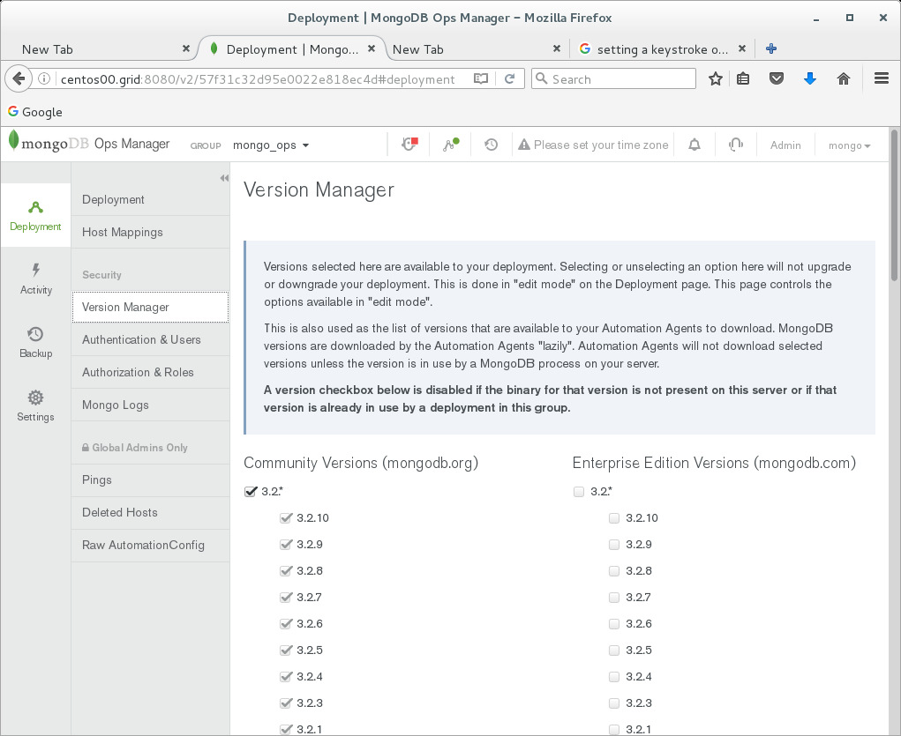

*Figure 11-19 Versions manager, allowing given binary versions.*

> Note: Give great notice to the file names in Example 11-3 and Example 11-4.

If you call for off line binary file distributions (non-Internet), and you do not satisfy all of the requirements (you’ve already installed version-x of MongoDB and then do not supply a version-x), your Ops Mgr application will not restart.

You will also find that you can not edit the supported versions as displayed in Figure 11-19.

A,

```text
service mongodb-mms start
```

will tell you the binary file distribution names you are missing.

- If you experiment with adding Custom Builds (beta software), you will at some point need the Git version value. You can get this value by unpacking the distribution to the point that you can run “mongod --version”, which reports this value.

- After any changes Click, Review and Deploy, then Save and Deploy. And then call to migrate any given database server node to one of your newly supported binary versions.

## 11.2.15 Configure backups, part 1

Thus far in this document we have not configured or created a backup of any of the (normal end user) databases we have created. MongoDB Operations Manager (Ops Mgr) can create backups and restore same, for both the data pages proper and any associated entries in the oplog (MongoDB’s transaction log file).

As a bit of an oddity, Ops Mgr can not be used to backup or restore the database that is itself serving the Ops Mgr application. Nor can Ops Mgr be used to tune or monitor the Ops Mgr database titled, appdb.

Figure 11-20 displays the first step in configuring and then using the backup and restore capability found inside Ops Mgr. A code review follows.

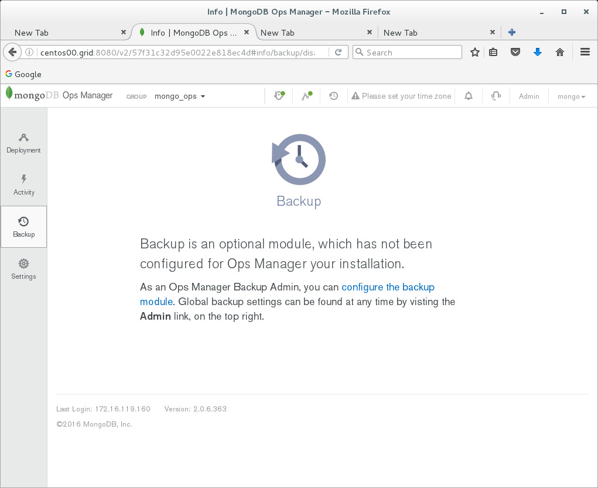

*Figure 11-20 Step 1 to configuring backups in Ops Mgr.*

Relative to Figure 11-20, the following is offered:

- In this image we have clicked the left side icon titled, Backup. This action produces the screen as shown in Figure 11-20.

- Next we Click the link titled, configure the backup module. This action produces the screen as shown in Figure 11-21. A code review follows.

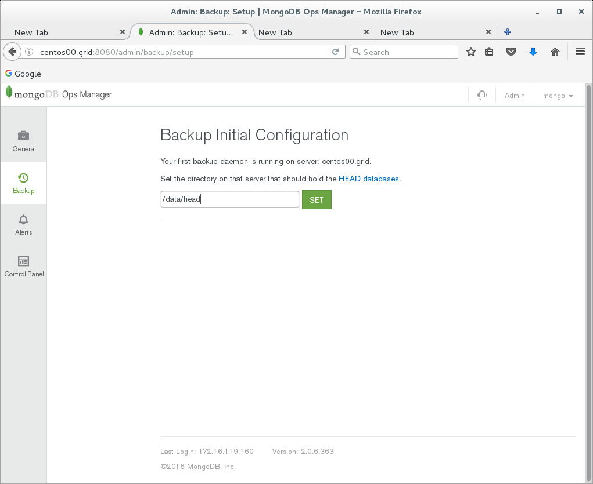

*Figure 11-21 Step 2 to configuring backups in Ops Mgr.*

Relative to Figure 11-21, the following is offered:

- As stated, MongoDB outputs two types of (data) that form a complete backup- • The data pages proper. • And the oplog entries that occur between the events of backing the data pages proper. Why ? Imagine that you make a backup at 2 PM, while continuing to make normal end user data modifications every second to your database server. Imagine that your server then fails at 2:40 PM. Should you accept the loss of all changes made to the database server since 2 PM ? No. Not only do you have replicas that will promote to primary and offer no loss in data or processing, but you also have the oplog entries which reflect changes made since, in this case, 2 PM.

Even if the replica set fails, you can still recreate this data set from the backup of the data pages proper and the entries made to the oplog.

- The data pages proper are written to a database server that is created for the express purpose of recording a copy of the (data pages proper). Automatically and in the background, a brand new never before seen database server instance will be stood up to receive and record these (data pages). After the backup of these (data pages proper) is complete, this (background) database server instance is shutdown and its resources released.

- All MongoDB database server instances write their collected data files to a given directory. This setting, the HEAD directory from Figure 11-21, says, ‘every time a make a backup, where is that new set of database server files written’. Every backup will create a new sub-directory within the HEAD, which contains the data files for that backup. This HEAD directory should exist, and be writable by the

```text
mongod
```

user.

- Enter a HEAD directory name and Click Set. This action produces the image in Figure 11-22. A code review follows.

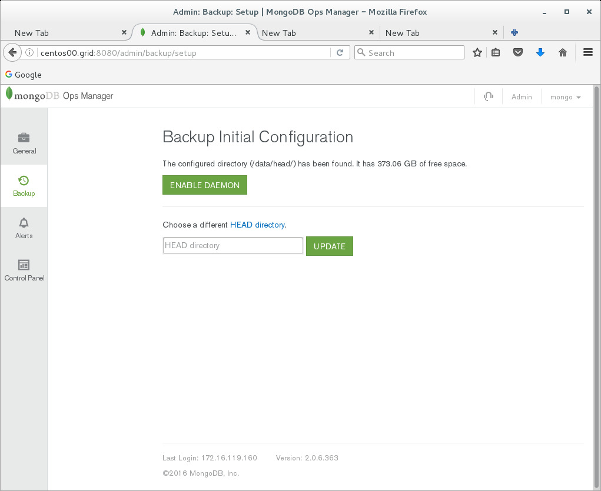

*Figure 11-22 Step 3 to configuring backups in Ops Mgr.*

Relative to Figure 11-22, the following is offered.

- Click the, Enable Daemon button.

- This action produces the displays as shown in Figure 11-23. A code review follows.

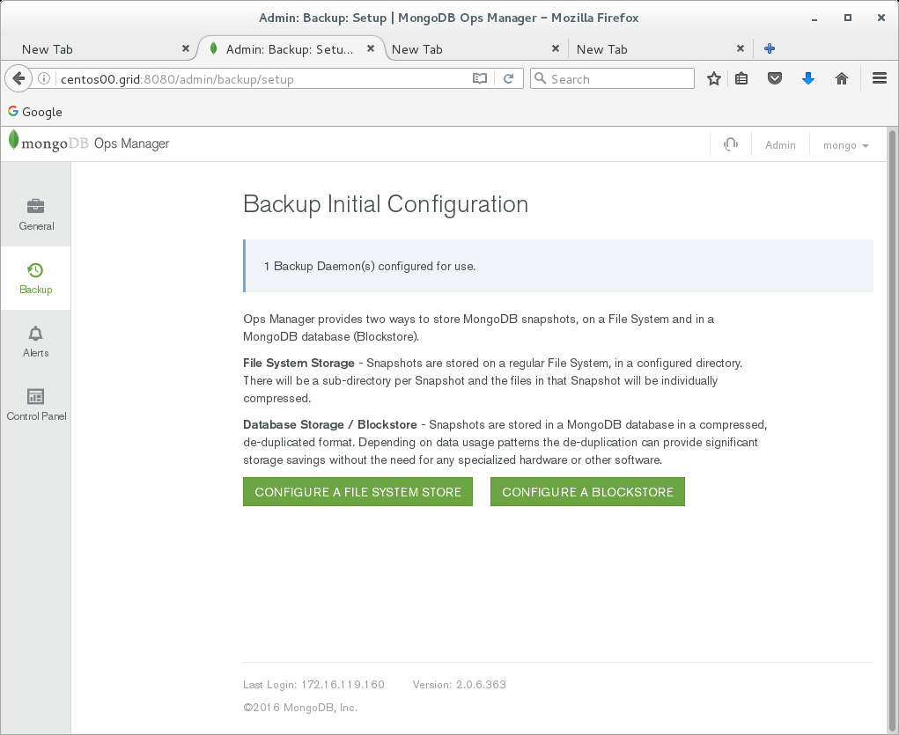

*Figure 11-23 Step 4 to configuring backups in Ops Mgr.*

Relative to Figure 11-23, the following is offered:

- The backup of the data pages proper is configured. In Figure 11-23 we are configuring where the newly received entries to the oplog will be backed up. This data may be sent to a database server or to the filesystem. IF this data is sent to a database server, this database server will be persistent; forever active. This is due to the nature of oplog entries, which are constantly arriving as end users perform work against the target database servers.

- In production you would not share the database server instance already in use by the Ops Mgr application proper, however, to save resource, that is exactly what we will do here.

- Click, Configure a Blockstore. This action produces the screen as displayed in Figure 11-24. A code review follows.

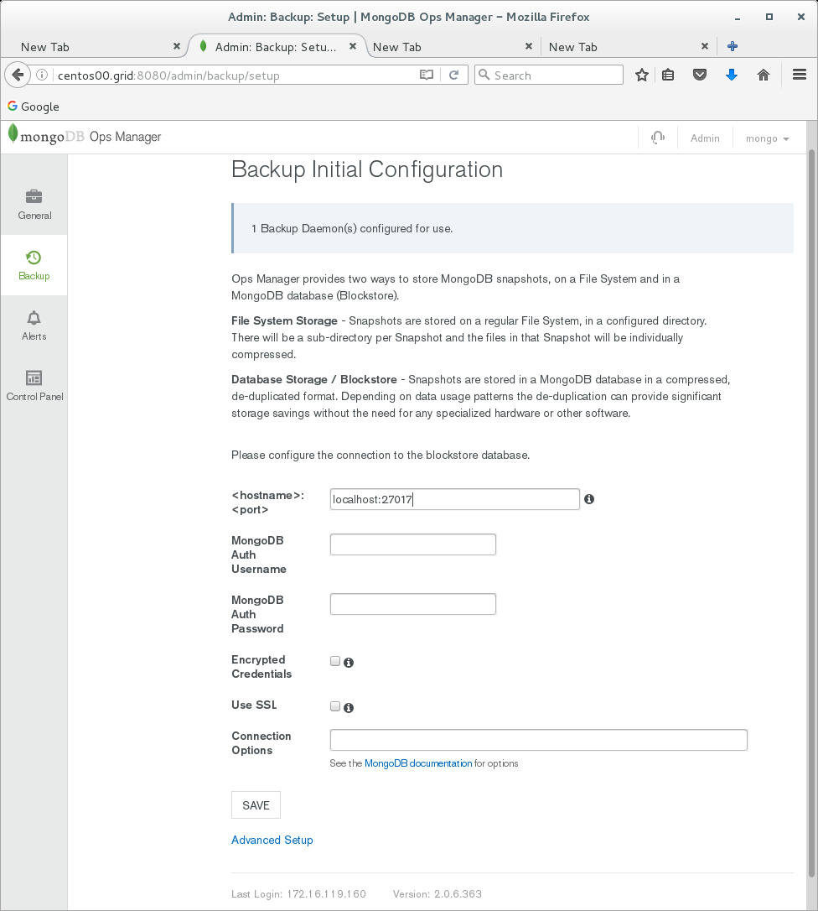

*Figure 11-24 Step 5 to configuring backups in Ops Mgr.*

Relative to Figure 11-24, the following is offered:

- The database server instance hosting our Ops Mgr application proper is residing at localhost:271017, with no passwords (no authentication, test only).

- In Figure 11-24, we configure the oplog backups to use this same database server instance.

- After this activity, we Click, Save.

This action produces the display as shown in Figure 11-25. A code review follows.

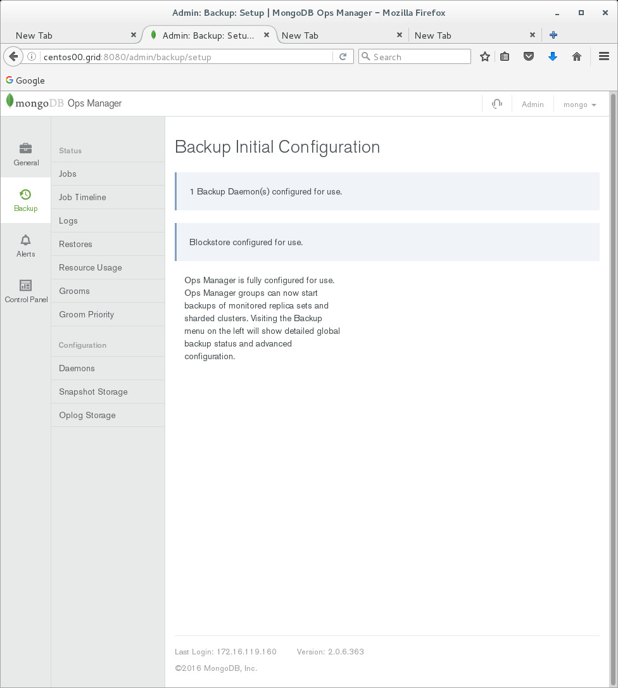

*Figure 11-25 Final step configuring backups in Ops Mgr.*

Relative to Figure 11-25, the following is offered:

- At this point in this document, the backup and recovery system to Ops Mgr is configured, although we have yet to call to actually make any backups. And we have yet to actually place (locate and install) the Backup Agent itself.

- If we click the Backup sub-menu again, we are prompted to configure the schedule with which backups should occur.

## 11.2.16 Configure backups, part 2

In Figure 11-26, we have clicked on the Backup sub-menu item, producing the image as shown.

A code review follows.


*Figure 11-26 Step 1 to configuring the Backup Agent.*

Relative to Figure 11-26, the following is offered:

- Click, Begin Setup, and then Click, Next, and then Click, ‘Install a Backup Agent: Deployment-Servers’. In effect we have deployed the Automation Agents, and a Monitoring Agent, but never a Backup Agent. Installing the Backup Agent is automated, but we have to tell the Ops Mgr where to install the Backup Agent, which node.

- This action produces the display as shown in Figure 11-27. A code review follows.

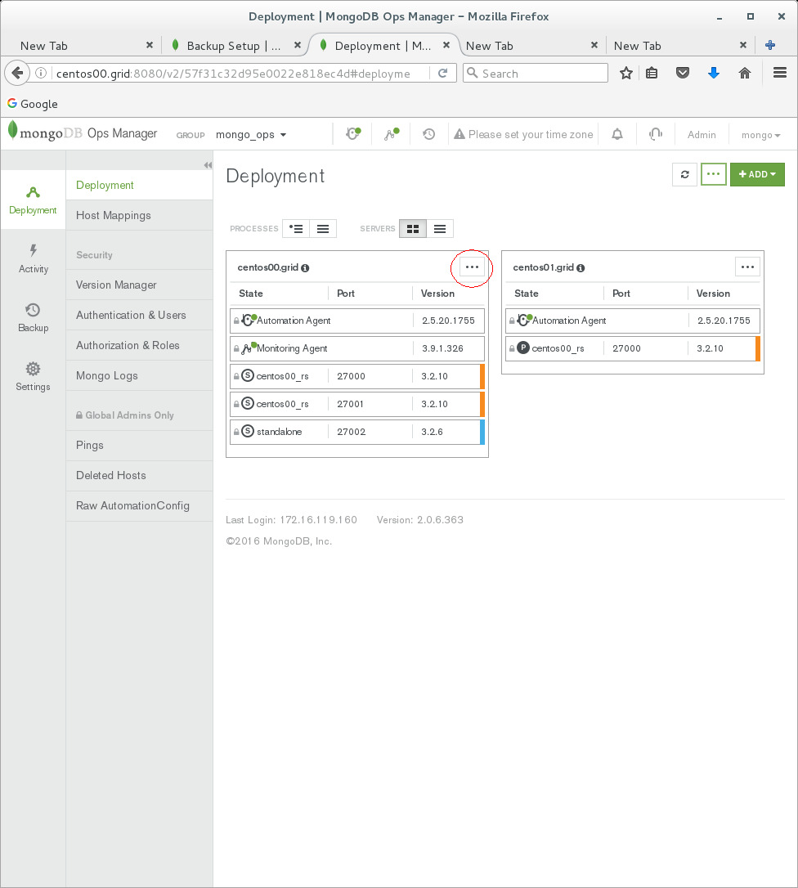

*Figure 11-27 Step 2 to configuring the Backup Agent.*

Relative to Figure 11-27, the following is offered:

- Click the ellipsis for either operating system node, highlighted in red, and Click, Install Backup Agent. Then Click, Review and Deploy, Confirm and Deploy.

- When the above is complete, re-enter the Backup sub-menu.

- Change the display to equal that as shown in Figure 11-28, and then Click, Start Backup. This action will call for your first Backup to begin. Based on our current data volumes, this task should complete quickly.

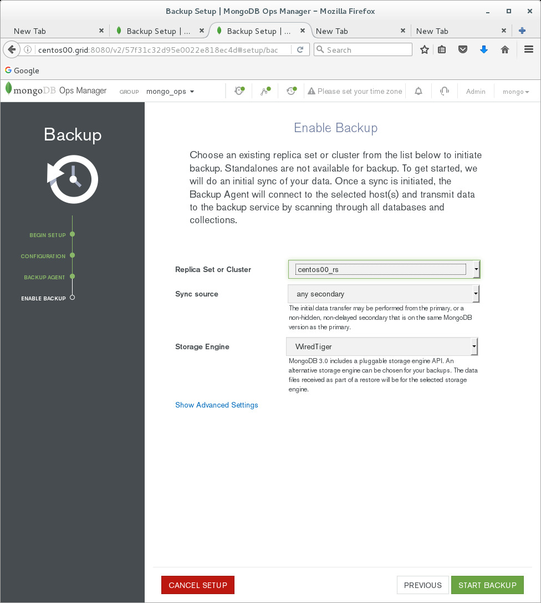

*Figure 11-28 Step 3 to configuring the Backup Agent.*

In Figure 11-29, we’ve moved to Backup, Job Timeline, and Search. In this context, Timeline means the point-in-time recovery timestamps available in this backup image.

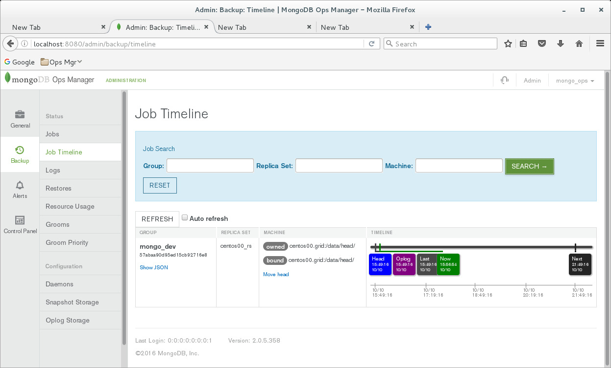

*Figure 11-29 Completed backup job under Job Timeline.*

## 11.2.17 Restore of image above

The menu item to restore comes from the restore image we created above via our call to backup. In Figure 11-30, a red circle highlights an ellipsis icon with several menu items, including restore. The restore menu item offers choice for; restore a snapshot (just the data pages proper), restore to a point in time, restore to a given oplog timestamp (which is a logical timestamp, event based).

Because this restore came from a replica set, you will be prompted to restore to an existing replica set, or more simply, just output an image that you can manually restore in any manner you prefer.

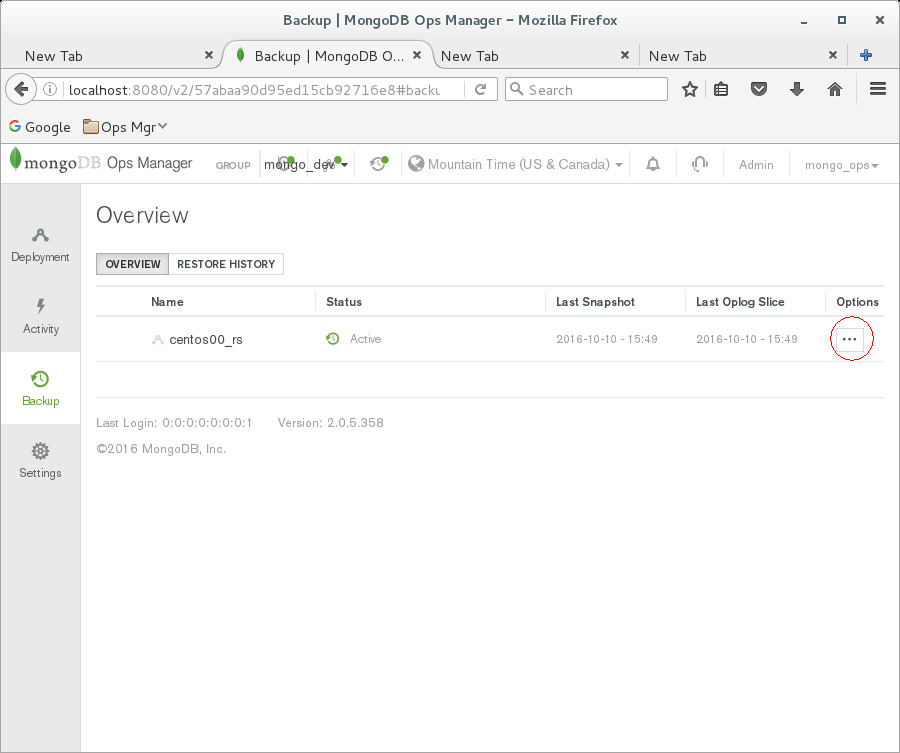

*Figure 11-30 Step 1 of restore.*

In Figure 11-31 we select, No I’ll do it myself, which leads to the image displayed in Figure 11-32.


*Figure 11-31 Step 2 of restore.*

In Figure 11-32 we enter the values as shown, and Click, Finalize Request.


*Figure 11-32 Step 3 of restore.*

As the result of the commands above, one of the database servers will be restored to the named/requested directory, (we called for /data/head2, which needs to exist and be writable).

After the restore completes, we can start a mongod for this directory. Example as shown in Figure 11-33.


*Figure 11-33 Final step, image restored and booted.*

## 11.3 In this document, we reviewed or created:

We provided a primer on MongoDB Operations Manager (Ops Mgr), MongoDB Cloud Manager (Cloud Manager) and MongoDB Atlas (Atlas). And we detailed the install, configuration and use of Ops Mgr to include; deploy a replica set, add data, do a small amount of tuning, and create and restore a backup.

### Persons who help this month.

Dave Lutz, and Shawn McCarthy.

### Additional resources:

Free MongoDB training courses,

https://university.mongodb.com/

This document is located here,

```text
https://github.com/farrell0/MongoDB-Developers-Notebook
```
