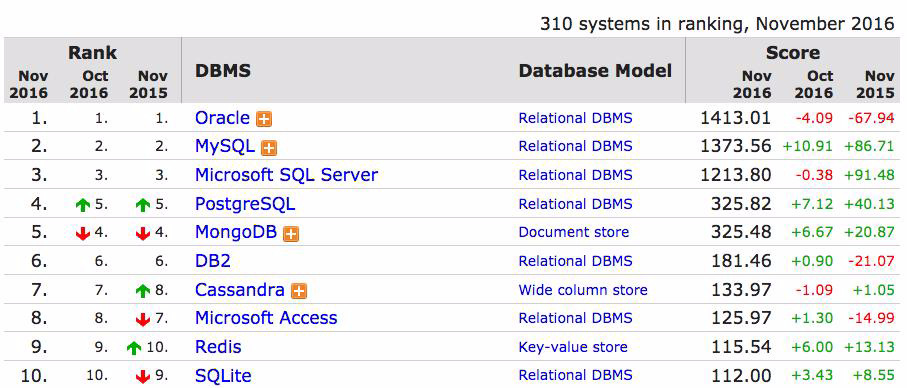
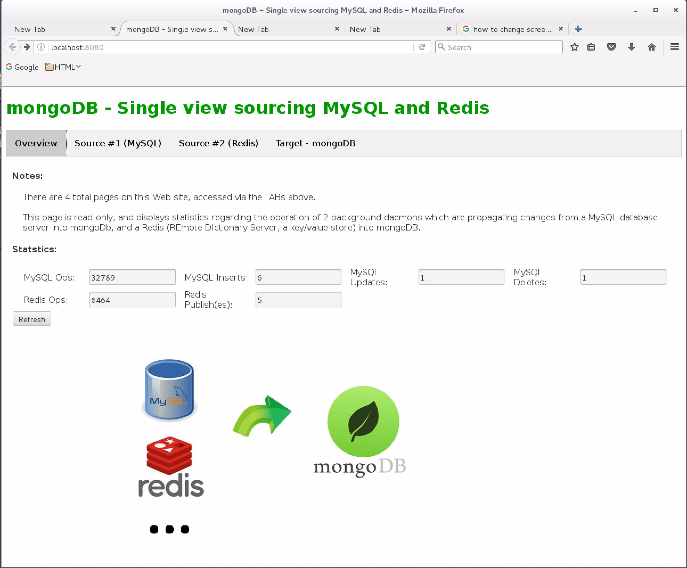
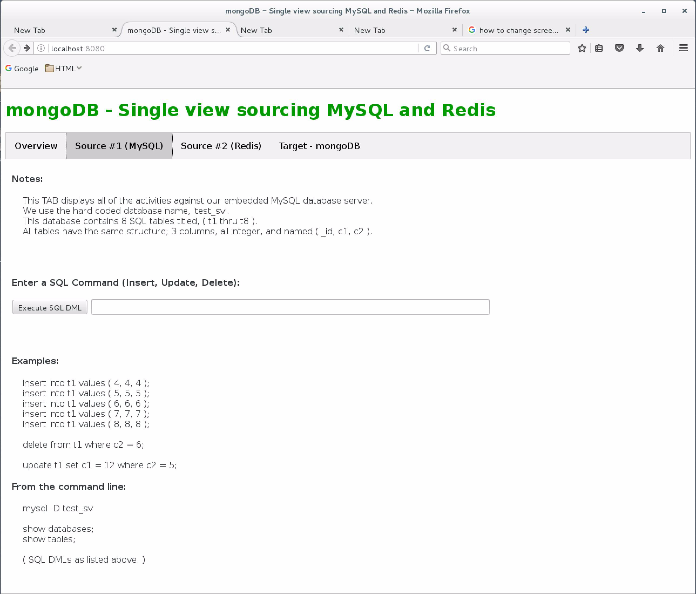
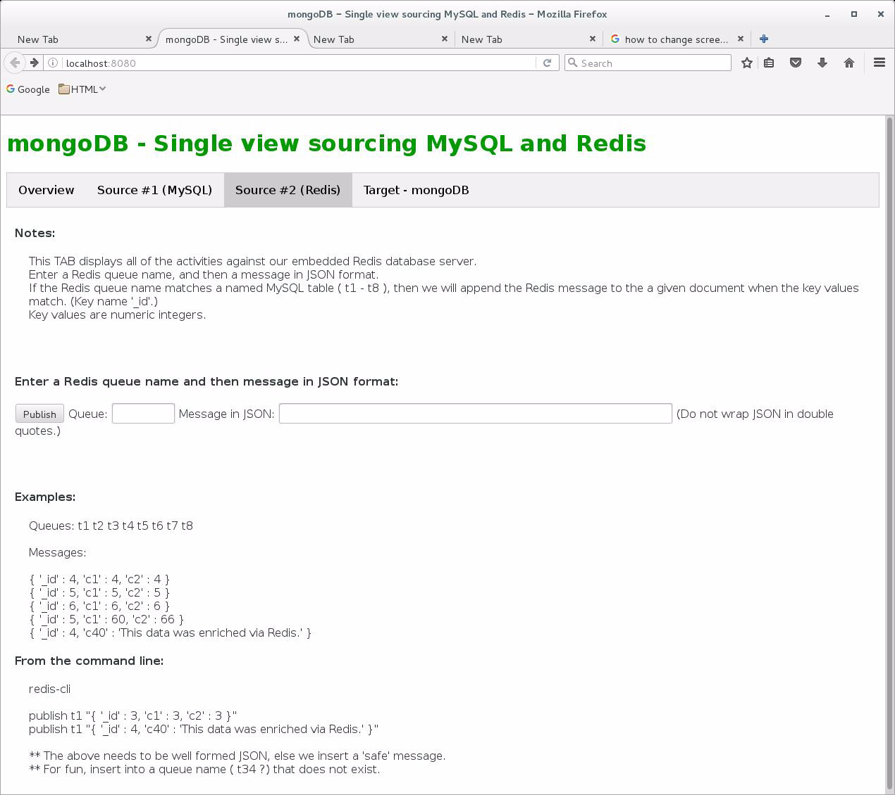
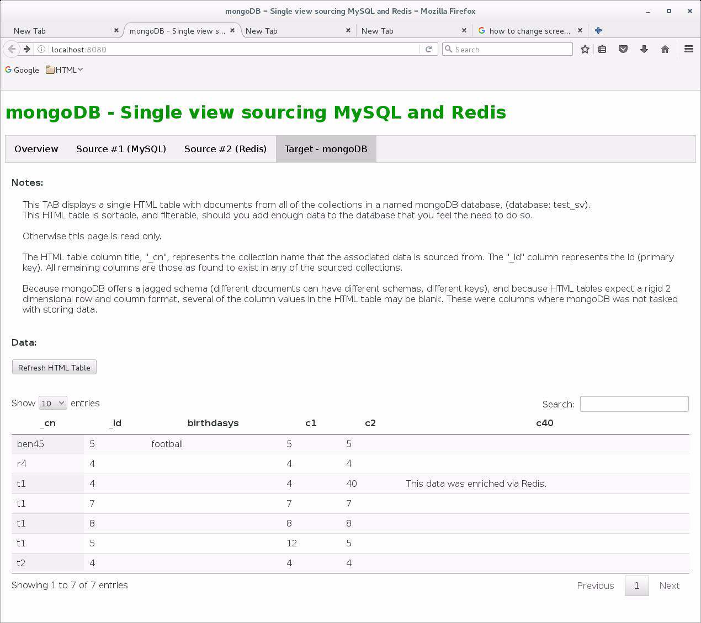

# December 2016: Single View

[Browse 2016](../README.md)

[Back to home](../../README.md)

Original PDF: [MDB_DN_2016_12_SingleView.pdf](./MDB_DN_2016_12_SingleView.pdf)

---
## Chapter 12. December 2016

Welcome to the December 2016 edition of mongoDB Developer’s Notebook (MDB-DN). This month we answer the following question(s); Through acquisition of several competitors, my company has numerous redundant order entry, processing and fulfillment systems. When a customer contacts us via phone or via the Website, any order the customer may have placed could reside in any of these systems, causing confusion, delay and error. We are looking at a master-data-management solution, with a 24 month design and delivery cycle that we find prohibitive. mongoDB lists this type of problem as single-view, and as one of the problems that your database server and its ecosystem help address. What can you tell me ? Excellent question ! Normally when writing this document we go to Wikipedia.com, to gather a sense of what others are saying on the given topic; an attempt to avoid any kind of myopic response. The Wikipedia.com entries on single view (customer) and master data management (MDM) are disappointing, and uncommonly incomplete.

```text
https://en.wikipedia.org/wiki/Single_customer_view
https://en.wikipedia.org/wiki/Master_data_management
```

In this article we will detail MDM, single view, and how many mongoDB customers choose to address this need. We detail creation and delivery of a change data capture solution from MySQL and Redis into mongoDB, just to pick two common legacy data sources.

## Software versions

The primary mongoDB software component used in this edition of MDB-DN is the mongoDB database server core, currently release 3.4. All of the software referenced is available for download at the URL's specified, in either trial or community editions. We also install, configure and use MySQL release 14.14 and Redis version 2.8.19.

All of these solutions were developed and tested on a single tier CentOS 7.0 operating system, running in a VMWare Fusion version 8.1 virtual machine. The mongoDB server software is version 3.4, and unless otherwise specified is running on one node, with no shards and no replicas. All software is 64 bit.

## 12.1 Terms and core concepts

The master data management, single view topic is certainly an instance where there are many means to address the same concern. To restate the problem, a company has numerous redundant end user application systems that fulfill the same purpose; multiple customer order entry systems, multiple billing systems, or similar. The negative impact to the business is that customer experience can be lacking; the customer contacts the company and can get transfered to multiple departments to receive service. Analytics can also suffer; if the customer (or whatever primary entity) has its data spread across numerous siloed data sets, it becomes harder gain insight into conditions or opportunities.

Take the pervasive design pattern of model-view-controller detailed here,

```text
https://en.wikipedia.org/wiki/Model%E2%80%93view%E2%80%93controll
er
```

We could state that each of these redundant application systems is expected to have 3 distinct sets of components:

- An end user interface, the view, expectedly a Web form or mobile device application.

- A (data) model, expectedly a database. This is where whatever the end user calls to make happen, is persisted.

- A controller. This piece of the application takes end user initiated events (button clicks, selected menu items, other), and then reads from or writes to a data store to make or accept changes. The controller sits between the model and the view and acts as a coordinator of states and events. The controller is generally custom software produced by a customer, written in Java, C#, Scala, Python, whatever.

> Note: When you want to integrate multiple redundant end user application systems, you might choose to do this work at the controller level, or (data) model level, or both.

MDM/single-view at the controller level Master data management (MDM) systems generally give focus to achieving this integration at the controller level, which is partially why they are so costly and complex to design and deliver. Any well designed controller level arrives as a well defined application programming interface (API) detailed here,

```text
https://en.wikipedia.org/wiki/Application_programming_interface
```

You need first to understand the API from each of the redundant systems involved (you need to understand the custom Java, C#, etcetera), each of which

could have hundreds of distinct API methods. Then you need to design and construct an additional API which can broker in a hub and spoke style of architecture, and sit above any of these systems and manage them (master data management), sort of a controller to the controllers.

MDM systems are not themselves pre-packaged solutions, like a database server, electronic mail server, other. The number, version and variety of source systems (the controllers that need to be controlled) are so vast, that no pre-packaged solution could be built to address every need. To a large part, you are buying consulting when buying an MDM solution, along with whatever intellectual property the given consulting firm can supply; E.g., if the consulting firm has previously provided an MDM solution, for example in the health care vertical market, then the consultant is likely to arrive with an amount of previously created program code and expertise that they can re-use. As every customer installation is different, every MDM solution is different and the end result is another custom application. There will no economy of scale to update said MDM solution in the future, as there is no standard product from which to move forward.

Further, as you design and deliver the MDM solution, the underlying systems may themselves be changing; their application code (their APIs), and even their data structures.

MDM/single-view at the data model level Where an end user application API can have hundreds of distinct methods, a database server really only has four; insert (write new data), update (change data that is already there), remove (delete data that is there) and query (read and report on data). Yes, a database server executes these four verbs over any number of lists of data, and possibly in unique combinations, but there are still only four primary verbs.

And, the list of possible data sources from which these four verbs need to run is measurably smaller; Oracle, DB2, MySQL and a rapidly declining set of further options. (Rapidly declining in terms of popularity.) Figure 12-1 below displays the November 2016 database server popularity ranking by DB-Engines.com. mongoDB and Postgres have traded the number 4 and 5 spots on this list many times in 2016.



*Figure 12-1 db-engines.com, November 2016, ranking of database servers.*

When you deliver MDM/single-view at the data model level, you need a means to copy data or pull from any of the legacy source systems into a central point, a central database; a hub and spoke style of architecture similar to above. Consider the following:

- If you only need a reporting system (read only access to the centralized data), and you can accept high latency data propagation (it is okay if the centralized data is up to 24 hours old), you could program batch jobs to, for example, copy data from Oracle, MySQL, MS/SQLServer and others into the central database.

- If you need a lower latency solution, for example sub-second latency to pull the change from the legacy database into a central database, this too is do-able. SQL databases offer triggers, which can record each insert, update and remove into local storage. Then a background daemon can perform micro-batches of updates from the legacy system into the central database.

> Note: Why triggers into local storage ? Triggers are generally synchronous, meaning; the trigger needs to complete in whole before the legacy insert, update or remove can complete. Triggers also generally lack a heterogeneous capability, meaning; they can generally only write to another database server of the same type, Oracle to Oracle for example.

Triggers produce additional load on the legacy database which is bad. One reason to replace a legacy database server is poor performance, and now triggers are adding to that problem.

- Another and better low latency solution is to tail the legacy database server transaction log file, and use this data stream to propagate changes to a central database. In short: • Database servers do not only write modified data pages. The changes to these data pages can span several hundred terabytes or more of disk. • Database servers generally perform dual writes. A second copy of the writes go to a transaction log file, which is a dense, single, consolidated record of the changes made to data pages and the database server as a whole. See,

```text
https://en.wikipedia.org/wiki/Transaction_log
```

The transaction log file exists to provide high availability. E.g., if you back up the database and its associated data pages at 2 PM, and also write changes to the database to the transaction log and back that up as soon as it fills every few minutes, you could suffer a complete failure at 3 PM and have a greater chance for full recovery to the data as it existed at 3 PM. • Commercial and even open source products exist just to tail (read and stay reading) transaction log files for most major database servers. This work is asynchronous to the normal work of the legacy database server, and also consumes low resource. As a topic, this category of software is generally titled, change data capture (CDC).

Legacy data sources detailed in this document To demonstrate single-view into mongoDB, this document will use the MySQL re- lational database server and the Redis (REmote DIctionary Server), networked in-memory key/value store. Both of these server systems, MySQL and Redis, are available in open source.

> Note: It took less than 1 hour of Googling to download, install, configure, test and prove a change data capture piece of software that sourced its data from MySQL.

It took another hour of Googling, download, install, configure and test the same for Redis, largely because it had been a while since we had used Redis.

One of the disadvantages of a SQL database server is rigid schema changes; all tables, and their columns and data types have to be defined before accepting any data. Any ongoing changes to the (schema) generally require a planned outage, an interruption in processing on the relational database server. For that reason, this document creates a small number of fixed SQL tables in MySQL, that we change data capture into mongoDB. (Fixed: rigid, predefined rows and column and data types).

Redis on the other hand is a key/value store, meaning; after a single key value (single identifier, primary key of sorts), the payload (the data proper) can be variable. This document takes that payload (a document in JSON format), and loads it into a mongoDB database with its polymorphic schema, meaning; through Redis we can demonstrate that the legacy data source can change, without any required changes or outages within mongoDB. This document even accepts new, never before specified table/collection names, that are created on the mongoDB side without outage or intervention.

Developers and operations folks; this document uses the Python programming language, since it is a choice most likely to be used by either camp.

Let’s begin.

## 12.2 Complete the following

At this point in this document, we have an initial understanding of:

- The MySQL relational database server, and that we have to propagate changes from the MySQL transaction log file to a remote destination, a mongoDB database server. We will install and configure an open source package to read the MySQL transaction log file, and create a single daemon program that pushes these changes to mongoDB.

- The Redis key/value data source, and that we have to perform the same function here.

Again, we will create a single daemon to listen for and push these changes to mongoDB.

- That we are using change data capture at the data model tier of model-view-controller to deliver a single view solution.

We detail our solution using a single node version 7 CentOS linux virtual machine. You can of course network this solution, but that’s not the point; we wish to detail getting it working first.

As a bonus, we will deliver and operate a Web application that details all of the activities in these two daemons, and allow a nice interface to prompt changes in MySQL and Redis. The first TAB of the Web application is displayed below in Figure 12-2. A code review follows.



*Figure 12-2 First TAB of four to our Web application, an overview page.*

Relative to Figure 12-2 the following is offered:

- The is TAB one of four in a Web page delivered with this document.

- The first TAB is read only, and displays details about the two background daemons the push changes from MySQL and Redis into mongoDB.

- The ‘ops’ columns displays each occurrence either of these two daemon programs loop to check for changes from the legacy source systems. These daemons programs are written to sleep 2 seconds between each attempt.

- The SQL Insert, Update and Delete columns display each operation of that type that were pushed to mongoDB.

- This page does not automatically refresh and the Refresh button supports that function.

Figure 12-3 displays the second TAB to our Web application, which allows access to MySQL. A code review follows.



*Figure 12-3 Second TAB of four to our Web application, access to MySQL*

Relative to Figure 12-3, the following is offered:

- This TAB is not read only, and allows you to enter and execute SQL statements against a MySQL database server.

- We only tested this TAB with SQL Insert, Update and Delete, but many more SQL statement types should work.

Inside the MySQL database are 8 (count) SQL tables titled, t1 through t8. Each table has the same structure with 3 (count) columns, all of type integer, and with the column names; _id, c1 and c2.

- The sample statements useful to test this overall system are pasted below, ready for a copy and paste, then execute.

Figure 12-4 displays the third TAB to our Web application, which allows access to Redis. A code review follows.



*Figure 12-4 Third TAB of four to our Web application, access to Redis.*

Relative to Figure 12-4, the following is offered:

- This TAB is not read only, and allows you to enter messages which are published to a Redis server message queue.

- The queue name you enter will place this data into an existing mongoDB collection name. E.g. queue name t1 enters data into a mongoDB collection titled t1. If you enter a queue name that does not exist as the same named mongoDB collection, that collection will be created for you automatically

within mongoDB. Very cool, and demonstrates mongoDB’s polymorphic schema capability.

- To allow us to write less program code when reading from Redis (this code exists in a Redis listening daemon we create below), we cheated. This system, the listening daemon, other, expect that the data you enter in the Message field will be JSON formatted. We could have used YML formatting, XML formatting, whatever, but we are most familiar with JSON since mongoDB uses JSON/BSON internally.

- Again to write less Redis listening daemon code, a message should have a primary key identifier and we hard coded the key name, “_id”, which is also the default in mongoDB. All of your messages should have that key field name. Programmatically we chose to always perform upserts into mongoDB. If your “_id” value matches a document in mongoDB, you will witness an update. If not, you will witness an insert. We didn’t bother to program deletes.

- The SQL tables have columns titled “_id”, c1 and c2. If your Redis message contains new column names and/or with new data types, you will again see the polymorphic schema capability of mongoDB, as these keys will be created on the fly. Very cool.

Figure 12-4 displays the final TAB to our Web application, which allows you to see what was actually inserted into mongoDB. A code review follows.



*Figure 12-5 Final TAB of four to our Web application, access to mongoDB.*

Relative to Figure 12-5, the following is offered:

- Primarily this is an HTML table. The table is sortable and filterable.

- The Refresh button calls to repopulate this data from mongoDB, in the event new data has arrived.

- The best use case here is to witness news keys (columns) that were added to mongoDB via a Redis message, or even new collections being added via the same route.

## 12.2.1 Install the MySQL database server

CentOS version 7 is an open source enterprise Linux distribution that arrives with a pre-configured repository (package) management system. Thus, you can install new software automatically if you know what package name to ask for. To install the MySQL database server we run a the following as displayed in Example 12-1. A code review follows.

### Example 12-1 Installing, starting, and using the MySQL database server.

```text
yum update
```

```text
wget http://repo.mysql.com/mysql-community-release-el7-5.noarch.rpm
```

```text
yum install -y *
```

```text
yum install -y mysql-server
```

```text
systemctl status mysqld
```

```text
systemctl start mysqld
```

```text
mysql
create database test_sv;
use test_sv;
create table t1 (_id int, c1 int, c2 int);
insert into t1 values (4, 4, 4);
```

```text
show databases;
show tables;
```

Relative to Example 12-1 the following is offered:

- The first 4 lines above install the MySQL database server.

- The next 2 lines including the Linux

```text
systemctl
```

utility check to see if the MySQL database server is running (initially it is not), and then call to start same.

- The line that starts ‘mysql’ places us in a SQL command shell specific to MySQL, and all of the lines that follow are SQL commands. These commands create a database and make it current, create a table and insert data. In effect, these are all install-verify commands. The ‘show’ commands are also diagnostic. We will use these combination of commands later.

At this point you have installed and used the MySQL database server. The default MySQL database server end user session listening port is 3306.

## 12.2.2 Install the open source MySQL log file capture

There are commercial and open source software packages to change data capture the MySQL transaction log file and push these changes to a remote system. We Googled, took the first hit, and were successful in getting this to work in under an hour. If we were putting this entire solution in production, we’d feel much more comfortable having a vendor to call for support.

The code we found is located on

```text
GitHub
```

at,

```text
https://github.com/noplay/python-mysql-replication
```

It looked to be a well created package, initially released in 2013, with numerous updates as recently as May of 2016. Steps to install and configure this code is detailed in Example 12-2. A code review follows.

### Example 12-2 Steps to install the open source change data capture piece to MySQL.

```text
pip install mysql-replication
```

```text
vi /etc/my.cnf
```

```text
Add these lines after lien that says "socket=",
```

```text
server-id = 1
log_bin = /var/log/mysql/mysql-bin.log
expire_logs_days = 10
max_binlog_size = 100M
binlog-format = row
```

```text
# Had to create the directory below-
```

```text
mkdir /var/log/mysql/
chmod 777 /var/log/mysql/
```

```text
service mysql restart
```

Relative to Example 12-2 the following is offered:

- “pip” is the Python installer program. We detailed above that we chose to use the Python programming language for this solution, since it is the language option most likely to be used by both developers and operations folks.

- After the install, we have to edit the named configuration file, and add the 5 lines as displayed. These 5 lines refer to a log file residing in a directory that did not exist for us. Thus, the following two lines correct that condition.

- And the last line calls to restart MySQL. If MySQL does not restart (it was already started), you introduced an error somewhere in this section.

At this point MySQL is configured to allow tailing of its transaction log file, and we have installed a Python programming library to access same. We have not yet written the application code to do this, and have a few more steps to complete before we are ready to do so.

## 12.2.3 Install the mongoDB server and client libraries to access same

We will assume you know how to install the mongoDB database server, and start it using all default values. From this point forward, we expect that a stand alone mongoDB database server is operating at the default mongoDB database server end user session listening port 27107.

In Example 12-3 we add two client program libraries which we use below. A code review follows.

### Example 12-3 Installing client side libraries for mongoDB and a Web server

```text
pip install pymongo
pip install bottle
```

Relative to Example 12-3 the following is offered:

- Again we use “pip”, the Python installer program.

- “pymongo” is the Python library to write client side programs that access a mongoDB database server.

- And “bottle” is a lightweight Web server framework we will use to host our demonstration Web application.

> Note: bottle is the same lightweight Web server framework used in the mongoDB University course, M101P, and others.

## 12.2.4 Install, configure and operate the Redis message server

Example 12-4 details the steps to install, boot, and install verify the Redis message server. A code review follows.

### Example 12-4 Steps to install, boot and verify the Redis message server.

```text
wget -r --no-parent -A 'epel-release-*.rpm' \
http://dl.fedoraproject.org/pub/epel/7/x86_64/e/
rpm -Uvh dl.fedoraproject.org/pub/epel/7/x86_64/e/epel-release-*.rpm
```

```text
yum install -y redis
```

```text
systemctl status redis.service
systemctl start redis.service
```

```text
pip install redis
```

```text
redis-cli ping
```

```text
redis-cli
publish t1 "{ '_id: 4, 'c1' : 4 , 'c2' : 4}"
```

Relative to Example 12-4 the following is offered:

- The first (two) lines are actually one command line so long, that it wraps on the display.

```text
“rpm”
```

is the actual second command, second line.

```text
“rpm”
```

and

```text
“yum”
```

perform the actual Redis install.

- The

```text
“systemctl”
```

lines check the status of the Redis server (initially it is not running), and then start it.

- The “pip” lines installs the Python client libraries to access Redis. –

```text
“redis-cli”
```

offers a Redis specific command shell, and the line that begins with the “publish” verb actually publishes a message to a queue titled, t1. The message we submit is JSON formatted and in this context must be wrapped in a pair of double quotes. The publish verb will return with a zero status code, since no subscribers are actively listening to this queue, but still a good test. The ping line will respond with a standard Redis pong response; a good thing.

At this point Redis is installed and operating.

## 12.2.5 Ready to program a CDC client, first for MySQL

At this point all of the pieces are in place to start delivering our single view application. Comments-

- We installed, configured, booted, and install-verified the MySQL database server.

- We installed, configured and started the MySQL change data capture agent, and programming libraries in Python to access same.

- We installed, configured, booted and install verified the Redis message server. We also installed the Python client side libraries to access same.

- And we installed programming libraries to access a mongoDB database server from Python, and a lightweight Web application server titled, bottle.

Now we are set to create the actual application program to capture changes from MySQL, and put them into mongoDB. Example 12-5 lists our completed program, and a code review follows.

### Example 12-5 Python language client program to CDC MySQL into mongoDB.

```text
#
# This program reads from the MySQL transaction log
# log file, and propagates changes into a mongoDB
# database server instance.
#
#
# Comments-
#
# . Version 0.58
#
# . This program was tested on CentOS 7 64 bit, and a
# Community Edition MySQL version 5.6.34.
#
# All database servers were local to one host, as was
# this test program.
#
# . This program uses the open source BinLogStreamReader
# available at,
# https://github.com/noplay/python-mysql-replication
#
# . The MySQL database server uses the default port
# number 3306, and expects a hard coded database
# name of test_sv.
#
# We only replicate SQL Inserts, Updates and Deletes,
# although the BinLogStreamReader supports most/all
```

```text
# MySQL events.
#
# We do replicate all source table names into
# the same named (collection) in mongoDB.
#
# . We also hard code our destination into MongoDB,
# port 27017, database name test_sv.
#
# . We didn't make restart of this program terribly
# robust; basically we start reading the MySQL transaction
# log file and replicate all observed changes.
#
# A production ready version of this program would
# be created to know where to restart.
#
# This program also does not check or expectedly
# handle log file rotations in MySQL.
#
# On restart, this program will read through the
# entire MySQL transaction log file one time, [ then ]
# start replicating. Thus, we only propagate changes
# that occur after this program starts.
#
# . To avoid sprawl on the mongoDB side, we start with
# a drop database (test_sv), which was the cheapest
# and easiest way to start fresh, all empty collections.
#
# . The syntax to extract the primary key names from SQL
# was do-able, but long. Thus, we cheated-
#
# - Inserts work.
#
# - Deletes use the entire width (entire set of column
# names and values) to perform a remove on mongoDB.
#
# - Updates, we perform a delete then insert.
#
# For production code, we should perform a proper
# modify on the mongoDB side. Again, we chose less
# code because it worked and proved our point.
#
# . While not required, having a MySQL table with a
# column titled '_id' will insert that _id value
# into mongoDB as the _id field. This saves having
# mongoDB system generated _id field which are
# longer/more-complex than inserting simple integer
# values.
```

```text
###################################################
```

```text
#
# Imports
#
```

```text
import time
```

```text
import MySQLdb
```

```text
from pymysqlreplication import BinLogStreamReader
#
from pymysqlreplication.row_event import (
DeleteRowsEvent, UpdateRowsEvent, WriteRowsEvent )
```

```text
import pymongo
#
from pymongo import MongoClient
```

```text
###################################################
```

```text
#
# Setup the MySQL database, 8 tables (t1 - t8), all
# with the same structure, cols (_id, c1, c2), all
# integer, with the first column being the primary
# key.
#
# A primary key is not required by this program.
#
```

```text
db_conn = MySQLdb.connect(host="localhost", port=3306)
#
db_curs = db_conn.cursor()
```

```text
try:
db_curs.execute("DROP DATABASE test_sv;")
db_curs.execute("COMMIT ;")
except:
pass
```

```text
db_curs.execute("CREATE DATABASE test_sv;")
db_curs.execute("USE test_sv;")
```

```text
l_tableNames = [ "t1", "t2", "t3", "t4", "t5", "t6", "t7", "t8" ]
```

```text
for l_tableName in l_tableNames:
db_curs.execute("CREATE TABLE " + l_tableName +
" (_id INT NOT NULL PRIMARY KEY, c1 INT, c2 INT);")
```

```text
#
# This insert is kind of bogus. If I started the
# loop below with zero data in the MySQL transaction
# log file, I got an error. Thus, insert one (bogus)
# row to overcome.
#
db_curs.execute("INSERT INTO t8 VALUES (-99, -99, -99);")
db_curs.execute("COMMIT;")
```

```text
db_conn.close()
```

```text
###################################################
```

```text
#
# Set up connections we use throughout the remainder
# of this program; the connector to the MySQL log
# reader, and the connector to the destination database
# hosted in mongoDB.
#
```

```text
mysql_host = {'host': 'localhost', 'port': 3306 }
```

```text
mysql_stream = BinLogStreamReader(connection_settings = mysql_host,
only_events=[DeleteRowsEvent, WriteRowsEvent, UpdateRowsEvent],
server_id = 1)
```

```text
mongo_host = MongoClient("localhost:27017")
mongo_host.drop_database("test_sv")
#
mdb = mongo_host.test_sv
```

```text
mdb.statistics.insert( { "_id" : 0, "mysql_ops" : 0,
"mysql_ins" : 0, "mysql_upd" : 0, "mysql_del" : 0,
"redis_ops" : 0, "redis_pubs" : 0 } )
```

```text
###################################################
```

```text
#
# This loop allows us to read the entire MySQL
# transaction log file and do nothing. In effect,
# we leave with the latest log file entry and its
# associated timestamp.
#
# Then the second loop below begins pushing any
# new changes to mongoDB.
#
```

```text
for l_event in mysql_stream:
g_timestamp = l_event.timestamp
```

```text
###################################################
```

```text
#
# Our second loop, and the one that actually pushes
# MySQL transaction log files changes into mongoDB.
#
```

```text
while True:
```

```text
time.sleep(2) # Endless loop, sleep to throttle
#
for l_event in mysql_stream:
```

```text
#
# An event above can have multiple rows.
#
for l_row in l_event.rows:
#
# Delete row event from the SQL side.
#
# Because the utility we are using reads
# the MySQL transaction log file then
# terminates, we set and check the timestamp
# of the last transaction we ever processed.
#
if isinstance(l_event, DeleteRowsEvent):
if (l_event.timestamp > g_timestamp):
l_vals = l_row["values"]
l_table = l_event.table
#
```

```text
mdb[l_table].remove(l_vals)
#
mdb.statistics.update( { "_id" : 0 },
{ "$inc" : { "mysql_del" : 1 } } )
#
# To save code, we delete then insert on
# update. This could be omptimzed.
#
elif isinstance(l_event, UpdateRowsEvent):
if (l_event.timestamp > g_timestamp):
l_valsA = l_row["after_values"]
l_valsB = l_row["before_values"]
#
mdb[l_table].remove(l_valsB)
mdb[l_table].insert(l_valsA)
#
mdb.statistics.update( { "_id" : 0 },
{ "$inc" : { "mysql_upd" : 1 } } )
#
# Insert event.
#
elif isinstance(l_event, WriteRowsEvent):
if (l_event.timestamp > g_timestamp):
l_vals = l_row["values"]
l_table = l_event.table
#
mdb[l_table].insert(l_vals)
#
mdb.statistics.update( { "_id" : 0 },
{ "$inc" : { "mysql_ins" : 1 } } )
#
# Add more events here; create index, yadda.
#
```

```text
g_timestamp = l_event.timestamp
#
mdb.statistics.update( { "_id" : 0 },
{ "$inc" : { "mysql_ops" : 1 } } )
```

```text
mysql_stream.close()
```

Relative to Example 12-5 the following is offered:

- We titled this program, 10_MySQLCDC.py, and it is a Python program.

We can run this program with a, python 10_MySQLCDC.py A daemon program, this program does not exit; it will run forever. Hit Control-C (Interrupt) to quit.

- This program file has 278 total lines of code, of which more than 100 are comments. Thus, 180 lines to deliver inserts, updates and deletes from MySQL into mongoDB; about 2 pages when printed out.

- The first block of code includes a number of library import statements, including one titled,

```text
BinLogStreamReader
```

.

```text
BinLogStreamReader
```

is the open source MySQL change data capture library we downloaded from GitHub above.

- The next block of code begins with the line,

```text
“db_conn =”
```

. Comments include: • Besides connecting to MySQL on the default port 3306, we drop the MySQL database titled,

```text
test_sv
```

and re-create it. This is not required. We use this step to nuke for morbid; always start this program from a point of known consistency. • We remake the database, and create 8 (count) SQL tables titled, t1 through t8. The tables all have the same structure; 3 numeric integer columns titled, “_id”, c1 and c2. The column titled “_id” is made the SQL primary key, not null.

> Note: To save code volume, we cheated. The key value name “_id” has special significance inside mongoDB; it is the default mongoDB primary key name.

By lining up these columns names, we save having to write more code.

• We insert one (dummy) record into the SQL table titled, t8. Also a cheat; by having at least one record in the MySQL transaction log file, we can more easily get a timestamp into this data structure. This is something we need to when we iterate through this structure.

- The next block of code begins with the line,

```text
“mysql_host =”
```

. Comments include: • This block creates a second connection to MySQL, the one that will actually read from the MySQL transaction log file. • And we drop and recreate the mongoDB database titled,

```text
test_sv
```

. Same idea as above; nuke the (destination) database, and start from a point of known consistency.

• We also make one collection in mongoDB to store statistics; how often this and other programs loop, and perform given activities.

- The next two line block of code begins with a, “f

```text
or l_event in
mysql_stream:”
```

Here we are looping through the MySQL transaction log file merely to reach the end. We want the very last timestamp in this data structure, a timestamp we will maintain going forward as a pointer into this (file).

- Finally we have reached the meat of this program, which begins with a,

```text
“while True:”
```

• Basically we loop forever, check for new entries in the MySQL transaction log, and sleep 3 seconds between every check so we don’t thrash this box. • Each response in this outer loop may itself return multiple MySQL data manipulation events that have taken place. Thus, a nested loop,

```text
“for l_row in l_event.rows:”
```

• Then we begin a case statement, in effect, what just happened ?

```text
“ if isinstance(l_event, DeleteRowsEvent):”
```

detects SQL delete statements, followed by updates and inserts. • Deletes and inserts are straight forward. More cheating; for updates we did a delete then insert, to save having to write more code. • From a Python stand point, this line is cool,

```text
“mdb[l_table].remove(l_vals)”
```

The above is how you have a dynamic collection name in Pymongo/mongoDB. In effect, the MySQL database could throw any new SQL table name (which creates the same named collection in mongoDB, our design choice), and mongoDB would be fine; no errors. • The “mdb.statistics.update” maintain performance statistics in our mongoDB database server. You see these statistics displayed on TAB one of our Web form.

That’s it, that’s the entire program to read MySQL SQL inserts, updates and deletes, and push them into mongoDB, with dynamic collection (table) names. Not truly production ready code (it needs more error checking), but still only 180 lines and it works pretty well.

To continue in this document and this series of steps, start running this program now as detailed above.

## 12.2.6 Ready to program a CDC client, second and final, Redis

Now we are set to create the actual application program to capture changes from Redis, and put them into mongoDB. Example 12-6 lists our completed program, and a code review follows.

### Example 12-6 Python language client program to CDC MySQL into Redis.

```text
#
# This program reads from a Redis message queue,
# and propagates changes into a mongoDB database
# server instance.
#
#
# Comments-
#
# . Version 0.58
#
# . This program was tested on CentOS 7 64 bit, and a
# Redis version 2.8.19.
#
# All software is expected to be running on one host,
# as was this test program.
#
# . The Redis server uses the default port of 6379.
#
# You can always recover this value via a,
# redis-cli info
#
# . We replicate all received messages as an upsert
# on the given key value. The received queue name
# is used as the mongoDB collection name.
#
```

```text
# . We also hard code our destination into MongoDB,
# port 27017, database name test_sv.
#
# . The companion program to this program replicates
# log file changes from a MySQL database server, and
# that program drops the "test_sv" destination
# database upon program initialization.
#
# We drop that database merely to avoid sprawl; that
# is, as we test and test, the database would only
# grow.
#
# . To put messages into a Redis message queue, open
```

```text
# a second terminal windows and perform steps similar
# to,
#
# redis-cli
# publish t1 v1
#
# Or when using JSON,
# publish t1 "{ 'c1' : 2, 'c2' : 4 }"
#
# . A good doc page is located here,
# https://github.com/andymccurdy/redis-py
```

```text
import time
#
import ast # Convert string to dictonary
```

```text
import redis
import pymongo
#
from pymongo import MongoClient
```

```text
###################################################
```

```text
my_redis = redis.StrictRedis(
host="localhost", port=6379, db=0)
```

```text
my_pubsub = my_redis.pubsub()
```

```text
my_pubsub.psubscribe("*")
```

```text
mongo_host = MongoClient("localhost:27017")
#
mdb = mongo_host.test_sv
```

```text
###################################################
```

```text
#
# This loop will run forever, checking for messages
# on any named Redis queue. We sleep (n) seconds
# between each check for messages.
#
```

```text
while True:
l_msg = my_pubsub.get_message()
if (l_msg):
if (l_msg["type"] == "psubscribe"):
pass
else:
l_table = l_msg["channel"]
#
if ( len(l_table) < 1):
l_table = "t99"
#
l_data = l_msg["data" ]
#
# Redis returns l_data as a string, and we
# need it as a Python dictionary.
#
try:
l_data = ast.literal_eval(l_data)
except:
l_data = ast.literal_eval(
"{ '_id' : -99, 'c1' : -99, 'c2' : -99 }")
#
# This 'if' block handles inserts into Redis
# without an _id field. If not _id field is
# present, just use a hard coded value of -99.
#
if ( "_id" in l_data ):
l_justId = l_data["_id"]
else:
l_justId = -99
#
# Here we handle inserts and updates.
#
# We chose not to program deletes, since we
# are mimicing enriching the data via Redis,
# not actual maintainence of the data.
#
mdb[l_table].update( { "_id" : l_justId },
{ "$set" : l_data }, upsert = True )
#
mdb.statistics.update( { "_id" : 0 },
{ "$inc" : { "redis_pubs" : 1 } } )
else:
time.sleep(2) # Endless loop, sleep to throttle
#
mdb.statistics.update( { "_id" : 0 },
{ "$inc" : { "redis_ops" : 1 } } )
```

Relative to Example 12-6 the following is offered:

- We titled this program, 11_MyRedisCDC.py, and it is a Python program. We can run this program with a, python 11_MyRedisCDC.py A daemon program, this program does not exit. Hit Control-C (Interrupt) to quit.

- This program file has 154 total lines of code, of which more than 60 are comments. Thus, 90 lines to published messages from Redis into mongoDB; about 1.5 pages when printed out.

- The first block of code includes a number of library import statements, including one titled,

```text
ast. ast
```

is a standard python library to convert text to JSON. We receive standard text from the HTML Web form, and convert it to JSON to insert it into mongoDB.

- The next block of code begins with the line,

```text
“my_redis =”
```

. Comments include: • We open a Redis pub-sub client on the default Redis port, 6379, and subscribe to all message queue names, (the reference to “*”). • And we open a connection to the mongoDB server on the default port of 27017.

- And then we begin our listening loop proper. Comments: • The first “if” statement checks the message type we receive from Redis; is it a pub-sub event or some form of administrative event. • After the “else” we retrieve the “channel” name, which most closely equates to a mongoDB collection name. And then we also retrieve the payload, the data proper. The way this application code exists now, we automatically create a new mongoDB collection name any time we receive a never before seen Redis queue name. You could of course change this behavior. • If the queue name if empty (a string length less than 1), we default to the queue (and thus collection) name of t99. • If there is a key name (column name) equal to “_id”, we use it, else we default to the key value -99. • With all data values now sane, we perform and update to mongoDB with a “$set”. This combination allows us to add new key (never before seen columns) to mongoDB, demonstrating the polymorphic schema capability.

• And we update the statistics tracking, used on TAB one of our Web page.

That’s it, that’s the entire program to read Redis message publications, and push them into mongoDB, with dynamic collection (table) names, and key (column) names. Not truly production ready code (it needs more error checking), but still only 90 lines and it works pretty well.

To continue in this document and this series of steps, start running this program now as detailed above.

## 12.2.7 Test all of the above

There are two means to test all of the above; Web user interface and command line. And you can use a combination of the two.

Comments related to the Web user interface:

- This program is supplied in the file name titled, 40_Index.py. To run this program, enter a

```text
python 40_index.py
```

inside a Linux terminal window. A daemon program (its running a Web site, this program does not exit; it will run forever. Hit Control-C (Interrupt) to quit. This Web site operates at,

```text
localhost:8080
```

- We detailed most of the Web site operation above. In the Web site, you enter command largely equal to those listed below for the command line style of testing.

Comments related to the command line interface:

- Best practice here would have you opening 3 additional Linux terminal windows. Additional because you should already have two open and active; one running the MySQL change data capture client, and a second running the Redis change data capture client.

- We don't give you the exact sequence of commands (you can experiment), but the commands you will run should resemble these: • Enter this command in a new Linux terminal window to enter a MySQL command shell,

```text
mysql
```

• Each of the commands below work in the MySQL command shell, and each should be terminated with a semicolon,

```text
show databases;
insert into t1 values ( 4, 4, 4 );
```

```text
insert into t1 values ( 5, 5, 5 );
insert into t1 values ( 6, 6, 6 );
insert into t1 values ( 7, 7, 7 );
insert into t1 values ( 8, 8, 8 );
delete from t1 where c2 = 6;
update t1 set c1 = 12 where c2 = 5;
```

Experiment, play, have fun. • Enter this command in a new Linux terminal window to enter a Redis command shell,

```text
redic-cli
```

• Each of the commands below work in the Redis command shell, and each payload (the data proper), should be enclosed in double quotes and be properly formatted JSON,

```text
publish t1 "{ '_id' : 3, 'c1' : 3, 'c2' : 3 }"
publish t1 "{ '_id' : 4, 'c40' : 'This data was enriched via
Redis.' }"
```

A bit of an anomaly in how we created our Redis change data capture

> Note: client program-

You are asked to enclose the data in double quotes when using the command line (

```text
redis-cli
```

), and not to use double quotes in the Web UI. Sorry.

You should see data correctly pushed into mongoDB is near sub-second and also while demonstrating the mongoDB polymorphic schema.

## 12.3 In this document, we reviewed or created:

We did a lot. We installed MySQL and Redis, configured, booted, and used same. And we installed a change data capture set of libraries for use with MySQL. We installed Python libraries to support a Web site, and programming into each of our three data sources; mongoDB, MySQL, and Redis.

At this point you can say you have created and delivered single view customer using mongoDB.

### Persons who help this month.

Dave Lutz, Shawn McCarthy, and Thomas Boyd.

### Additional resources:

Free mongoDB training courses,

```text
https://university.mongoDB.com/
```

This document is located here,

```text
https://github.com/farrell0/mongoDB-Developers-Notebook
```
