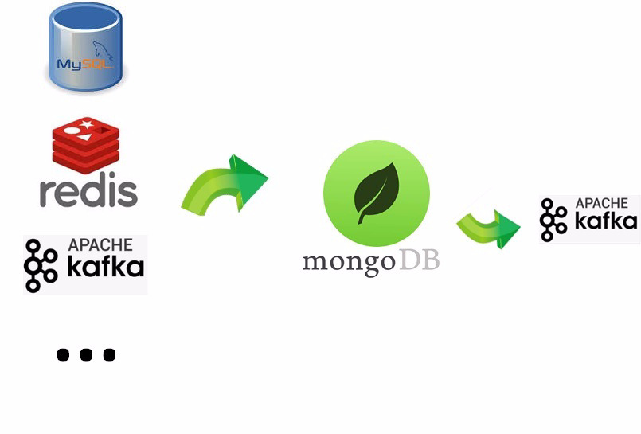
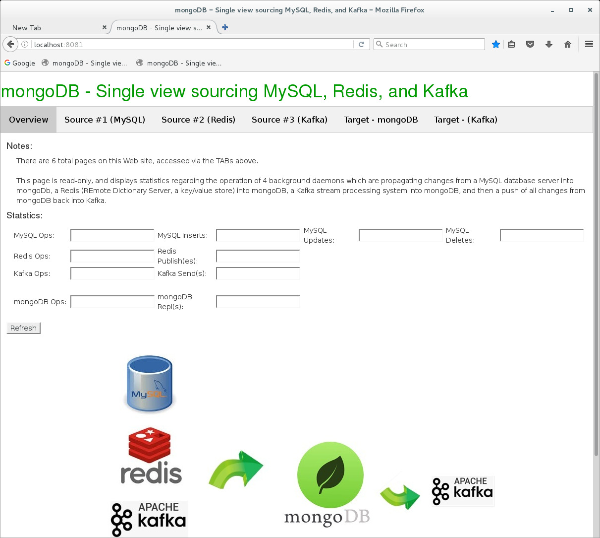
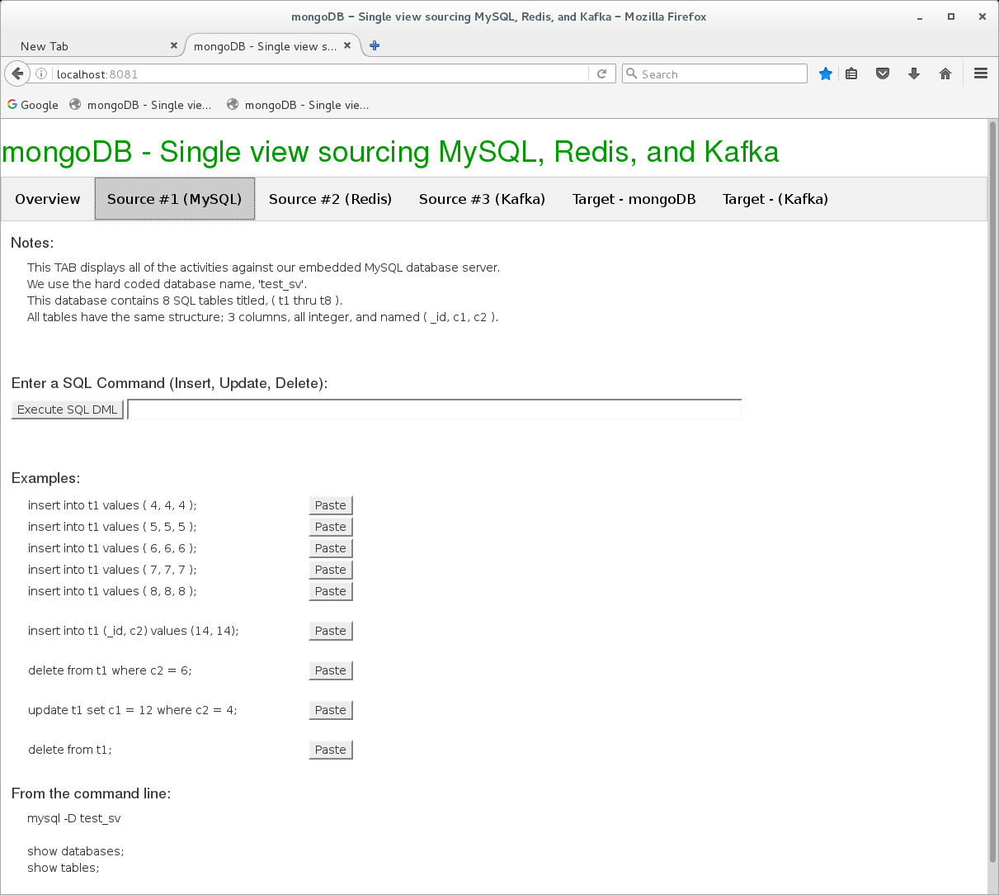
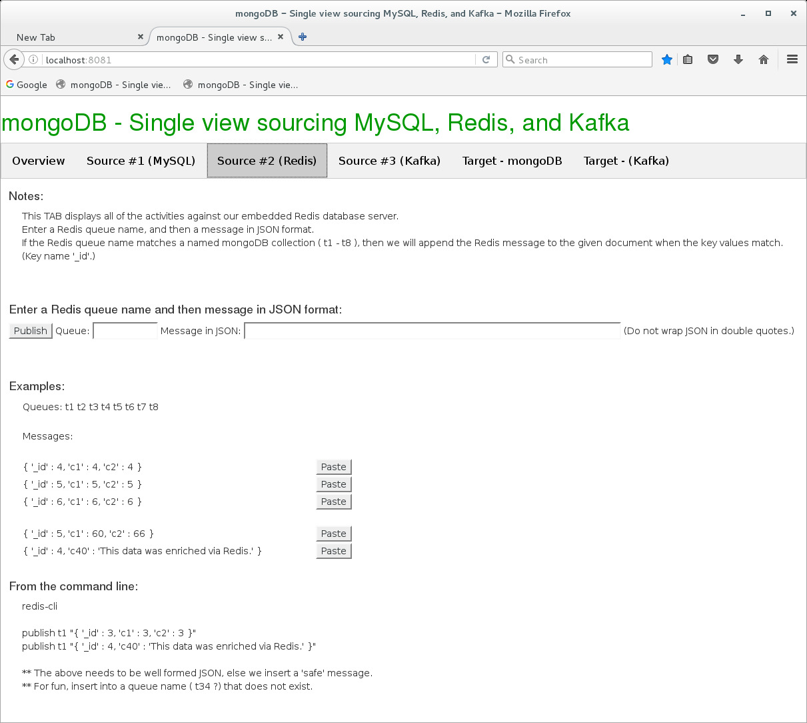
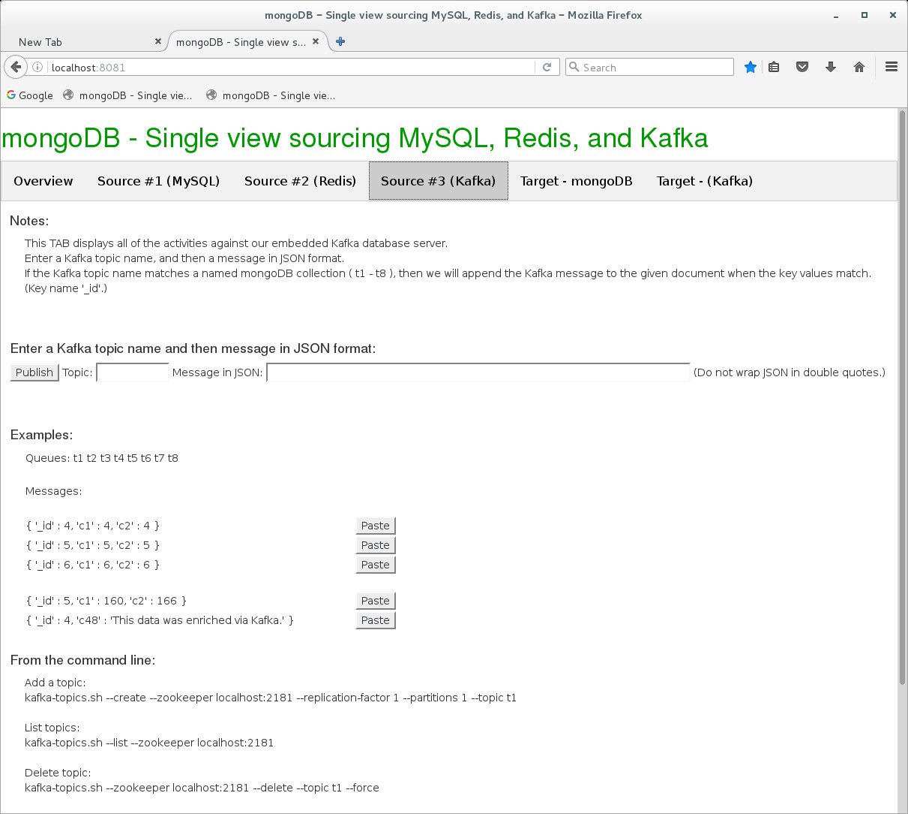
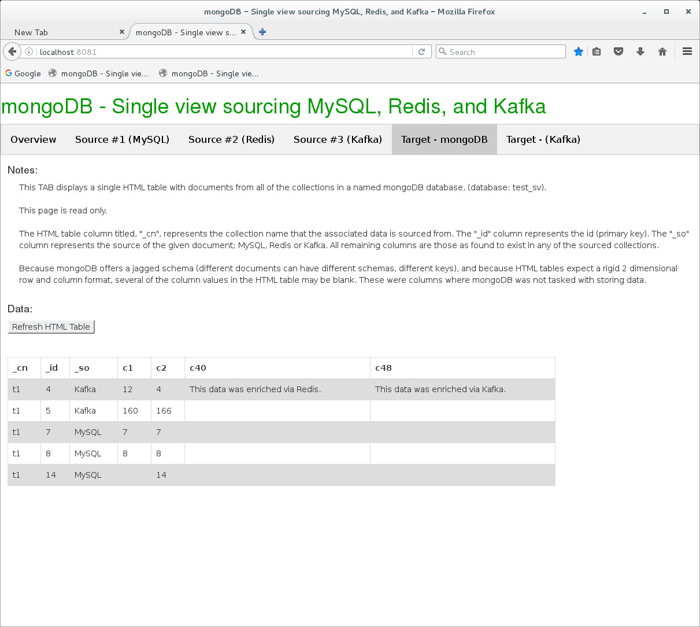
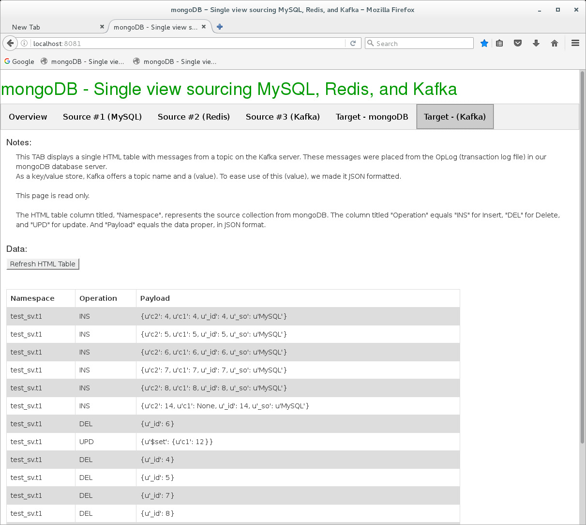
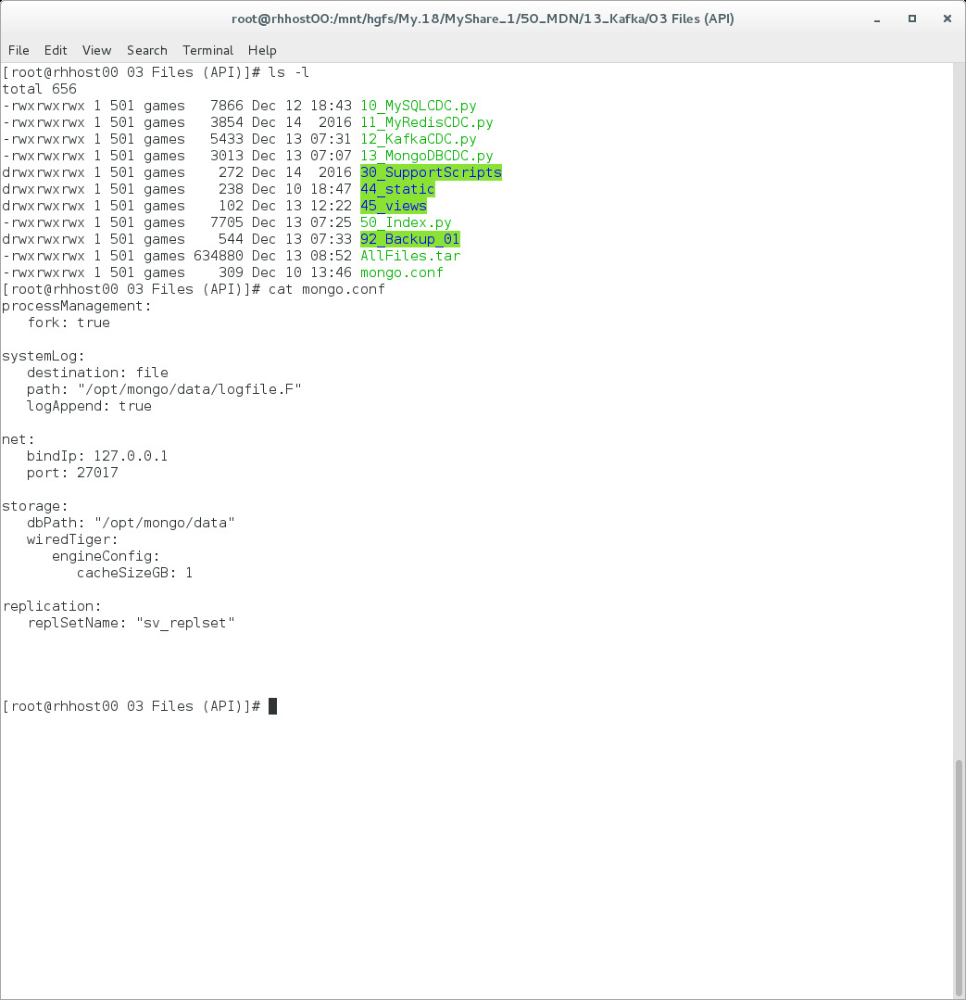

# January 2017: Single View with Kafka

[Browse 2017](../README.md)

[Back to home](../../README.md)

Original PDF: [MDB_DN_2017_13_SingleView.pdf](./MDB_DN_2017_13_SingleView.pdf)

---
## Chapter 13. January 2017

Welcome to the January 2017 edition of mongoDB Developer’s Notebook (MDB-DN). This month we answer the following question(s); I really enjoyed the December/2016 edition of this document where you detailed the single view use case, however; you left off Kafka as a topic, and while you ingested data from multiple sources, you failed to detail how to get data out of mongoDB. What can you tell me ? Excellent question ! You are correct. In this edition of this document we will pick up where we left off last month, adding Kafka as a third input data source, and detailing how to output change data capture from mongoDB using the mongoDB oplog (transaction log file). Last month we specifically chose MySQL and Redis, since that gave us a data store (database), and a message queue as data sources. In that regard, Kafka is similar to Redis but you asked, so we’ll comply. Outputting data (change data capture) from mongoDB is as easy as getting data into mongoDB. In the July/2016 version of this document we detailed using the mongoDB Connector, an open source change data capture client for mongoDB that pushes data from mongoDB into ElasticSearch, other mongoDB database servers, and more. Because it is so easy, this edition of this document goes straight to the source, where we will read change from the mongoDB oplog, and push these into Kafka.

## Software versions

The primary mongoDB software component used in this edition of MDB-DN is the mongoDB database server core, currently release 3.4. All of the software referenced is available for download at the URL's specified, in either trial or community editions. We also install, configure and use Kafka release 0.10.1 and a number of Python client libraries.

All of these solutions were developed and tested on a single tier CentOS 7.0 operating system, running in a VMWare Fusion version 8.1 virtual machine. The mongoDB server software is version 3.4, and unless otherwise specified is running on one node, with no shards and no replicas. All software is 64 bit.

## 13.1 Terms and core concepts

In the prior edition of this document (MongoDB Developer’s Notebook, MDB-DN, December/2016), we detailed the single view use case (a near form of master-data-management), and more. Details include:

- We installed, configured and operated a MySQL relational database server.

- We installed, configured and operated an open source change data capture agent that uses MySQL as a source, and writes all data to mongoDB. We chose to use the Python programming language here, but other languages exist.

- We installed, configured, and operated a Redis message server (similar to above), and again pushed changes into mongoDB; again, with a Python client side library.

- And we built a Web user interface using the Python Bottle lightweight Web application framework. (Bottle is the same framework used in the mongoDB University courses.)

> Note: For better or worse we have to state; to really make sense of this edition of this document (MDB-DN January/2017, Single View, Part 2), you should consider reading the prior edition of this document; mongoDB Developer’s Notebook (MDB-DN), December/2016, Single View, Part 1.

Sorry.

In this edition of this document we detail the following:

- We install, configure and operate Kafka, both as a producer, and consumer of messages.

- We install, configure and program an open source Python client for Kafka.

> Note: Using Apache Spark, for example, you can safely use the Java, Scala, or Python clients and do okay.

The Python client for Apache Kafka lags a bit behind the Java client; there were APIs for Producer and Consumer (of messages), but none currently for any of the administrative work; adding or dropping topics, and related. The subscribe-by-pattern-of-topic method returned all topics, so be prepared for a little craziness.

- We moved the Web application we were using to demonstrate all of the above from Python Bottle to Python Flask. We wanted a single page application and Flask was just a better fit here.

- And we detail tailing the mongoDB oplog, so that we may push data from mongoDB into anything, but in this case we push to Kafka.

Figure Figure 13-1 displays our updated solution architecture of what we are about to build. (Updated from last month’s edition of this document.) A code review follows.



*Figure 13-1 Solution architecture, what we are about to build.*

Relative to Figure 13-1, the following is offered:

- We are operating 3 software servers in the background; MySQL, Redis, and Kafka. And we have a mongoDB database server. We detailed MySQL and Redis in the prior edition of this document, and detail only Kafka in this document. MySQL and Redis act as data sources, and Kafka will act as a data source and a data target.

- 4 client daemons operate on this diagram, 1 each for MySQL, Redis and 2 for (Kafka): • Again, we detailed MySQL and Redis last month, although we added to these daemons a bit; performance metrics and the like.

• The 2 (Kafka) daemons are net new. One daemon listens on a number of Kafka topics and pushes these changes into the same named mongoDB collections. Currently messages arrive on these Kafka topics via our Web application, but in the real world any application would be writing to these Kafka topics. Using Kafka command line utilities, you can also push to these Kafka topics and see these messages pushed to mongoDB. The second daemon reads the mongoDB oplog and pushes all changes inside mongoDB to a single Kafka topic. (Think messaging, or pub/sub.)

> Note: We detailed the mongoDB oplog in the July/2016 edition of this document. In short, there is a single collection (table) inside mongoDB where you can read all of the changes that happened inside mongoDB.

Pushing changes from mongoDB to any target is super easy, and we detail this task in this edition of this document.

The July/2016 edition of this document detailed the mongoDB Connector, which is offered as a Python library/API to accomplish the same task. The mongoDB Connector comes with specific (drivers) to write to ElasticSearch, other mongoDB servers, and more.

- We are also operating a mongoDB database server; single node, but with replication enabled. By having replication enabled, the mongoDB oplog is automatically populated with all changes. If the mongoDB database server is booted with a given (replset) flag, that is the only real step. Step (two) is done by our daemon, where we just double-check that the mongoDB server was in fact booted in such a manner.

- And we have our Web app, written in Python Flask, which we will detail to the extent necessary; how does a client write into Kafka, and then integrate with mongoDB, other. All custom software is provided in a working state, at the same URL as this document,

```text
https://github.com/farrell0/mongoDB-Developers-Notebook
```

Figure 13-2 displays the first TAB of our Web application, a code review follows:



*Figure 13-2 The first TAB of our Web application.*

Relative to Figure 13-2, the following is offered:

- This is a read only page. The Refresh button calls to updates each of the counters; how many times have we pinged MySQL to check for updates, other.

- The mongoDB area reports the documents read from the mongoDB oplog and pushed into a Kafka queue titled, x_MDB.

Figure 13-3 displays the second TAB of our Web application, a code review follows:



*Figure 13-3 The second TAB of our Web application.*

Relative to Figure 13-3, the following is offered:

- This page is writable; here you can enter raw SQL INSERT, UPDATE and DELETE commands.

- The Paste buttons make it easy to (Copy and Paste) the sample SQL command listed beside each button. After a Paste, you can also edit these commands before clicking, Execute.

Figure 13-4 displays the third TAB of our Web application, a code review follows:



*Figure 13-4 The third TAB of our Web application.*

Relative to Figure 13-4, the following is offered:

- This page is writable. Here you can enter messages in JSON format that are pushed to a Redis queue, where a daemon then picks it up and places it into mongoDB.

- Redis queue names are dynamic, and if you enter a new, never before seen queue name in Redis, this will become a net new collection name in mongoDB.

Figure 13-5 displays the fourth TAB of our Web application, a code review follows:



*Figure 13-5 The fourth TAB of our Web application.*

Relative to Figure 13-5, the following is offered:

- Due to the similarities between Redis and Kafka, this Kafka page looks and acts the same as the previous Redis page.

- This page is writable. Here messages published to Kafka get written, where one of our 4 daemons will push to mongoDB.

- Kafka topics can be dynamic similar to Redis queue names, but we did see some grief in our testing on the Kafka side. For that reason it might be best to stick with the 8 previously/explicitly created Kafka topic names, t1 though t8.

Figure 13-6 displays the fifth TAB of our Web application, a code review follows:



*Figure 13-6 The fifth TAB of our Web application.*

Relative to Figure 13-6, the following is offered:

- This ia a read only page, which displays all of the data pushed into mongoDB.

- This set of data will grow and shrink based on any SQL inserts and deletes, and the activity from Redis and Kafka.

Figure 13-7 displays the sixth TAB of our Web application, a code review follows:



*Figure 13-7 The sixth TAB of our Web application.*

Relative to Figure 13-7, the following is offered:

- This page is read only, and offers a list of the data pushed to Kafka from the mongoDB oplog.

- As a queue, this list will only grow.

## 13.2 Complete the following

At this point in this document, we have an initial understanding of the application we built in last month’s edition of this document, and the new items we plan to build now. The following assumptions are made:

- You have completed all work from the December/2016 edition of this document. This means too that all of the referenced libraries are installed and working.

- You have a mongoDB server, MySQL server, and Redis server all installed and operating.

## 13.2.1 Install Flask, and a Python Kafka client

Previously the Web user interface portion of our application used Python Bottle, the same lightweight Web application framework used in the mongoDB University courses. We wanted to move to a single page Web application, that is:

- The first (and only) page load loads the entire contents of the Web site.

- All second and subsequent communication between the Web client and Web server send data only, via asynchronous AJAX calls with JSON encoded data. (We use a small and common library from jQuery to accomplish this.) Why ? This makes our Web application quite a bit zippier in performance; it looks nicer.

To install Flask, we use the standard Python Installer Program (PIP) through the Linux command prompt via a,

```text
pip install flask
```

We also need a Python Kafka client library; the means for a Python program to send and receive messages from Kafka. Comments:

- The install is again done via PIP via a,

```text
pip install kafka-python
```

- The documentation page to the above is here,

```text
http://kafka-python.readthedocs.io/en/master/apidoc/KafkaClien
t.html
```

- And sample code is here,

```text
https://github.com/dpkp/kafka-python
https://github.com/dpkp/kafka-python/blob/master/example.py
```

- There are Java clients to Kafka, Python clients and more. After a brief review, you will notice that the Python client offers consumer and producer APIs only, and none of the (administrative) APIs, like creating or deleting topics.

## 13.2.2 Install Zookeeper and Kafka

Installing and install-verifying Kafka is easy. Complete the following:

- Even a single node installation of Kafka is dependent on the Apache Zookeeper scheduler/resource-manager. Fortunately, Kafka ships with a copy of Zookeeper.

> Note: In this section we are following this online tutorial we found at,

```text
https://kafka.apache.org/documentation#quickstart
```

With documentation available at,

```text
https://kafka.apache.org/documentation
```

- We downloaded the Kafka distribution from the following Url,

```text
https://www.apache.org/dyn/closer.cgi?path=/kafka/0.10.1.0/kaf
ka_2.11-0.10.1.0.tgz
```

- We unpacked the above distribution, and placed it in /opt, and added to our execution search path. See,

```text
gunzip *.tgz
mv * /opt/
export PATH=$PATH:/opt/kafka_2.11-0.10.1.0/bin
```

- By default, you can not delete topics within Kafka. (Kafka topics are similar to Redis queues.) To allow this ability, we edited the following file and line,

```text
vi /opt/kafka_2.11-0.10.1.0/config/server.properties
# Uncomment line
delete.topic.enable=true
```

- To boot Zookeeper, and then Kafka, run a

```text
zookeeper-server-start.sh
/opt/kafka_2.11-0.10.1.0/config/zookeeper.properties &
kafka-server-start.sh
/opt/kafka_2.11-0.10.1.0/config/server.properties &
```

A little weird with long lines, line wrap above; those are two commands each terminating with an ampersand.

- To stop Kafka and also Zookeeper enter a,

```text
kafka-server-stop.sh
zookeeper-server-stop.sh
```

- In the event Kafka begins acting squirrelly, you should consider deleting these two default directories between a complete reboot of Kafka/Zookeeper,

```text
rm -fr /tmp/kafka-logs /tmp/zookeeper
```

- And lastly, the following commands entered in the Linux command shell allows you to perform given steps to configure and test Kafka,

```text
# Add a topic
kafka-topics.sh --create --zookeeper localhost:2181 \
--replication-factor 1 --partitions 1 --topic t1
```

```text
# List topics
kafka-topics.sh --list --zookeeper localhost:2181
```

```text
# Delete a topic
kafka-topics.sh --zookeeper localhost:2181 \
--delete --topic t1 --force
```

```text
# Produce a message
echo "Blah blah" | kafka-console-producer.sh \
--broker-list localhost:9092 --topic t1
```

```text
# Consume a message
kafka-console-consumer.sh --bootstrap-server \
localhost:9092 --topic t1 --from-beginning
kafka-console-consumer.sh --bootstrap-server \
localhost:9092 --topic t1
```

Leave this section having completed all of the above. It doesn’t matter if you leave Kafka or Zookeeper operating or not, our application daemon programs will create a point of known consistency for us.

## 13.2.3 Run/test the application-

Figure 13-8 offers a directory listing of our entire application. A code review follows.



*Figure 13-8 Directory listing for our application.*

Relative to Figure 13-8, the following is offered:

- Starting first with the file titled, mongo.conf This is a standard mongoDB database server configuration file formatted in YAML. The only point to make here is that the mongoDB database server must be started with a “replset” argument. This is a requirement we are going to have, if we are going to have a mongoDB oplog collection to read from. You don’t actually have to have a replica set, but the first/only node must be started as such.

```text
– 10_MySQLCDC.py
```

Is our Python language MySQL database server change data capture (CDC) agent (daemon program). This is a program we detailed in the December/2016 edition of this document; only cosmetic elements have changed. Start this program in a Linux terminal window with a,

```text
clear ; python 10_MySQLCDC.py
```

You will receive a notice on this screen for every SQL INSERT, UPDATE and DELETE run against MySQL, that is then pushed to mongoDB.

```text
– 11_MyRedisCDC.py
```

Is our Python language Redis server change data capture program. This is a program we detailed in the December/2016 edition of this document; only cosmetic elements have changed. Start this program in a new Linux terminal window with a,

```text
clear ; python 11_MyRedisCDC.py
```

Again, status messages will appear on the screen.

```text
– 12_KafkaCDC.py
```

This program is a net new to our application. Listed in Example 13-1, a code review follows.

### Example 13-1 Program listing for 12_KafkaCDC.py

```text
#
# This program reads from a Kafka topic and propagates
# changes into a mongoDB database server instance.
#
#
# Comments-
#
# . Version 0.67
#
# . This program was tested on CentOS 7 64 bit, and a
# Kafka version 0.10.1.
#
# All software is expected to be running on one host,
# as was this test program.
#
# . This program loops, gets all of the Kafka topic
# names starting with the letter 't', and listens
# for messages, which are then upserted into mongoDB.
#
# . To push messages into a Kafka queue, run any of
# the following,
#
# Add a topic
# kafka-topics.sh --create --zookeeper localhost:2181 \
# --replication-factor 1 --partitions 1 --topic t1
#
# List topics
```

```text
# kafka-topics.sh --list --zookeeper localhost:2181
#
# Delete topic
# kafka-topics.sh --zookeeper localhost:2181 \
# --delete --topic t1 --force
#
# Produce a message
# echo "Blah blah " | kafka-console-producer.sh \
# --broker-list localhost:9092 --topic t1
#
# Consume a message
# kafka-console-consumer.sh --bootstrap-server \
# localhost:9092 --topic t1 --from-beginning
# kafka-console-consumer.sh --bootstrap-server \
# localhost:9092 --topic t1
#
```

```text
##################################################################
## Imports #######################################################
```

```text
import pymongo
import kafka
#
import time
import threading
import subprocess # Run Linux programs
#
import ast # Convert string to JSON
```

```text
##################################################################
## Define functions ##############################################
```

```text
#
# Messages received from Kafka
#
l_kMsgs = []
```

```text
#
# Kafka topics we monitor
#
l_topics = [ "t1", "t2", "t3", "t4",
```

```text
"t5", "t6", "t7", "t8", "x_MDB" ]
```

```text
#
# Create a topic inside Kafka
#
def add_topic(p_arg1):
l_proc = subprocess.Popen([
'./30_SupportScripts/08_AddATopic.sh', p_arg1])
#
l_proc.communicate()
```

```text
##################################################################
## Recycle Kafka #################################################
```

```text
#
# Nuke for morbid; stop and restart Kafka and its associated
# Zookeeper.
#
```

```text
print " "
print "Recycle Kafka: Begin (about 28 seconds)"
#
l_proc = subprocess.Popen([
'./30_SupportScripts/04_StartAllKafka.sh', ' '])
l_proc.communicate()
#
print "Recycle Kafka: End"
```

```text
print " "
```

```text
for l_topic in l_topics:
print "Add Kafka topic: " + l_topic
add_topic(l_topic)
```

```text
##################################################################
```

```text
mongo_host = pymongo.MongoClient("localhost:27017")
mdb = mongo_host.test_sv
```

```text
##################################################################
## Program main ##################################################
```

```text
print " "
print "Running: Kafka CDC (12) (Consume t*)"
print " "
```

```text
#
# Polling from Kafa topics.
#
# The Python lib we used for this had some issues;
#
# . The subscribe pattern returned all topics.
# So we need to filter those out.
# . The start from beginning did not work, so
# we run this task async, and place the results
# in an array.
#
```

```text
class t_tab3(threading.Thread):
global l_kMsgs
#
daemon = True
```

```text
def run(self):
l_messages = kafka.KafkaConsumer()
l_messages.subscribe(pattern="t*")
#
for l_message in l_messages:
l_message = str(l_message.value)
l_message = ast.literal_eval(l_message)
#
l_kMsgs.append(l_message)
```

```text
l_threads = [ t_tab3() ]
#
for l_thread in l_threads:
l_thread.start()
```

```text
##################################################################
```

```text
l_lastProcessed = 0
```

```text
while True:
l_thisProcessed = 0
#
for l_kMsg in l_kMsgs:
#
l_thisProcessed += 1
#
if (l_thisProcessed > l_lastProcessed):
l_lastProcessed +=1
#
l_namespace = l_kMsg["namespace"]
l_payload = l_kMsg["payload" ]
#
try:
l_payload = ast.literal_eval(l_payload)
except:
l_payload = ast.literal_eval(
"{ '_id' : -99, 'c1' : -99, 'c2' : -99 }")
#
# This 'if' block handles inserts into mongoDB
# without an _id field. If not _id field is
# present, just use a hard coded value of -99.
#
if ( "_id" in l_payload ):
l_justId = l_payload["_id"]
else:
l_justId = -99
#
# Here we handle inserts and updates.
#
# We chose not to program deletes, since we
# are mimicing enriching the data via Kafka,
# not actual maintainence of the data.
#
l_payload["_so"] = "Kafka"
#
if (l_namespace.startswith("t")):
mdb[l_namespace].update( { "_id" : l_justId },
{ "$set" : l_payload }, upsert = True )
print " Kafka Publish - Success"
#
mdb.statistics.update( { "_id" : 0 },
{ "$inc" : { "kafka_pubs" : 1 } } )
#
time.sleep(2) # Endless loop, sleep to throttle
mdb.statistics.update( { "_id" : 0 },
{ "$inc" : { "kafka_ops" : 1 } } )
```

Relative to Example 13-1, the following is offered:

- import kafka This line is new to us, and allows use of the Python client for Kafka we installed above via pip.

- import threading This line is new to us, and allows us to deliver a multi-threaded Python program. In effect, reading a Kafka queue via the Python library required us to subscribe to one or many topics, and then sit in a polling loop. THe Kafka Java libraries and command line utilities allow you to restart (reading) from the very start of a topic; the Python client currently does not. Thus, we multi-thread and always listen to the topic AND run the rest of this program/daemon. You’ll see the actual multi-threaded elements of this Python program below.

```text
l_kMsgs
```

– = [ ] Is a global variable, an array that we read and write messages received from Kafka into. Once Kafka messages arrive here, we then write them to mongoDB.

```text
– def add_topic(p_arg1):
```

This block is a bit of a hack. The Python library we are using for Kafka did not offer an (add topic) method, so we resorted to CGI/RPC. Huh ? We run a shell script to accomplish the task. Very slow.

```text
– l_proc = subprocess.Popen([
```

Here we recycle the Kafka server; start from a point of known consistency. The for loop that follows adds our topics within Kafka.

- class t_tab3(threading.Thread): This block begins the section where we spin up a separate task within our daemon that listens for Kafka messages. Why did we do this ? The Java API allows you to connect to a topic and retrieve past messages. The Python API currently does not offer this. So, we connect to the topic, stay connected, and populate a global array when these messages do arrive.

The subscribe.pattern line is bogus; we are getting messages from all topics, and must filter them out later.

- And the “while True” loop begins our second main loop for processing; once a message is received, munge it a bit and put it into mongoDB. We run update/inserts just to be lazy.

Back to our program list from figure, Figure 13-8-

- 13_MongoDBCDC.py This program is a net new to our application. Listed in Example 13-2, a code review follows.

### Example 13-2 Program listing for 13_MongoDBCDC.py

```text
# This program reads from the mongoDB transaction log
# log file, and propagates changes into a Kafka topic.
#
#
# Comments-
#
# . Version 0.67
#
# . This program was tested on CentOS 7 64 bit, and a
# Community Edition MySQL version 5.6.34.
#
# All database servers were local to one host, as was
# this test program.
#
```

```text
###################################################
```

```text
#
# Imports
#
```

```text
import pymongo
import kafka
#
import time # Sleeps
import sys # Exit on error
import re # Regex
```

```text
###################################################
```

```text
#
# Open our mongoDB connections-
#
# 1 to read the oplog
# 1 to update our activity collection
#
mongo_host1 = pymongo.MongoClient("localhost:27017")
mdb1 = mongo_host1.local
mongo_host2 = pymongo.MongoClient("localhost:27017")
mdb2 = mongo_host2.test_sv
```

```text
#
# The collections names we wish to read from the
# oplog.
#
l_regx = re.compile("test_sv\.t", re.IGNORECASE)
```

```text
#
# Structure and command needed to initiate replica
# set.
#
# This needs to be done only one time in the life of
# this mongoDB server.
#
l_conf = { "_id" : "sv_replset", "members" : [
{ "_id" : 0, "host" : "localhost:27017" }
] }
try:
mdb1.command("replSetInitiate", l_conf)
except:
pass
```

```text
l_oplog = mdb1['oplog.rs']
if (l_oplog.count() == 0):
print " "
print "Error: oplog.rs collection does not exist."
print " "
sys.exit(1)
else:
pass
```

```text
###################################################
###################################################
```

```text
#
# Kafpa connection.
#
l_kProd = kafka.KafkaProducer()
```

```text
#
# We use this flag to pass thru the oplog one time,
# and then start processing.
#
l_firstpass = 1
```

```text
#
# Cursor for the oplog.
#
l_oplog = mdb1.oplog.rs.find( { "ns" : l_regx ,
"op" : { "$in" : [ "i", "d", "u" ] } },
cursor_type=pymongo.CursorType.TAILABLE_AWAIT )
```

```text
#
# Our main loop; read the entries from the oplog.
#
```

```text
print " "
print "Running mongoDB CDC (13) (Producer x_MDB)"
print " "
```

```text
while l_oplog.alive:
for l_docu in l_oplog:
if (l_firstpass == 1):
pass
else:
l_message = {}
#
l_message["namespace"] = l_docu["ns" ]
#
if (l_docu["op"] == "i"):
l_message["operation"] = "INS"
elif (l_docu["op"] == "d"):
l_message["operation"] = "DEL"
elif (l_docu["op"] == "u"):
l_message["operation"] = "UPD"
#
l_message["payload"] = str(l_docu["o"])
```

```text
#
l_message = str(l_message)
#
l_kProd.send("x_MDB", l_message)
print " mongoDB Pull - Success"
#
mdb2.statistics.update( { "_id" : 0 },
{ "$inc" : { "mongo_pubs" : 1 } } )
l_firstpass = 0
time.sleep(2)
#
mdb2.statistics.update( { "_id" : 0 },
{ "$inc" : { "mongo_ops" : 1 } } )
```

Relative to Example 13-2, the following is offered:

- We open two mongoDB connections. The first will be used on a database cursor that waits on new documents to arrive in the mongoDB oplog. The second has a small role; sending statistical updates to a central collection.

- The try/except block checks to see if our mongoDB server can support replication, and also to set same.

```text
– l_oplog = ..
```

Is our tailable (constant query) cursor that runs against the mongoDB

```text
!
```

oplog. Its that simple The filter on “ns” (namespace, database and collection name combination) uses a Regex pattern for all collections starting with the letter t, a design choice for us. The filter on “op” gives us only insert, update and delete. All other server events are ignored for our purposes today.

> Note: Tailable cursors are super handy, and can run against any capped collection, not just the oplog.

- And we have a small number of statements, including a send into Kafka. This is the line where we actually send data to a foreign source.

50_Index.py Is the Web application proper. You can run this program with a,

```text
python 50_Index.py
```

And page (async data call) Events will display here for diagnosis purposes only.

We used Python Flask and asynchronous messaging between the Web browser and the server, otherwise its all just HTML, CSS, JavaScript, and Flask data tags.

That’s it. Go forth and experiment with the Web application, and/or dissect some of the code for your own use.

## 13.3 In this document, we reviewed or created:

We did a lot more. In the previous edition of this document we:

- We installed MySQL and Redis, configured, booted, and used same.

- We installed a change data capture set of libraries for use with MySQL.

- We installed Python libraries to support a Web site, and programming into each of our three data sources; mongoDB, MySQL, and Redis.

In this follow on edition to this document we:

- Added Kafka as a source and target.

- Configured and read from the mongoDB oplog (transaction log file).

- And moved our Web app to single page, and some of our Python change data capture clients to multi-threaded.

At this point you can say you have created and delivered single view customer using mongoDB.

### Persons who help this month.

Dave Lutz, Shawn McCarthy, and Thomas Boyd.

### Additional resources:

Free mongoDB training courses,

```text
https://university.mongoDB.com/
```

This document is located here,

```text
https://github.com/farrell0/mongoDB-Developers-Notebook
```
