# February 2017: Cloud Foundry

[Browse 2017](../README.md)

[Back to home](../../README.md)

Original PDF: [MDB_DN_2017_14b_CloudFoundry.pdf](./MDB_DN_2017_14b_CloudFoundry.pdf)

---
## Chapter 14. February 2017

Welcome to the February 2017 edition of mongoDB Developer’s Notebook (MDB-DN). This month we answer the following question(s); While we claim we sprint and scrum, my company wants to move from a traditional deployment monolithic application architecture to a microservices architecture. We’ve looked at Docker and others, and currently plan to go all in on Cloud Foundry. What can you tell me ? Excellent question ! You are in for some exciting times. Moving from a traditional waterfall software development process to one that is truly agile can have a huge and positive impact to an IT organization. Moving from 8-10 month software delivery cycles to an ability to deploy weekly and daily can offer great competitive advantages to the business. And, microservices can actually make your life a whole lot easier. Because there are persons out there who think that cloud means simply off-premise, or even just virtual machines, this document assumes no pre-requisites. We will start with model-view-controller and work our way up into IaaS, PaaS (Cloud Foundry), microservices and more.

## Software versions

The primary mongoDB software component used in this edition of MDB-DN is the mongoDB database server core, currently release 3.4. All of the software referenced is available for download at the URL's specified, in either trial or community editions. We also install, configure and use Pivotal Cloud Foundry “pcfdev” version 0.24 (Pivotal Cloud Foundry version 1.9.0) and the Cloud Foundry command line utility “cf” version 6.23. For testing we push and scale a simple Python Web application. We also detail use of a new/beta mongoDB tile for Pivotal Cloud Foundry, where you can self service your mongoDB database server needs while developing.

All of these solutions were developed and tested on a single tier CentOS 7.0 operating system, running in a VMWare Fusion version 8.1 virtual machine. The mongoDB server software is version 3.4, and unless otherwise specified is running on one node, with no shards and no replicas. All software is 64 bit.

## 14.1 Terms and core concepts

In this document we are going to take you to a cloud hosted microservices architecture with no assumed pre-requisites. With that, we start with the defacto business application design pattern, model-view-controller (MVC).

Model-view-controller (MVC) To begin we will state that there is systems programming, and business application programming. Systems programming occurs when we are creating the next version of Linux, or a new or next version of Http server. Wikipedia.com does a good job of overviewing systems programming here,

```text
https://en.wikipedia.org/wiki/System_programming
```

(Business) application programing occurs when we are creating an end user facing order entry system, time and attendance system or similar. Today the expectation for a business application is that it is accessed via a Web browser or mobile device application, and speaks with an (application server) via a network or the Internet.

Model-view-controller (MVC) associated with business application programming, arrived as early as 1970, or perhaps more famously in the 1995 IT industry book titled, Design Patterns: Elements of Reusable Object-Oriented Software , available at,

```text
https://www.amazon.com/Design-Patterns-Elements-Reusable-Object-Oriente
d/dp/0201633612
```

Figure 14-1 offers a graphic on the topic of model-view-controller.

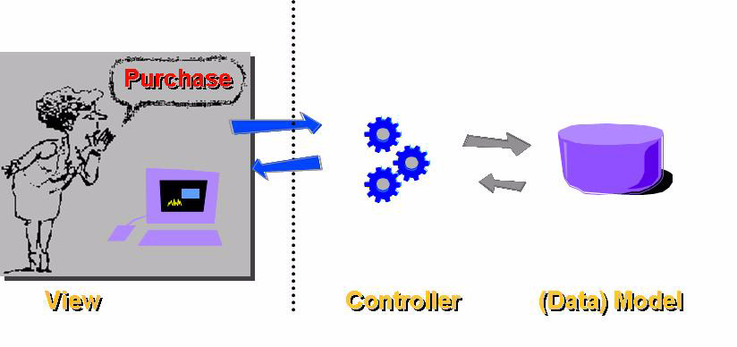

*Figure 14-1 Model-view-controller (MVC).*

MVC is a design pattern for creating business applications, just as you have the design pattern in the kitchen of your house which states; the refrigerator, stove and sink should be within 15 feet of one another, and the stove and refrigerator should not be directly adjacent because of energy consumption (hot and cold). In effect, MVC states:

- If you wanted to become the next Amazon.com, you might need to create 1 million lines of source code; 1/3 of which might be view, 1/3 controller, and 1/3 model.

- The (end user) view constitutes the user interface (UI), and is the portion of the application that the end user actually sees and directly interacts with. The expectation today is that the view operates within a Web browser or mobile application on the end user’s device. For a Web browser, the view may be written in Html(5), JavaScript, and a number of standard open source JavaScript libraries. The end user initiates events inside the view via button clicks or similar, events which are listened for and responded to by the controller. The controller sits between the view and the model.

- The controller resides on a server and generally operates as a static Http server in concert with an application server of some form. In an attempt to put a name to a face, Figure 14-2 displays Web (application) server market shares. A code review follows.

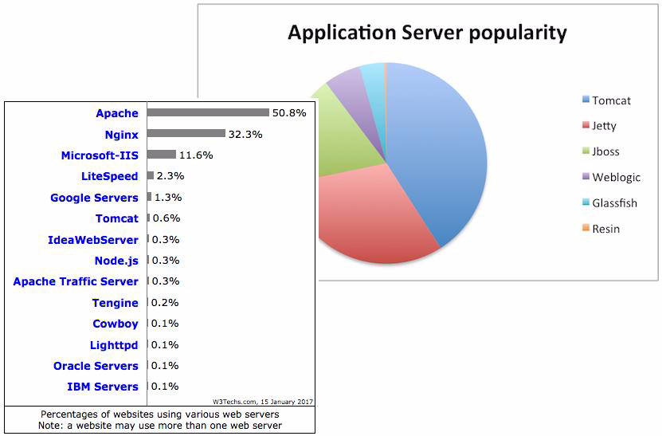

*Figure 14-2 Market share of Web (application) servers.*

Relative to Figure 14-2 the following is offered: • The upper right pie chart is sourced from,

```text
https://plumbr.eu/blog/java/most-popular-application-servers-i
n-2014
```

and offers about what we would expect for a web application server market share. • The lower left bar chart is sourced from,

```text
https://w3techs.com/technologies/overview/web_server/all
```

This graphic doesn’t make clear the delineation and resultant market share between Http servers and application servers. Further, Apache is more of an open source (brand) and includes Apache Http server (a Web server), Apache Tomcat (a Web and application server), and more. But, you can still get an idea some of the names involved. Back to controllers proper- The controller’s job is to coordinate and complete end user initiated events (button clicks and similar) to database server routines; for example click here, and create a new customer order. This order would exist as (n) number of rows or documents in our database server, which hosts the

model. The database server resides in the model tier, and is the element of MVC we discuss next.

- The (data) model is the only element of MVC that offers persistence, that is; the only portion designated to write to disk, and persist data for all eternity across machines failures. The data model generally arrives as a database server, be it relational (SQL), NoSQL (mongoDB and others), or something else.

Stateful and stateless The Http communication protocol (how the Web client interacts with the controller tier) is actually stateless , meaning; as soon as the view’s sub-second request for service is fulfilled, the controller can completely forget about the view’s existence.

In reality, you may have a shopping cart or other representation of your progress on the (Web) site across requests for service, creating a stateful session. Commonly a unique end user session-id is created upon first contact, which is then sent back and forth between the view and the controller upon each request. With this primary key identifier for a given user, we may then keep an idea of the user state on the server, or pass it back and forth each time the end user and controller communicate.

> Note: Stateful or stateless; Why do you care ?

If the controller is truly stateless, then the user request (the view) can be routed to any controller without concern. Further, controllers could be scaled up (more controllers added in count to support a higher workload), or destroyed (perhaps a given controllers fails/crashes, or we wish to scale down) on demand. Stateless; easier to scale, easier to manage. Stateful; a more functional application, a better user experience.

How to preserve the effect of statelessness-

Often we implement a distributed cache at the controller tier to distribute/replicate session state across multiple servers. Thus, if one controller process fails, state is preserved/available. Or, we can encode the entire representation of state and pass this in addition to the session id across service requests.

Both techniques have pluses and minuses.

Bare metal up, and up; IaaS In order that we may host a controller (server), the following is held true:

- On top of the hardware proper (CPUs, memory, disks, network interface cards) we expect to install and configure an operating system; Linux or similar.

- Infrastructure as a Service (IaaS) offers the ability for the hardware (server) to support multiple, concurrent, isolated operating systems on the same hardware (server). Consider the following true story: • A hospital with 380 beds found itself with over 1550 servers to operate the various business applications a hospital needs; scheduling, insurance and billing, inventory, other. More servers and applications than beds, curious. • Each of the vendors to these business systems demands a separate operating system, to ensure that their business application, which they offer support for, is not impacted by any other (unknown/strange) business application. • Each of these business applications size their hardware for peak load, and then might average a 90% idle usage when not operating on-peak. If we could magically operate multiple business application on one server with a guaranteed isolation, the hardware savings, plus electricity, cooling, other, becomes quickly significant. • IaaS arrives as a hypervisor , a piece of software between the hardware and the operating system. The hypervisor supports running multiple operating systems on the same hardware, concurrently, while at the same time guaranteeing isolation and performance of each.

> Note: An analogy-

As a software application, Microsoft Word is a program that operates on a data file, which is the document proper. The same is true for Microsoft Excel; Excel is a program that operates on a data file, the spreadsheet proper.

IaaS, a hypervisor, is a program that operates on a single or collection of data files. These data files represent the virtual machine, the guest operating system (operating system). Just as Word or Excel can operate multiple copies (of the data files on which they operate), a hypervisor can operate multiple, concurrent operating systems.

The guest operating system (also called a virtual machine), has zero idea that it is not sitting directly atop the hardware all by itself.

The first hypervisor we encountered was VMWare Workstation, and in that release was only a 55 megabyte program. Incredible.

Platform as a Service, PaaS Thus far with IaaS, we have an operating system, however; hosting a controller proper requires much more than an operating system.

- After the operating system (or virtual machine), we expect to install, configure and operate one or more additional software servers on top of the operating system; Http server, application server, identity server (LDAP server), and any number of 20 or more other options. By means of comparison; if it takes 100 steps and 4hours to install and fully configure an operating system, if might take us 1200 steps and 1-2 days to fully install, configure and test the complete stack of application related software (the controller tier). With the possibly for human error, especially if we have to repeat this over 100+ nodes, it makes the most sense to automate the above.

- PaaS has a more broad set of responsibilities than IaaS. Where IaaS means largely a (virtual) operating system, PaaS includes the entirety of an application stack. With so many choices in the application stack, and many, many choices for configuration of same, PaaS systems are much larger and more complex than IaaS systems.

Containers versus operating systems- Around 2008, the Linux operating system began to offer c-groups , also referred to as containers. Containers offer the ability for one (Linux) operating system to control the specific amount of resource (CPU, RAM, other) offered to a single or

set of discreet Linux (end user application) processes. One of these processes could be the controller to your application.

Initially used as a finely grained resource governor, containers come with the ability to (boot) in sub-second or nearly sub-second, versus the many (60 ?) seconds for an operating system to boot.

Thus, we can create a distinct resource governor for a controller in sub-second versus many, many seconds, when using containers.

Application packaging (WAR, Gradle, Maven) And then packaging (installation, distribution) of the compiled controller.

When a controller is created and compiled, how do we document what the dependencies are of this (program) ? How do we document what the entry point is to this program (what is the start command, how is this asset run) ?

A Java Web program could be packaged as a WAR file (Web Application aRchive). Further, this program could include a table of contents of sorts; an accompanying Gradle or Maven configuration file. From the Wikipedia.com page on Maven, the following is offered:

```text
https://en.wikipedia.org/wiki/Apache_Maven
```

Maven addresses two aspects of building software: first, it describes how software is built, and second, it describes its dependencies.

A Maven file tells us everything we need to know to deploy and operate a given controller.

PaaS, specifically Cloud Foundry

There are multiple software options for delivering a PaaS; Docker, RedHat OpenShift, Cloud Foundry, and others. What Cloud Foundry (CF) offers and why is detailed below:

> Note: Cloud Foundry is an open source PaaS. Commercial providers of Cloud Foundry include; Pivotal (Cloud Foundry), IBM (BlueMix), HP (Helion), and others. Free trials of Cloud Foundry are available at,

```text
https://www.cloudfoundry.org/how-can-i-try-out-cloud-foundry-2016/
```

- Automated deployments- Continuing with a Java Web application with an accompanying Maven build file, CF automatically knows how to create a new container that can run this application in its entirety. • If a given version of Java runtime (JRE) is required, CF will install it. • If Apache Http Server, Apache Tomcat, or similar is required, CF will install and configure it. • If the application uses Spring Boot, Spring CLI or similar, CF will install and configure it. • More.

> Note: Where and how does your application get deployed on Cloud Foundry ?

Cloud Foundry is not a small piece of software. On AWS, Cloud Foundry is deployed as over 30 virtual machines; 13 (count) t2.micro, 15 (count) t2.small, 2 (count) m3.medium, 6 (count) m3.xlarge, 3 (count) m3.2xlarge. (That’s 76 CPUs and 226 GB of RAM.) Some of these virtual machines host the Cloud Foundry components proper, and some host your actual application. See,

```text
http://docs.pivotal.io/pivotalcf/1-9/customizing/cloudform.html
```

The virtual machines that host your application were historically titled, Droplet Execution Agent (DEA) Nodes. (Your program/controller, as it was deployed, was called a droplet.) Today the same virtual machines are titled, Diego Cells. Cloud Foundry instantiates, manages and monitors containers inside the Diego Cell, which is where your application actually resides.

When you call to deploy your application on Cloud Foundry, a Cloud Foundry buildpack is used to examine whatever deployment artifact you submit; identify its type (Java, Ruby, dot.[Net], Python, whatever), package your application up for operation within Cloud Foundry, and then know how to start the application. Each Cloud Foundry vendor supports a given set of buildpacks, which may or may not be optionally installed. You can also build and install your own custom buildpacks.

For more information see,

```text
https://docs.cloudfoundry.org/buildpacks/
https://docs.cloudfoundry.org/buildpacks/custom.html
```

- Automatic scaling- As recently as 2015, automatic scaling of applications was a commercial only feature to Cloud Foundry. Using standard Cloud Foundry APIs,

another (Cloud Foundry subsystem) application would monitor CPU, memory consumption, and maybe even network throughput/latency of each deployed application and add more count of any given type of end user application should the given performance metrics not be met. For example, you deploy a single instance of an application to calculate sales tax and then observe that this container, this application, is 98% busy with high waits. In this case, automatically deploy a second instance of this application.

- Health monitoring and reporting- Each Diego Cell and each container reports a heartbeat and collection of statistics that indicates whether a given container is doing as told. If an application inside a container has crashed or similar, Cloud Foundry will automatically start a new instance of the application, and terminate and recover all resource from whatever container it is that failed. And, using the principles of a 12 Factor Application, Cloud Foundry will forward all standard out and standard error messages from each deployed application to a central data stream, to enable any sort of external monitoring or reporting you desire. For example, a Python/Flask Web application would report each Http Web page request to standard out; who is hitting my Web site, how often, with what arguments, other.

- And more- Automatic deployment, automatic scaling, health checks, and monitoring are only a portion of what the Cloud Foundry platform provides. The net/net becomes; this is all infrastructure and work that operations teams normally have to do manually, slower, and with greater error.

> Note: As recently as 2015, Cloud Foundry could not run most legacy applications. The applications that Cloud Foundry could run had to be 12 factor , See, https://12factor.net/

In effect, the application controller needs to be stateless, not read or write from the local hard disk (the application should expect ephemeral disk), and more. Why ? This allows Cloud Foundry to deploy, monitor, and scale applications in the automated fashion that it does. This is also considered best practice by many folks; you should not be hard coding, for example, the IP address to your database inside your deployment bundle. What happens when that IP changes ?

This was one of the first reasons Docker had so much early traction over Cloud Foundry; Docker could allow interminable disk storage inside its containers. Today Cloud Foundry has the ability to host Docker containers as well, but; 12 factor does offer some pretty sweet features.

Which category of application could not suffer an ephemeral disk ? A database server for one.

3 major types of (user supplied artifacts) in Cloud Foundry Thus far we have discussed a stateless application (perhaps a Web application controller), deployed and then fully managed by Cloud Foundry. We also discussed that Cloud Foundry expects this application to be 12 factor and operate using ephemeral disk. Cloud Foundry supports two more major types of (user supplied artifacts); services and user provided services. We put user supplied artifacts in parenthesis because there is no official title to this list of 3 items.

User provided services operate entirely outside Cloud Foundry and examples would include a SQL database server, a mongoDB database server, other. (Most things that require ephemeral disk.) In the case of a user provided service, Cloud Foundry has the optional value add of forwarding the user authentication/authorization credentials to any consumers (applications) for a given service. In effect, Cloud Foundry can be configured to do the service binding automatically.

(Non user provided) services are hosted inside Cloud Foundry like any stateless application. A marketplace (think iTunes) allows developers to browse, select, and then instantiate a new operating copy of said service which Cloud Foundry will manage like all other applications. Figure 14-3 offers a screen shot of the Pivotal Cloud Foundry marketplace. A code review follows:

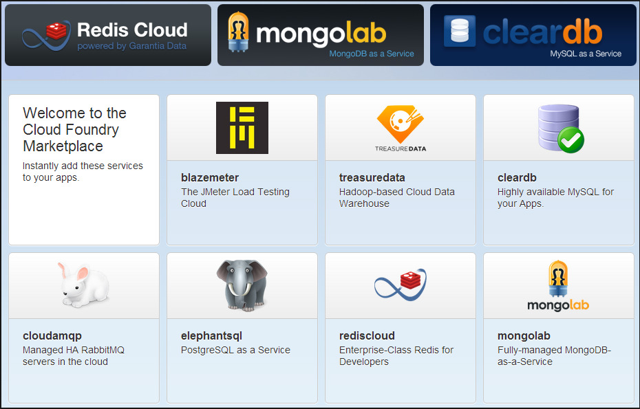

*Figure 14-3 Services Marketplace inside Pivotal Cloud Foundry.*

Relative to Figure 14-3, the following is offered:

- The primary purpose of the Cloud Foundry marketplace is to enable application developers to easily create given servers (services) they need to test and develop their custom applications. Need a Redis server to quickly code or test against ? Use the Cloud Foundry marketplace. Need a RabbitMQ ? Same thing. MySQL, mongoDB, Postgres server; all are available in the marketplace.

- Each of the offerings in the marketplace is called a tile, and there has almost always been a mongoDB tile in the Pivotal Cloud Foundry marketplace.

> Note: The first version of the Cloud Foundry marketplace mongoDB tile, created by Pivotal circa 2013, allowed creation of a single node community edition mongoDB server with no mongoDB Operations Manager (Ops Mgr: the Web based administrative graphical user interface to mongoDB) or similar.

Another version of this tile dated 2017, open source and created by a third party, is available here, and is currently in beta,

```text
https://network.pivotal.io/products/a9s-mongodb/
https://github.com/pivotal-cf/pcfdev/releases/tag/v0.24.0
https://docs.pivotal.io/a9s-mongodb/
```

The last link above offers a documentation page which details the following:

- You can create single node or 3 node replica setted mongoDB instance. This is still a mongoDB community edition distribution.

- You can not created sharded clusters, and still do not install mongoDB Ops Mgr.

A third version of mongoDB tile for the Pivotal Cloud Foundry platform is currently in controlled release (beta). This version, created by Pivotal, allows creation of stand alone mongoDB systems, replica sets, and sharded systems. There is also integration with an external mongoDB Operations Manager (Ops Mgr), and more. We detail operation of this third version of the tile below.

Installing/hosting marketplace tiles Tiles exist in the Cloud Foundry marketplace via the installation of that service’s associated service broker . Installing a net new service broker to Cloud Foundry requires a high level of Cloud Foundry administrative permission. Run time options to Cloud Foundry include:

- The full blown, on premise installation- This is the 76 CPU count and 226 GB RAM (full install) option introduced above. You could make yourself administrator upon Cloud Foundry install, install a given version of Cloud Foundry tile, and there you are.

- Bosh lite- The runtime subsystem within Cloud Foundry that interfaces with the IaaS tier upon which Cloud Foundry sits atop is titled Bosh. See,

```text
https://en.wikipedia.org/wiki/BOSH_%28bosh_outer_shell%29
```

There are at least two open source, alternate packagings of Cloud Foundry that attempt to deliver a version of Cloud Foundry that does not require 30+ (large) virtual machines, located here,

```text
http://stackoverflow.com/questions/36596743/how-to-install-clo
udfoundry-on-local-server
https://docs.cloudfoundry.org/deploying/boshlite/
```

Both of the above sets of instructions failed for us in fun and dramatic means. If you get either to work, you might be able to install your own service brokers.

- Pivotal Web Services (PWS)- Pivotal sells Pivotal Cloud Foundry directly, or as a hosted service. This hosted service does have a 30 day free trial and is available at

```text
http://run.pivotal.io
```

As expected, PWS does not allow you to administer this box, or to install your own marketplace tiles.

- And then “pcfdev”, available at,

```text
https://docs.pivotal.io/pcf-dev/index.html
```

This we did get installed and we detail the procedure to complete same below. (If you are not at all familiar with Cloud Foundry, this install doc was sparse and assumed a number of conditions which may cause you grief.) Operating pcfdev requires a single virtual machine with 4 GB RAM. With this option you can run “Cloud Foundry” on your laptop, and perform many including administrative functions. This distribution of Cloud Foundry disables the ability to install your own service brokers, so you still can not run or test the mongoDB marketplace tile. You can test development of 12 factor applications that connect to a user defined service for mongoDB, so there’s that.

What we are left with above is the following:

- If you want to install and/or test the mongoDB Cloud Foundry marketplace tile (or any tile), you need administrator permission, you need the full install of Cloud Foundry; currently 30+ virtual machines, 76 CPUs, 226 GB RAM. Or you need an existing Cloud Foundry system with any given tile you want to use or test pre installed.

- If you just want to test 12 factor applications on a Cloud Foundry platform and integration with mongoDB, you can run the much smaller pcfdev.

Back to services, user defined services As recently as 2015, these services were to be considered volatile, and not be used for production. Why ? A Cloud Foundry service broker has 5 primary methods in its interface:

- catalog, make this service known to the Cloud Foundry marketplace

- create, instantiate a copy of this service

- bind, bind a consumer to this service

- unbind, unbind

- delete, destroy a copy of this service

Missing above is a method to upgrade, certainly while preserving a database instance’s data.

You can use Cloud Foundry services reliably when using SaaS Services (software as a service, like SalesForce.com, endpoints, or related). The take away here is: don’t expect to put your production database in the Cloud Foundry marketplace.

Microservices A really good article on microservices is located on Wikipedia.com at,

```text
https://en.wikipedia.org/wiki/Microservices
```

The net of microservices becomes:

- Instead of creating one, monolithic binary executable that we deploy all or nothing, design and deliver your application as a number distinct API endpoints. If we use the Amazon.com example again, we might have services to: • Calculate sales tax. • Calculate shipping cost, calculate expected arrival date following shipment, calculate available shipping carriers for a given world location, yadda. • Methods related to inventory; check amount on hand, reserve an amount on hand, deplete inventory (to assign given items to a completed order), other.

- Design topics under consideration- • Should each distinct method related to inventory be one deployable artifact, or should several single-topic methods be deployed as a group ?

• Should each distinct data store (single SQL table, or mongoDB collection) be stored in its own database server instance, or stored as before, all in one database server instance ? Minimally, as you have more clients to the single or set of database server instances, your number of concurrent client connections is likely to be higher. Fortunately, mongoDB is known to scale very well in this regard.

- Why microservices ? As detailed above, microservices and especially 12 factor (microservices) can be automatically deployed, scaled, monitored, yadda, by your application run time platform, Cloud Foundry or similar. If you still create that all encompassing single binary, there is no automated platform that can see inside that binary and manager and scale it; you’re on your own.

## 14.2 Complete the following

At this point in this document, we have an initial understanding of the open source PaaS, Cloud Foundry, 12 factor applications, and related. In this section we complete the following:

- Because of the very large run time size of a Cloud Foundry system, we will not detail install, configuration and operation of Cloud Foundry. We will screen shot and detail use of the third version (currently beta) of the mongoDB Cloud Foundry marketplace tile that offers end user (programmer) self service creating mongoDB database server systems.

- Something that will fit on a laptop; we will detail install, configuration and operation of pcfdev (a laptop sized stand alone installation of Pivotal Cloud Foundry), so that we may develop and test 12 factor applications that use mongoDB.

## 14.2.1 Overview of the install of Pivotal Cloud Foundry

Because of the run time size of the Pivotal Cloud Foundry server, this section of this document overviews the install and use of Pivotal Cloud Foundry, including the mongoDB Cloud Foundry marketplace tile, and does not actually ask you to

```text
http://network.pivotal.io
```

complete these steps.Figure 14-4 displays , the central Pivotal software download site. A code review follows:

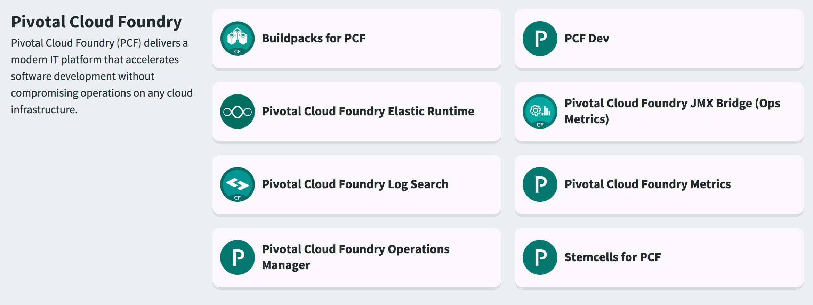

*Figure 14-4 network.pivotal.io, the main download site for Pivotal.*

Relative to Figure 14-4, the following is offered:

- The first item to download and install is Pivotal Cloud Foundry Operations Manager (PCFOM), which is functionally similar to mongoDB Operations Manager. PCFOM is platform specific, specific to a given IaaS; AWS, GCE, VSphere, Azure, other. A given Cloud Found instance may operate on premise, in the cloud, or a mixture thereof, but it will sit atop only one IaaS provider.

- The second item installed is Pivotal Cloud Foundry Elastic Runtime, after which you have the complete (but basic) run time to Cloud Foundry installed and running.

- None of the software available from this site is time bombed or functionally limited.

Figure 14-5 displays a number of the available buildpacks to install. A code review follows.

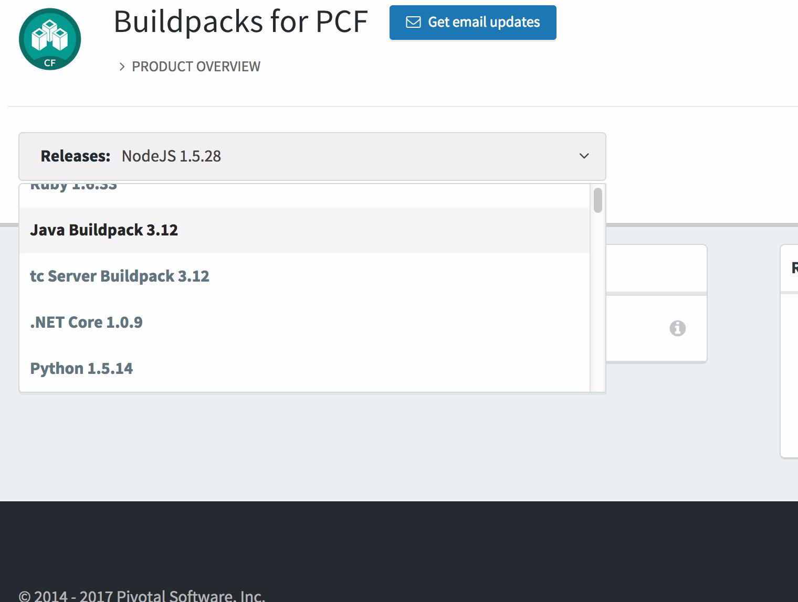

*Figure 14-5 Buildpacks available for Cloud Foundry.*

Relative to Figure 14-5, the following is offered:

- Buildpacks are that entity within Cloud Foundry that automatically detect, package, deploy, monitor and maintain the end user application artifacts that you create. By default no buildpacks are installed, allowing you to choose those that you wish to promote for either production, or first testing and QA. You may customize buildpacks, for example, to specify you support some versions of Java run time and not others.

- In the diagram above, we see buildpacks for Java, Apache Tomcat, [dot].Net, and Python.

Figure 14-6 displays a number of the services that you may choose to install. A code review follows.

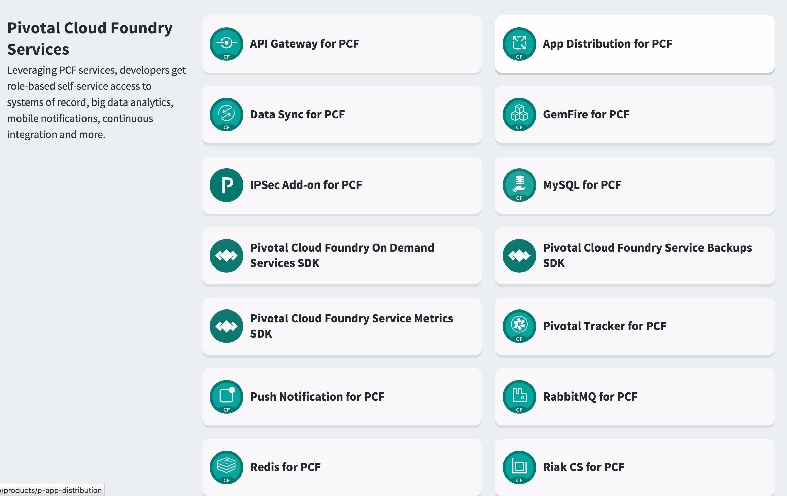

*Figure 14-6 A number of the services tiles that may be installed in Cloud Foundry.*

Relative to Figure 14-6, the following is offered:

- Services are another of the strong value propositions to Cloud Foundry; the ability to developers to self serve, and quickly instantiate their own database servers, message servers, and related, on demand as their develop their application code.

- In the diagram above, we see service tiles ready to install for GemFire, MySQL, RabbitMQ, Redis, Riak, and more.

Figure 14-7 displays a number of additional services, including one for mongoDB. A code review follows.

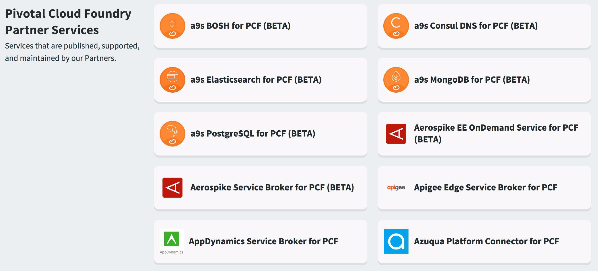

*Figure 14-7 Third party Cloud Foundry service tiles available for install.*

Relative to Figure 14-7, the following is offered:

- This diagram displays partner services, essentially service tiles not created by Pivotal. Pivotal provides service tiles, third parties can provide tiles, and you can write you own service tiles.

- The mongoDB tile displayed by a9s above offers a Community Edition mongoDB with either stand alone or replica set network topologies and is currently in beta. Also in beta (and not displayed) is a mongoDB tile created by Pivotal, with mongoDB slated to adopt support for. This new tile offers stand alone, replica sets, sharded systems, and support for mongoDB Operations Manager. This tile also supports mongoDB Enterprise Edition.

Figure 14-8 displays the Pivotal Cloud Foundry Operations Manager administrative screen at rest (the home page, not currently performing an activity). A code review follows.

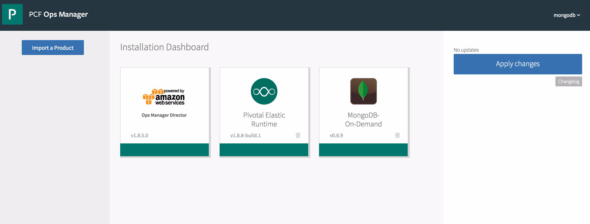

*Figure 14-8 Pivotal Cloud Foundry Ops Manager administrative screen at rest.*

Relative to Figure 14-8, the following is offered:

- The left most tile displayed is for the Pivotal Cloud Foundry Operations Manager application. This tile tells us that this instance of Cloud Foundry is sitting atop AWS, an IaaS provider.

- The middle tile displays Pivotal Cloud Foundry Elastic Runtime, and these two tiles form the basic and full run time installation to Cloud Foundry.

- The third tile is the new/beta Pivotal/mongoDB provided service tile for mongoDB.

Figure 14-9 displays another Pivotal Cloud Foundry installation. A code review follows.

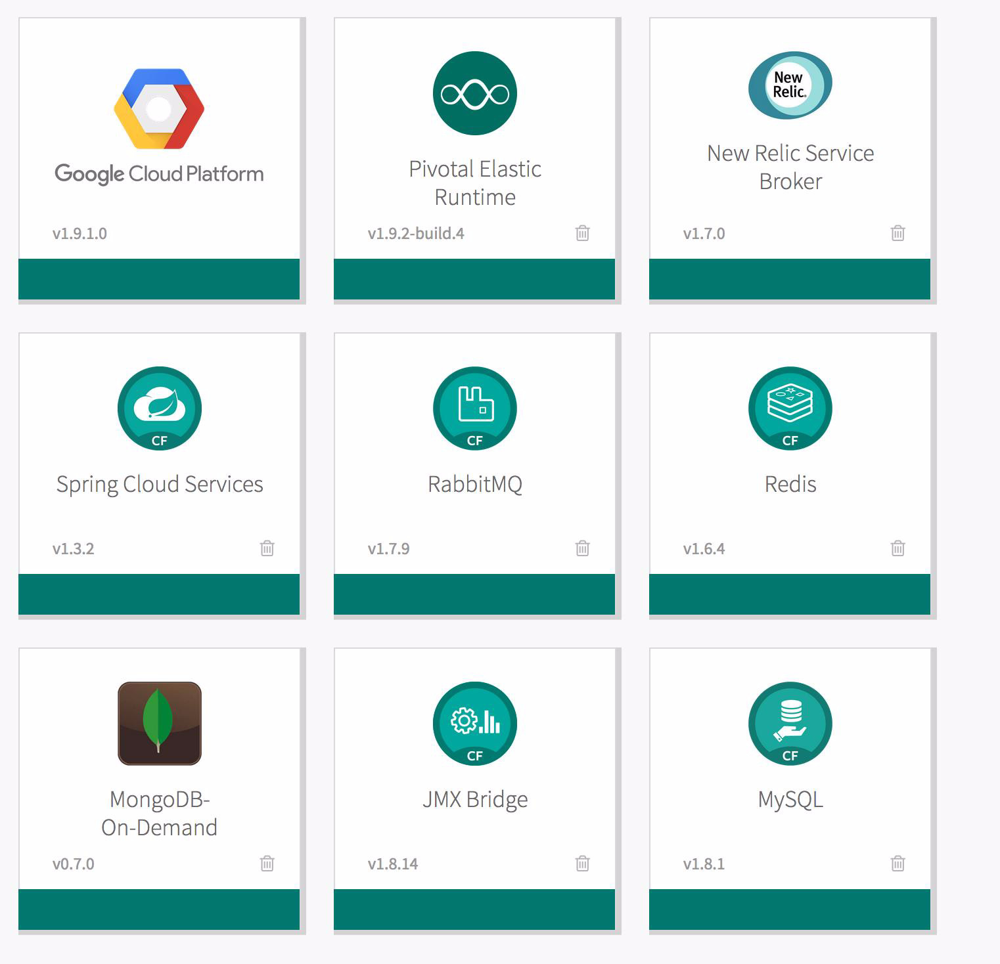

*Figure 14-9 Also Pivotal Cloud Foundry Ops Manager screen at rest.*

Relative to Figure 14-9, the following is offered:

- In this diagram we see that this instance of Cloud Foundry sits atop GCE, an IaaS provider.

- Additional service tiles exists for; RabbitMQ, Redis, MySQL, and mongoDB. With these service tiles, the end user can self serve, and install these types of database servers and related for their development and testing needs.

## 14.2.2 The new mongoDB Pivotal Cloud Foundry services tile

Figure 14-10 displays one of the install and configuration screens inside the mongoDB services tile. A code review follows.

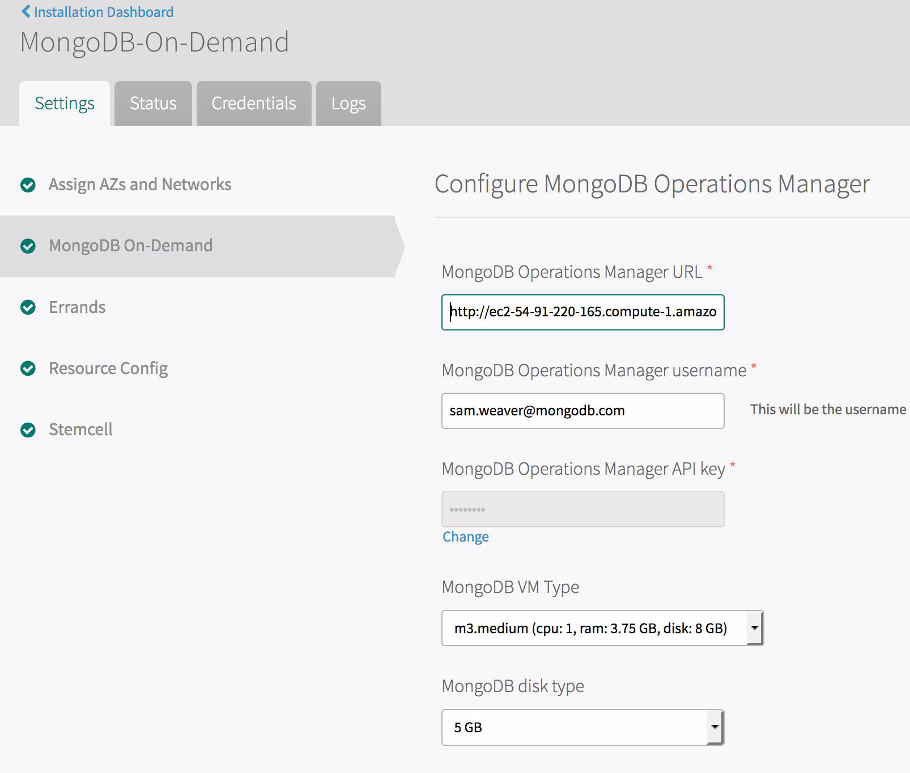

*Figure 14-10 mongoDB tile install and configuration.*

Relative to Figure 14-10, the following is offered:

- The mongoDB Cloud Foundry services tile follows the very same look and feel as all other Cloud Foundry tiles. Generally the TABs across the top of the display are titled: • Settings, configuring the initial install of the given tile, and then any changes to resource allocation post install. • Status, generally of the virtual machines or containers consumed by this asset, how much CPU, memory, disk, and related is consumed. • Credentials, for any of the service accounts associated with this asset, the username and password pairs. • Logs, ability to read, tail, or download associated operating logs.

- And then under settings, a number of TABs on the left side panel: • AZs and networks, how this asset’s traffic is routed within given Cloud Foundry network/sub-networks.

• (mongoDB On Demand, the name of this tile), settings specific to this asset type. In this case, how to log on to the mongoDB Ops Mgr. This tile uses the mongoDB Ops Mgr services API to create any stand alone mongoDB database servers, replica sets, or sharded systems. • Errands, often you can control/reduce the number of tasks performed during deployment of a given tile. This area is often used to debugging or trial on fail. • Resource config, generally raising or lowering the CPU and related dedicated to the operation of the given tile. • Stemcell, which (operating system) to host this asset on.

- You can visit these setting without change at no cost. Upon initial install or later change, you are given the option to deploy this tile with its new settings.

## 14.2.3 Cloud Foundry Applications Manager (App Mgr)

Cloud Foundry has an Operations Manager very similar to the mongoDB Operations Manager. Cloud Foundry also has an Applications Manager. There are at least 3 Urls associated with Cloud Foundry:

- The Url to the Cloud Foundry Operations Manager (Ops Mgr). The Cloud Foundry administrator knows this Url as the result of installing the Cloud Foundry Ops Mgr.

- The Url to the Cloud Foundry Applications Manager (App Mgr). This Url

```text
login.{system domain}
```

defaults to, . The {system domain} value can be discovered from the Elastic Runtime tile -> Settings -> Domains. Example as displayed in Figure 14-11.

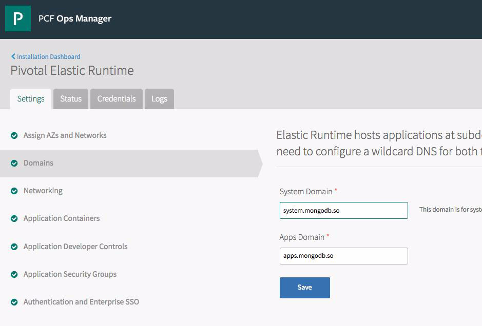

*Figure 14-11 Elastic Runtime -> Settings -> Domains.*

From Figure 14-11 the Url to this system’s Application Manager (Apps

```text
http://login.system.mongodb.so.
```

Mgr) is The administrative username password for Apps Mgr is located under, Elastic Runtime -> Credentials -> Admin Credentials. Example as shown in Figure 14-12.

> Note: Most of the instructions in this section are detailed at, http://docs.pivotal.io/pivotalcf/1-9/customizing/console-login.html

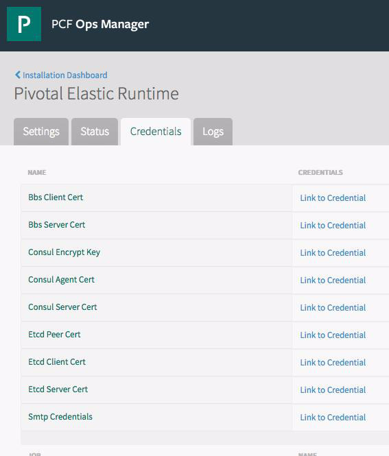

*Figure 14-12 Elastic Runtime -> Credentials -> UAA -> Admin Credentials*

Scroll to the bottom of Figure 14-12 and located UAA -> Admin Credentials. Example as shown in Figure 14-13.

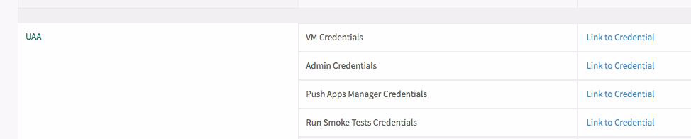

*Figure 14-13 Elastic Runtime -> Credentials -> UAA -> Admin Credentials*

The splash screen to Pivotal Cloud Foundry Application Manager is displayed in Figure 14-14.

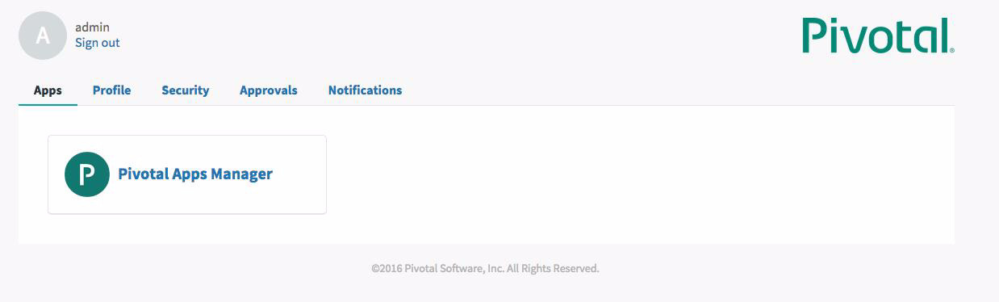

*Figure 14-14 Pivotal Cloud Foundry Apps Mgr login screen.*

- And then the Url to the Cloud Foundry Operations Manager API. This end point is used to deploy applications, scale same, and related. This Url can be discovered inside the Apps Mgr -> Tools. Example as shown in Figure 14-15.

```text
cf
```

We use this Url with the Cloud Foundry command line utility titled, . We detail this utility below.

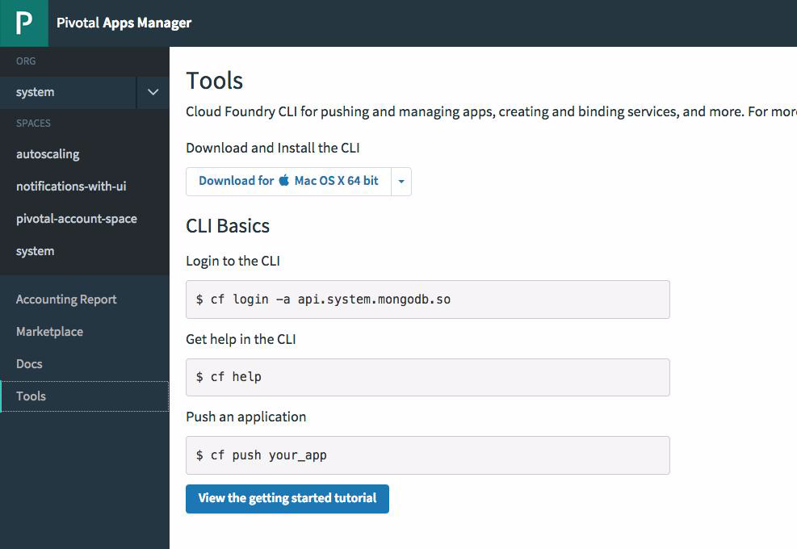

*Figure 14-15 Pivotal Cloud Foundry -> Apps Mgr -> Tools*

## 14.2.4 The new (third version) mongoDB services tile

Above in 14.2.2, “The new mongoDB Pivotal Cloud Foundry services tile” on page 24 we overviewed the installation of the new (third version, from Pivotal and mongoDB) services tile. In this section we detail its use. Recall that the purpose of this tile (or any services tile) is to allow developers to self service; to instantiate and then use database servers and related on demand for the purpose of speeding their application development.

Figure 14-16 displays the beta version mongoDB services tile option in the Cloud Foundry marketplace. A code review follows.

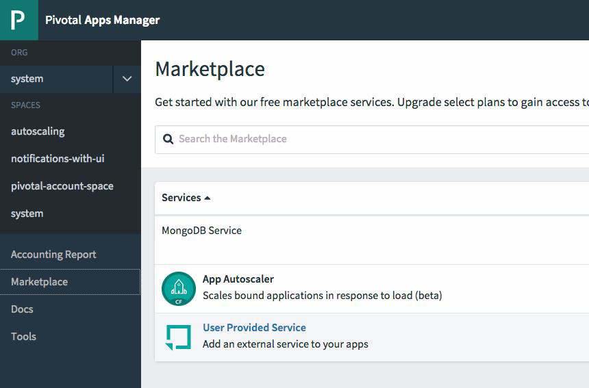

*Figure 14-16 New/beta mongoDB services tile in the marketplace*

Relative to Figure 14-16, the following is offered:

- This is the beta version of the mongoDB services tile created by Pivotal and also mongoDB. This version of tile supports the Enterprise Edition of mongoDB, and the creation of stand alone, replica setted, and then also sharded database server systems. There is also (pre) integration with the mongoDB Operations Manager (Ops Mgr).

- Clicking the mongoDB services tile above produces the display inFigure 14-17. A code review follows.

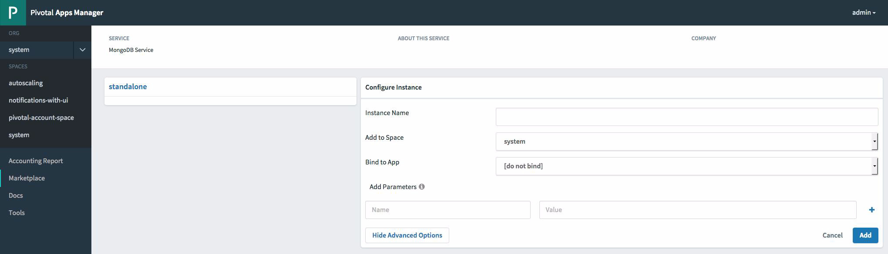

*Figure 14-17 mongoDB services tile, actually creating and setting parameters.*

Relative to Figure 14-17, the following is offered:

- Cloud Foundry has a hierarchical concept of organizations (orgs) and spaces. Orgs are generally equated to projects; the order entry system, time and attendance system, other. And spaces are generally associated with stages in the development cycle; development, test, QA, production. In Figure 14-17, our org is titled, system, and our space it titled, system.

- Each Cloud Foundry service may optionally be associated with a service plan , that is; the Cloud Foundry administrator, the installer of this tile may state (in the content of mongoDB): • Should they allow stand alone installations, replica sets, and/or sharded systems. • In Figure 14-17, the Cloud Foundry administrator is choosing to allow only stand alone systems, although the service tile itself supports high order systems. This is cool, and we wanted to highlight same; after installation of a given service tile, you can still choose to lock things down, restrict access to resource.

- Other visual controls include the ability to: • Instance name; give this distinct copy of the operating service a specific name, so that we may uniquely identify it in reports and similar. • Bind to app (application); as a database server, this instance of this service can serve multiple clients, multiple applications or controllers. Here we can call to bind this service to the first application, after which we can bind more applications.

• Parameters; send parameters to this operating service. E.g., Wired Tiger (memory) Cache Size or similar.

At this point in this document we overviewed the installation and operation of Cloud Foundry, including the new mongoDB services tile. In this next section of this document, we move into actually performing some our own creations and operations first hand.

## 14.2.5 Install pcfdev, cf, deploy a Python app that hits mongoDB

Enough overview, let’s actually do some work using Cloud Foundry.

As detailed above, there are a number of run time options to operating Cloud

```text
pcfdev
```

Foundry. The only option we can reliably run on our laptop is titled, . pcfdev will operate a small, developer only, installation of Cloud Foundry inside a 4 GB RAM virtual machine. Comments include:

- pcfdev is detailed here,

```text
https://docs.pivotal.io/pcf-dev/
https://network.pivotal.io/products/pcfdev#/releases/3553
https://github.com/pivotal-cf/pcfdev/releases/tag/v0.24.0
```

- We also have to separately install the Cloud Foundry command line utility

```text
cf
```

titled, .

```text
cf
```

The utility will allow us to deploy a first time application (for some reason, you can not deploy first time application though Cloud Foundry Apps Mgr), then scale, connect to services, and more.

```text
cf
```

This utility is small, and is the very same utility you use when accessing a full blown Cloud Foundry installation.

- The virtual machine that hosts pcfdev is artificially limited to 4 GB RAM. This virtual machine will not allow you to install additional services tiles (will not allow you to install the mongoDB service tile), but does come with the following pre-installed: • MySQL • Redis • RabbitMQ • Spring Cloud Services; a very cool set of libraries that came from Netflix, now open source. Available only for Java Spring, these libraries jump start your best practice means to deliver 12 factor applications. Since our example uses Python below, this route is not available to us.

Figure 14-18 compares/contrasts a normal Cloud Foundry runtime setup

```text
pcfdev
```

versus that for .

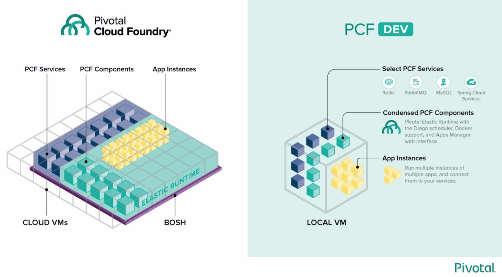

*Figure 14-18 Run time environment for pcfdev.*

> Note: All of the work below is performed on a 64 bit CentOS version 7 Linux operating system.

Install cf Install the latest version of the Cloud Foundry cf command line utility:

- For us, this was version 6.23 of the cf utility-

- Use this download Url,

```text
https://github.com/cloudfoundry/cli#downloads
```

and/or the command,

```text
wget -O /etc/yum.repos.d/cloudfoundry-cli.repo \
https://packages.cloudfoundry.org/fedora/cloudfoundry-cli.repo
```

- Follow the above with a,

```text
yum install -y cf-cli*
/usr/bin
```

- A yum install will place cf in

```text
cf --version
```

You can install verify with a,

Install VirtualBox

```text
pcfdev
```

arrives as a virtual machine, thus we need a hypervisor to actually run it. Oracle VirtualBox is one such hypervisor and the one all of the examples for

```text
pcfdev
```

seem to use.

See this Url for details to installing VirtualBox,

```text
http://tecadmin.net/install-oracle-virtualbox-on-centos-redhat-and-f
edora/#
```

And/or follow these steps:

- Set up a new Linux repository end point that serves VirtualBox, and install same

```text
cd /etc/yum.repos.d/
wget \
http://download.virtualbox.org/virtualbox/rpm/rhel/virtualbox.
repo
rpm -Uvh \
http://epel.mirror.net.in/epel/7/x86_64/e/epel-release-7-8.noa
rch.rpm
```

- VirtualBox needs some specific Linux resources so let’s install those,

```text
yum install -y gcc make patch dkms qt libgomp
yum install -y kernel-headers kernel-devel \
```

fontforge binutils glibc-headers glibc-devel

```text
export KERN_DIR=/usr/src/kernels/2.6.32-504.3.3.el6.x86_64
```

- And finally install VirtualBox and run the VirtualBox graphical user interface,

```text
yum install -y VirtualBox-5.1
virtualbox &
```

Harden your DNS capabilities Cloud Foundry is always stinky with regards to having a production DNS server in place. On our laptop, that is not likely to happen so we’ll cheat be editing

```text
/etc/resolve.conf
```

and referencing the Google DNS server,

```text
vi /etc/resolv.conf
(add this line)
nameserver 8.8.8.8
```

Based on your Linux system settings, you might need to go back and reapply this change between Linux system reboots.

Download pcfdev pcfdev is downloaded from the central Pivotal download site available at,

```text
http://network.pivotal.io
```

. You need a free username password pair. Figure 14-19 displays screen 1 of 2 to the download.

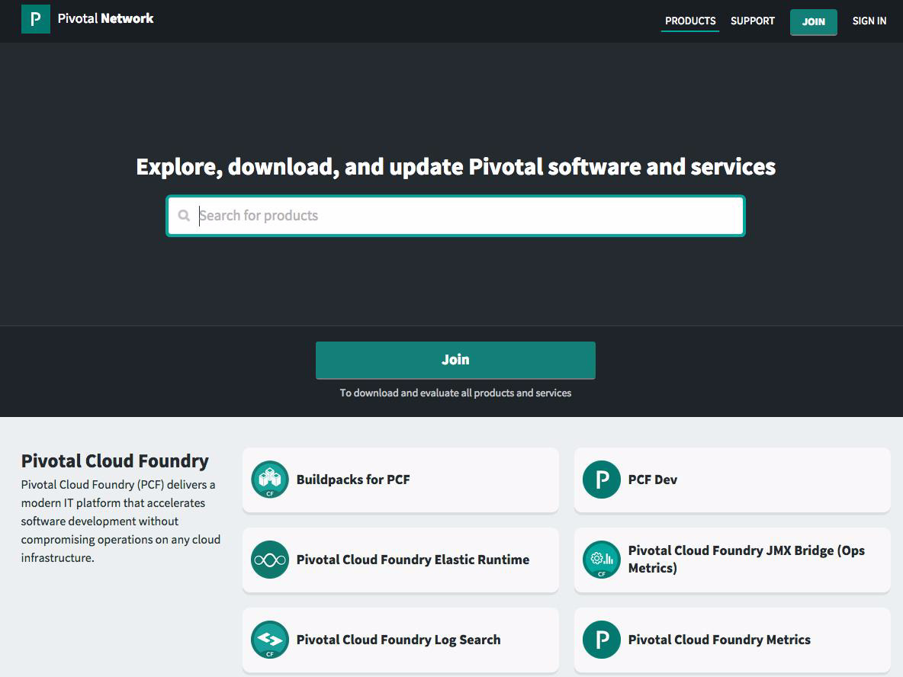

*Figure 14-19 network.pivotal.io, screen 1 of 2 to the download of pcfdev.*

In Figure 14-19, select pcfdev, and then select Linux as displayed in Figure 14-20.

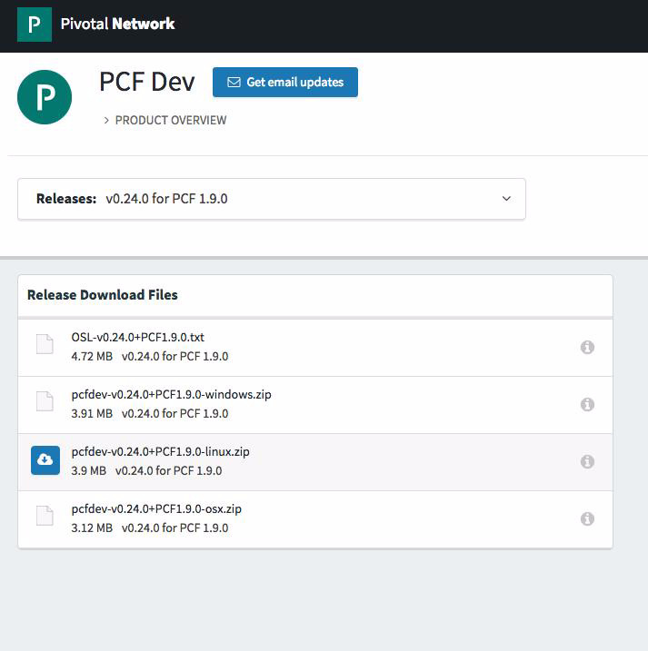

*Figure 14-20 Selecting the Linux OS version of pcfdev.*

The above arrives as a zip file. Unzip this file in a given directory and move forward.

> Note: The download above was not actually the virtual machine. The download above was a binary that extends cf (installs a a plug in into the cf command line utility). It is this plugin that knows how to find and download the virtual machine.

Extend cf, Booting the pcfdev virtual machine Booting pcfdev takes 20-25 or so minutes and is done via the cf command line utility. Example as shown,

- From the directory where pcfdev was downloaded and unzipped, run the binary that you downloaded. This action extends (installs a plugin into) cf.

```text
./pcfdev-v0.24.0+PCF1.9.0-linux
Plugin successfully upgraded. Current version: 0.24.0. For more
info run: cf dev help
```

> Note: Where is this virtual machine on the hard disk ?

Using the VirtualBox graphical user interface, you can determine that this

```text
./pcfdev
```

virtual machine resides in your home directory under, . This image runs about 20 GB.

```text
– Download and boot the pcf virtual machine proper.
cf dev start
(Output from above)
Downloading VM...
Progress: |++++++++++++==> | 69%
VM downloaded.
Allocating 3893 MB out of 7787 MB total system memory (6847 MB
free).
Importing VM...
Starting VM...
Provisioning VM...
Waiting for services to start...
8 out of 57 running
8 out of 57 running
8 out of 57 running
39 out of 57 running
57 out of 57 running
_______ _______ _______ ______ _______ __ __
| || || | | | | || | | |
| _ || || ___| | _ || ___|| |_| |
| |_| || || |___ | | | || |___ | |
| ___|| _|| ___| | |_| || ___|| |
| | | |_ | | | || |___ | |
|___| |_______||___| |______| |_______| |___|
is now running.
To begin using PCF Dev, please run:
```

```text
cf login -a https://api.local.pcfdev.io
--skip-ssl-validation
Apps Manager URL: https://local.pcfdev.io
Admin user => Email: admin / Password: admin
Regular user => Email: user / Password: pass
```

You can witness the virtual machine hosting pcfdev in the VirtualBox graphical user interface. Example as shown in Figure 14-21.

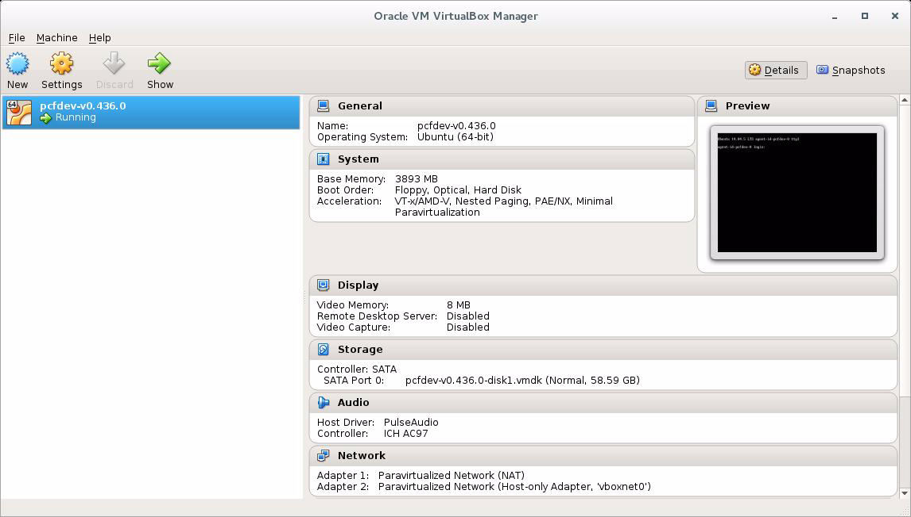

*Figure 14-21 pcfdev in the VirtualBox GUI.*

> Note: If any of these steps fail, or fail to re-run on second and iterative attempts, you can always perform the following-

```text
cf dev stop
cf dev destroy
```

```text
cf dev start
```

Logging into pcfdev, setting the endpoint Thus far we virtual machine host pcfdev booted, but we have not logged in. Pretty much per the output from above, run a

```text
cf login -a https://api.local.pcfdev.io --skip-ssl-validation
API endpoint: https://api.local.pcfdev.io
Email> user
Password>
Authenticating...
OK
Targeted org pcfdev-org
Targeted space pcfdev-space
API endpoint: https://api.local.pcfdev.io (API version: 2.65.0)
User: user
Org: pcfdev-org
Space: pcfdev-space
```

Relative to the above, the following is offered:

```text
cf login
-a
```

– with a argument combines two operations- cf will maintain your default endpoint, that is; the default Cloud Foundry

```text
cf
cf api
```

instance that will target. You can set the endpoint via a, .

```text
cf login.
```

And you can login separately via a, As stated from the output above, the default username password pair for

```text
pcfdev
user pass
```

is, .

```text
cf
```

- A couple of random commands-

```text
cf m
```

• , will report the tiles installed in the Cloud Foundry marketplace. Per the discussion above, there are a number of services pre-installed

```text
pcfdev
```

into .

```text
cf a
```

• , will report the application that are installed. There should be none currently.

```text
cf services
```

• , will report any services that are instantiated/operating. Again, there should be none.

```text
cf --help
```

• , reports all arguments to cf.

Apps Mgr (to pcfdev) The documentation page to pcfdev tells us the Url to the Apps Mgr (Pivotal Cloud Foundry Application Manager) for this instance of Cloud Foundry. See,

```text
https://docs.pivotal.io/pcf-dev/usage.html#pcf-dev
https://local.pcfdev.io/
```

```text
pcfdev
```

Figure 14-22 displays the Apps Mgr screen embedded inside the virtual

```text
cf
```

machine. From this point forward, we will use the command line utility, but you can also experiment using this Web UI.

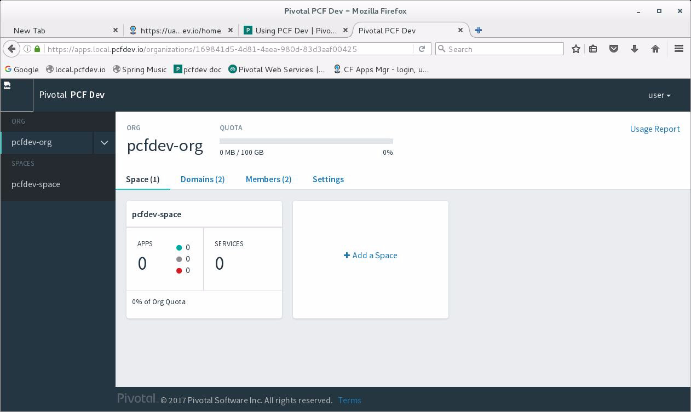

*Figure 14-22 Apps Mgr embedded inside pcfdev.*

Deploy a Python Web application Unlike the Java Web application discussed above, Python (Web) applications do not have a standard packaging (Gradle, or Maven build files), or standard table of contents mechanism similar to Java Jars. Thus, Cloud Foundry specifies these requirements for you.

We found this Url handy for deciphering how to package a Python Web application so that Cloud Foundry can understand how to deploy it,

```text
https://github.com/ihuston/python-cf-examples
```

In effect, you need to supply 3 ASCII text files over and above your Python Web application proper. These 3 files are:

- manifest.yml manifest.yml is a standard YaML formatted Cloud Foundry distribution file which tells Cloud Foundry, among other things, what you want to name this application instance (used for reporting later), how much memory to give it, and more. Here is the manifest.yml file we supplied in the root of the application directory,

```text
---
applications:
- name: myapp56
memory: 128MB
disk_quota: 256MB
random-route: true
buildpack: python_buildpack
command: python E10_Main.py
```

- requirements.txt Tells Cloud Foundry which Python dependencies (which standard Python libraries), this specific Python (Web) application requires. We used Python/Flask to program our Web application and our requirements.txt file states same. Example requirements.txt as shown,

```text
Flask
```

- runtime.txt Tells Cloud Foundry which Python runtime version we require. Example runtime.txt as shown, python-2.7.11

And then our Python Web application proper as displayed in Example 14-1. A code review follows.

### Example 14-1 Our sample Python Web application.

```text
from flask import Flask, render_template, request, jsonify
import os
import ast
```

```text
m_app = Flask(__name__)
```

```text
m_templateDir = os.path.abspath("45_views" )
m_staticDir = os.path.abspath("44_static")
#
m_app.template_folder = m_templateDir
m_app.static_folder = m_staticDir
```

```text
# Get port from environment variable or choose 9099 as local default
port = int(os.getenv("PORT", 9099))
```

```text
@m_app.route('/')
def overview_tab():
return render_template("10_Index.html")
```

```text
@m_app.route('/exec_tab1')
def refresh_tab1():
l_textFld1 = request.args.get("text_fld1")
l_textFld2 = request.args.get("text_fld2")
#
l_dict = {}
l_dict["text_fld3"] = ( l_textFld1 + " " + l_textFld2 )
```

```text
return jsonify(l_dict)
```

```text
if __name__ == '__main__':
# Run the app, listening on all IPs with our chosen port number
m_app.run(host='0.0.0.0', port=port)
```

Relative to Example 14-1, the following is offered:

- This Web application is way more complex than it needs to be. (Way more complex than “Hello World”.) This application uses single page load, asynchronous JavaScript messaging in the background. To do this, our HTML page template loads a given jQuery JavaScript library (not displayed here.) This file is titled, E10_Main.py, and is run via a, python E10_Main.py.

- The IP address we request is listed as 0.0.0.0, and is an IP address that will be supplied by Cloud Foundry. We could also request a given IP address, but for testing run the risk that this address will be out of range.

- There is code to specifically set the port number via an environment variable, or via a default. (The default is specified to be, 9099.) In a production application, we should be using a configuration server similar to Spring Cloud Services to determine these values.

Example 14-2 displays the HTML template we use. A code review follows:

### Example 14-2 Our HTML template for this example.

```text
<html>
```

```text
<head>
<title>
```

```text
Variable type returned from a Web form
</title>
<script src="{{ url_for('static', filename='10_jquery.min.js') }}">
</script>
</head>
```

```text
<!-- --------------------------------------------------- -->
```

```text
<body>
```

```text
<h1>
My Web form:
</h1>
<br>
<br>
<form>
<input type ="submit" id="exec_tab1" value="Submit">
<br>
<br>
<input type="text" id="text_fld1" size="80" >
<br>
<br>
<input type="text" id="text_fld2" size="80" >
<br>
<br>
<input type="text" id="text_fld3" size="80" readonly="readonly" >
</form>
```

```text
<!-- --------------------------------------------------- -->
```

```text
<script type="text/javascript">
```

```text
function f_execTab1() {
$.getJSON(
"/exec_tab1",
{
'text_fld1': $('input[id="text_fld1"]').val(),
'text_fld2': $('input[id="text_fld2"]').val()
},
function(r_retValue) {
document.getElementById("text_fld1").value = "";
document.getElementById("text_fld2").value = "";
//
document.getElementById("text_fld3").value = r_retValue.text_fld3;
});
return false;
}
```

```text
document.getElementById("exec_tab1").onclick = f_execTab1;
```

```text
</script>
```

```text
<!-- --------------------------------------------------- -->
```

```text
</body>
```

```text
</html>
```

Relative to Example 14-2, the following is offered:

- So again, this example is way more complex than, “Hello World”; single page application, asynchronous messaging. Most relevant is we load a jQuery JavaScript library, and then a (submit) by the HTML form calls a JavaScript method, versus an HTML POST.

- In effect, we send the values of two text fields to the server (our Python controller). This controller concatenates these two values and returns them into a third, read-only field.

Deploy this application from the parent directory (the directory containing the 3 ASCII text files and the E10_Main.py file), using a,

```text
cf push
(Output from cf push)
cf push
Using manifest file
/mnt/hgfs/My.18/MyShare_1/50_MDN/14_CloudFoundry/python-app/manif
est.yml
```

```text
Creating app myapp56 in org pcfdev-org / space pcfdev-space as
user...
OK
```

```text
Creating route
myapp56-nonincriminating-patriotism.local.pcfdev.io...
OK
```

```text
Binding myapp56-nonincriminating-patriotism.local.pcfdev.io to
myapp56...
```

```text
OK
```

```text
Uploading myapp56...
Uploading app files from:
/mnt/hgfs/My.18/MyShare_1/50_MDN/14_CloudFoundry/python-app
Uploading 35.7K, 9 files
Done uploading
OK
```

```text
Starting app myapp56 in org pcfdev-org / space pcfdev-space as
user...
Downloading python_buildpack...
Downloaded python_buildpack (255.3M)
Creating container
Successfully created container
Downloading app package...
Downloaded app package (35.3K)
Staging...
-------> Buildpack version 1.5.12
! Warning: Your application is missing a Procfile. This file
tells Cloud Foundry how to run your application.
! Learn more:
https://docs.cloudfoundry.org/buildpacks/prod-server.html#procfil
e
-----> Installing python-2.7.11
Downloaded
[file:///tmp/buildpack/dependencies/https___buildpacks.cloudfound
ry.org_concourse-binaries_python_python-2.7.11-linux-x64.tgz]
$ pip install -r requirements.txt
Collecting Flask (from -r requirements.txt (line 1))
Downloading Flask-0.12-py2.py3-none-any.whl (82kB)
Collecting click>=2.0 (from Flask->-r requirements.txt
(line 1))
Downloading click-6.7-py2.py3-none-any.whl (71kB)
```

```text
Collecting Jinja2>=2.4 (from Flask->-r requirements.txt
(line 1))
Downloading Jinja2-2.9.5-py2.py3-none-any.whl (340kB)
Collecting Werkzeug>=0.7 (from Flask->-r requirements.txt
(line 1))
Downloading Werkzeug-0.11.15-py2.py3-none-any.whl (307kB)
Collecting itsdangerous>=0.21 (from Flask->-r
requirements.txt (line 1))
Downloading itsdangerous-0.24.tar.gz (46kB)
Collecting MarkupSafe>=0.23 (from Jinja2>=2.4->Flask->-r
requirements.txt (line 1))
Downloading MarkupSafe-0.23.tar.gz
Installing collected packages: click, MarkupSafe, Jinja2,
Werkzeug, itsdangerous, Flask
Running setup.py install for MarkupSafe: started
Running setup.py install for MarkupSafe: finished with
status 'done'
Running setup.py install for itsdangerous: started
Running setup.py install for itsdangerous: finished with
status 'done'
Successfully installed Flask-0.12 Jinja2-2.9.5
MarkupSafe-0.23 Werkzeug-0.11.15 click-6.7 itsdangerous-0.24
You are using pip version 8.1.2, however version 9.0.1 is
available.
You should consider upgrading via the 'pip install --upgrade pip'
command.
You are using pip version 8.1.2, however version 9.0.1 is
available.
You should consider upgrading via the 'pip install --upgrade pip'
command.
No start command specified by buildpack or via Procfile.
App will not start unless a command is provided at runtime.
Exit status 0
Staging complete
Uploading droplet, build artifacts cache...
```

```text
Uploading build artifacts cache...
Uploading droplet...
Uploaded droplet (30.2M)
Uploading complete
Destroying container
Successfully destroyed container
```

```text
1 of 1 instances running
```

```text
App started
OK
```

```text
App myapp56 was started using this command `python E10_Main.py`
```

```text
Showing health and status for app myapp56 in org pcfdev-org /
space pcfdev-space as user...
OK
```

```text
requested state: started
instances: 1/1
usage: 128M x 1 instances
urls: myapp56-nonincriminating-patriotism.local.pcfdev.io
last uploaded: Sat Jan 28 20:56:30 UTC 2017
stack: cflinuxfs2
buildpack: python_buildpack
```

```text
state since cpu memory disk
details
#0 running 2017-01-28 01:57:54 PM 0.0% 820K of 128M 2M
of 256M
```

The very end of the output above displays the Url of our now deployed Python Web application,

```text
http://myapp56-nonincriminating-patriotism.local.pcfdev.io
```

For testing purposes only, call to scale this application. Example as shown,

```text
cf a
Getting apps in org pcfdev-org / space pcfdev-space as user...
OK
name requested state instances memory disk urls
myapp56 started 1/1 128M 256M
myapp56-nonincriminating-patriotism.local.pcfdev.io
#
# cf scale myapp56 -i 2
Scaling app myapp56 in org pcfdev-org / space pcfdev-space as user...
OK
#
# cf a
Getting apps in org pcfdev-org / space pcfdev-space as user...
OK
name requested state instances memory disk urls
myapp56 started 2/2 128M 256M
myapp56-nonincriminating-patriotism.local.pcfdev.io
```

## 14.3 In this document, we reviewed or created:

We overviewed the following topics: model-view-controller, stateful/stateless applications, IaaS, PaaS, containers, application packaging (Gradle, Maven), Cloud Foundry, services, user defined services, Cloud Foundry marketplace, and micro-services.

```text
pcfdev
```

Then we installed , a laptop capable Cloud Foundry runtime, and deployed and scaled a Python Web application.

### Persons who help this month.

Dave Lutz, Shawn McCarthy, Thomas Boyd, and Sam Weaver.

### Additional resources:

Free mongoDB training courses,

```text
https://university.mongoDB.com/
```

This document is located here,

```text
https://github.com/farrell0/mongoDB-Developers-Notebook
```
