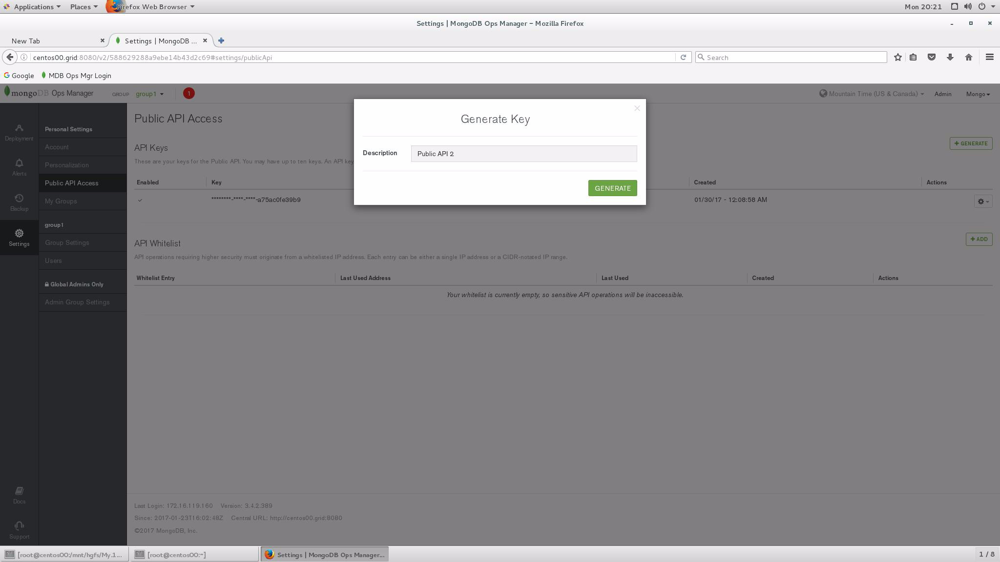
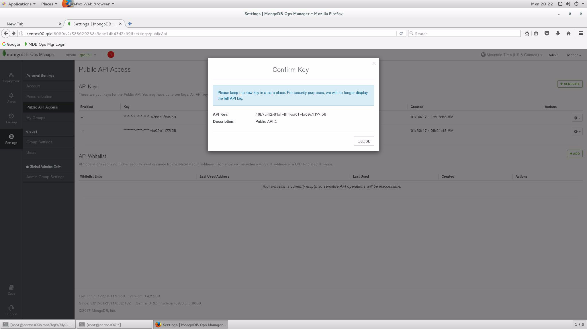
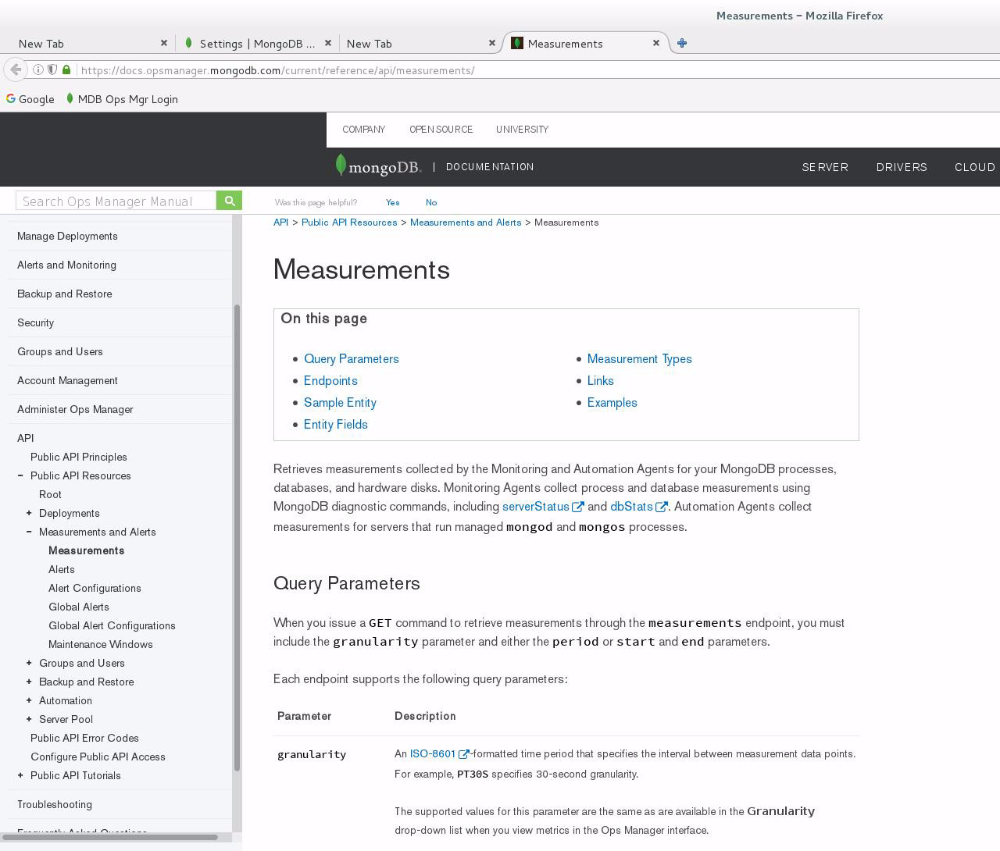

# March 2017: Monitoring

[Browse 2017](../README.md)

[Back to home](../../README.md)

Original PDF: [MDB_DN_2017_15_Monitoringb.pdf](./MDB_DN_2017_15_Monitoringb.pdf)

---
## Chapter 14. March 2017

Welcome to the March 2017 edition of mongoDB Developer’s Notebook (MDB-DN). This month we answer the following question(s); My company is committing to mongoDB in a large way. Over the years and with prior technologies, we have built our own single pane of glass to monitor all of our server systems; reporting server events, significant performance statistics, items to watch for tuning, faults, and more. What does mongoDB offer in this area ? Excellent question ! We can’t promise we will cover every topic in this area as the basic question you ask is essentially; tell me everything I need to know. We will, however, list many of our favorites in the area of monitoring, statistics, tuning, and more. Where it makes sense below we offer sample code. And in each case, we list the documentation Url for further research as your specific needs and intents make suggest.

## Software versions

The primary mongoDB software component used in this edition of MDB-DN is the mongoDB database server core, currently release 3.4. All of the software referenced is available for download at the URL's specified, in either trial or community editions. A portion of what we detail in this document makes use of the mongoDB Operations Manager (Ops Mgr) system, which we detail at the appropriate time.

All of these solutions were developed and tested on a single tier CentOS 7.0 operating system, running in a VMWare Fusion version 8.1 virtual machine. The mongoDB server software is version 3.4, and unless otherwise specified is running on one node, with no shards and no replicas. All software is 64 bit.

## 14.1 Terms and core concepts

In this document we detail each of the following topics:

- Using the mongoDB Operations Manger (Ops Mgr) management API. Ops Mgr is simply a Web interface. All of the routines and reporting that this Ops Mgr supplies come from a standard restful API delivered as part of Ops Mgr. We program a Python client to access this management API, show some statistics to cover the point, then overview a documentation Url. We detailed the installation, configuration and use of Ops Mgr in the November/2016 edition of this document.

- Detail use of db.serverStatus(). This administrative server method is HUGE. There are a ton of very useful data points under here including server cache rates and more. We program a Python client to access a portion of these statistics.

- Tail the mongoDB OpLog. We detailed this technique in the January/2017 edition of this same document when we read the mongoDB transaction log file (OpLog), and pushed these changes (and associated data) into a Kafka messaging system. We will overview that technique again in this document.

- Index usage, and query plans. Every other item in this list is pertinent to mongoDB server system tuning and monitoring. You can, however, have a mongoDB system that is tuned perfectly, and still not be observing the best possible performance. You must also give attention to tuning and monitoring of the routines that the mongoDB system is processing; thus, monitoring and tuning index and and query plans. We covered this entire topic in detail in the May/2016 edition of this document, and overview the topic again briefly below.

- View the mongoDB (message) log file. In addition to the mongoDB transaction log file (OpLog), mongoDB also has a (message) log file on disk; some new data, some redundant between the two subsystems. We detail this file on disk, and also a means to read this data through a client side query routine.

- And finally the mongodB auditing subsystem; similar to most enterprise grade servers, mongoDB includes a subsystem to capture and log given

systems events; logins, system data definition language statements, and more.

mongoDB Ops Mgr management API As stated above, the November/2016 edition of this same document detailed the installation, configuration and use of mongoDB Operations Manager (Ops Mgr). In that document we did not cover the Ops Mgr management API, and choose to do so now. Comments related to this task:

- The Ops Mgr Web interface is merely a skin, a presentation layer, and uses the very same Ops Mgr management API; this is a public API. This means that if there is a routine or statistic that Ops Mgr can complete or report on, you can also with your own programming.

- After you use the Ops Mgr Web interface to create the (Ops Mgr) API (access) key, the rest is simple client programming; using the management API. This assumes you have a functioning Ops Mgr installation, and sufficient authority to create a key, or access to an administrator to complete same.

Figure 14-1 displays screen one of (n) towards making an API (access) key. A code review follows.



*Figure 14-1 Step 1 of (n) to creating an Ops Mgr management API (access) key.*

Relative Figure 14-1, the following is offered:

- Ops Mgr management (access) API keys are per group.

- In the image above we selected, (The Group we wish to provide access to) -> Settings -> Public API Access -> Generate (Key). This action produces the model dialog box as displayed. In this box we enter a logical name for this key, and click, Generate. If we have not authenticated in a while, we are prompted to enter our password and click, OK.

- The action above produces the modal dialog box as displayed in Figure 14-2. A code review follows.



*Figure 14-2 Step 2 of (n) to creating an Ops Mgr management API (access) key.*

Relative to Figure 14-2, the following is offered:

- The figure above displays our generated key value. Save this value; it is essentially a password and there is no means to recover it short of creating a new key.

- After exiting this screen, you are ready to begin using the Ops Mgr management API.

Example 14-1 lists a Python program that access the Ops Mgr management API. A code review follows:

### Example 14-1 Python program that uses the Ops Mgr management API.

```text
from requests.auth import HTTPDigestAuth
import requests
```

```text
#############################################################
```

```text
m_argsHost = "http://centos00.grid:8080"
m_groupId = "588629288a9ebe14b43d2c69"
m_username = "mongo_ops@centos00.grid"
m_apiKey = "01682ca6-27b7-4983-a115-a75ac0fe39b9"
```

```text
#############################################################
```

```text
# Agents, there are 3; MONITORING, BACKUP, AUTOMATION
```

```text
my_req = requests.get(m_argsHost +
"/api/public/v1.0/groups/" +
m_groupId + "/agents/MONITORING",
auth=HTTPDigestAuth(m_username,m_apiKey))
```

```text
print " "
print "Agents: Monitofing"
```

```text
print my_req.json()
```

```text
print " "
print " "
```

```text
# {
# u'totalCount': 1, u'results':
# [
# {
# u'lastPing': u'2017-01-30T04:17:15Z',
# u'stateName': u'ACTIVE',
# u'hostname': u'centos00.grid',
# u'typeName': u'MONITORING',
# u'isManaged': True,
# u'pingCount': 1585,
```

```text
# u'lastConf': u'2017-01-30T04:17:11Z',
# u'confCount': 1586
# }
# ],
# u'links':
# [
# {
# u'href':
u'http://centos00.grid:8080/api/public/v1.0/groups/588629288a9ebe14b43d2c69/age
nts/MONITORING?pageNum=1&itemsPerPage=100',
# u'rel': u'self'
# }
# ]
# }
```

```text
#############################################################
```

```text
# Hosts
```

```text
my_req = requests.get(m_argsHost +
"/api/public/v1.0/groups/" +
m_groupId + "/hosts",
auth=HTTPDigestAuth(m_username,m_apiKey))
```

```text
print " "
print "Hosts"
```

```text
print my_req.json()
```

```text
print " "
print " "
```

```text
# {
# u'totalCount': 3,
# u'results':
# [
# {
# u'profilerEnabled': True,
# u'links':
# [
# {
# u'href':
u'http://centos00.grid:8080/api/public/v1.0/groups/588629288a9ebe14b43d2c69/hos
ts/cf554582a93d78d47e7b45973c60e2dd',
# u'rel': u'self'
# }
```

```text
# ],
# u'authMechanismName': u'NONE',
# u'clusterId': u'5886424e8a9ebe0d05eeaf8e',
# u'typeName': u'REPLICA_PRIMARY',
# u'logsEnabled': False,
# u'uptimeMsec': 31406,
# u'id': u'cf554582a93d78d47e7b45973c60e2dd',
# u'lastPing': u'2017-01-30T04:25:30Z',
# u'hostname': u'centos00.grid',
# u'port': 27000,
# u'version': u'3.4.1',
# u'lowUlimit': False,
# u'alertsEnabled': True,
# u'hidden': False,
# u'replicaSetName': u'centos00_rs0',
# u'replicaStateName': u'PRIMARY',
# u'lastDataSizeBytes': 221614496,
# u'muninEnabled': False,
# u'hasStartupWarnings': True,
# u'journalingEnabled': False,
# u'lastRestart': u'2017-01-29T19:42:58Z',
# u'groupId': u'588629288a9ebe14b43d2c69',
# u'lastIndexSizeBytes': 17731584,
# u'deactivated': False,
# u'created': u'2017-01-23T17:46:10Z',
# u'sslEnabled': False,
# u'hostEnabled': True,
# u'ipAddress': u'172.16.119.160'},
# {
# u'profilerEnabled': True,
# u'links':
# [
# {
# u'href':
u'http://centos00.grid:8080/api/public/v1.0/groups/588629288a9ebe14b43d2c69/hos
ts/044a3f66fa6ae8e9b1bbfd1ce8332e4e',
# u'rel': u'self'
# }
# ],
# u'authMechanismName': u'NONE',
# u'clusterId': u'5886424e8a9ebe0d05eeaf8e',
# u'typeName': u'REPLICA_SECONDARY',
# u'logsEnabled': False,
# u'uptimeMsec': 31406,
# u'id': u'044a3f66fa6ae8e9b1bbfd1ce8332e4e',
# u'lastPing': u'2017-01-30T04:25:30Z',
# u'hostname': u'centos00.grid',
# u'port': 27001,
# u'version': u'3.4.1',
```

```text
# u'lowUlimit': False,
# u'alertsEnabled': True,
# u'hidden': False,
# u'replicaSetName': u'centos00_rs0',
# u'replicaStateName': u'SECONDARY',
# u'lastDataSizeBytes': 222736498,
# u'muninEnabled': False,
# u'hasStartupWarnings': True,
# u'journalingEnabled': False,
# u'lastRestart': u'2017-01-29T19:42:58Z',
# u'groupId': u'588629288a9ebe14b43d2c69',
# u'lastIndexSizeBytes': 17694720,
# u'deactivated': False,
# u'created': u'2017-01-23T17:46:10Z',
# u'sslEnabled': False,
# u'hostEnabled': True,
# u'ipAddress': u'172.16.119.160'
# },
# {
# u'profilerEnabled': True,
# u'links':
# [
# {
# u'href':
u'http://centos00.grid:8080/api/public/v1.0/groups/588629288a9ebe14b43d2c69/hos
ts/ba2161d76f9c508528296c3836acf072',
# u'rel': u'self'
# }
# ],
# u'authMechanismName': u'NONE',
# u'clusterId': u'5886424e8a9ebe0d05eeaf8e',
# u'typeName': u'REPLICA_SECONDARY',
# u'logsEnabled': False,
# u'uptimeMsec': 31405,
# u'id': u'ba2161d76f9c508528296c3836acf072',
# u'lastPing': u'2017-01-30T04:25:30Z',
# u'hostname': u'centos00.grid',
# u'port': 27002,
# u'version': u'3.4.1',
# u'lowUlimit': False,
# u'alertsEnabled': True,
# u'hidden': False,
# u'replicaSetName': u'centos00_rs0',
# u'replicaStateName': u'SECONDARY',
# u'lastDataSizeBytes': 222655257,
# u'muninEnabled': False,
# u'hasStartupWarnings': True,
# u'journalingEnabled': False,
# u'lastRestart': u'2017-01-29T19:42:58Z',
```

```text
# u'groupId': u'588629288a9ebe14b43d2c69',
# u'lastIndexSizeBytes': 17682432,
# u'deactivated': False,
# u'created': u'2017-01-23T17:46:10Z',
# u'sslEnabled': False,
# u'hostEnabled': True,
# u'ipAddress': u'172.16.119.160'
# }
# ],
# u'links':
# [
# {
# u'href':
u'http://centos00.grid:8080/api/public/v1.0/groups/588629288a9ebe14b43d2c69/hos
ts?pageNum=1&itemsPerPage=100',
# u'rel': u'self'
# }
# ]
# }
```

```text
#############################################################
```

```text
# Disks (per host)
```

```text
m_host = "cf554582a93d78d47e7b45973c60e2dd"
```

```text
my_req = requests.get(m_argsHost +
"/api/public/v1.0/groups/" +
m_groupId + "/hosts/" + m_host +
"/disks",
auth=HTTPDigestAuth(m_username,m_apiKey))
```

```text
print " "
print "Disks"
```

```text
print my_req.json()
```

```text
print " "
print " "
```

```text
m_host = "044a3f66fa6ae8e9b1bbfd1ce8332e4e"
```

```text
my_req = requests.get(m_argsHost +
"/api/public/v1.0/groups/" +
```

```text
m_groupId + "/hosts/" + m_host +
"/disks",
auth=HTTPDigestAuth(m_username,m_apiKey))
```

```text
print " "
print "Disks"
```

```text
print my_req.json()
```

```text
print " "
print " "
```

```text
m_host = "ba2161d76f9c508528296c3836acf072"
```

```text
my_req = requests.get(m_argsHost +
"/api/public/v1.0/groups/" +
m_groupId + "/hosts/" + m_host +
"/disks",
auth=HTTPDigestAuth(m_username,m_apiKey))
```

```text
print " "
print "Disks"
```

```text
print my_req.json()
```

```text
print " "
print " "
```

```text
# {
# u'totalCount': 1,
# u'results':
# [
# {
# u'partitionName': u'sda1',
# u'links':
# [
# {
# u'href':
u'http://centos00.grid:8080/api/public/v1.0/groups/588629288a9ebe14b43d2c69/hos
ts/cf554582a93d78d47e7b45973c60e2dd/disks/sda1',
# u'rel': u'self'
# }
# ]
# }
# ],
```

```text
# u'links':
# [
# {
# u'href':
u'http://centos00.grid:8080/api/public/v1.0/groups/588629288a9ebe14b43d2c69/hos
ts/cf554582a93d78d47e7b45973c60e2dd/disks?pageNum=1&itemsPerPage=100',
# u'rel': u'self'
# }
# ]
# }
```

```text
# {
# u'totalCount': 1,
# u'results':
# [
# {
# u'partitionName': u'sda1',
# u'links':
# [
# {
# u'href':
u'http://centos00.grid:8080/api/public/v1.0/groups/588629288a9ebe14b43d2c69/hos
ts/044a3f66fa6ae8e9b1bbfd1ce8332e4e/disks/sda1',
# u'rel': u'self'
# }
# ]
# }
# ],
# u'links':
# [
# {
# u'href':
u'http://centos00.grid:8080/api/public/v1.0/groups/588629288a9ebe14b43d2c69/hos
ts/044a3f66fa6ae8e9b1bbfd1ce8332e4e/disks?pageNum=1&itemsPerPage=100',
# u'rel': u'self'
# }
# ]
# }
```

```text
# {
# u'totalCount': 1,
# u'results':
# [
# {
# u'partitionName': u'sda1',
# u'links':
# [
```

```text
# {
# u'href':
u'http://centos00.grid:8080/api/public/v1.0/groups/588629288a9ebe14b43d2c69/hos
ts/ba2161d76f9c508528296c3836acf072/disks/sda1',
# u'rel': u'self'
# }
# ]
# }
# ],
# u'links':
# [
# {
# u'href':
u'http://centos00.grid:8080/api/public/v1.0/groups/588629288a9ebe14b43d2c69/hos
ts/ba2161d76f9c508528296c3836acf072/disks?pageNum=1&itemsPerPage=100',
# u'rel': u'self'
# }
# ]
# }
```

```text
#############################################################
```

```text
# clear
#
# # Get agent configs
#
# echo "AGENTS"
# curl -u "mongo_ops@centos00.grid:831bc21e-3b35-4349-96a1-ca59d42b6b7c"
--digest -i \
#
"http://centos00.grid:8080/api/public/v1.0/groups/588629288a9ebe14b43d2c69/agen
ts/MONITORING"
# echo " "
# echo " "
# echo " "
#
# echo "AGENTS"
# curl -u "mongo_ops@centos00.grid:831bc21e-3b35-4349-96a1-ca59d42b6b7c"
--digest -i \
#
"http://centos00.grid:8080/api/public/v1.0/groups/588629288a9ebe14b43d2c69/agen
ts/BACKUP"
# echo " "
# echo " "
# echo " "
#
# echo "AGENTS"
```

```text
# curl -u "mongo_ops@centos00.grid:831bc21e-3b35-4349-96a1-ca59d42b6b7c"
--digest -i \
#
"http://centos00.grid:8080/api/public/v1.0/groups/588629288a9ebe14b43d2c69/agen
ts/AUTOMATION"
# echo " "
# echo " "
# echo " "
#
# echo "HOSTS"
# curl -u "mongo_ops@centos00.grid:831bc21e-3b35-4349-96a1-ca59d42b6b7c"
--digest -i \
#
"http://centos00.grid:8080/api/public/v1.0/groups/588629288a9ebe14b43d2c69/host
s"
# echo " "
# echo " "
# echo " "
#
# echo "DISKS"
# curl -u "mongo_ops@centos00.grid:831bc21e-3b35-4349-96a1-ca59d42b6b7c"
--digest -i \
#
"http://centos00.grid:8080/api/public/v1.0/groups/588629288a9ebe14b43d2c69/host
s/cf554582a93d78d47e7b45973c60e2dd/disks"
# echo " "
# echo " "
# echo " "
#
# echo "DISKS"
# curl -u "mongo_ops@centos00.grid:831bc21e-3b35-4349-96a1-ca59d42b6b7c"
--digest -i \
#
"http://centos00.grid:8080/api/public/v1.0/groups/588629288a9ebe14b43d2c69/host
s/044a3f66fa6ae8e9b1bbfd1ce8332e4e/disks"
# echo " "
# echo " "
# echo " "
#
# echo "DISKS"
# curl -u "mongo_ops@centos00.grid:831bc21e-3b35-4349-96a1-ca59d42b6b7c"
--digest -i \
#
"http://centos00.grid:8080/api/public/v1.0/groups/588629288a9ebe14b43d2c69/host
s/ba2161d76f9c508528296c3836acf072/disks"
# echo " "
# echo " "
# echo " "
#
```

```text
#
#
#
```

Relative to Example 14-1, the following is offered:

- requests and requests.auth are the Python libraries to invoke secure restful services.

- The first four variable assignments include,

```text
m_argsHost = "http://centos00.grid:8080"
m_groupId = "588629288a9ebe14b43d2c69"
m_username = "mongo_ops@centos00.grid"
m_apiKey = "01682ca6-27b7-4983-a115-a75ac0fe39b9"
m_argsHost
```

is the same Url we use to access the mongoDB Ops Mgr Web application.

```text
m_groupId
```

is copied from Settings -> Group Settings. In effect, Ops Mgr can lock down privilege by “group” (merely a logical grouping of resources), and each group has its own unique identifier.

```text
m_username
```

is a administrative permissioned user name known to mongoDB Ops Mgr via our installation and configuration. And

```text
m_apiKey
```

is the value we created above.

- The next line of consequence is,

```text
my_req = requests.get(m_argsHost +
"/api/public/v1.0/groups/" +
m_groupId + "/agents/MONITORING",
auth=HTTPDigestAuth(m_username,m_apiKey))
```

Above we use the get() method to requests. get accepts two arguments, the Url to fetch from, and an authorization key. We build the Url from the concatenation of the hostname, a leading path, a code for the group id, and a trailing path. The point here is that the Url will be different for different services we seek to invoke, and this Url contains one or more pieces of data; in this case, group id. The authorization key itself takes two arguments; a username and the API key (essentially our password). In this instance we are fetching data about the mongoDB agents, of which there are three; monitoring, automation, and backup. This example fetches

data about the monitoring agent, and the next two examples fetch data about the remaining agents.

> Note: At this point you have the bulk of this mongoDB Ops Mgr management API example. The remainder is just more calls with slightly different formatted resource Urls.

- The host examples is followed by the disk example. The significance here is that some resources (disks, for example), are reported per host. Thus, you must retrieve the host id before you can fetch data about its contained resources.

- And then this example completes with the syntax you would operate to run these same command via a Linux command window using curl (copy Url).

A full documentation of all of the measurements and even actions you can invoke through the mongoDB Ops Mgr management API is available here,

```text
https://docs.opsmanager.mongodb.com/current/reference/api/measuremen
ts/
```

Figure 14-3 displays the page above.



*Figure 14-3 mongoDB Ops Mgr management API doc page.*

db.serverStatus() Where the mongoDB Operations Manager (Ops Mgr) management API allows for setting and retrieving elements of your mongoDB run time environment, db.serverStatus() is read only, however; the amount of data available via this routine is nearly staggering.

Example 14-2 lists a Python client that uses db.serverStatus(). A code review follows.

### Example 14-2 Python client to read db.serverStatus().

```text
import pymongo
#
from pymongo import MongoClient
```

```text
######################################################
```

```text
rsc = MongoClient("localhost:27000, localhost:27001, localhost:27002")
db = rsc.admin
```

```text
#
# This command will output the area headers
#
print "Server Status (full)"
sss = db.command("serverStatus")
print sss
print " "
print " "
```

```text
# [
# u'metrics',
# u'process',
# u'pid',
# u'connections',
# u'locks',
# u'storageEngine',
# u'globalLock',
# u'extra_info',
# u'uptime',
# u'network',
# u'uptimeMillis',
# u'version',
# u'localTime',
# u'mem',
# u'opcountersRepl',
# u'wiredTiger',
# u'opLatencies',
# u'uptimeEstimate',
# u'host',
# u'repl',
# u'encryptionAtRest',
# u'tcmalloc',
# u'opcounters',
# u'ok',
# u'asserts']
```

```text
print "Connections"
sss = db.command("serverStatus")["connections"]
print sss
print " "
print " "
```

```text
#
```

```text
# This command will output Wired Tiger specific data
#
print "Wired Tiger"
sss = db.command("serverStatus")["wiredTiger"]
print sss
print " "
print " "
```

```text
# [
# u'data-handle',
# u'reconciliation',
# u'cache',
# u'log',
# u'lock',
# u'LSM',
# u'uri',
# u'transaction',
# u'cursor',
# u'connection',
# u'session',
# u'block-manager',
# u'thread-yield',
# u'async',
# u'concurrentTransactions',
# u'thread-state']
```

```text
print "Wired Tiger, Cache"
sss = db.command("serverStatus")["wiredTiger"]["cache"]
print sss
```

```text
ttt = sss["percentage overhead"]
print "Percentage overhead: " + str( ttt )
print " "
print " "
```

```text
# u'eviction server evicting pages',
# u'tracked dirty pages in the cache',
# u'overflow values cached in memory',
# u'eviction calls to get a page found queue empty after locking',
# u'internal pages split during eviction',
# u'application threads page write from cache to disk time (usecs)',
# u'page split during eviction deepened the tree',
# u'leaf pages split during eviction',
# u'pages walked for eviction',
# u'percentage overhead',
# u'pages evicted by application threads',
# u'tracked dirty bytes in the cache',
# u'maximum page size at eviction',
```

```text
# u'application threads page write from cache to disk count',
# u'pages evicted because they had chains of deleted items',
# u'pages evicted because they exceeded the in-memory maximum',
# u'tracked bytes belonging to leaf pages in the cache',
# u'eviction server candidate queue empty when topping up',
# u'bytes written from cache',
# u'overflow pages read into cache',
# u'eviction empty score',
# u'eviction server slept, because we did not make progress with eviction',
# u'pages queued for urgent eviction',
# u'eviction walks abandoned',
# u'eviction currently operating in aggressive mode',
# u'application threads page read from disk to cache count',
# u'tracked bytes belonging to internal pages in the cache',
# u'bytes currently in the cache',
# u'pages selected for eviction unable to be evicted',
# u'hazard pointer maximum array length',
# u'lookaside table remove calls',
# u'in-memory page passed criteria to be split',
# u'eviction state',
# u'checkpoint blocked page eviction',
# u'pages queued for urgent eviction during walk',
# u'eviction calls to get a page found queue empty',
# u'application threads page read from disk to cache time (usecs)',
# u'pages written from cache',
# u'eviction calls to get a page',
# u'modified pages evicted by application threads',
# u'pages seen by eviction walk',
# u'eviction worker thread evicting pages',
# u'bytes read into cache',
# u'page written requiring lookaside records',
# u'hazard pointer blocked page eviction',
# u'lookaside table insert calls',
# u'bytes not belonging to page images in the cache',
# u'pages written requiring in-memory restoration',
# u'pages read into cache',
# u'files with new eviction walks started',
# u'pages queued for eviction',
# u'failed eviction of pages that exceeded the in-memory maximum',
# u'pages requested from the cache',
# u'pages read into cache requiring lookaside entries',
# u'eviction server candidate queue not empty when topping up',
# u'files with active eviction walks',
# u'hazard pointer check entries walked',
# u'in-memory page splits',
# u'internal pages evicted',
# u'unmodified pages evicted',
# u'maximum bytes configured',
# u'pages currently held in the cache',
```

```text
# u'modified pages evicted',
# u'eviction server unable to reach eviction goal',
# u'bytes belonging to page images in the cache',
# u'hazard pointer check calls',
```

Relative to Example 14-2, the following is offered:

- mongoDB features native client side drivers, that is; instead of having to learn an ODBC/JDBC API with its 80+ methods, mongoDB allows you to write in Python when writing Python, C# when C#, and so on. To that end, the db.serverStatus() method in Python is titled,

```text
db.command("serverStatus")
```

This command return the entirety of statistics from db.serverStatus(). To return just a subset related to any specific sub-topic, you may run command similar to,

```text
db.command("serverStatus")["connections"]
db.command("serverStatus")["wiredTiger"]
db.command("serverStatus")["wiredTiger"]["cache"]
```

Which is consistent with Python’s handling of dictionaries (lists, an array type).

- Specifically under wiredTiger.cache, we see data returned for,

```text
01.) maximum bytes configured: 1073741824.0
02.) tracked dirty bytes in the cache: 5928793
03.) bytes written from cache: 868233337
04.) tracked bytes belonging to internal pages in the cache:
245417
05.) bytes currently in the cache: 24645184
06.) bytes read into cache: 2243387
07.) bytes not belonging to page images in the cache: 24296311
08.) tracked dirty pages in the cache: 4
09.) pages requested from the cache: 659012
10.) pages currently held in the cache: 65
11.) pages read into cache: 402
12.) pages written from cache: 36709
```

```text
13.) pages read into cache: 402
```

The above list is only a subset of the data returned. From this list we see the amount of memory allocated to the mongoDB cache in bytes (#01, in bytes). We can also calculate the read cache percentage as,

```text
(#09 / ( #09
+ #14) )
```

. Super handy.

- Where db.serverStatus() offers these (read-only) statistics, you can likely change these values in full multi-user mode should you detect a condition you want to improve. A really good article on this topic is available at,

```text
http://www.developer.com/db/tips-for-mongodb-wiredtiger-perfor
mance-tuning.html
```

In effect, you can change the cache size in full multi-user mode via a,

```text
db.adminCommand( { "setParameter": 1,
"wiredTigerEngineRuntimeConfig": "cache_size=2"} )
```

The above would move us from 1 GB of cache (observed in Example 14-2) to 2 GB. This change is not persistent across mongoDB reboots, and you would next add this change to your mongoDB configuration file. Example as shown,

```text
wiredTiger:
engineConfig:
cacheSizeGB: 2
```

Tailing the mongoDB OpLog The following is held true:

- mongoDB has two collection (table) types; standard and capped.

- Capped collections act like a circular event queue, retaining as much data in a persistent fashion and you specify.

- mongoDB has two query verbs; find() and aggregate().

- The find() query verb has a modifier where the cursor can be declared tailable, in effect; stay open, and poll for changes to the collection using a pointer. This capability is superior to re-querying the collection over and over for performance reasons.

- The mongoDB transaction log file (OpLog) exists as a capped collection and you may query like any normal collection.

In effect you can tail the mongoDB transaction log file and report on it, take action, other. We used this technique in the January/2017 edition of this

document to propagate changes from mongoDB into Apache Kafka. The relevant cursor and program code is pasted below:

```text
l_oplog = mdb1.oplog.rs.find( { "ns" : l_regx ,
"op" : { "$in" : [ "i", "d", "u" ] } },
cursor_type=pymongo.CursorType.TAILABLE_AWAIT )
while l_oplog.alive:
for l_docu in l_oplog:
l_message["namespace"] = l_docu["ns" ]
#
if (l_docu["op"] == "i"):
l_message["operation"] = "INS"
...
l_message["payload"] = str(l_docu["o"])
l_kProd.send("x_MDB", l_message)
```

The first line above declares our cursor with a (WHERE clause), and marks the cursor as tailable. The while loop continues to fetch. And the remainder of the code before the send method manages the payload that we send to Kafka.

> Note: For a full treatment on this topic, visit the January/2017 edition of this document which offers a full code and design review when tailing the mongoDB OpLog.

Index usage, query plans As stated above, every other topic in this list is related to mongoDB database server system monitoring and tuning, that is; tuning and monitoring buffers, processes, other. While you could tune the server to within an inch of its life, the statements you call to run against this same system could themselves be poorly tuned.

The May/2016 edition of this document fully details the index usage and query plan topic as it related to mongoDB. For now, consider the following:

- An index is a vertical slice of a collection; a subset of keys (columns) and all documents (unless the index is sparse).

- As each document is inserted, deleted or updated, changes must be made to the collection proper and then also each index to that collection (containing documents affected by same).

So, a full document insert into a collection with 6 indexes must in effect perform 7 inserts (6 plus 1). If you’re not using these indexes, then you are incurring overhead that can be removed.

- Each find() or aggregate() method can itself be tuned; is this query plan

```text
?
```

the most efficient means to produce this data

Again, for a full coverage of this topic review the May/2016 edition of this document. In short, you can retrieve index and index usage statistics using a

```text
db.zips.getIndexes()
[ {
"v" : 1, "key" : { "_id" : 1 },
"name" : "_id_",
"ns" : "test_db.zips"
}
db.zips.aggregate( [ { "$indexStats" : { } } ] ).pretty( )
```

Where “zips” is a given collection name in the current database.

And, you can retrieve the query plan for find() or aggregate() using a,

```text
db.zips.find( { "state" : "WI",
"pop" : { "$lt" : 50 } } ).sort(
{ "city" : 1 } ).explain("executionStats")
db.zips.aggregate(
[
{ "$sort" :
{ "state" : 1 }
},
{
"$match" :
{ "state" : { "$gt" : "M" } }
}
],
{ "explain" : true } )
```

Again, where “zips” is a collection name in the current database.

mongoDB (message) log file Previously discussed was the mongoDB transaction log file (OpLog). The mongoDB (message) log file is an ASCII text file on disk that records many and many other server events witnessed in the operation of a mongoDB Database server.

The mongoDB (message) log file is documented here,

```text
https://docs.mongodb.com/v3.2/administration/monitoring/#monitoring-
standard-loggging
https://docs.mongodb.com/v3.2/tutorial/rotate-log-files/
https://docs.mongodb.com/v3.2/reference/command/getLog/#dbcmd.getLog
```

The is a means to programmatically retrieve the contents of the (message) log file, however; as stated in the documentation, getLog returns events from a RAM cache of the mongod events and does not read log data from the log file.

So this means of reading the (message) log file might return incomplete results.

You control the verbosity with which mongoDB logs events into the (message) log file via profiling, detailed here, https://docs.mongodb.com/manual/reference/method/db.setProfilingLevel/

In effect then, you can log every find() and aggregate() method for whatever purpose you determine.

mongoDB auditing Largely similar to a relational database server, mongoDB has an audit (audit) control subsystem. The audit subsystem is documented here,

```text
https://docs.mongodb.com/manual/core/auditing/
https://docs.mongodb.com/manual/reference/audit-message/#audit-actio
n-details-results
```

In effect the audit system can report on events equal to:

- Schema DDL changes; create database, create collection, index, and similar.

- Replica set and sharded cluster system operation and events.

- Authentication and authorization, and CRUD (insert, update and delete)

```text
auditAuthorizationSuccess
```

operations, which requires set to true.

To turn on the mongoDB audit subsystem, you pass argument on the mongod command line or via the mongoDB configuration file. Example as shown,

```text
mongod --dbpath . --logpath logfile.A --wiredTigerCacheSizeGB 1
--port 28000 --auditDestination file --auditFormat JSON --auditPath
auditLog5.json --fork
```

And sample output from the mongoDB audit subsystem is listed below:

```text
{ "atype" : "createDatabase", "ts" : { "$date" :
"2017-01-30T07:07:26.627-0700" }, "local" : { "ip" : "(NONE)", "port"
: 0 }, "remote" : { "ip" : "(NONE)", "port" : 0 }, "users" : [],
"roles" : [], "param" : { "ns" : "local" }, "result" : 0 }
{ "atype" : "createCollection", "ts" : { "$date" :
"2017-01-30T07:07:26.628-0700" }, "local" : { "ip" : "(NONE)", "port"
: 0 }, "remote" : { "ip" : "(NONE)", "port" : 0 }, "users" : [],
"roles" : [], "param" : { "ns" : "local.startup_log" }, "result" : 0
}
{ "atype" : "createDatabase", "ts" : { "$date" :
"2017-01-30T07:07:26.633-0700" }, "local" : { "ip" : "(NONE)", "port"
: 0 }, "remote" : { "ip" : "(NONE)", "port" : 0 }, "users" : [ {
"user" : "__system", "db" : "local" } ], "roles" : [], "param" : {
"ns" : "admin" }, "result" : 0 }
{ "atype" : "createCollection", "ts" : { "$date" :
"2017-01-30T07:07:26.633-0700" }, "local" : { "ip" : "(NONE)", "port"
: 0 }, "remote" : { "ip" : "(NONE)", "port" : 0 }, "users" : [ {
"user" : "__system", "db" : "local" } ], "roles" : [], "param" : {
"ns" : "admin.system.version" }, "result" : 0 }
{ "atype" : "createIndex", "ts" : { "$date" :
"2017-01-30T07:07:26.638-0700" }, "local" : { "ip" : "(NONE)", "port"
: 0 }, "remote" : { "ip" : "(NONE)", "port" : 0 }, "users" : [ {
"user" : "__system", "db" : "local" } ], "roles" : [], "param" : {
"ns" : "admin.system.version", "indexName" :
"incompatible_with_version_32", "indexSpec" : { "v" : 2, "key" : {
"version" : 1 }, "name" : "incompatible_with_version_32", "ns" :
"admin.system.version" } }, "result" : 0 }
```

```text
{ "atype" : "createDatabase", "ts" : { "$date" :
"2017-01-30T07:08:23.295-0700" }, "local" : { "ip" : "127.0.0.1",
"port" : 28000 }, "remote" : { "ip" : "127.0.0.1", "port" : 51091 },
"users" : [], "roles" : [], "param" : { "ns" : "test_db6" }, "result"
: 0 }
```

```text
{ "atype" : "createCollection", "ts" : { "$date" :
"2017-01-30T07:08:23.295-0700" }, "local" : { "ip" : "127.0.0.1",
"port" : 28000 }, "remote" : { "ip" : "127.0.0.1", "port" : 51091 },
"users" : [], "roles" : [], "param" : { "ns" : "test_db6.t1" },
"result" : 0 }
```

## 14.2 Complete the following

Implement one or more of the techniques detailed above:

- Implement the steps to determine your observed read cache rate.

- Implement the steps to write all data changes from mongoDB into an ASCII text file.

- Report all database server connection attempts.

- Other.

## 14.3 In this document, we reviewed or created:

We overviewed the following:

- Monitoring mongoDB via means other than mongoDB Operation Manager (Ops Mgr) or Cloud Manager, or Atlas.

- We detailed: • The mongoDB Ops Mgr management API. • Using db.serverStatus(). • Tailing the mongoDB OpLog. • Index usage and query plan production. • Reading the mongoDB (message) log file. • Starting and configuring the mongoDB auditing subsystem.

### Persons who help this month.

Dave Lutz and Thomas Boyd.

### Additional resources:

Free mongoDB training courses,

```text
https://university.mongoDB.com/
```

This document is located here,

```text
https://github.com/farrell0/mongoDB-Developers-Notebook
```
