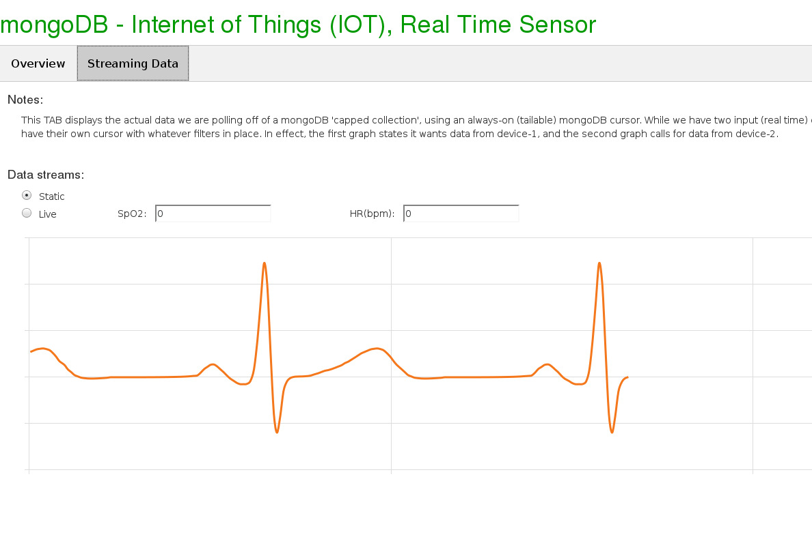
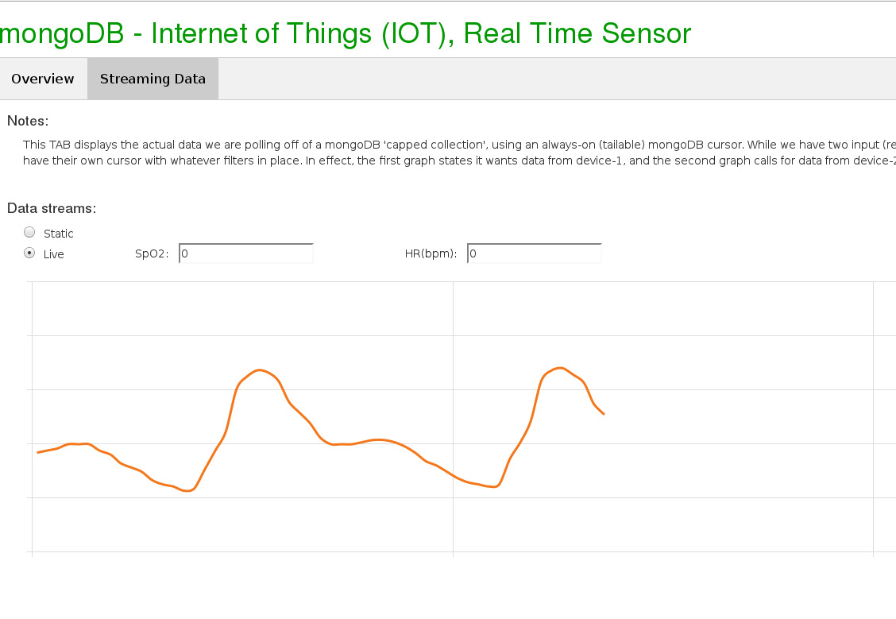
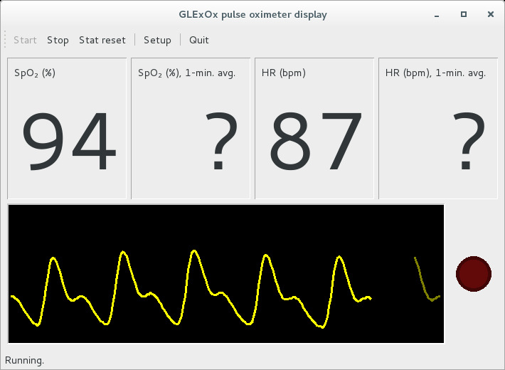

# April 2017: IoT

[Browse 2017](../README.md)

[Back to home](../../README.md)

Original PDF: [MDB_DN_2017_16_IOT.pdf](./MDB_DN_2017_16_IOT.pdf)

---
## Chapter 15. April 2017

Welcome to the April 2017 edition of mongoDB Developer’s Notebook (MDB-DN). This month we answer the following question(s); My company has a corporate campus with over 120 buildings, and an even larger number of real time sensors; badge entry systems for doors, point of sale systems which we can read, and more. One of the analytics routines we need to run associates a given event with any other event at the same location and within a given amount of time. Can you show me how to tie real time events to analytics routines inside mongoDB ? Excellent question ! We can’t promise we will cover every topic in this area as the basic question you ask is essentially; tell me everything I need to know. We will, however, list many of our favorites in the area of Internet of things, recursive queries, (always on queries), and more. Where it makes sense below we offer sample code. And in each case, we list the documentation Url for further research as your specific needs and intents make suggest.

## Software versions

The primary mongoDB software component used in this edition of MDB-DN is the mongoDB database server core, currently release 3.4. All of the software referenced is available for download at the URL's specified, in either trial or community editions. As a lowest common denominator, we use Python to create any client side application programs; Python being a good general purpose language usable by both developers and operations personnel.

All of these solutions were developed and tested on a single tier CentOS 7.0 operating system, running in a VMWare Fusion version 8.1 virtual machine. The mongoDB server software is version 3.4, and unless otherwise specified is running on one node, with no shards and no replicas. All software is 64 bit.

## 15.1 Terms and core concepts

In effect our problem statement this month is: real time analytics on streaming data. Internet of things (IOT) is one of the larger (most common) of the seven primary use cases for mongoDB. In previous editions of this document we have looked at one of the many aids inside mongoDB for IOT, namely, capped collections. Previously we have read the mongoDB oplog (transaction log file), which is itself a capped collection.

With a capped collection you can submit a query one time, and have this query return documents as they arrive in real time to the (capped collection). In this manner you may rationalize that the query is static (always on), and it is the data that is moving; versus, the data is static (not moving), and the query is sent to the database server where results are generated and returned to the client.

In this document we detail executing a mongoDB query against the data stream from a real time sensor, a finger tip pulse meter. Illustration as displayed in Figure 15-1.


*Figure 15-1 Finger tip pulse meter and real time (always on) queries.*

Relative to Figure 15-1, the following is offered:

- The real time sensor we use in this document is available on Amazon.com at,

```text
https://www.amazon.com/gp/product/B00IWOKTC0
```

This device outputs a real time pulse, and blood oxygen level, with data available with a high speed USB serial line interface. What sold us on this product is that we found a ready made Python program we could modify to write this data into mongoDB. The Python program to read this pulse meter is located here,

```text
http://ian.ahands.org/progs/pulseox/
```

And we used a JavaScript library to graph the pulse signal in a Web browser, available here,

```text
https://github.com/joakimkemeny/jke.d3.ecg
```

- The device above outputs a human pulse, a simple waveform data stream. With research, we found many scientific papers surrounding not a pulse waveform, but the more complete ECG/EKG compound waveform. What analytics could we run here ? There was at least one paper that claimed a 92% confidence towards identifying an individual by reading their ECG/EKG. Many other papers stated that identification via this means did not yield a usable confidence. We experimented alerting on pulse high or low readings, however, getting the pulse to increase by exercising or similar lead to erratic (jumpy) waveforms. So, we exited this area of the solution by merely graphing the data, using filters on always on queries, etcetera.

- We detail a separate sample query below, which details how to answer the portion of the problem statement, associate(s) a given event with any other event at the same location and within a given amount of time The difficult part of this challenge is the range on time. We assume out data has a time stamp, and that we ourselves must generate and filter on a rage of time (plus or minus [n] minutes).

- Figure 15-1 above displays the query in front of the database server, certainly before having to persist data. This convention is meant to reinforce that mongoDB supports always on queries, via in tailable cursor modifier to the find() query method. Example far below.

We created a Web program to display and allow us to interact with this demonstration. Figure 15-2 displays the first screen of this Web program. A code review follows.


*Figure 15-2 First page (TAB) of Web program.*

Relative to Figure 15-2, the following is offered:

- This Web program is written in Python, and is available via Linux Tar ball at the same Url where the electronic copy of this document is located,

```text
https://github.com/farrell0/MongoDB-Developers-Notebook
```

The name of this Web program is,

```text
50_Index.py
```

and it is run via a

```text
python 50_Index.py.
```

- The Web program is a single page application, meaning; the entire Web site is loaded upon first contact. The Web program calls to fetch data from a mongoDB always on cursor via a polling scheme; AJAX, background JavaScript method invocations.

- There are two TABs, the first of which is displayed above. The first TAB displays the status of two background daemons which collect the data displayed on the second TAB. • In the event we need to run this program without having the pulse meter present, the first daemon outputs a previously recorded ECG/EKG compound waveform that we found on the Internet.

This first daemon is titled,

```text
10_Device01.py
```

and is run via a,

```text
python 10_Device10.py.
```

• The second daemon is the one we harvested via the Url above for the pulse meter demonstration program. This daemon is titled,

```text
11_Device02.py
```

. We altered the original version of this program so that it would write to a mongoDB capped collection. We detail these code changes below.

> Note: The two signals we display (an ECG/EKG, and then a pulse meter), had two different amplitudes. We used a linear regression algorithm to alter the pulse meter so that is matched the amplitude of the ECG/EKG.

Why ?

We found a JavaScript library to graph the ECG/EKG which would work for the pulse meter. Thus, we changed the pulse meter signal.

Figure 15-3 displays the second TAB of our Web program. A code review follows.



*Figure 15-3 Second page (TAB) of the Web program.*

Relative to Figure 15-3, the following is offered:

- A radio button titled, Data streams (static, live) switches between displaying the pre-recorded ECG/EKG signal (static), and the live signal from the pulse meter.

- Figure 15-3 is displaying the ECG/EKG signal, and Figure 15-4 below displays the live signal from the pulse meter.



*Figure 15-4 Displaying the live pulse meter signal.*

Figure 15-5 displays the graphical user interface that we use to read the pulse meter. A code review follows.



*Figure 15-5 The GUI we found for the pulse meter.*

Relative to Figure 15-5, the following is offered:

- As stated above, we sourced the pulse meter reading program from,

```text
http://ian.ahands.org/progs/pulseox/
```

- Really we just added a few lines to these program so that it would also write the data it produced to a mongoDB capped collection. The above user interface is produced when you run the

```text
11_Device02.py
```

program. After program launch, you choose, Start, from the menu bar.

Example 15-1 below displays the source to the

```text
10_Device01.py
```

program. A code review follows.

### Example 15-1 Source listing for the 10_Device01.py program.

```text
#
# The entire contents of this directory deliver a Web
# application demonstrating IOT, (Internet of Things).
#
```

```text
# This specific program is 1 of 2 daemons that feed
# 'real time' data into a single mongoDB capped
# collection. 'Real time' is in quotes here because
# this daemon repeatedly sends 100 hard coded data
# points that mimic a human heartbeat; about 60 points
# per second.
#
# The other/second daemon reads from a real real
# time sensor, but .. we have this program as back
# up in case the true sensor is not traveling with
# us, or fails to work.
#
# Comments-
#
# . Version 0.24
#
# . This program was tested on CentOS 7 64 bit, and a
# Kafka version 0.10.1.
#
# All software is expected to be running on one host,
# as was this test program.
#
# . So that we start from a point of known consistency,
# this program drops our database and recreates it.
# We also create a capped collection titled, my_allEvents
# to store the real time data.
#
# A second collection titled, statistics, records data
# about this daemon; how many times it has looped, yadda.
#
# . An array titled, m_data stores 100 hard coded data
# points which represent a human EKG recording. We send
# these points to the mongoDB capped collection at a
# rate approximating 60 (heart beats) a second.
#
```

```text
###################################################
```

```text
from pymongo import MongoClient
```

```text
from datetime import datetime
import time
```

```text
###################################################
```

```text
mongo_host = MongoClient("localhost:27017")
mongo_host.drop_database("test_iot")
#
m_dbas = mongo_host.test_iot
```

```text
#
# 5 MB, 5000 documents
#
m_dbas.create_collection("my_allEvents",
capped = True, size = 5242880, max = 5000)
```

```text
m_dbas.statistics.insert( {
"_id" : 0, "dev1_ops" : 0, "dev1_cnt" : 0,
"dev2_ops" : 0, "dev2_cnt" : 0 } )
```

```text
###################################################
```

```text
#
# Much of this sourced form,
# https://github.com/joakimkemeny/jke.d3.ecg
#
```

```text
m_data = [
0, 0, 0, 0, 0.0000050048828125, 0.0000137939453125,
0.000049560546875, 0.00008740234375, 0.00015966796875,
0.000262451171875, 0.0003975830078125, 0.0005687255859375,
0.0007802734375, 0.001037353515625, 0.0013468017578125,
0.00172119140625, 0.0021756591796875, 0.0027232666015625,
0.0033880615234375, 0.004206787109375, 0.0052380371093750005,
0.006586181640625, 0.008400146484375001, 0.010904296875,
0.0144892578125, 0.0196798095703125, 0.049684204101562504,
0.0886883544921875, 0.11185363769531251, 0.134164306640625,
0.137352294921875, 0.1160369873046875, 0.08516308593750001,
0.0539765625, 0.014997436523437501, -0.015882568359375,
-0.0387554931640625, -0.06125732421875, -0.0745780029296875,
-0.07479357910156251, -0.0725338134765625, -0.0418538818359375,
0.08582861328125001, 0.397717529296875, 0.8136408691406251,
1.2295617980957032, 0.9944150390625001, 0.2824605712890625,
-0.38949267578125, -0.597251220703125, -0.425675537109375,
-0.1537947998046875, -0.0500914306640625, -0.0111041259765625,
```

```text
0.0027451171875, 0.0071739501953125, 0.008443359375,
0.0094327392578125, 0.012530517578125, 0.0176046142578125,
0.0300162353515625, 0.0433489990234375, 0.056962646484375004,
0.0704832763671875, 0.0770511474609375, 0.0898175048828125,
0.10311853027343751, 0.117046142578125, 0.1312630615234375,
0.1529300537109375, 0.167607177734375, 0.1899068603515625,
0.2124422607421875, 0.235044677734375, 0.2575535888671875,
0.2724073486328125, 0.286978271484375, 0.3007579345703125,
0.3067425537109375, 0.3106370849609375, 0.303756103515625,
0.2897236328125,0.25916931152343753, 0.2200599365234375,
0.1728209228515625, 0.133416259765625, 0.086224853515625,
0.05493408203125, 0.02409423828125, 0.00922607421875,
-0.0043409423828125, -0.0097349853515625, -0.013127685546875,
-0.01423095703125, -0.013834716796875, -0.012556030273437501,
-0.010675048828125, -0.00835888671875, -0.0057305908203125,
-0.0000562744140625
]
```

```text
###################################################
###################################################
```

```text
print " "
print "Running: Device-Insert-01 (10)"
print " "
```

```text
m_dataCntr1 = 0
m_dataCntr2 = 0
m_dataCntr3 = 0
```

```text
#
# Endless loop, send 60 inserts into mongoDB per
# second.
#
while True:
m_dbas.statistics.update( { "_id" : 0 },
{ "$inc" : { "dev1_ops" : 1, "dev1_cnt" : 1 } } )
#
for x in range(0, 60):
m_dataCntr1 += 1
m_dataCntr2 += 1
m_dataCntr3 += 1
#
if (m_dataCntr1 > len(m_data) - 1):
m_dataCntr1 = 0
```

```text
if (m_dataCntr2 > 1000 ):
print " Inserted additional: 1,000"
m_dataCntr2 = 0
if (m_dataCntr3 > 10000 ):
print " "
m_dataCntr3 = 0
l_time = (datetime.utcnow() -
datetime.utcfromtimestamp(0)
).total_seconds() * 1000.0
#
m_dbas.my_allEvents.insert(
{ "dev" : 1, "k1" : m_data[m_dataCntr1],
"ts" : l_time } )
#
time.sleep(0.008) # Endless loop, sleep to throttle
```

Relative to Example 15-1, the following is offered:

- After a large number of program comments, we define a mongoDB client connection, drop, and recreate a database. We drop and recreate the database as the fastest (nuke for morbid) means to reset any data we may have left behind from previous use.

- The

```text
create_collection()
```

method makes our capped collection with a 5000 document limit. We insert both data streams into this one collection in order that we may best demonstrate filters on capped collections below. –

```text
statistics
```

is a control table where we record the activity of this daemon, as well as the daemon that reads from the pulse meter proper.

```text
m_data[]
```

– is a Python list (array). The data in this array was harvested from a JavaScript library we found to display an ECG/EKG style graph. The JavaScript library is available here,

```text
https://github.com/joakimkemeny/jke.d3.ecg
```

- Then we start an endless loop where we insert the element from the

```text
m_data[]
```

array into mongoDB. We throttle this insert activity (sleep), at a rate meant to mimic an ECG/EKG signal. We only write to the capped collection here, and do not perform reads. Reads are performed in the Web program where we choose to display our signal.

Example 15-2 displays a subset of the second daemon program; only the lines we added. A code review follows.

### Example 15-2 Subset of the second daemon program; only the changes.

```text
#
# Lines I added went here-
#
from pymongo import MongoClient
import time
```

```text
#
# Lines I added went here-
#
print " "
print "Running: Device-Insert-02 (11)"
print " "
```

```text
... ...
```

```text
#
# Lines I added went here-
#
self.mongo_host = MongoClient("localhost:27017")
self.m_dbas = self.mongo_host.test_iot
#
self.m_dataCntr2 = 0
self.m_dataCntr3 = 0
```

```text
... ...
```

```text
# Lines I added went here, MMM-
#
# This is the only block we added to this program.
#
# This block inserts data into a mongoDB capped
# collection; data this program already had. We
# added the sleep as a means to throttle this
# program, otherwise it was inserting way more
# data than we needed.
#
```

```text
l_k1 = data[0][0]
l_k1 = ( l_k1 * 0.01955) - 0.78255
#
l_k2 = data[0][2]
l_k3 = data[0][3]
#
self.m_dataCntr2 += 1
self.m_dataCntr3 += 1
```

```text
self.m_dbas.statistics.update( { "_id" : 0 },
{ "$inc" : { "dev2_ops" : 1, "dev2_cnt" : 1 } } )
#
l_time = (datetime.utcnow() -
datetime.utcfromtimestamp(0)
).total_seconds() * 1000.0
self.m_dbas.my_allEvents.insert(
{ "dev" : 2, "k1" : l_k1,
"k2" : l_k2, "k3" : l_k3,
"ts" : l_time } )
```

```text
if (self.m_dataCntr2 > 1000 ):
print " Inserted additional: 1,000"
self.m_dataCntr2 = 0
if (self.m_dataCntr3 > 10000 ):
print " "
self.m_dataCntr3 = 0
```

```text
time.sleep(0.008)
```

Relative to Example 15-2, the following is offered:

- There are 3 separate blocks of code above. • The first does our imports. • The second defines our database handle. • The third is the program modification proper.

- The line with the 0.01955 value is the output of out linear regression; normalizing this pulse meter to equal the amplitude that the JavaScript ECG/EKG graph library expects.

- And then

```text
my_allEvents
```

is the mongoDB capped collection we insert into. Every other piece of code is just program diagnostics.

Example 15-3 displays the source code listing for our Web program. A code review follows.

### Example 15-3 Source code listing for the Web program.

```text
#
# The entire contents of this directory deliver a Web
# application demonstrating IOT, (Internet of Things).
#
# This program runs our Web application, the viewable
```

```text
# piece of this demonstration. Other pieces include a
# number of daemon programs that insert 'real time'
# data into a mongoDB Capped collection.
#
# Comments-
#
# . Version 0.24
#
# . This program was tested on CentOS 7 64 bit, and a
# Kafka version 0.10.1.
#
# All software is expected to be running on one host,
# as was this test program.
#
# . This Web site has 2 routes; one to serve page(s)
# proper (done once, a single page application), and
# then a second called asynchronously and in the
# background which refreshes our data, an EKG graph.
#
# . A separate thread polls the database for updates
# to our EKG style data.
#
```

```text
#############################################################
## Imports ##################################################
```

```text
from flask import Flask, render_template, request, jsonify
```

```text
from pymongo import MongoClient
from pymongo import CursorType
```

```text
import os
import threading
import time
```

```text
#############################################################
## Inits, Opens, and Sets ###################################
```

```text
#
# Instantiate flask object
#
```

```text
m_app = Flask(__name__)
```

```text
#
# Set flask defaults for locating files
#
m_templateDir = os.path.abspath("45_views" )
m_staticDir = os.path.abspath("44_static")
#
m_app.template_folder = m_templateDir
m_app.static_folder = m_staticDir
```

```text
#
# Open our connection to the mongoDB database
# server.
#
m_conn0 = MongoClient("localhost:27017")
m_dbas0 = m_conn0.test_iot
```

```text
#############################################################
```

```text
#
# A central array, global/modular in scope, that
# receives the documents from a mongoDB capped
# collection. A later piece of code culls from
# this array.
#
m_dev1Msgs = []
m_dev2Msgs = []
```

```text
#############################################################
## Functions ################################################
```

```text
#
# This is our main page.
#
@m_app.route('/')
def overview_tab():
return render_template("10_Index.html")
```

```text
#
# Method called from our Web page to get
# all data refreshed.
#
@m_app.route('/_my_refresh')
def refresh_tab1():
global m_dev1Msgs
```

```text
#
# Get the statistics for Tab-1
#
l_curr = m_dbas0.statistics.find_one(
{ "_id" : 0 }, { "_id" : 0, "dev1_ops" : 1,
"dev1_cnt" : 1, "dev2_ops" : 1, "dev2_cnt" : 1 } )
```

```text
#
# Copy and then cull the contents of m_dev1Msgs.
#
l_lenMsgs = len ( m_dev1Msgs)
c_dev1Msgs = list( m_dev1Msgs[ 0 : l_lenMsgs ] )
#
del m_dev1Msgs[ 0 : l_lenMsgs ]
```

```text
l_lenMsgs = len ( m_dev2Msgs)
c_dev2Msgs = list( m_dev2Msgs[ 0 : l_lenMsgs ] )
#
del m_dev2Msgs[ 0 : l_lenMsgs ]
```

```text
return jsonify(l_curr, c_dev1Msgs, c_dev2Msgs)
```

```text
#############################################################
#############################################################
```

```text
#
# This thread polls from a mongoDB capped collection,
# places these documents into an array.
#
class t_dev1Msgs(threading.Thread):
global m_dev1Msgs
```

```text
def run(self):
#
# Best practice for multi-threading, put the
# connection handle in the thread; avoid
```

```text
# deadlocks or races.
#
m_conn1 = MongoClient("localhost:27017")
m_dbas1 = m_conn1.test_iot
#
l_curr = m_dbas1.my_allEvents.find( { "dev" : 1 },
{ "_id" : 0, "k1" : 1, "ts" : 1 },
cursor_type=CursorType.TAILABLE_AWAIT )
#
while l_curr.alive:
#
# The while loop is true while the cursor
# can stay open.
#
# The for loop processed the 0:many docs
# we may receive for each 'while'.
#
for l_docu in l_curr:
#
# append() is the method to add elements
# to a Python array (list).
#
m_dev1Msgs.append(l_docu)
time.sleep(2)
```

```text
class t_dev2Msgs(threading.Thread):
global m_dev2Msgs
```

```text
def run(self):
#
# Best practice for multi-threading, put the
# connection handle in the thread; avoid
# deadlocks or races.
#
m_conn2 = MongoClient("localhost:27017")
m_dbas2 = m_conn2.test_iot
#
l_curr = m_dbas2.my_allEvents.find( { "dev" : 2 },
{ "_id" : 0, "k1" : 1, "ts" : 1,
"k2" : 1, "k3" : 1 },
cursor_type=CursorType.TAILABLE_AWAIT )
#
while l_curr.alive:
#
# The while loop is true while the cursor
# can stay open.
#
# The for loop processed the 0:many docs
```

```text
# we may receive for each 'while'.
#
for l_docu in l_curr:
#
# append() is the method to add elements
# to a Python array (list).
#
m_dev2Msgs.append(l_docu)
time.sleep(2)
```

```text
#
# Starting the above thread.
#
l_threads = [ t_dev1Msgs(), t_dev2Msgs() ]
#
for l_thread in l_threads:
l_thread.start()
```

```text
######################################################
######################################################
```

```text
#
# And then running our Web site proper.
#
if (__name__ == '__main__'):
m_app.run(host = "localhost", port = int("8084"))
```

Relative to Example 15-3, the following is offered:

- After the imports, we define a mongoDB database connection handle, and set default for Python Flask, the Python Web server we are using.

```text
my_dev1Msgs[]
```

– is a Python list that stores data for the static, pre-recorded

```text
my_dev2Msgs[]
```

ECG/EKG signal. And stores the live data we read from the pulse meter. In either case, the Web program this Web program only knows it is reading from a single mongoDB capped collection with filters present. –

```text
route(“/”)
```

calls to load our Flask page template.

–

```text
route(“_my_refresh”)
```

is called repeatedly from the Web program via a background AJAX service method. This method calls to refresh data in the Web graph display. There is some multi-threaded behavior here; threads are filling

```text
my_dev1Msgs[
```

] and

```text
my_dev2Msgs[]
```

. So, this method copies the given list (array), sizes it, and performs the steps needed to return the targeted (rows) to the calling function, the Web page.

```text
t_dev1Msgs
t_dev2Msgs
```

- And then two threads titled, , and . These two threads are nearly identical, however; to keep the code simpler we did not work to create one smarter object to service both devices. Each thread has its own cursor because it must; it must keep a unique pointer into the capped collection which serves its data. Each cursor has a unique filter, so that it may read only the data for its dedicated device. Thread one filter on

```text
{“dev” : 1}
```

, where the thread 2 filter reads,

```text
{“dev” : 2}
```

.

- The remainder of this Python program starts the threads, and starts the Web site proper.

> Note: With all of this multi-threading and real time device signal processing, you might be concerned about resource, specifically CPU.

We were able to run this program in a CentOS version 7 virtual machine with 8 GB of RAM, and three cores. 2 or fewer cores and the displays tend to jitter.

At this point in the document we have all of our real time data processing. The only remaining part of the solution yet to detail are the analytics. Again, we don’t choose to perform analytics on our mocked up streaming data source because this data source is poor; its just as simple waveform.

```text
$lookup aggregate()
```

The analysis we do detail uses the mongoDB pipeline stage along with a range operand.Example 15-4 displays our code, and a code review follows.

### Example 15-4 $lookup with a range.

```text
#
# Example to deliver social networks with a range
# expression.
#
# While there is a graphLookup stage now, the version
# of software we are currently using didn't yet support
# this feature.
```

```text
#
```

```text
import datetime
import pymongo
#
from pymongo import MongoClient
```

```text
######################################################
```

```text
sc = MongoClient("localhost:27017")
db = sc.test_CU
```

```text
db.my_students.drop()
db.my_patrons.drop()
db.my_transactions.drop()
#
db.my_preppedTransactions.drop()
```

```text
######################################################
```

```text
#
# The collection titled, my_students contains all students
# on campus. The collection titled, my_patrons contains all
# persons who can complete a transaction at a (cash) register.
#
# my_patrons offers a superset of my_students.
#
```

```text
db.my_students.insert( { "_id" : 1001, "name" : "Steve" } )
db.my_students.insert( { "_id" : 1002, "name" : "Sarah" } )
db.my_students.insert( { "_id" : 1003, "name" : "Sam" } )
db.my_students.insert( { "_id" : 1004, "name" : "Stiffler" } )
db.my_students.insert( { "_id" : 1005, "name" : "Simon" } )
db.my_students.insert( { "_id" : 1006, "name" : "Stinky" } )
```

```text
db.my_patrons.insert( { "_id" : 2001, "student_id" : 1001 } )
db.my_patrons.insert( { "_id" : 2002, "student_id" : 1002 } )
db.my_patrons.insert( { "_id" : 2003, "student_id" : 1003 } )
db.my_patrons.insert( { "_id" : 2004, "student_id" : 1004 } )
db.my_patrons.insert( { "_id" : 2005, "student_id" : 1005 } )
db.my_patrons.insert( { "_id" : 2006, "student_id" : 1006 } )
```

```text
#
# The patrons below are not students and will not be able
# join with my_students as such.
#
```

```text
db.my_patrons.insert( { "_id" : 2007 } )
db.my_patrons.insert( { "_id" : 2008 } )
```

```text
######################################################
```

```text
#
# The collection titled, my_transactions is meant to mimic
# card swipes at a sales register on campus. We have a
# register_id and a time stamp titled, 'ts'. The whole point
# of this program is to identify two persons who have had a
# transaction at the same location, within 3 minutes, and 5
# or more times.
#
```

```text
# Sarah and Stiffler match; same register, 5 or more times,
# within 3 minutes.
```

```text
db.my_transactions.insert( { "_id" : 8000, "ts" : datetime.datetime(2016, 8, 6,
10, 15, 00), "register_id" : "400", "patron_id" : 2002 } )
db.my_transactions.insert( { "_id" : 8001, "ts" : datetime.datetime(2016, 8, 6,
10, 16, 00), "register_id" : "400", "patron_id" : 2004 } )
db.my_transactions.insert( { "_id" : 8002, "ts" : datetime.datetime(2016, 8, 7,
10, 15, 00), "register_id" : "600", "patron_id" : 2002 } )
db.my_transactions.insert( { "_id" : 8003, "ts" : datetime.datetime(2016, 8, 7,
10, 16, 00), "register_id" : "600", "patron_id" : 2004 } )
db.my_transactions.insert( { "_id" : 8004, "ts" : datetime.datetime(2016, 8, 8,
10, 15, 00), "register_id" : "800", "patron_id" : 2002 } )
db.my_transactions.insert( { "_id" : 8005, "ts" : datetime.datetime(2016, 8, 8,
10, 16, 00), "register_id" : "800", "patron_id" : 2004 } )
db.my_transactions.insert( { "_id" : 8006, "ts" : datetime.datetime(2016, 8, 9,
10, 15, 00), "register_id" : "400", "patron_id" : 2002 } )
db.my_transactions.insert( { "_id" : 8007, "ts" : datetime.datetime(2016, 8, 9,
10, 16, 00), "register_id" : "400", "patron_id" : 2004 } )
db.my_transactions.insert( { "_id" : 8008, "ts" : datetime.datetime(2016, 8, 9,
14, 15, 00), "register_id" : "400", "patron_id" : 2002 } )
db.my_transactions.insert( { "_id" : 8009, "ts" : datetime.datetime(2016, 8, 9,
14, 16, 00), "register_id" : "400", "patron_id" : 2004 } )
```

```text
# Sarah and Sam not a match; 5 or more times, not within
# the time frame.
```

```text
db.my_transactions.insert( { "_id" : 1000, "ts" : datetime.datetime(2016, 8, 6,
10, 15, 00), "register_id" : "400", "patron_id" : 2002 } )
db.my_transactions.insert( { "_id" : 1001, "ts" : datetime.datetime(2016, 8, 6,
12, 16, 00), "register_id" : "400", "patron_id" : 2003 } )
db.my_transactions.insert( { "_id" : 1002, "ts" : datetime.datetime(2016, 8, 7,
10, 15, 00), "register_id" : "400", "patron_id" : 2002 } )
db.my_transactions.insert( { "_id" : 1003, "ts" : datetime.datetime(2016, 8, 7,
12, 16, 00), "register_id" : "400", "patron_id" : 2003 } )
db.my_transactions.insert( { "_id" : 1004, "ts" : datetime.datetime(2016, 8, 8,
10, 15, 00), "register_id" : "400", "patron_id" : 2002 } )
db.my_transactions.insert( { "_id" : 1005, "ts" : datetime.datetime(2016, 8, 8,
12, 16, 00), "register_id" : "400", "patron_id" : 2003 } )
db.my_transactions.insert( { "_id" : 1006, "ts" : datetime.datetime(2016, 8, 9,
10, 15, 00), "register_id" : "400", "patron_id" : 2002 } )
db.my_transactions.insert( { "_id" : 1007, "ts" : datetime.datetime(2016, 8, 9,
12, 16, 00), "register_id" : "400", "patron_id" : 2003 } )
db.my_transactions.insert( { "_id" : 1008, "ts" : datetime.datetime(2016, 8, 9,
14, 15, 00), "register_id" : "400", "patron_id" : 2002 } )
db.my_transactions.insert( { "_id" : 1009, "ts" : datetime.datetime(2016, 8, 9,
12, 16, 00), "register_id" : "400", "patron_id" : 2003 } )
```

```text
# Steve and Sarah not a match; not enough hits.
```

```text
db.my_transactions.insert( { "_id" : 2000, "ts" : datetime.datetime(2016, 8, 6,
10, 15, 00), "register_id" : "400", "patron_id" : 2002 } )
db.my_transactions.insert( { "_id" : 2001, "ts" : datetime.datetime(2016, 8, 6,
10, 16, 00), "register_id" : "400", "patron_id" : 2001 } )
db.my_transactions.insert( { "_id" : 2002, "ts" : datetime.datetime(2016, 8, 7,
10, 15, 00), "register_id" : "400", "patron_id" : 2002 } )
db.my_transactions.insert( { "_id" : 2003, "ts" : datetime.datetime(2016, 8, 7,
10, 16, 00), "register_id" : "400", "patron_id" : 2001 } )
db.my_transactions.insert( { "_id" : 2004, "ts" : datetime.datetime(2016, 8, 8,
10, 15, 00), "register_id" : "400", "patron_id" : 2002 } )
db.my_transactions.insert( { "_id" : 2005, "ts" : datetime.datetime(2016, 8, 8,
10, 16, 00), "register_id" : "400", "patron_id" : 2001 } )
db.my_transactions.insert( { "_id" : 2006, "ts" : datetime.datetime(2016, 8, 9,
10, 15, 00), "register_id" : "400", "patron_id" : 2002 } )
db.my_transactions.insert( { "_id" : 2007, "ts" : datetime.datetime(2016, 8, 9,
10, 16, 00), "register_id" : "400", "patron_id" : 2001 } )
```

```text
# Not a match, one patron is not a student.
```

```text
db.my_transactions.insert( { "_id" : 3000, "ts" : datetime.datetime(2016, 8, 6,
10, 15, 00), "register_id" : "400", "patron_id" : 2002 } )
db.my_transactions.insert( { "_id" : 3001, "ts" : datetime.datetime(2016, 8, 6,
10, 16, 00), "register_id" : "400", "patron_id" : 2007 } )
db.my_transactions.insert( { "_id" : 3002, "ts" : datetime.datetime(2016, 8, 7,
10, 15, 00), "register_id" : "400", "patron_id" : 2002 } )
```

```text
db.my_transactions.insert( { "_id" : 3003, "ts" : datetime.datetime(2016, 8, 7,
10, 16, 00), "register_id" : "400", "patron_id" : 2007 } )
db.my_transactions.insert( { "_id" : 3004, "ts" : datetime.datetime(2016, 8, 8,
10, 15, 00), "register_id" : "400", "patron_id" : 2002 } )
db.my_transactions.insert( { "_id" : 3005, "ts" : datetime.datetime(2016, 8, 8,
10, 16, 00), "register_id" : "400", "patron_id" : 2007 } )
db.my_transactions.insert( { "_id" : 3006, "ts" : datetime.datetime(2016, 8, 9,
10, 15, 00), "register_id" : "400", "patron_id" : 2002 } )
db.my_transactions.insert( { "_id" : 3007, "ts" : datetime.datetime(2016, 8, 9,
10, 16, 00), "register_id" : "400", "patron_id" : 2007 } )
db.my_transactions.insert( { "_id" : 3008, "ts" : datetime.datetime(2016, 8, 9,
14, 15, 00), "register_id" : "400", "patron_id" : 2002 } )
db.my_transactions.insert( { "_id" : 3009, "ts" : datetime.datetime(2016, 8, 9,
14, 16, 00), "register_id" : "400", "patron_id" : 2007 } )
```

```text
# Yes, a match, more than 5 meets, Stiffler and Stinky
```

```text
db.my_transactions.insert( { "_id" : 9000, "ts" : datetime.datetime(2016, 8, 6,
10, 15, 00), "register_id" : "400", "patron_id" : 2002 } )
db.my_transactions.insert( { "_id" : 9001, "ts" : datetime.datetime(2016, 8, 6,
10, 16, 00), "register_id" : "400", "patron_id" : 2006 } )
db.my_transactions.insert( { "_id" : 9002, "ts" : datetime.datetime(2016, 8, 7,
10, 15, 00), "register_id" : "600", "patron_id" : 2002 } )
db.my_transactions.insert( { "_id" : 9003, "ts" : datetime.datetime(2016, 8, 7,
10, 16, 00), "register_id" : "600", "patron_id" : 2006 } )
db.my_transactions.insert( { "_id" : 9004, "ts" : datetime.datetime(2016, 8, 8,
10, 15, 00), "register_id" : "800", "patron_id" : 2002 } )
db.my_transactions.insert( { "_id" : 9005, "ts" : datetime.datetime(2016, 8, 8,
10, 16, 00), "register_id" : "800", "patron_id" : 2006 } )
db.my_transactions.insert( { "_id" : 9006, "ts" : datetime.datetime(2016, 8, 9,
10, 15, 00), "register_id" : "400", "patron_id" : 2002 } )
db.my_transactions.insert( { "_id" : 9007, "ts" : datetime.datetime(2016, 8, 9,
10, 16, 00), "register_id" : "400", "patron_id" : 2006 } )
db.my_transactions.insert( { "_id" : 9008, "ts" : datetime.datetime(2016, 8,10,
14, 15, 00), "register_id" : "400", "patron_id" : 2002 } )
db.my_transactions.insert( { "_id" : 9009, "ts" : datetime.datetime(2016, 8,10,
14, 16, 00), "register_id" : "400", "patron_id" : 2006 } )
db.my_transactions.insert( { "_id" : 9010, "ts" : datetime.datetime(2016, 8,11,
14, 15, 00), "register_id" : "400", "patron_id" : 2002 } )
db.my_transactions.insert( { "_id" : 9011, "ts" : datetime.datetime(2016, 8,11,
14, 16, 00), "register_id" : "400", "patron_id" : 2006 } )
db.my_transactions.insert( { "_id" : 9012, "ts" : datetime.datetime(2016, 8,12,
14, 15, 00), "register_id" : "400", "patron_id" : 2002 } )
db.my_transactions.insert( { "_id" : 9013, "ts" : datetime.datetime(2016, 8,12,
14, 16, 00), "register_id" : "400", "patron_id" : 2006 } )
```

```text
######################################################
######################################################
```

```text
#
# Create a new collection titled, my_preppedTransactions
# from my_transactions. This new collection does the
# following-
#
# . Gives us only students.
# . Gives us a number of calculated/derived (date/time)
# values.
#
```

```text
l_myList = list ( db.my_transactions.aggregate
(
[
{
#
# Calculate 3 new date/time values ..
#
# . The event date, so that we may join on this
# . And the event time, plus and minus 3 minutes,
# so that we may filter below.
#
"$project" :
{
"_id" : 0,
"ts" : 1,
"register_id" : 1,
"patron_id" : 1,
#
"justDate" : { "$dateToString" : { "format" : "%Y-%m-%d", "date"
: "$ts" } },
#
# All times are in milliseconds.
#
# 1000 millseconds * 60 seconds * 3 minutes
#
"tsAdd3" : { "$add" : [ "$ts", 1000 * 60 * 3 ] },
"tsSub3" : { "$subtract" : [ "$ts", 1000 * 60 * 3 ] }
}
},
{
#
# We need this second project because we have a
# key calculated from another calculated key above.
#
"$project" :
```

```text
{
"_id" : 0,
"ts" : 1,
"register_id" : 1,
"patron_id" : 1,
#
"justDate" : 1,
#
"joinKey" : { "$concat" : [ "$register_id", "-", "$justDate" ]
},
#
"tsAdd3" : 1,
"tsSub3" : 1,
}
},
{
#
# We were asked to join twice, as opposed to joining
# directly into a collection which told us if this
# person were a student.
#
# Join # 1 ..
#
"$lookup" :
{
"from" : "my_patrons",
"localField" : "patron_id",
"foreignField" : "_id",
"as" : "my_patrons"
}
},
{
#
# This is a many to one join, however, all joins come
# back as an array. Move that one element array into
# a nested sub-document.
#
"$unwind" : "$my_patrons"
},
{
#
# Discard if we can for efficiency ..
#
"$match" : { "my_patrons.student_id" : { "$exists" : True } }
},
{
#
# Join # 2 ..
#
```

```text
"$lookup" :
{
"from" : "my_students",
"localField" : "my_patrons.student_id",
"foreignField" : "_id",
"as" : "my_students"
}
},
{
#
# This is a many to one join, however, all joins come
# back as an array. Move that one element array into
# a nested sub-document.
#
"$unwind" : "$my_students"
},
{
#
# Discard what we can for efficiency ..
#
"$match" : { "my_students._id" : { "$exists" : True } }
},
{
#
# Also cleanup, discard any keys we don't need later ..
#
"$project" :
{
"ts" : 1,
"tsAdd3" : 1,
"tsSub3" : 1,
"justDate" : 1,
"register_id" : 1,
"joinKey" : 1,
"student_id" : "$my_students._id",
"name" : "$my_students.name"
}
},
{
#
# Save this (clean) list for processing below.
#
"$out" : "my_preppedTransactions"
}
]
) )
```

```text
######################################################
```

```text
######################################################
```

```text
#
# At this point we have a collection of prepped transactions.
#
# Prepped as in-
#
# . Just student documents
# . Calculated date/time values for the join and filters.
#
```

```text
l_myList = list ( db.my_preppedTransactions.aggregate
(
[
{
#
# Here we are joining by register_id and event date.
#
# This list will be heavy, including self-joins and
# also joins outside the 3 minute match time.
#
"$lookup" :
{
"from" : "my_preppedTransactions",
"localField" : "joinKey",
"foreignField" : "joinKey",
"as" : "my_matches"
}
},
{
"$unwind" : "$my_matches"
},
{
#
# Discard keys we don't want, and produce keys that
# indicate a self-join and whether join was inside
# the 3 minute range.
#
"$project" :
{
"_id" : 0,
"ts" : 1,
"name" : 1,
"student_id" : 1,
"register_id" : 1,
#
"ifIsSameStudent" : { "$eq" : [ "$student_id", "$my_matches.student_id"
] },
```

```text
#
"ifIsInRange" : { "$and" :
[
{ "$gte" : [ "$ts" , "$my_matches.tsSub3" ] },
{ "$lte" : [ "$ts" , "$my_matches.tsAdd3" ] }
]
},
"match_name" : "$my_matches.name",
"match_id" : "$my_matches.student_id"
}
},
{
#
# Discard self-joins and joins outside the 3 minute
# range.
#
"$match" :
{
"ifIsSameStudent" : False,
"ifIsInRange" : True
}
},
{
#
# We have all of the clean data we need; two folks
# at the same location (register) at the same time
# (within 3 minutes).
#
# Group by event to allow us to count; did this
# happen 5 or more times.
#
# The addToSet allows us to preserve the time stamps
# for use later. Eg., when did this happen.
#
#
"$group" :
{
"_id" :
{
"name" : "$name",
"student_id" : "$student_id",
#
"match_name" : "$match_name",
"match_id" : "$match_id"
},
"arrOfMeets" : { "$addToSet" :
{ "ts" : "$ts", "register_id" : "$register_id" } }
}
},
```

```text
{
#
# arrOfMeets has the unique meeting events. Now calc
# the length of this array.
#
"$project" :
{
"_id" : 1,
"arrOfMeets" : 1,
#
"more5Meets" : { "$gte" : [ { "$size" : "$arrOfMeets" }, 5 ] }
}
},
{
#
# Discard meetings of 4 or fewer events.
#
#
# Only Sarah and Stiffler met 5 or more times.
#
# You will sees rows for both Stiffler AND Sarah.
#
"$match" :
{
"more5Meets" : True
}
}
]
) )
```

```text
#
# Sample data produced above-
#
#
# {u'more5Meets': True, u'_id':
# {
# u'student_id': 1004,
# u'match_name': u'Sarah',
# u'match_id': 1002,
# u'name': u'Stiffler'
# },
# u'arrOfMeets':
# [
# datetime.datetime(2016, 8, 8, 10, 16),
# datetime.datetime(2016, 8, 9, 10, 16),
# datetime.datetime(2016, 8, 7, 10, 16),
# datetime.datetime(2016, 8, 9, 14, 16),
# datetime.datetime(2016, 8, 6, 10, 16)
```

```text
# ]
# }
# {u'more5Meets': True, u'_id':
# {
# u'student_id': 1002,
# u'match_name': u'Stiffler',
# u'match_id': 1004,
# u'name': u'Sarah'
# },
# u'arrOfMeets':
# [
# datetime.datetime(2016, 8, 9, 10, 15),
# datetime.datetime(2016, 8, 8, 10, 15),
# datetime.datetime(2016, 8, 7, 10, 15),
# datetime.datetime(2016, 8, 9, 14, 15),
# datetime.datetime(2016, 8, 6, 10, 15)
# ]
# }
```

```text
for l_myDoc in l_myList:
print l_myDoc
```

Relative to Example 15-4, the following is offered:

- This example mimics a university, and students being recorded at the same location within 6 minutes of another student (n) or more times.

- After all of the standard program start up and initialization, data creation, we are left with a single aggregate query with the following stages: • project- There are two purposes to this stage- To restrict the number of columns (keys) being returned (discard data

```text
justDate
```

we are not using), and to assemble the column. • project- This project stage follows an earlier project stage; why not combine these two stages- First, readability; keep the code simple and short. Second, we are doing math on a column that did not exist until exiting the first project stage.

The lookup stage, which we perform next, expects to left outer join on a single key column. By the nature of our data and problem statement, we have a multi-column key. So, use this project to concatenate the multiple key columns into just one column. • lookup- Here we loop in (join to) the patrons data. Joins in mongoDB always return the detail/child records as an array (as per the expectations of a document model database). So the next stage unwinds those array elements as documents so that we may treat each as a separate entity. • unwind- Unwinding the join array from above. • match- As a a left outer join (above), we have produced some documents that did not have a match. Filter and reject those records now; we do this for efficiency (restrict the amount of data needing to be processed), and also for readability, why carry data you do not need. • lookup, unwind, match Looping on students, same as above; joining in the student data too. • project- Cleaning up our output. • out- And writing our prepped/cleansed data set to a collection, so that we may now perform analytics on it.

> Note: We are performing an analytics routine, not data science per se, however, we will take the time now to state a common belief- 90% of time spent performing data science (activity) is data preparation; munging the data to transform it into a shape you require.

- At this point we have a prepped data set with all of the event, students, and patrons pre-joined, and key columns assembled as we require. A second aggregate method performs our actual analytics, joining who was at the same location within a given time period, and rejecting those who have not met (n) or more times. The aggregate query has several methods which we detail now: • lookup-

This is a self-join, one table (collection) into itself. This is the nature of our problem statement; given events, join with events at the same location within the same general time period. • unwind- As usual, we unwind. Why- Each event has joined with all other events at the same location with those join pairs being returned in a single array. We wish to process these joined events as singletons; events in their own right. Thus, we unwind. • project- Cleaning up the data, rejecting or renaming columns to ease code maintainability. We create two new columns which acts as flags; does this specific row look like we want. We could have performed this step below in the match, however, this is another technique we wished to demonstrate. • match- And restricting those rows who do not meet our criteria; did these two events happen within the time window, and is this not the anomaly of an event joining with itself (a problem with self joins). • group- For a given student, for a given (event), group and assemble these repetitions of the event group; same students meeting. • project- Cleaning up the output columns. • match- Only output records where folks have met 5 or more times.

So, the above presents our analytics routine. The hard part was matching on a date (time) range; date/time math can always be wordy. Sample output displays the following:

- Sarah met with Stiffler 5 or more times, and by that nature, Stiffler met with Sarah.

- A cool feature to mongoDB; after the aggregate expression, we can preserve the actual data which represent the meets themselves. That’s really hard to do in SQL. In general, an aggregate expression only outputs keys (the key columns on which we group), and calculated expressions, not detail.

## 15.2 Complete the following

Implement one or more of the techniques detailed above. All of the sample code is retrievable as a Linux Tar ball. Unpack it and run the above. You will need a working mongoDB server version 3.2 or higher.

The analytics routine can run separately from any of the real time (separate from the pulse meter) program code.

To run the Web program you will needs Python and a number of Python libraries, like Flask. If you attempt to run the Web program and its fails, you should receive a missing library exception. Python libraries may be installed with “pip”, the Python installer program.

## 15.3 In this document, we reviewed or created:

This month and in this document we detailed the following:

- We overviewed the Internet of things (IOT), real time streaming use case. We wrote data into a mongoDB collection from a hard coded array to simulate an ECG/EKG waveform data stream. We used hard coding in the event you do not choose to purchase and operate an actual real time device; we used a finger tip pulse meter. You can operate the example with or without the device.

- The above further demonstrated use of mongoDB always on queries (tailable cursors), and mongoDB capped collections.

- And we detailed a given self-join analytics routine; what else happened five or more times to a given event. We could have used a more complex routine than the one above, but why-

### Persons who help this month.

Dave Lutz and Thomas Boyd.

### Additional resources:

Free mongoDB training courses,

```text
https://university.mongoDB.com/
```

This document is located here,
