# May 2017: MongoDB Connector for BI, Part 2

[Browse 2017](../README.md)

[Back to home](../../README.md)

Original PDF: [MDB_DN_2017_17_BiConnector2.pdf](./MDB_DN_2017_17_BiConnector2.pdf)

---
## Chapter 16. May 2017

Welcome to the May 2017 edition of mongoDB Developer’s Notebook (MDB-DN). This month we answer the following question(s); I’m coming from Oracle and MySQL, and can not possibly believe that you guys do not support running SQL- As a developer or even operations person I need to run SQL to understand my data, not to mention giving access to the data to my business intelligence users. What can you tell me ? Excellent question ! mongoDB has supported running SQL for some time, and with the recent 2.1 release of our mongoDB Connector for Business Intelligence (BI Connector), mongoDB’s capabilities in this area are even more performant. In this document we install, configure and use the version 2.1 BI Connector, and install and use Eclipse, the Toad plugin for Eclipse, MySQL SQL Workbench, a MySQL JDBC driver, Apache Drill, and more. In addition to running SQL, the October 2016 edition of this document details install, configuration and use of the graphical query user interface to mongoDB, named mongoDB Compass.

## Software versions

The primary mongoDB software component used in this edition of MDB-DN is the mongoDB database server core, currently release 3.4. We also install and use the mongoDB Business Intelligence Connector (BI Connector) version 2.1, Eclipse Neon version 4.6.1, the Toad plugin for Eclipse version 2.4.4, the MySQL JDBC driver version 5.1.41, MySQL Workbench version 6.3, and Apache Drill version 1.9. All of the software referenced is available for download at the URL's specified, in either trial or community editions

All of these solutions were developed and tested on a single tier CentOS 7.0 operating system, running in a VMWare Fusion version 8.5 virtual machine. The mongoDB server software is version 3.4, and unless otherwise specified is running on one node, with no shards and no replicas. All software is 64 bit.

## 16.1 Terms and core concepts

The very first edition of this document, mongoDB Developer’s Notebook March 2016, detailed the version 1.0 of the mongoDB Connector for Business Intelligence (BI Connector). Now mongoDB is shipping version 2.1 of the BI Connector. Related comments:

- The version 1.0 BI Connector used an embedded Postgres database server under the covers. Using the foreign data wrappers (FDW) feature of Postgres, a SQL client (SQL prompt tool, BI tool, other) would connect to what looked like Postgres, and then run SQL queries against mongoDB. A brilliant and quick time to market strategy, there were some areas for improvement: • Postgres FDW will push down predicates (where clauses) and sorts (order bys), but not aggregate calculations to any source system. This created a bottleneck in some cases and negatively impacted performance. • While the Postgres system was reasonably light weight (there was no persistence of data, it was just a pass through), there were memory utilization issues and honestly however small, who wants to be carrying a whole other database server just to be able run SQL ? • Still, a cool strategy, since most BI tools likely already have support to run against Postgres.

- The version 2.1 BI Connector drops the embedded Postgres system, and runs with all native code offering full ANSI SQL 99 read compliance. Related comments: • Now mongoDB looks like a MySQL database server system. Similar to above; if your SQL prompt or BI tool can access MySQL, you’re good to go. • This is all mongoDB provided and supported code; no embedded third party database servers. In fact, the version 2.1 BI Connector operates as a single light weight daemon process. If your tool supports MySQL, you can run SQL queries against mongoDB.

What about performance ? Well first, consider why the mongoDB database server is generally faster than a relational system to begin with:

- Document data model- SQL databases were designed at a time when disk was expensive. Now 80% or more of the cost related to an information technology (IT) system is

labor; optimize for labor costs, costs to create and maintain, and cost (time, database server performance) to operate. Give me a database designed to innovate quickly, not just to save disk space. Figure 16-1 displays both relational and document data models on a similar customer subject area. A code review follows.

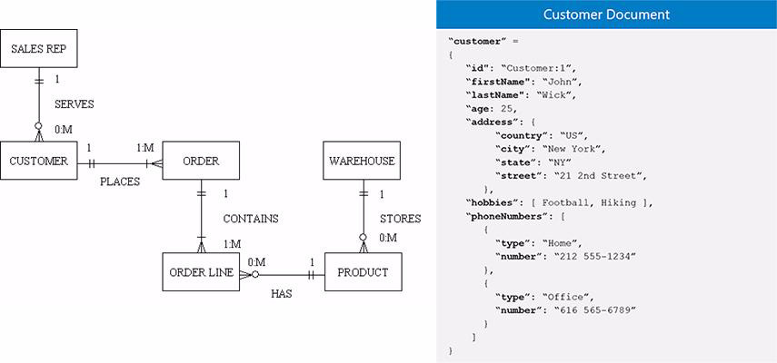

*Figure 16-1 Relational and document data models.*

• The relational data model on the left side of Figure 16-1 displays a typical customer, customer order, and order line items scenario. The take away is that in order to read any meaningful information about the customer order, you have to assemble data from 3 or more lists of data, looping and joining (processing, resource and time spent), etcetera. • The document model on the right side of Figure 16-1 displays nearly identical customer model; not customer orders, but customer activities and contact information. The take away is that the data is stored as a contiguous block of information (pre-assembled, optimized for ready use); no looping or processing to extract insight from this information. • Not only does the document data model not have to assemble most data to derive any value, a document model also does not have to shred data upon insert. (Pull the data apart to fit it into multiple tables.) Document data models commonly have a much smaller number of tables than relational; easier to consume and understand, fewer human errors.

- The mongoDB aggregation framework- • A SQL SELECT statement has seven clauses; 2 mandatory, and five optional. The five optional clauses (WHERE, ORDER BY, GROUP BY, other) if present, must appear in order and must appear only one time. In the mongoDB equivalent to a SQL SELECT, all of these clauses can appear in any order, and appear multiple times. What you have then is a programmable query framework much more powerful and much more performant than SQL; mongoDB can answer more questions natively, and in a more efficient manner.

Proof of performance- Can we go ahead and state on face value that reading all of your data from one table is more performant than having to read the data from three or more tables, looping, joining the data, yadda ? Assuming yes, consider the following:

- As recently as a few years ago, the defacto standard for databases and thus the source for BI tools was SQL, relational databases. By default, BI tools expect to see a relational model.

- Since mongodB is not relational, and is instead a document data store, the mongoDB BI Connector presents its underlying document data model as a standard relational model. In mongoDB you might have a single document with the customer, customer order, and order line items data. What the BI Connector will

```text
customer, orders
```

present to any SQL client is three separate SQL tables; ,

```text
order_items
```

and . In all or most cases, the SQL client will join these three tables to extract meaningful data.

- At its core, the BI Connector is a parser, and a query rewrite engine. The BI Connector will receive the SQL SELECT and translate it (parse it) into mongoDB query syntax. In the case of the three table SQL SELECT above, the BI Connector will be smart enough to query rewrite the SQL, and produce a single (table) query in mongoDB. A single table query is faster than a three table query.

There are at least two diagnostic log files in place when using the BI Connector; one client side (adjacent to the BI Connector) and one server side (adjacent to the mongoDB database server proper).

Below is a sample command to start the BI Connector. A code review follows:

```text
mongosqld --addr 127.0.0.1:3307 --schema 60_DRDL_Save.drdl \
--mongo-uri 127.0.0.1:$ppp --logPath logfile.BI \
--verbose=5 &
```

Relative to the above command, the following is offered: –

```text
mongosqld
```

is the name of the command to start the BI Connector listening daemon. This command runs in the foreground unless you call to do otherwise.

```text
--addr
```

– specifies the hostname and port to listen for new SQL connections on. We already had an unrelated MySQL database server operating on the default MySQL port number 3306, so we used 3307.

> Note: If you use the MySQL database server SQL command prompt titled, mysql, and do not specify a host name, or specify localhost, then the mysql command line program will ignore the port number argument. This is bad if you wish to use a port number other than the default of 3306.

Thus, we use an actual IP address throughout this document, even if that IP address resolved to localhost (127.0.0.1).

```text
--schema
```

– specifies the name of an ASCII text file in YAML format that details the mapping of document to relational (tables). A BI Connector utility generates this file for you, which you may then edit; a topic we cover later. The file name suffix DRDL stands for; document (to) relational definition language. –

```text
--mongo-uri
```

specifies the host name and port number of the source mongoDB database server, where the source data being served as SQL is located. –

```text
--logPath
```

specifies the ASCII text file that reports new client connections, client requests, and more made to the BI Connector.

```text
--verbose
```

– specified the logging level. 5 is high.

Example 16-1 displays the output made to our BI Connector log file when we

```text
customer, orders, and
```

executed the three table SQL SELECT above (

```text
line_items
```

). A code review follows.

### Example 16-1 Three table SQL SELECT received by the BI Connector, log file.

```text
2017-03-23T15:46:37.599-0600 D NETWORK [conn1] parsing "select company,
order_num from customers t1, orders t2 where t1.cust_num = t2.cust_num"
2017-03-23T15:46:37.599-0600 I ALGEBRIZER [conn1] generating query plan for
parsed sql: "select company, order_num from customers as t1, orders as t2 where
t1.cust_num = t2.cust_num"
2017-03-23T15:46:37.600-0600 D OPTIMIZER [conn1] optimizing query plan:
? Project(company, order_num):
```

```text
? Filter (t1.cust_num = t2.cust_num):
? Join:
? MongoSource: '[customers]' (db: 'test_bi', collection:
'[customer]') as '[t1]'cross join
? MongoSource: '[orders]' (db: 'test_bi', collection: '[customer]')
as '[t2]':
{"$unwind":{"includeArrayIndex":"orders_idx","path":"$orders"}}on
1
```

```text
2017-03-23T15:46:37.600-0600 D OPTIMIZER [conn1] running optimization stage
'subqueries'
2017-03-23T15:46:37.600-0600 D OPTIMIZER [conn1] running optimization stage
'evaluations'
2017-03-23T15:46:37.600-0600 D OPTIMIZER [conn1] running optimization stage
'cross joins'
2017-03-23T15:46:37.600-0600 D OPTIMIZER [conn1] optimized plan after 'cross
joins':
? Project(company, order_num):
? Join:
? MongoSource: '[customers]' (db: 'test_bi', collection: '[customer]')
as '[t1]'join
? MongoSource: '[orders]' (db: 'test_bi', collection: '[customer]') as
'[t2]':
{"$unwind":{"includeArrayIndex":"orders_idx","path":"$orders"}}on
t1.cust_num = t2.cust_num
```

```text
2017-03-23T15:46:37.600-0600 D OPTIMIZER [conn1] running optimization stage
'inner join'
2017-03-23T15:46:37.600-0600 D OPTIMIZER [conn1] optimized plan after 'inner
join':
? Project(company, order_num):
? Join:
? MongoSource: '[orders]' (db: 'test_bi', collection: '[customer]') as
'[t2]':
{"$unwind":{"includeArrayIndex":"orders_idx","path":"$orders"}}join
? MongoSource: '[customers]' (db: 'test_bi', collection: '[customer]')
as '[t1]'on t1.cust_num = t2.cust_num
```

```text
2017-03-23T15:46:37.600-0600 D OPTIMIZER [conn1] running optimization stage
'filtering'
2017-03-23T15:46:37.600-0600 D OPTIMIZER [conn1] running optimization stage
'pushdown'
2017-03-23T15:46:37.600-0600 D OPTIMIZER [conn1] attempting to merge tables
[t2] and [t1]
2017-03-23T15:46:37.600-0600 D OPTIMIZER [conn1] join merge: examining match
criteria...
2017-03-23T15:46:37.600-0600 D OPTIMIZER [conn1] successfully merged tables
[t2] and [t1]
```

```text
2017-03-23T15:46:37.600-0600 D OPTIMIZER [conn1] optimized plan after
'pushdown':
? MongoSource: '[orders customers]' (db: 'test_bi', collection: '[customer
customer]') as '[t2 t1]':
{"$unwind":{"includeArrayIndex":"orders_idx","path":"$orders"}},
```

```text
{"$project":{"t1_DOT_company":"$company","t2_DOT_order_num":"$orders.order_num"
}}
2017-03-23T15:46:37.600-0600 D EXECUTOR [conn1] executing query plan:
? MongoSource: '[orders customers]' (db: 'test_bi', collection: '[customer
customer]') as '[t2 t1]':
{"$unwind":{"includeArrayIndex":"orders_idx","path":"$orders"}},
```

```text
{"$project":{"t1_DOT_company":"$company","t2_DOT_order_num":"$orders.order_num"
}}
2017-03-23T15:46:37.602-0600 I NETWORK [conn1] returned 23 rows (557B)
2017-03-23T15:46:37.603-0600 I NETWORK [conn1] done executing query in 3ms
```

Relative to Example 16-1, the following is offered:

- In Example 16-1 we see the number of rows returned, execution time, and the original SQL SELECT and more.

- The optimization routines run and associated data is rather dense. If query optimizers are not a current skill set of yours, this text can be hard to read and comprehend. Minimally, and for this example, you are looking to see the phrase, “successfully merged tables”, meaning; we don’t run a three table select, but rather a one table select. This is more apparent on the server side, which we detail next.

mongoDB also has a database server side (message) log file, which by default logs all client requests that take over 100ms to process. You can adjust these settings in full multi-user mode. In Example 16-2, we detail the mongoDB server configuration file we used to boot our database server. A code review follows.

### Example 16-2 mongoDB server configuration file to log all server events.

```text
processManagement:
fork: true
```

```text
systemLog:
destination: file
path: "/opt/mongo/data/logfile.F"
logAppend: true
```

```text
net:
bindIp: 127.0.0.1
port: 27017
```

```text
storage:
dbPath: "/opt/mongo/data"
wiredTiger:
engineConfig:
cacheSizeGB: 1
```

```text
operationProfiling:
mode: "all"
slowOpThresholdMs: -1
```

Relative to Example 16-2, the following is offered:

- DO NOT DO THIS ! The log file settings above call to log every end user request for service, which will be a significant drain on performance. Do not do this unless testing in a safe and controlled manner.

```text
operationProfiling,
```

- The specific settings we are looking at include:

```text
mode, and slowOpThreshholdMs
```

. A minus one calls to log all requests.

What we receive on the server log file is displayed in Example 16-3. A code review follows.

### Example 16-3 mongoDB server side (message) log file.

```text
2017-03-23T17:07:11.114-0600 I COMMAND [conn4] command test_bi.customer
command: aggregate { aggregate: "customer", pipeline: [ { $unwind: {
includeArrayIndex: "orders_idx", path: "$orders" } }, { $project: {
t1_DOT_company: "$company", t2_DOT_order_num: "$orders.order_num" } } ],
cursor: {}, allowDiskUse: true } planSummary: COLLSCAN keysExamined:0
docsExamined:28 cursorExhausted:1 numYields:0 nreturned:23 reslen:2031 locks:{
Global: { acquireCount: { r: 8 } }, Database: { acquireCount: { r: 4 } },
Collection: { acquireCount: { r: 3 } } } protocol:op_query 0ms
```

```text
db.customer.aggregate(
[
{ $unwind :
{
includeArrayIndex : "orders_idx",
path : "$orders"
}
},
```

```text
{ $project :
{
t1_DOT_company : "$company",
t2_DOT_order_num : "$orders.order_num"
}
}
] );
```

Relative to Example 16-3, the following is offered:

- In this example, we see a single table select (a single collection aggregate read). We see the query plan and related.

> Note: This single table query will perform faster than the originally requested 3 table SQL SELECT.

- You could, if you wished, copy this aggregate query and run it somewhere for testing.

At this point in the document we have detailed most of the operating conventions of the mongoDB BI Connector. In the next section of this document, we call to actually install, configure, and operate this software.

## 16.2 Complete the following

In this section of this document we install, configure and operate the mongoDB Connector for Business Intelligence (BI Connector), and a few other pieces of software. The following is assumed:

- You already have an operating mongoDB database server. In the examples that follow, this server is operating on localhost at port 27017, the default mongoDB new client connection port.

- You have made a mongoDB collection (table) that presents a hierarchy. For example, customer to orders, and orders to order line items. The example data we used is similar to that as displayed in Example 16-4.

### Example 16-4 Sample data used throughout this exercise.

```text
my_tabl.insert({ "_id" : "101" , "fname" : "Ludwig" , "lname"
: "Pauli" , "company" : "All Sports Supplies" , "address1" : "213
Erstwild Court" , "address2" : "" , "city" : "Sunnyvale" ,
"state" : "CA" , "zipcode" : "94086" , "phone" :
"408-789-8075" } )
```

```text
my_tabl.update_one({ "_id" : "101" }, { "$push" : { "orders" : { "order_num" :
"1002" , "order_date" : "05/21/1998", "ship_instruct" : "PO on box;
deliver to back door only", "backlog" : "n", "po_num" :
"9270", "ship_date" : "05/26/1998", "ship_weight" : "50.6",
"ship_charge" : "15.3", "paid_date" : "06/03/1998" } } } )
```

```text
my_tabl.update_one({ "orders.order_num" : "1002" }, { "$push" : {
"orders.$.line_items" : { "item_num" : "1" , "stock_num" : "4",
"manu_code" : "HSK", "quantity" : "1", "total_price" : "960.0"
} } } )
my_tabl.update_one({ "orders.order_num" : "1002" }, { "$push" : {
"orders.$.line_items" : { "item_num" : "2" , "stock_num" : "3",
"manu_code" : "HSK", "quantity" : "1", "total_price" : "240.0"
} } } )
```

## 16.2.1 Install, configure, and start the BI Connector

The mongoDB Connector for Business Intelligence is available for download at,

```text
https://www.mongodb.com/download-center?jmp=docs#bi-connector
```

The documentation page is located here,

```text
https://docs.mongodb.com/bi-connector/current/
https://docs.mongodb.com/bi-connector/current/supported-operations/
```

The BI Connector is ANSI SQL 99 read compliant. The last link above details supported SQL operations when using the BI Connector.

The above software distribution arrives as a Gunzip file, leading to a Tar ball. Unpack both and copy to a directory of your choosing. We chose an installation directory of

```text
/opt/bi_connector
```

. Example as displayed below,

```text
[root@rhhost00 bi_connector]# pwd
/opt/bi_connector
[root@rhhost00 bi_connector]# ls -l
drwxr-xr-x 2 root root 4096 Mar 22 09:18 bin
-rw-rw-r-- 1 501 games 7526 Feb 27 18:47 LICENSE
-rw-rw-r-- 1 501 games 339 Feb 27 18:47 README
-rw-rw-r-- 1 501 games 46286 Feb 27 18:47 THIRD-PARTY-NOTICES
[root@rhhost00 bi_connector]# ls -l bin
-rwxrwxr-x 1 501 games 10881603 Feb 27 18:47 mongodrdl
-rwxrwxr-x 1 501 games 20024064 Feb 27 18:47 mongosqld
```

As you can see above, the BI Connector is a very simple piece of software to install and operate, containing only two real files.

Generate the DRDL file Before we can operate the BI Connector, we need a document (to) relational definition file, a DRDL file. The mongodrdl utility will generate one for us. Given the following:

- A mongoDB database server operating on localhost and at port 27107.

```text
test_bi
```

- A mongoDB source database titled, . This database to have at least one table containing data; preferably data with a hierarchical relational like customer to orders.

To generate the necessary DRDL file, run the following command,

```text
mongodrdl -d test_bi -o 55_DRDL.drdl
```

Relative to the above command, the following is offered:

- mongodrdl is the utility to generate a DRDL file.

- This command defaults to localhost and port 27017. To change this behavior, you would add more to the command above, not detailed here. –

```text
-d
```

calls to specify the database name to source. –

```text
-o
```

specifies the output file name.

The file that is output is ASCII text and may be edited to suit your needs. In Example 16-5 we have already edited this file. A code review follows.

### Example 16-5 Edited DRDL file.

```text
schema:
- db: test_bi
tables:
- table: customers
collection: customer
pipeline: []
columns:
- Name: _id
MongoType: string
SqlName: cust_num
SqlType: varchar
- Name: address1
MongoType: string
SqlName: address1
SqlType: varchar
- Name: address2
MongoType: string
SqlName: address2
SqlType: varchar
- Name: city
MongoType: string
SqlName: city
SqlType: varchar
- Name: company
MongoType: string
SqlName: company
SqlType: varchar
- Name: fname
MongoType: string
SqlName: fname
SqlType: varchar
- Name: lname
MongoType: string
SqlName: lname
SqlType: varchar
- Name: phone
MongoType: string
SqlName: phone
SqlType: varchar
- Name: state
MongoType: string
SqlName: state
SqlType: varchar
- Name: zipcode
MongoType: string
SqlName: zipcode
```

```text
SqlType: varchar
- table: orders
collection: customer
pipeline:
- $unwind:
includeArrayIndex: orders_idx
path: $orders
columns:
- Name: _id
MongoType: string
SqlName: cust_num
SqlType: varchar
- Name: orders.backlog
MongoType: string
SqlName: backlog
SqlType: varchar
- Name: orders.order_date
MongoType: string
SqlName: order_date
SqlType: varchar
- Name: orders.order_num
MongoType: string
SqlName: order_num
SqlType: varchar
- Name: orders.paid_date
MongoType: string
SqlName: paid_date
SqlType: varchar
- Name: orders.po_num
MongoType: string
SqlName: po_num
SqlType: varchar
- Name: orders.ship_charge
MongoType: string
SqlName: ship_charge
SqlType: varchar
- Name: orders.ship_date
MongoType: string
SqlName: ship_date
SqlType: varchar
- Name: orders.ship_instruct
MongoType: string
SqlName: ship_instruct
SqlType: varchar
- Name: orders.ship_weight
MongoType: string
SqlName: ship_weight
SqlType: varchar
- table: order_items
```

```text
collection: customer
pipeline:
- $unwind:
includeArrayIndex: orders_idx
path: $orders
- $unwind:
includeArrayIndex: orders.line_items_idx
path: $orders.line_items
- $unwind:
includeArrayIndex: orders.line_items_idx_1
path: $orders.line_items
columns:
- Name: _id
MongoType: string
SqlName: _id
SqlType: varchar
```

```text
- Name: orders.line_items.item_num
MongoType: string
SqlName: item_num
SqlType: varchar
- Name: orders.line_items.manu_code
MongoType: string
SqlName: manu_code
SqlType: varchar
- Name: orders.line_items.quantity
MongoType: string
SqlName: quantity
SqlType: varchar
- Name: orders.line_items.stock_num
MongoType: string
SqlName: stock_num
SqlType: varchar
- Name: orders.line_items.total_price
MongoType: string
SqlName: total_price
SqlType: varchar
```

```text
- Name: orders.line_items_idx
MongoType: int
SqlName: orders.line_items_idx
SqlType: int
- Name: orders.line_items_idx_1
MongoType: int
SqlName: orders.line_items_idx_1
SqlType: int
- Name: orders_idx
MongoType: int
SqlName: orders_idx
```

```text
SqlType: int
```

```text
- table: v_customers
collection: v_customers
pipeline: []
columns:
- Name: address1
MongoType: string
SqlName: address1
SqlType: varchar
- Name: address2
MongoType: string
SqlName: address2
SqlType: varchar
- Name: city
MongoType: string
SqlName: city
SqlType: varchar
- Name: company
MongoType: string
SqlName: company
SqlType: varchar
- Name: cust_num
MongoType: string
SqlName: cust_num
SqlType: varchar
- Name: fname
MongoType: string
SqlName: fname
SqlType: varchar
- Name: lname
MongoType: string
SqlName: lname
SqlType: varchar
- Name: phone
MongoType: string
SqlName: phone
SqlType: varchar
- Name: state
MongoType: string
SqlName: state
SqlType: varchar
- Name: zipcode
MongoType: string
SqlName: zipcode
SqlType: varchar
- table: v_order_items
collection: v_order_items
pipeline: []
```

```text
columns:
- Name: item_num
MongoType: string
SqlName: item_num
SqlType: varchar
- Name: manu_code
MongoType: string
SqlName: manu_code
SqlType: varchar
- Name: order_num
MongoType: string
SqlName: order_num
SqlType: varchar
- Name: quantity
MongoType: string
SqlName: quantity
SqlType: varchar
- Name: stock_num
MongoType: string
SqlName: stock_num
SqlType: varchar
- Name: total_price
MongoType: string
SqlName: total_price
SqlType: varchar
- table: v_orders
collection: v_orders
pipeline: []
columns:
- Name: backlog
MongoType: string
SqlName: backlog
SqlType: varchar
- Name: cust_num
MongoType: string
SqlName: cust_num
SqlType: varchar
- Name: order_date
MongoType: string
SqlName: order_date
SqlType: varchar
- Name: order_num
MongoType: string
SqlName: order_num
SqlType: varchar
- Name: paid_date
MongoType: string
SqlName: paid_date
SqlType: varchar
```

```text
- Name: po_num
MongoType: string
SqlName: po_num
SqlType: varchar
- Name: ship_charge
MongoType: string
SqlName: ship_charge
SqlType: varchar
- Name: ship_date
MongoType: string
SqlName: ship_date
SqlType: varchar
- Name: ship_instruct
MongoType: string
SqlName: ship_instruct
SqlType: varchar
- Name: ship_weight
MongoType: string
SqlName: ship_weight
SqlType: varchar
```

Relative to Example 16-5, the following is offered:

- This is a YAML formatted file, so white space and indentation are important. If you create an error in this file, the BI Connector daemon will not start.

- The vast majority of this file is presented unchanged. Highlights to overall syntax and the changes we made are detailed below: • schema: begins this file. • tables: begins a list of those tables that will be offered to any SQL client. • table: offers the name SQL will observe for our first table. • collection: is the name of the source mongoDB collection. • pipeline: offers the aggregation framework query mongoDB will execute to satisfy this SQL request for service (whatever SQL SELECT runs against this SQL table). This value is empty, effectively returning all rows without filters or related. • columns: begins a section for whatever columns SQL will have access to.

• Name: is the name of the mongoDB source key (column). (SQL calls these attributes column. mongoDB calls these attributes keys.) • MongoType, SqlType, typecast the source and return column; string, integer, whatever. Because mongoDB does not have a data dictionary per se, these values will be generated as string, and you may change them as you see fit and as the data allows. • SqlName: is the column name that will be offered to SQL.

Most of the changes we made to this generated file were cosmetic; SQL column names and similar. More comments:

- One of the more impactful areas of this file are the pipeline entries. Here you can add filters or similar to the SQL outputted data. These entries can fully mimic mongoDB aggregate queries; a very powerful query language.

- The pipeline setting for the orders table (a child to customer), specifies this query,

```text
$unwind:
includeArrayIndex: orders_idx
path: $orders
```

The above is standard mongoDB aggregate framework query syntax; if you know how to write mongoDB aggregate queries, this syntax is familiar. By this syntax, the BI Connector will pivot the array of orders data from the customer and present these as data records in there own right. Below we prune (reduce) the columns returned to include those solely related to (customer) orders.

- The pipeline entry for the (order) line item table has two unwinds, since order is embedded within customer, which then embeds (order) line items.

```text
- $unwind:
includeArrayIndex: orders_idx
path: $orders
- $unwind:
includeArrayIndex: orders.line_items_idx
path: $orders.line_items
- $unwind:
includeArrayIndex: orders.line_items_idx_1
path: $orders.line_items
```

And again, we prune SQL output column to present only those attributes related to line items.

- The remainder of this file offers SQL access to mongoDB views. mongoDB views are another means to restrict end user access to given rows or columns.

Start the BI Connector daemon With the generation and possibly modification of the DRDL file, we are ready to start the mongoDB BI Connector daemon process. Example as shown:

```text
mongosqld --addr 127.0.0.1:3307 --schema 60_DRDL_Save.drdl \
--mongo-uri 127.0.0.1:$ppp --logPath logfile.BI \
--verbose=5 &
```

Relative to the above command, the following is offered:

```text
mongosqld
```

– is the name of the command to start the BI Connector listening daemon. This command runs in the foreground unless you call to do otherwise. –

```text
--addr
```

specifies the hostname and port to listen for new SQL connections on. We already had an unrelated MySQL database server operating on the default MySQL port number 3306, so we used 3307.

> Note: If you use the MySQL database server SQL command prompt titled, mysql, and do not specify a host name, or specify localhost, then the mysql command line program will ignore the port number argument. This is bad if you wish to use a port number other than the default of 3306.

Thus, we use an actual IP address throughout this document, even if that IP address resolved to localhost (127.0.0.1).

–

```text
--schema
```

specifies the name of an ASCII text file in YAML format that details the mapping of document to relational (tables). A BI Connector utility generates this file for you, which you may then edit; a topic we cover above. The file name suffix DRDL stands for; document (to) relational definition language. –

```text
--mongo-uri
```

specifies the host name and port number of the source mongoDB database server, where the source data being served as SQL is received.

```text
--logPath
```

– specifies the ASCII text file that reports new client connections, client requests, and more made to the BI Connector.

–

```text
--verbose
```

specified the logging level. 5 is high.

At this point, you can serve SQL queries.

## 16.2.2 Install/operate a SQL client, mysql

You do not need to install any MySQL software in order to operate the mongoDB BI Connector. In this section we install MySQL simply to give us the best client to test mongoDB SQL functionality.

Install MySQL via a,

```text
yum update
wget http://repo.mysql.com/mysql-community-release-el7-5.noarch.rpm
yum install -y *
yum install -y mysql-server
```

```text
systemctl status mysqld
systemctl start mysqld
```

The above sequence installs way more than we need; a MySQL database server, and the SQL command line client titled, mysql.

> Note: If you use the MySQL database server SQL command prompt titled, mysql, and do not specify a host name, or specify localhost, then the mysql command line program will ignore the port number argument. This is bad if you wish to use a port number other than the default of 3306.

Thus, we use an actual IP address throughout this document, even if that IP address resolved to localhost (127.0.0.1).

Enter the mysql command prompt test your BI Connector install via a,

```text
mysql --host=127.0.0.1 --port=3307
describe customers;
describe orders;
select company, order_num from customers t1, orders t2 where
t1.cust_num = t2.cust_num;
select company, order_num from v_customers t1, v_orders t2 where
t1.cust_num = t2.cust_num;
```

You should receive data from mongoDB as though you are accessing a MySQL relational database server.

## 16.2.3 Install/operate a SQL client, Eclipse

Toad is a popular Oracle and MySQL graphical client. The stand alone Toad client is built using Microsoft proprietary libraries and runs only on Windows. No bueno. A Toad plug in for Eclipse is free, and runs on Linux and Mac. Bueno.

Complete the following:

- Download Eclipse from,

```text
http://www.eclipse.org/downloads/
```

The above arrives as a Gunzip and Tar ball. Unpack both and place in the

```text
/opt/eclipse
```

directory of your choosing. We placed ours in, . To launch Eclipse, run the following command,

```text
/opt/eclipse/javascript-neon/eclipse/eclipse
```

- Eclipse is a general purpose (perhaps Java centric) developer’s workbench. To support SQL command execution, we need to add a plug in to Eclipse. We choose to install Toad. • From the Eclipse menu bar select, Help -> Eclipse Marketplace • In the text entry field titled, Find, enter the text ‘toad’, then click the search icon. Example as displayed in Figure 16-2.

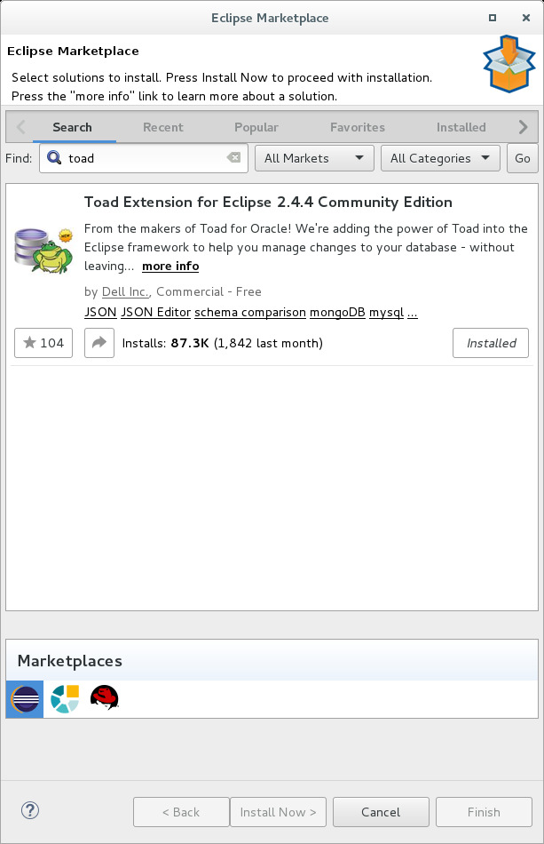

*Figure 16-2 Eclipse Marketplace, searching for Toad.*

• Complete the steps to install Toad, which includes a restart of Eclipse.

Configure Toad for mongoDB use The Toad plug in for Eclipse can run queries and more against mongoDB out of the box. Complete the following:

- From the Eclipse menu bar select, Window -> Preferences. This action produces the dialog box as displayed in Figure 16-3.

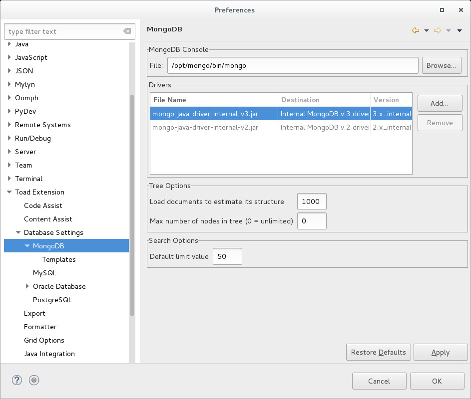

*Figure 16-3 Toad configuration for mongoDB use.*

- Minimally in Figure 16-3 you might have to alter the mongoDB Console File visual control. Navigate to the directory containing the command line

```text
/usr/bin/mongo
```

program. Ours was located in .

- Click through with an Okay.

Create a mongoDB connection, execute a mongoDB query Complete the following:

- Each of the panes in the Eclipse workbench are called, views. In the view titled, Connections, and in the tool bar specific to this view is a button titled, New Connection. (These icons are not labeled, and you must hover to receive balloon help in order to see the names of the icons.) If you click this icon directly, you are prompted for a default connection type. Since we know we specifically want a mongoDB connection type, click the down arrow adjacent to this icon. This action produces the image displayed in Figure 16-4.

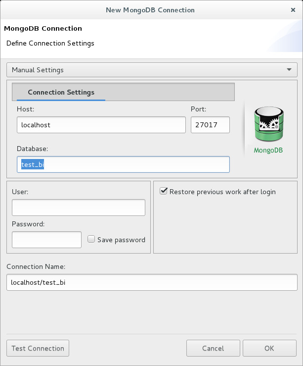

*Figure 16-4 Toad for Eclipse, creating a new mongoDB connection.*

- In Figure 16-4 we call to connect to a mongoDB database server operating on localhost and at port 27107, and a database titled, test_bi. Clicking Okay we create and make active this connection to mongoDB.

- In Figure 16-5, we’ve entered a number of mongoDB command statements- show databases; show collections; db.customer.find();

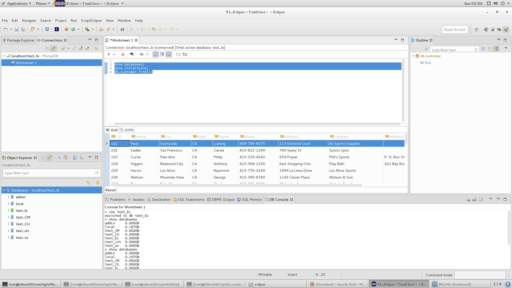

*Figure 16-5 Running a Toad query against mongoDB.*

Configure Toad for MySQL use As an Eclipse plugin, Toad will want to communicate with MySQL via a JDBC driver, and no such driver is installed by default. We downloaded our MySQL JDBC driver from,

```text
https://dev.mysql.com/downloads/connector/j/5.1.html
```

The above arrives as a Gunzip and Tar ball. Unpack both and place in a directory of your choosing. Ours is listed below.

```text
[root@rhhost00 mysql-connector-java-5.1.41]# pwd
/opt/mysql_jdbc/mysql-connector-java-5.1.41
[root@rhhost00 mysql-connector-java-5.1.41]# ls -l
-rw-r--r-- 1 root root 91463 Feb 14 13:27 build.xml
-rw-r--r-- 1 root root 242633 Feb 14 13:27 CHANGES
-rw-r--r-- 1 root root 18122 Feb 14 13:27 COPYING
drwxr-xr-x 2 root root 4096 Mar 25 07:00 docs
-rw-r--r-- 1 root root 454624 Mar 25 09:20
mariadb-java-client-1.5.9.jar
```

```text
-rw-r--r-- 1 root root 992808 Feb 14 13:27
mysql-connector-java-5.1.41-bin.jar
-rw-r--r-- 1 root root 61407 Feb 14 13:27 README
-rw-r--r-- 1 root root 63658 Feb 14 13:27 README.txt
drwxr-xr-x 8 root root 4096 Feb 14 13:27 src
```

Now that the MySQL JDBC driver is installed, we need to inform Toad as to its location. In Eclipse and from the menu bar select, Window -> Preferences -> Toad Extension -> Database settings -> MySQL.

Click the Add button and navigate to the MySQL JDBC file you installed above. Example as displayed in Figure 16-6. Click Okay when you are done.

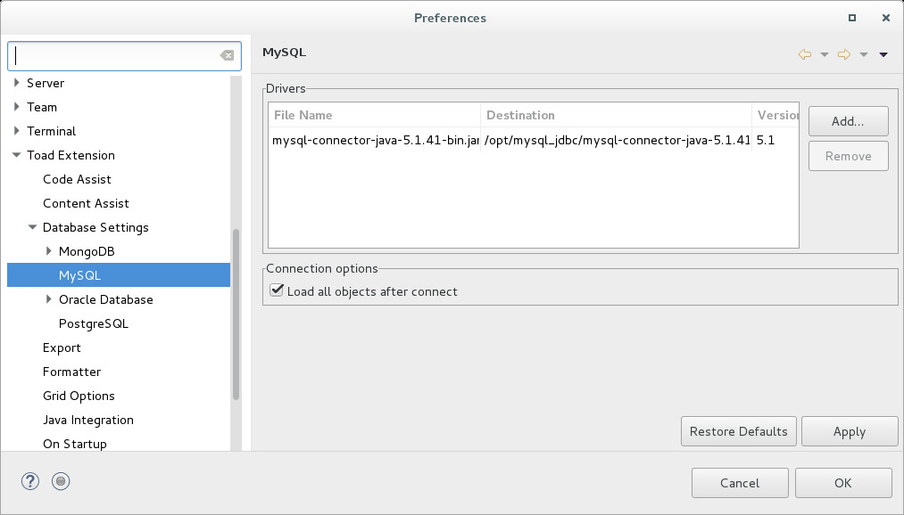

*Figure 16-6 Configuring Toad for use with MySQL.*

Back in the Eclipse Connections view, click the toolbar icon for New Connection using the drop down arrow. Complete the dialog box as displayed in Figure 16-7.

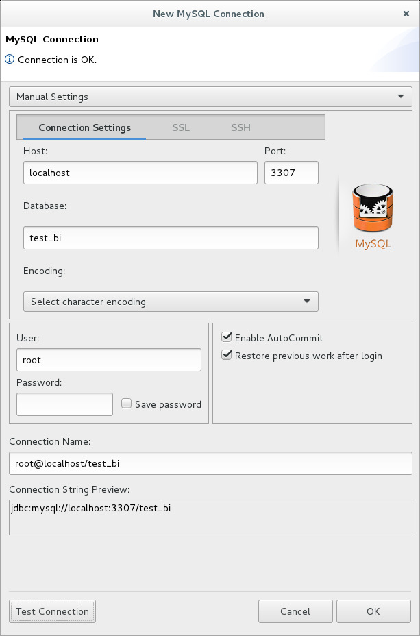

*Figure 16-7 Configuring Toad for MySQL.*

After completing the above steps, you will be prompted to log in via this connection. It is okay to not use a password, since our database does not require one.

An error, and how to detect In our testing prior to writing this document, we learned that the Toad plug in for Eclipse used SQL syntax beyond ANSI SQL 99, SQL syntax not supported by the mongoDB BI Connector. Comments:

- We knew something was wrong when the we connected successfully, but the Object Explorer view inside Eclipse contained no tables. See example in Figure 16-8.

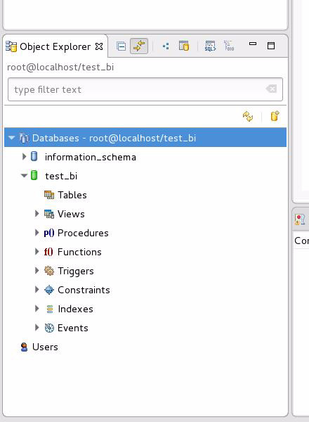

*Figure 16-8 Object Explorer view inside Eclipse.*

- Further, when we used Toad to connect to an actual MySQL database server it worked fine.

- When we examined the BI Connector log file after connecting with Toad, we saw 17 or more reports of SQL syntax errors. We researched options for configuring Toad to use only ANSI 99 SQL syntax, and found none. No worries, there are lots of other popular MySQL tools.

> Note: We’re not too worried the Toad chooses to run SQL beyond (extended past) ANSI SQL 99.

All good BI tools (Tableau, Qlik, others), generally have a SQL compatibility mode that you can select. These tools know that part of their value add is to run SQL across varying platforms.

## 16.2.4 Install/operate a SQL client, MySQL Workbench

MySQL Workbench is another popular MySQL graphical tool, available for free, and available on multiple platforms. We downloaded ours from,

```text
https://dev.mysql.com/downloads/workbench/
```

The above installs as an RPM, and places a desktop ready icon in

```text
/usr/share/applications
```

.

Figure 16-9 displays the launch screen to MySQL Workbench. A code review follows.

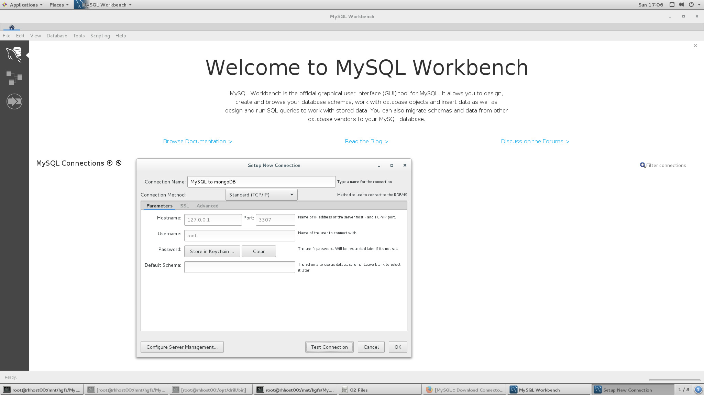

*Figure 16-9 MySQL Workbench, creating a connection.*

Relative to Figure 16-9, the following is offered:

- First we clicked the MySQL Connection + button, which produced the modal dialog box as shown.

- Complete this dialog box and click, Test Connection, then Okay.

- This action produces the display as shown in Figure 16-10.

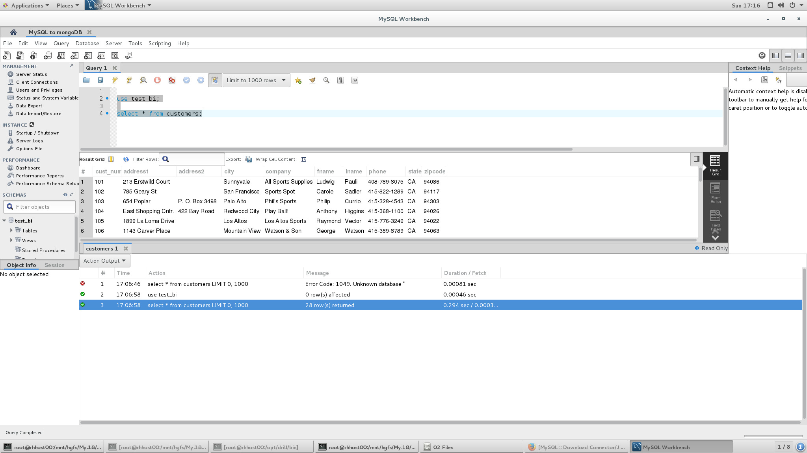

*Figure 16-10 Running a query in MySQL Workbench with results.*

In Figure 16-10 we ran the following,

```text
use test_bi;
select * from customers;
```

And the results appear in the Results Grid.

## 16.2.5 Install/operate a SQL client, Apache Drill

Apache Drill became a top level Apache project in 2014. Currently version 1.10 (released 9 days before we wrote this article, we used version 1.9), the aim of Drill is to provide cross platform (HBase, S3, mongoDB, HDFS, others) SQL access. Extensible and highly parallel, Drill can accept plug-ins to also read systems like MySQL.

We will stop short of extending Drill, and use it in ‘embedded’ mode (single node mode) to run SQL queries against mongoDB.

Complete the following:

- Download Drill from,

```text
https://drill.apache.org/download/
```

The install guide is here,

```text
https://zeppelin.apache.org/docs/0.6.0/install/install.html
```

- The above arrives as a Gunzip and Tar ball. Unpack both and put in a directory of your choosing. We put ours in /opt/drill.

```text
[root@rhhost00 drill]# pwd
/opt/drill
[root@rhhost00 drill]# ls -l
drwxr-xr-x 2 root root 4096 Mar 25 11:00 bin
drwxr-xr-x 2 root root 4096 Mar 25 11:00 conf
-rw-r--r-- 1 root root 699 Nov 18 13:15 git.properties
drwxr-xr-x 6 root root 4096 Mar 25 11:00 jars
-rw-r--r-- 1 root root 35434 Nov 18 12:22 KEYS
-rw-r--r-- 1 root root 63245 Nov 18 12:22 LICENSE
drwxr-xr-x 2 root root 4096 Mar 25 11:02 log
-rw-r--r-- 1 root root 238 Nov 18 12:22 NOTICE
-rw-r--r-- 1 root root 1297 Nov 18 12:22 README.md
drwxr-xr-x 6 root root 4096 Nov 18 12:22 sample-data
drwxr-xr-x 3 root root 4096 Mar 25 11:00 winutils
[root@rhhost00 drill]# cd bin
[root@rhhost00 bin]# ls -l
-rwxr-xr-x 1 root root 6541 Nov 18 12:22 drillbit.sh
-rwxr-xr-x 1 root root 981 Nov 18 12:22 drill-conf
-rwxr-xr-x 1 root root 12663 Nov 18 12:22 drill-config.sh
-rwxr-xr-x 1 root root 991 Nov 18 12:22 drill-embedded
-rwxr-xr-x 1 root root 991 Nov 18 12:22 drill-localhost
-rw-r--r-- 1 root root 104 Nov 18 12:22 hadoop-excludes.txt
-rwxr-xr-x 1 root root 3898 Nov 18 12:22 runbit
-rwxr-xr-x 1 root root 2881 Nov 18 12:22 sqlline
-rwxr-xr-x 1 root root 6163 Nov 18 12:22 sqlline.bat
-rwxr-xr-x 1 root root 1142 Nov 18 12:22 submit_plan
```

- Under bin, run the following command,

```text
install-interpret.sh --all
```

- Enter the Apache Drill command shell, which in our case will start the Web application which is where you run Drill configuration and query tasks.

```text
drill-embedded
```

```text
show databases;
use mongo.test_bi;
show tables;
select * from customer;
```

```text
!quit
```

- With the Drill shell still active, open a Web browser and navigate to, localhost:8047. Example as shown inFigure 16-11.

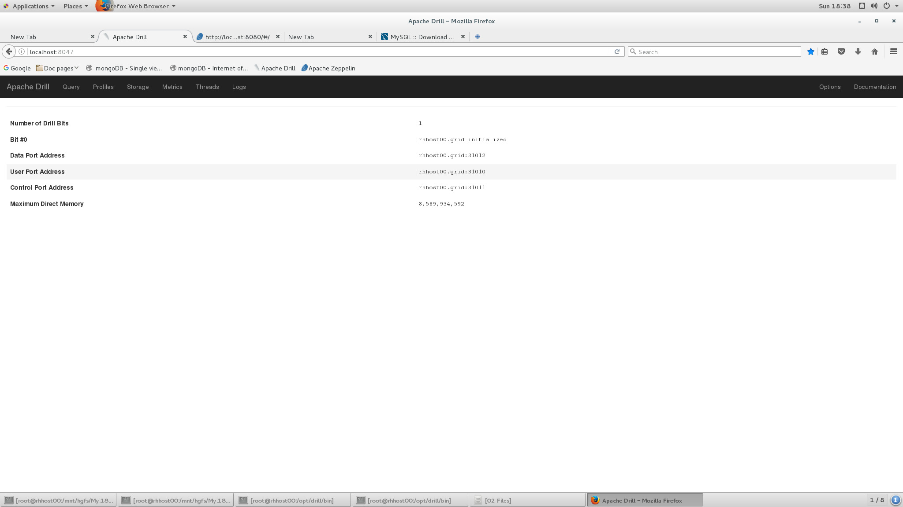

*Figure 16-11 Apache Drill workbench home page*

While mongoDB is supported out of the box, it is not configured or enabled by default. In Figure 16-10, click the menu bar item titled, Storage. This action produces the display as shown in Figure 16-12

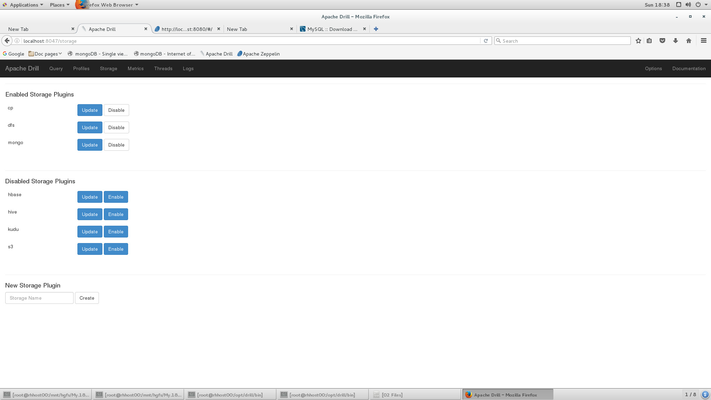

*Figure 16-12 Allowing mongoDB as a data source to Drill.*

In Figure 16-12 complete the following:

- Click Update and Enable.

- The Update button will allow you to edit JSON, which contain the configuration parameters to connect to mongoDB. Example as shown in Figure 16-13.

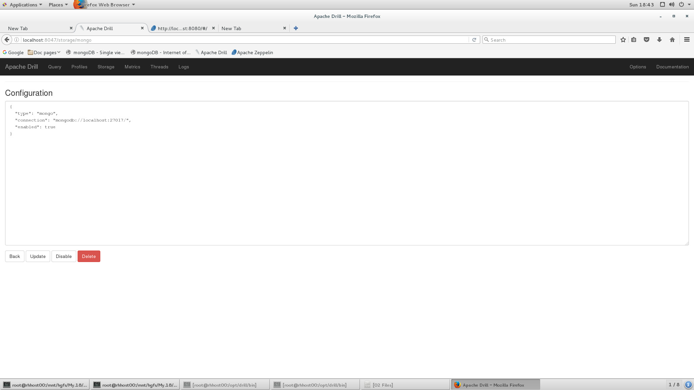

*Figure 16-13 Specifying mongoDB connection parameters.*

With all of the above configuration complete, we are now ready to run queries. From the Drill menu bar click, Query. Example as shown in Figure 16-14.

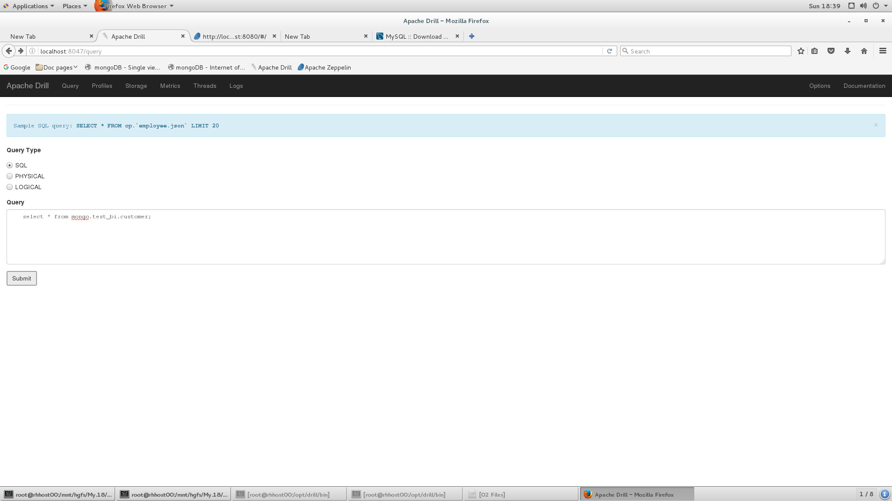

*Figure 16-14 Entering a SQL query in Drill.*

Clicking Submit in Figure 16-14 produces the display in Figure 16-15.

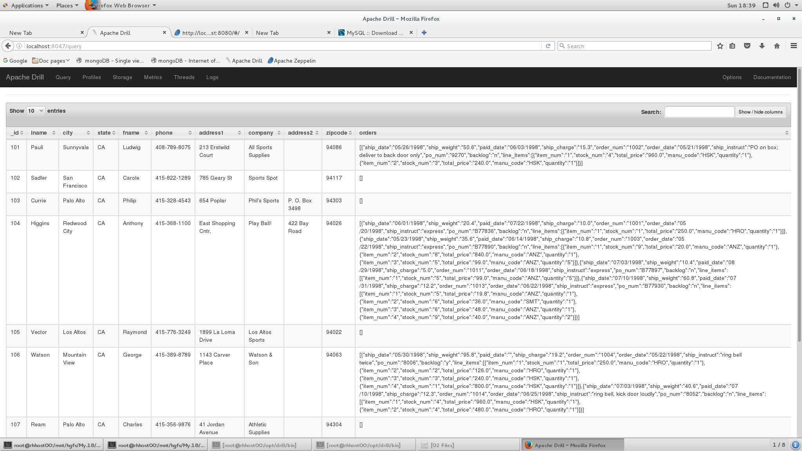

*Figure 16-15 SQL result set in Drill.*

Comments related to Apache Drill:

- So above we selected from the full document store titled, customer. What that means is, you will receive in return the full width document with embedded orders and embedded order line items. You could optionally select from mongoDB views that isolate just customer, just orders, just order line items. If you do this, Drill will do the joining. mongoDB receives 3 separate queries with no relation. There is no optimization to run the 3 table query as one retrieval.

> Note: How do we know this ?

We ran these queries and checked the mongoDB server side (message) log file.

- Apache Drill is a super great cross platform tool (mongoDB AND Hbase, and, and), but in this first use case it is running lowest common denominator (SQL); perhaps not as performant as native connectivity.

## 16.3 In this document, we reviewed or created:

This month and in this document we detailed the following:

- We installed, configured, and operated the mongoDB Connector for Business Intelligence (BI Connector). We included debugging also.

- And we installed and ran a number of SQL command tools; Eclipse/Toad, MySQL Workbench, Apache Drill, perhaps more.

### Persons who help this month.

Dave Lutz and Thomas Boyd.

### Additional resources:

Free mongoDB training courses,

```text
https://university.mongoDB.com/
```

This document is located here,

```text
https://github.com/farrell0/mongoDB-Developers-Notebook
```
