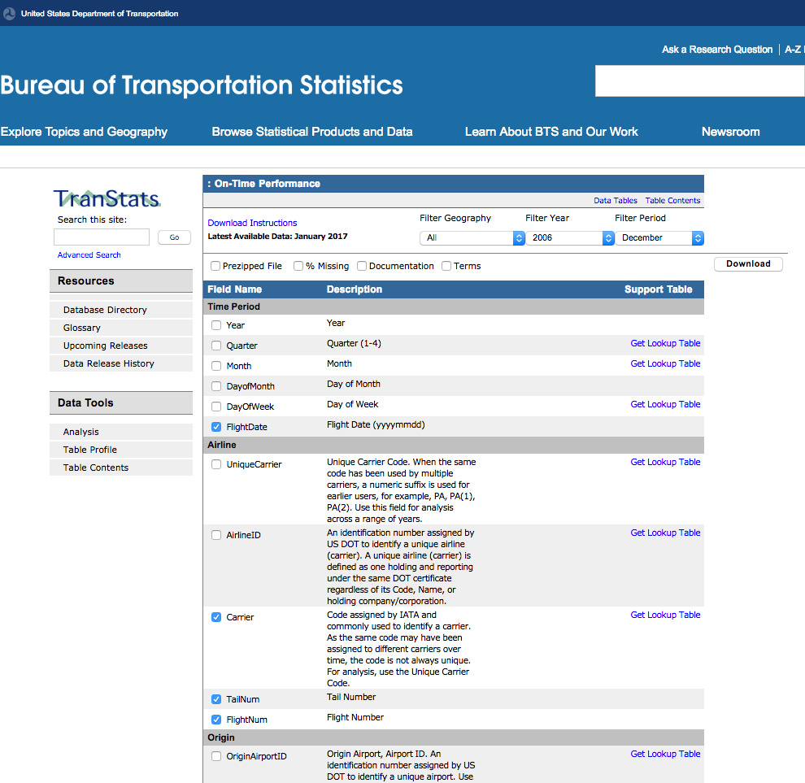

# June 2017: Query Hackathon

[Browse 2017](../README.md)

[Back to home](../../README.md)

Original PDF: [MDB_DN_2017_18_QueryHackathon.pdf](./MDB_DN_2017_18_QueryHackathon.pdf)

---
## Chapter 17. June 2017

Welcome to the June 2017 edition of mongoDB Developer’s Notebook (MDB-DN). This month we answer the following question(s); I need a hackathon for my mongoDB Meetup.com group, a skill set everyone can use like queries. Can you help ? Excellent question ! The June/2016 edition of this document offers a primer on writing mongoDB queries; take the SQL TPC-C, TPC-D, and TPC-H benchmark queries and replicate these in mongoDB. And the May/2016 edition of this document details query tuning, and related. We write queries regularly in this series of documents, but have never had a hackathon proper. The September/2016 edition of this document detailed (new) version 3.4 features to mongoDB, including 15+ new aggregate query stages. In this edition of MDB-DN we give you two data sets, US Postal codes and US airline performance data, and ask you to answer these questions: • Which US city name is most common across states/provinces ? • Which US state has the highest number of unique city names ? • And, my airline is advertising they have improved on time performance. Are they being entirely truthful? We’ll do a bit of a primer, but as a hackathon; you need to discover the answers on your own. (We’re kidding; answers are provided if you’re willing to cheat.)

## Software versions

The primary mongoDB software component used in this edition of MDB-DN is the mongoDB database server core, currently release 3.4. You can run all of your work from the mongo command shell. All of the examples we provide use Python and PyMongo to be able you to control flow and output formatting.

Installing Python and PyMongo on Linux and MAC are easy. We’re told its a bit of a pain on Windows, just saying.

All of these solutions were developed and tested on a single tier CentOS 7.0 operating system, running in a VMWare Fusion version 8.5 virtual machine. The mongoDB server software is version 3.4, and unless otherwise specified is running on one node, with no shards and no replicas. All software is 64 bit.

## 17.1 Terms and core concepts

As stated above, the June/2016 edition of this document offered a primer on writing and using mongoDB queries. We took 20+ queries from the SQL TPC-C, TPC-D, and TPC-H database benchmarks and replicate them in mongoDB. If you don’t know how to write mongoDB queries, you might choose to start there.

This hackathon comes with a resource file, a number of sample programs that you can harvest mongoDB query syntax from, and more. (These examples are largely taken from the June/2016 edition of this document.) Wherever you unpack that (zip file) is a directory titled, “20 Sample queries (Zips and Flights). If you view the files in this directory, you can get ideas to assemble your hackathon queries.

Super abbreviated mongodB query primer Briefly we will state:

- mongoDB has two query verbs (methods), find() and aggregate(). While you might use some finds to explore the two data sets you are given (US postal codes, and US airline performance data), the final three questions you are asked are answered with aggregate queries.

- One sample find is located in the file titled, “022 zipsQuery.py, and is listed in Example 17-1. A code review follows.

### Example 17-1 022 zipsQuery.py, a basic find method query.

```text
import sys
#
from pymongo import MongoClient
```

```text
######################################################
```

```text
if ( len(sys.argv) < 2):
print " "
print " "
l_portNum = input("Enter mongod port number > ")
else:
l_portNum = sys.argv[1]
```

```text
l_connStr = "mongodb://localhost:" + str( l_portNum )
```

```text
rsc = MongoClient( l_connStr )
db = rsc.test_qh
```

```text
sss = list (
db.zips.find( { "state" : "WI", "pop" :
{ "$lt" : 8000 } } ).sort( "city" , 1 ).limit( 20 ) )
```

```text
for s in sss:
print s
```

Relative to Example 17-1, the following is offered:

- This example is written in Python using the PyMongo client side driver. Python should be pre-installed on most Linux boxes, and MAC. If Python is not installed on your Windows box, you will have to Google, and complete same. To install PyMongo you need an Internet connection to run, pip install pymongo Pip is the Python installer program, which will install PyMongo for you. PyMongo would be installed after you install Python.

- After the imports, the next paragraph prompts you for the port number that a locally operating mongoDB database server is operating on. Sometimes our mongoDB database server is at port 27017 (the default), and sometimes its not, so we prompt for this value. You can also pass this same port number on the command line.

- Finally then we run find(): • The first argument to find is optional, and is enclosed in curly braces with JSON formatting. This first argument is called the query document , and essentially equals the SQL concept of a WHERE clause. • A second argument, also in curly braces (not present in this example), is called the projection document , and determines what key columns are output from this query; similar to the column list in a SQL SELECT. • Our find includes an optional sort method; on city, ascending. • And our find includes an optional limit method; give me only the first 20 documents that are produced.

- Example 17-2 displays the more capable aggregate method to mongoDB, the second of two mongoDB query verbs. A code review follows.

### Example 17-2 110_Group.py, a basic aggregate method query.

```text
import sys
#
from pymongo import MongoClient
```

```text
######################################################
```

```text
if ( len(sys.argv) < 2):
print " "
print " "
l_portNum = input("Enter mongod port number > ")
else:
l_portNum = sys.argv[1]
```

```text
l_connStr = "mongodb://localhost:" + str( l_portNum )
```

```text
rsc = MongoClient( l_connStr )
db = rsc.test_qh
```

```text
######################################################
```

```text
sss = list ( db.zips.aggregate([
{ "$group" :
{
"_id" : "$state",
#
"totalPop" : { "$sum" : "$pop" },
"cityCount" : { "$sum" : 1 }
}
} ,
{ "$sort" :
{
"_id" : 1
}
}
] ) )
```

```text
for s in sss:
print s
```

Relative to Example 17-2, the following is offered:

- A mongoDB aggregate query contains a mandatory first argument contained in curly braces, and formatted in JSON. This first argument is called a pipeline expression . Any second or further arguments to aggregate are used to control memory management, collation sequencing, other. However, be aware that the first argument to aggregate is where the query proper is defined. The pipeline expression contains one or more stages , also known as, pipeline operators . Since there are one or more stages, you know to expect that this list is enclosed in a square bracket pair, common to array expressions. The list of stages (pipeline operators) is documented here,

```text
https://docs.mongodb.com/manual/reference/operator/aggregation
-pipeline/
```

- In this our sample aggregate query, we have two stages; group and sort. Each of these two stages is itself followed by a mandatory JSON document, which configure the stage. Each stage is separated by a comma. • Group is one of the more useful and verbose stages to learn.

> Note: Generally in SQL and in mongoDB the following is true of group- – You must specify a single or set of keys to group on, that is; are we grouping on state name, department number, division and department number combined, etcetera. – And then for this grouping of data; what action should the query take. Generally the expected action is to calculate and output totals, averages, counts, etcetera.

True in SQL, but not true in mongoDB; an aggregate expression can only output the group key, and any calculated columns. By the nature of grouping, SQL can not continue to output the detail data, can not output whatever single or set of documents were members of the group. SQL can only output calculated values and the key.

mongoDB can output calculated values, the key, AND the detail documents using an operator called push.

• mongoDB does not have a data dictionary per se; there is no data structure that describes the keys and values contained in a collection. That is because mongoDB offers a polymorphic schema, where each document in a collection can have more or fewer keys, different data types for each value for a given key, etcetera. Thus, mongoDB has no means to know what the primary key to a collection is named. For that reason, mongoDB expects a hard coded primary key value of, _id. You can have multiple unique keys in mongoDB, but the key named _id is special, required, and must be unique. (Special in that it is automatically generated if you do not provide one.) • So, the first argument to the group stage must be the grouping key (single or set of keys), and it must be titled, _id. In Example 17-2, we group on one key titled, state. The actual output key name will be generated as, _id.state. You can change this key name later using a project stage, not pictured here. • In Example 17-2 we output two calculated columns- totalPop, which is a summation of the values of pop for this group. We grouped on state, so this is a sub-total of the population for a given state. cityCount, which is a count of cities. (An easy means to count in mongoDB aggregate queries is to sum on the value of 1.) • And the query ends with a sort ascending on _id, which happens to contain the state value.

Data sets used in this query hackathon We use two data sets in this hackathon, US Postal codes, and US airline performance data.

Sample data for (zips) is listed in Example 17-3. A code review follows.

### Example 17-3 Sample document from Zips, US Postal code data.

```text
db.zips.findOne()
{
"_id" : ObjectId("58e24f99f8a1a0db9b5d2b54"),
"city" : "ACMAR",
"loc" : [
-86.51557,
33.584132
```

```text
],
"pop" : 6055,
"state" : "AL",
"zip" : "35004"
}
```

Relative to Example 17-3, the following is offered:

- This data set represents US Postal office locations.

- Zip can be considered a unique key. However, single large cities in the US like Denver, Colorado, might have 20 or more post offices, might have 20 or more zip(s). Small cities like Buena Vista, Colorado have only one post office. (Its nice, You should visit.)

> Note: Thus, if you wish to count how many Denvers there are across states, you need to account for the fact that Denver could appear 20 times just in Colorado.

- Other than the many to one relation between city name and zip, there are no hidden (features) to this data set.

We downloaded the US airline performance data from,

```text
https://www.transtats.bts.gov/DL_SelectFields.asp?Table_ID=236
```

Sample page as displayed in Figure 17-1. A code review follows.



*Figure 17-1 Downloading US airline performance data.*

Relative to Figure 17-1, the following is offered:

- Cool site ! In effect we can download US airline performance data; schedules, delays, tail numbers, hold times, other.

- You can choose which dates and keys to download. Results arrives pre-zipped and with column headers. There are also symbol tables available for download. E.g., United Airlines is abbreviated UA in the data.

- Example 17-4 offers a sample of the specific columns we downloaded. A code review follows.

### Example 17-4 Sample US airline performance data.

```text
db.flights.findOne()
{
"_id" : ObjectId("58e43aa17e84d9ace7904eed"),
"FL_YEAR" : 2006,
"FL_DATE" : "2006-01-01",
"CARRIER" : "UA",
"TAIL_NUM" : "N210UA",
```

```text
"FL_NUM" : "1",
"ORIGIN" : "ORD",
"DEST" : "HNL",
"CRS_DEP_TIME" : 1010,
"DEP_TIME" : 1057,
"DEP_DELAY" : 47,
"WHEELS_OFF" : 1129,
"WHEELS_ON" : 1629,
"CRS_ARR_TIME" : 1515,
"ARR_TIME" : 1632,
"ARR_DELAY" : 77,
"CANCELLED" : 0,
"CANCELLATION_CODE" : "0",
"DIVERTED" : 0,
"CRS_ELAPSED_TIME" : 545,
"ACTUAL_ELAPSED_TIME" : 575,
"CARRIER_DELAY" : 47,
"WEATHER_DELAY" : 0,
"NAS_DELAY" : 30,
"SECURITY_DELAY" : 0,
"field24" : ""
}
```

Relative to Example 17-4, the following is offered:

- We only downloaded a subset of data by date and a subset of key columns. We downloaded 2006 and 2016, and only the US airline carrier, United Airlines. (All carriers for 2006 and 2016 was over 1 GB of data.)

- Relative to each key, the following is offered: •

```text
_id
```

is not used •

```text
FL_YEAR
```

is an integer representing the year that a given flight took place. To reduce overall data set size, we have pre-filtered for the years 2006 and 2016.

```text
FL_DATE
```

• is a string in YYYYMMDD format, the actual date that the given flight took place. •

```text
CARRIER
```

is a string with the carrier code, UA for United Airlines. To reduce overall data set size, we have pre-filtered to include only data for United. •

```text
TAIL_NUM
```

, is a string, the unique airplane tail number identifier. •

```text
FL_NUM
```

, is a string, the flight number.

•

```text
ORIGIN
```

is a string, LAX for Los Angeles, ORD for Chicago, etcetera. This is the city name where the flight started. •

```text
DEST
```

is a string, where the flight ended.

> Note: A number of ‘times’ below are represented as integers, but really they are not.

The source system offered us times formatted as HHMM (two digit hour, followed by two digit time). While this looks like an integer, the minutes are base 60; 60 minutes in an hour.

Also, all times are from the local time zone. So, you could take off from New York at 1300 (1 PM EST), and land in San Francisco at 1400 (2 PM PST). The times are recorded as (1 hour), when really the flight was 4 hours.)

Net/net, you can do math on these times keeping in mind these values do not reflect true time duration.

•

```text
CRS_DEP_TIME
```

the scheduled departure time as an integer. •

```text
DEP_TIME
```

the actual departure time as an integer.

```text
DEP_DELAY
```

• the difference between the two keys above. Negative values are early departues. •

```text
WHEELS_OFF
```

the time that the plane actually took off, as an integer.

```text
WHEELS_ON
```

• the time that the plane actually landed, as an integer. •

```text
CRS_ARR_TIME
```

the scheduled arrival time, as an integer. •

```text
ARR_TIME
```

the actual arrival time, as an integer. •

```text
ARR_DELAY
```

the difference between the two key above.

```text
CANCELLED
```

• 1 if the flight was cancelled. •

```text
CANCELLATION_CODE
```

a string indicating why the flight was cancelled.

```text
DIVERTED
```

• 1 is the flight did not land where it was scheduled to land. •

```text
CRS_ELAPSED_TIME
```

an integer, the scheduled elapsed time; scheduled time from origin to destination. •

```text
ACTUAL_ELAPSED_TIME
```

an integer, the actual alapsed time from origin to destination. •

```text
CARRIER_DELAY
```

an integer indicating in minutes the amount of delay caused by the carrier.

```text
WEATHER_DELAY
```

• an integer indicating in minutes the amount of delay attributed to weather.

•

```text
NAS_DELAY
```

an integer indicating in minutes the amount of delay caused by air traffic control. •

```text
SECURITY_DELAY
```

an integer indicating in minutes the amount of delay caused by an issue related to security.

Loading the data This hackathon comes with a resource file, which includes among other things, scripts to load these two data sets. Wherever you unpack that (zip file) is a directory titled, “02 Files”. A directory listing is offered below:

```text
# pwd
./02 Files
# ls -l
-rwxrwxrwx 1 501 games 249 Apr 4 17:22 01 loadZips.sh
-rwxrwxrwx 1 501 games 2871007 May 11 2016 02 zips.json
-rwxrwxrwx 1 501 games 405 Apr 4 18:14 10 loadFlights.sh
-rw-r--r-- 1 501 games 101343275 Apr 4 18:26 11 FlightDataUA.csv
-rwxrwxrwx 1 501 games 463 Apr 4 18:30 12.fieldTypes
```

The following is offered relative to the above: –

```text
“01 loadZips.sh”
```

is a Bash script that will load the “02 zips.json” file. This is just a mongoimport.

```text
“10 loadFlights.sh”
```

– is a Bash script that will load the “11 FlightDataUA.csv” file. This is a monogimport that uses a “fieldFile”; an ASCII text file that informs mongoimport of the input column names and data type. Cool. –

```text
“11 FlightDataUA.csv”
```

contains United Airlines flight performance data for the years 2006 and 2016. –

```text
“12.fieldTypes”
```

is an ASCII text files used to configure the mongoinport from “10 LoadFlights.sh”

What questions to answer as part of this hackathon In this hackathon you should:

- Have a working (local ?) mongoDB database server instance.

- Load the two data sets above.

- Answer these three questions according to the data files supplied above - • Which US city name is most common across states ?

EG, there is a Paris, Texas. Is there also a Paris, California, and so many other states with a city named Paris, that this name is most common ? Not only name the city which is most common across states, produce a single query that lists the city name, a count of its member states, and the state names to which that city name is found. • Name the state with the highest number of unique city names ? E.g., as a US (state), District of Columbia has one city name not found in any other US state; its District of Columbia. Okay outlier example, but the point is made. Name the US state with the highest number of city names not found in other states. • And then US airline performance- If the United Airlines flight from Denver to San Francisco historically took 2 hours, all of a sudden it seemed as though United Airlines was listing this as a 3 hour flight. (Times approximate, and I could be wrong.) And when we landed the pilot would proudly proclaim, “we’re early !”, and then we still wait 6 extra minutes because the ground crew was not ready to walk the plane to the gate. United Airlines has taken out advertisements to this effect. See Figure 17-2 below.


*Figure 17-2 Current United Airlines advertisement.*

Yet, United Airlines still ranked ninth in US airlines on time performance for 2015. See Figure 17-3.


*Figure 17-3 US airlines 2015 on time performance ranking.*

So the question is; is United Airlines actual on time performance higher than in year’s past, or is United Airlines fudging the data ? We give you 2006 and 2016 performance data. You decide, and be prepared to defend your methodology and answer-

## 17.2 Complete the following

Hackathon ! Load the two data sets detailed above into a mongoDB database server, and prepare at least 3 queries to answer the three hackathon questions listed above.

The first two questions have a pretty definite answer.

The airline question offers some challenges, given the data. For example:

- We do not currently consider the equipment. For example, if United Airlines used to fly Denver to San Francisco with a jet, and now flies via a slower propeller plane, we do not account for that.

- There is some weather data present, but what if 2016 was a truly terrible year weather wise and that caused a huge amount of delay,

- Etcetera.

One way to account for the complexity of the airlines performance questions is to supply multiple answers. E.g.

- What were the total delays and delay types for each year.

- What is the difference between the scheduled and actual arrivals ?

- Other.

The resource kit, and some (most) answers This hackathon comes with a resource file, which includes many things. Wherever you unpack that (zip file), you should see this directory listing:

```text
ls -l
drwxrwxrwx 1 501 games 238 Apr 5 2017 02 Files
drwxrwxrwx 1 501 games 1326 Apr 4 22:02 20 Sample queries (Zips
and Flights)
drwxrwxrwx 1 501 games 306 Apr 4 22:02 80 Solutions
```

Relative to the directory listing above, the following is offered:

- “02 Files” contains data and scripts to load the two data sets.

- “20 Sample queries (Zips and Flights) contains sample queries that you may harvest ideas from.

- “80 Solutions” contains answer to the first two questions, and a near answer to the last question. You can use these sample queries to check your work.

Under just “80 Solutions” are these files:

```text
ls -l
-rwxrwxrwx 1 501 games 1424 Apr 3 08:56 217_ZipsExample.py
-rwxrwxrwx 1 501 games 1539 Apr 3 08:56 218_ZipsExample2.py
-rwxrwxrwx 1 501 games 2184 Apr 3 08:57 219_FinalZip.py
-rwxrwxrwx 1 501 games 1324 Apr 4 20:11 401_Airline01.py
-rwxrwxrwx 1 501 games 2193 Apr 4 20:30 402_Airline02.py
-rwxrwxrwx 1 501 games 2851 Apr 4 21:58 403_Airline03.py
-rwxrwxrwx 1 501 games 4537 Apr 4 21:00 404_Airline04.py
```

Relative to the directory listing above, the following is offered:

- Files 217 and 218 answer the first question. File 218 presents the data in a better format.

- File 219 answers the second question.

- Files 401 through 404 offer a progression, that is; We start with file 401, and make it better and better, arriving at file 404, which is a reasonable good answer to the third question. There is one technique we use in these files documented on line, and not in any of the sample queries provided. This technique was not required, so we didn’t detail it in this document.

Good luck !

## 17.3 In this document, we reviewed or created:

This month and in this document we detailed the following:

- We ran a query hackathon.

- We spent way too much time to determine if United Airlines was actually on time.

### Persons who help this month.

Dave Lutz and Thomas Boyd.

### Additional resources:

Free mongoDB training courses,

```text
https://university.mongoDB.com/
```

This document is located here,

```text
https://github.com/farrell0/mongoDB-Developers-Notebook
```
